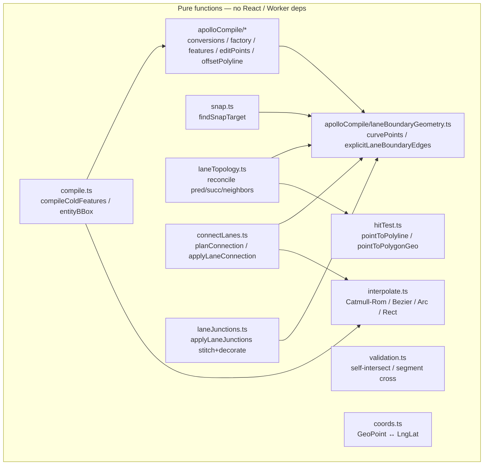

# Geometry Engine

`src/core/geometry/` is Apollo Map Studio's **pure-function geometry
core**. It depends on neither React, Zustand, MapLibre nor Worker
context. Every "entity → GeoJSON" compilation, every "two-points →
arc" curve generation, every "endpoint → lane topology" derivation
lives here. This page is your guided tour of the directory.

## 1. Module topology

## 2. By responsibility

### 2.1 Compilation

| File                                    | Public API                                                                                        | Purpose                                                                  |
| --------------------------------------- | ------------------------------------------------------------------------------------------------- | ------------------------------------------------------------------------ |
| `compile.ts`                            | `compileColdFeatures(entity)`, `entityBBox`, `entityCoords`, `entityRenderCoords`, `isAreaEntity` | Entity → cold-layer feature array (called by the worker)                 |
| `apolloCompile.ts`                      | barrel re-exports including `compileApolloFeatures`                                               | Single entry point for the apolloCompile sub-package                     |
| `apolloCompile/conversions.ts`          | `pointsToCurve`, `pointsToPolygon`                                                                | Convert between `GeoPoint[]` and Apollo `Curve` / `Polygon`              |
| `apolloCompile/factory.ts`              | `createApolloEntity`, `inferLaneTurn`                                                             | Materialise LaneEntity / SignalEntity / … from drawTool + params         |
| `apolloCompile/features.ts`             | `compileApolloFeatures`                                                                           | Apollo entity → cold features (centerline, boundaries, arrows, label)    |
| `apolloCompile/laneBoundaryGeometry.ts` | `curvePoints`, `explicitLaneBoundaryEdges`                                                        | Resolve `LaneBoundary.curve` to `GeoPoint[]`, detect explicit boundaries |
| `apolloCompile/offsetPolyline.ts`       | `offsetPolylineDeg`                                                                               | Offset a centerline (with miter/bevel handling) for lane width           |
| `apolloCompile/editPoints.ts`           | `getApolloEditPoints`, `setApolloEditPoint`, `moveApolloEntity`, `deleteApolloVertex`             | One-stop for "draggable points" per Apollo entity type                   |
| `apolloCompile/projection.ts`           | (internal) Cartesian/spherical helpers                                                            | Used by signal-heading inference                                         |
| `apolloCompile/signalHeading.ts`        | `computeSignalHeading`                                                                            | Boundary plane × stop line → signal icon heading                         |
| `apolloCompile/signalTemplate.ts`       | (signal geometry templates)                                                                       | Render mix-2/3 horizontal/vertical light groups                          |

### 2.2 Curve / interpolation

`interpolate.ts` is 364 lines of pure algorithms:

- `catmullRom(points, segments=32, alpha=0.5)` — spline that passes
  through every control point; `alpha` selects
  uniform / centripetal / chordal.
- `cubicBezier(anchors, segments=48)` — multi-segment cubic bezier;
  anchors carry `handleIn` / `handleOut`.
- `threePointArc(p1, p2, p3, segments=64)` — three-point circular arc;
  collinear input falls back to a polyline. Uses cosLat correction
  to avoid distortion at high latitudes.
- `rectCorners(p1, p2, rotation)` / `rotatedRectFromPoints(a,b,c)` /
  `rectRotateHandle` — rotated-rectangle geometry.
- `mirrorPoint(pivot, pt)` — anchor mirror (for bezier break/smooth
  toggling).

Out of scope: self-intersection (in `validation.ts`), curve length (in
`lib/geo.ts` haversine), hit testing (in `hitTest.ts`).

### 2.3 Validation

`validation.ts` is 58 lines:

- `segmentsIntersect(a1, a2, b1, b2)` — strict intersection (excluding
  shared endpoints).
- `wouldSelfIntersect(points, newPt)` — would adding a new point
  self-cross?
- `polygonSelfIntersects(points)` — does the closed polygon
  self-cross?

Called by FSM `MOUSE_DOWN` guards to forbid illegal "fold-back"
geometry while drawing bezier or polyline shapes.

### 2.4 Hit test

`hitTest.ts` exposes the latitude-compensated API family:

- `pointToPolylineDistGeo` / `pointToPolygonDistGeo`

It scales Δlat by 1/cosLat, lifting it into "lng-degree
equivalent space" so the result matches the `pixelToRadius` (lng
degrees) unit. The worker hit test uses this family — see
[Spatial Index](./spatial-index.md).

### 2.5 Snap

The public entry is `findSnapTarget(point, entities, radiusMeters,
excludeId)` at `snap.ts:309`:

- Collect candidates: lane endpoints (tagged with `endpointRole`),
  polygon vertices, polyline vertices and edges of every other entity
  type.
- Project to local ENU (meters), find the nearest candidate by
  squared Euclidean distance.
- **Vertices win over edges** at equal distance.
- Only first/last lane vertices are eligible — anything else creates
  "looks-connected but not in topology" ghost links (see
  `pushLaneEndpointVertices`).

Behaviour details: [Map Event Router](./map-event-router.md), snap
section.

### 2.6 Topology

`laneTopology.ts` (665 lines) reconciles per-lane
`predecessorIds` / `successorIds` / `neighbors` / `junctionId` from
geometry. Granularity:

| Field                         | Derivation                                                                              |
| ----------------------------- | --------------------------------------------------------------------------------------- |
| `predecessorIds`              | Endpoints share within 1cm (`toFixed(6)`)                                               |
| `successorIds`                | Same, mirrored                                                                          |
| `selfReverseIds`              | A's reverse twin: B.start ≈ A.end ∧ B.end ≈ A.start                                     |
| `junctionId`                  | Centerline geometrically intersects junction polygon                                    |
| `leftNeighborForwardIds` etc. | Lateral distance ∈ [1, 6]m, direction dot ≥ 0.95, longitudinal projection overlap ≥ 50% |

Input is `(entities, dirtyIds)` — incremental mode walks a dirty
closure. Output is the minimal diff (`Map<laneId, updated lane>`),
applied by the store atomically.

### 2.7 Lane connect

`connectLanes.ts`:

- `planConnection(a, b)` — pick the minimum-distance pair from the 4
  endpoint combinations; return a `ConnectionPlan` (`mode`,
  `indexToMove`, `target`).
- `applyLaneConnection(lane, plan)` — translate the chosen endpoint
  to `target`; branches by `_source.drawTool`:
  - Bezier: shift the anchor + its handles, re-sample.
  - Arc: replace one of `arcPoints`, re-sample.
  - Polyline: overwrite the centerline endpoint directly.
    Finally `applyDerive(editGeometry)` closes the loop on `length` /
    `turn` etc.

Invoked from connectMode (the connectMode handler inside the map
event router).

### 2.8 Lane junctions (endpoint stitching)

`laneJunctions.ts:150-165`'s `applyLaneJunctions(features, entities,
excludeId, decorateOnly)` is the worker entry point:

1. `buildLaneFeatureMap(features)` — find each lane's left / right /
   polygon feature inside the GeoJSON array.
2. `collectLaneEndpoints` — extract every lane's endpoint with local
   widths.
3. `findEndpointJunctions` — quantise by 1cm endpoint key, find
   continuous pairs (start-start fork / end-end merge are excluded).
4. `stitchLaneJunctions` — compute left/right miter joins, drag
   boundary endpoints to the shared point, sync polygons.
5. `decorateLaneBoundaries` — re-decorate only the lanes in
   `decorateOnly` (the affected set on INCREMENTAL), producing dashed
   / solid / double-yellow features.

Details: [Junction Stitching](./junction-stitching.md).

## 3. Public surface at a glance

| Entry                                                          | File                        | Caller                                    |
| -------------------------------------------------------------- | --------------------------- | ----------------------------------------- |
| `compileColdFeatures`                                          | `compile.ts`                | spatial worker                            |
| `compileApolloFeatures`                                        | `apolloCompile/features.ts` | `compile.ts` (dispatch)                   |
| `entityRenderCoords`                                           | `compile.ts`                | hit test, reconcile                       |
| `findSnapTarget`                                               | `snap.ts`                   | `mapEventRouter/snap.ts`                  |
| `pointToPolylineDistGeo` / `pointToPolygonDistGeo`             | `hitTest.ts`                | `spatialHitTest.ts`                       |
| `applyLaneJunctions`                                           | `laneJunctions.ts`          | worker `buildFeatureCollection`           |
| `planConnection` / `applyLaneConnection`                       | `connectLanes.ts`           | `mapEventRouter/connectMode.ts`           |
| `reconcileLaneTopology`                                        | `laneTopology.ts`           | mapStore (after addEntity / updateEntity) |
| `catmullRom` / `cubicBezier` / `threePointArc` / `rectCorners` | `interpolate.ts`            | overlay rendering, entity compile         |
| `wouldSelfIntersect` / `polygonSelfIntersects`                 | `validation.ts`             | FSM guards                                |

## 4. Internal algorithm highlights

### 4.1 cosLat correction

Every "meter-space" computation (snap / hit / connect / topology) uses
`cosLat = cos(lat)` to either compress Δlng to meters or stretch Δlat
to lng-degree equivalent. The constant `DEG_TO_M = 111320` is the
WGS84 approximation near the equator.

### 4.2 1cm endpoint precision

Junction stitching, lane topology, and the lane junction graph all use
`toFixed(6)` as the endpoint hash key — six fractional digits is on
the order of 1cm, which is plenty for the editor scale (well below
lane width) and immune to floating-point jitter that would otherwise
leave "almost-connected" gaps.

### 4.3 Circumcenter for arcs

`circumcenter(p1, p2, p3)` is the textbook formula
$D = 2(a_x(b_y-c_y) + b_x(c_y-a_y) + c_x(a_y-b_y))$.
Collinear input (`|D| < 1e-12`) returns null and the caller falls back
to a polyline.

### 4.4 Rotated-rectangle local frame

`rotatedRectFromPoints(a, b, c)` projects the third point onto the
normal of the (a,b) main axis to get the half-width, then sets
`rotation = -atan2(dy, dx)`. The negative sign keeps "visually
clockwise" as the positive direction.

## 5. Pitfalls

1. **Do not import store from geometry**: violating the rule kills the
   ability to run any of these functions inside the worker.
2. **Lanes must snap on endpoints, not interior vertices**: see the
   comment at `snap.ts:138-148`.
3. **`apolloCompile` barrel**: UI code must go through
   `@/lib/entityOps` and never reach into
   `@/core/geometry/apolloCompile` directly — that breaks the R2
   anti-corruption layer.
4. **`interpolate.threePointArc` collinear fallback**: returns
   `[p1, p2, p3]` (not `[p1, p3]`). Callers must be aware.

## 6. Source map

| Concept                | File                                                      | Lines |
| ---------------------- | --------------------------------------------------------- | ----- |
| Entity cold compile    | `src/core/geometry/compile.ts`                            | 1-159 |
| Apollo compile facade  | `src/core/geometry/apolloCompile.ts`                      | 1-20  |
| Apollo factory         | `src/core/geometry/apolloCompile/factory.ts`              | —     |
| Lane boundary geometry | `src/core/geometry/apolloCompile/laneBoundaryGeometry.ts` | —     |
| Offset polyline        | `src/core/geometry/apolloCompile/offsetPolyline.ts`       | —     |
| Edit points            | `src/core/geometry/apolloCompile/editPoints.ts`           | —     |
| Curve interpolation    | `src/core/geometry/interpolate.ts`                        | 1-364 |
| Self-intersection      | `src/core/geometry/validation.ts`                         | 1-58  |
| Distances              | `src/core/geometry/hitTest.ts`                            | 1-143 |
| Snap                   | `src/core/geometry/snap.ts`                               | 1-368 |
| Topology reconcile     | `src/core/geometry/laneTopology.ts`                       | 1-665 |
| Lane connect           | `src/core/geometry/connectLanes.ts`                       | 1-204 |
| Junction stitch        | `src/core/geometry/laneJunctions.ts`                      | 1-165 |
| Stitch internals       | `src/core/geometry/laneJunctions/internal.ts`             | 1-... |

## 7. Testing notes

Geometry tests live in `src/core/geometry/__tests__/`:

| Test                    | Covers                                                                      |
| ----------------------- | --------------------------------------------------------------------------- |
| `apolloCompile.test.ts` | Entity → features compilation; signal heading                               |
| `connectLanes.test.ts`  | All four endpoint pairings; bezier / arc / polyline branches                |
| `interpolate.test.ts`   | Catmull-Rom duplicate points; single-segment bezier; collinear-arc fallback |
| `laneJunctions.test.ts` | Continuous-junction stitching; fork/merge skipping                          |
| `laneTopology.test.ts`  | pred/succ 1cm quantisation; neighbour thresholds                            |
| `snap.test.ts`          | vertex > edge; lane endpoint-only; excludeId                                |

Conventions: pure-function tests with no store / worker dependencies;
fixtures use a small real Apollo map (subset of `map_data/garage`)
for regression coverage.

## 8. History

- **2026-01**: split the 760-line `apolloCompile.ts` into a 9-module
  `apolloCompile/` subdirectory.
- **2026-03**: `validation.ts` was extracted from `interpolate.ts` —
  `interpolate` no longer does self-intersection (that is now a FSM
  guard's job).
- **2026-04 Phase E**: `laneJunctions.ts` gained the `decorateOnly`
  parameter for incremental decoration.
- **2026-04**: `hitTest.ts` exposes the latitude-compensated
  `pointToPolylineDistGeo` / `pointToPolygonDistGeo` family; Euclidean
  distance remains only as a local test baseline helper.

## 9. FAQ

**Q: Why does lane snap only consider start/end and not interior
vertices?**

A: Lanes are directional; topology only makes sense at endpoints.
Mid-snap would give the user a vertex that "looks connected" but
reconcile would not establish pred/succ — producing a phantom that is
not in topology. See `snap.ts:138-148`.

**Q: Why is `inferLaneTurn` in factory and not derive?**

A: Historical. `inferLaneTurn` is a pure function that derive rules
consume. It was originally the factory's helper; today both paths
call it.

**Q: What does a three-point arc return when the points are
collinear?**

A: `[p1, p2, p3]` (a polyline), not `[p1, p3]`. The reason: we keep
`p2` so the inspector can still display the middle point; otherwise
the arc the user "sees" loses a vertex.

## 10. See also

- [Rendering Pipeline](./rendering-pipeline.md)
- [Junction Stitching](./junction-stitching.md)
- [Junction Graph](./junction-graph.md)
- [Spatial Index](./spatial-index.md)
- [Coordinate System](./coordinate-system.md)
- [Map Event Router](./map-event-router.md)
- [Derive Engine](./derive-engine.md)
- [Overlap Derivation](./overlap-derivation.md)
