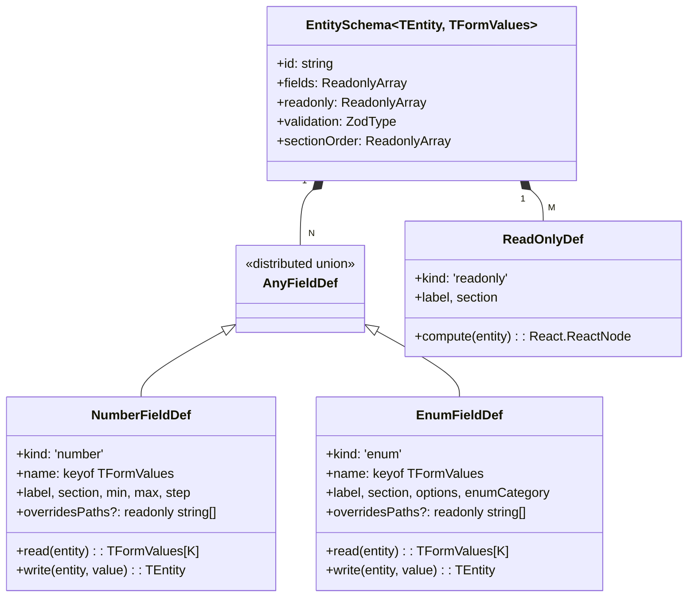

# Inspector Schema

> File: `src/types/inspectorSchema.ts`
> Reference fixture: `LaneInspectorSchema` (same file).
> Background: before this module, every entity type had its own React form
> file; adding one field meant touching JSX in five places. Schema-ifying
> separates "rendering" from "semantics".

## 1. Why a schema

Pre-schema, `InspectorForms.tsx` hardcoded one form component per entity
type. Adding `Lane.speedLimit` required:

1. update `LaneEntity` type;
2. update `laneSchema` (zod) validator;
3. update `LaneForm` JSX;
4. update `LaneForm` `useEffect` listeners;
5. update `LaneForm` watch persistence.

Only steps 1, 2, and 5 carry semantics; 3 and 4 are render boilerplate.
Inspector Schema lifts the boilerplate into `SchemaForm`, so adding a
field reduces to one `F.field({...})` call.

## 2. Type hierarchy



## 3. Key design decisions

### 3.1 Adapter pattern instead of field path

Naive schema libraries assume `entity[fieldName] = value`. `LaneEntity`
breaks that — "left width" needs to write the same value into every
`leftSamples[*].width`, "left boundary type" lives at
`leftBoundary.boundaryType[0].types[0]`. Each `FieldDef` therefore
carries its own `read` / `write` adapter:

```ts
// src/types/inspectorSchema.ts:209-247
function applySampleWidth(
  samples: readonly LaneSampleAssociation[],
  width: number,
  totalLength: number,
): LaneSampleAssociation[] {
  if (samples.length === 0) {
    return [
      { s: 0, width },
      { s: Math.max(0, totalLength), width },
    ];
  }
  return samples.map((sample) => ({ s: sample.s, width }));
}

const writeLeftWidth = (e, w) => ({ ...e, leftSamples: applySampleWidth(...) });
```

`read` is `(entity) => formValue`; `write` is
`(entity, formValue) => entity`. They must be mutually inverse —
`read(write(e, v)) === v` — or the cherry-pick effect loops.

### 3.2 Double generics: TEntity + TFormValues

`EntitySchema<TEntity, TFormValues>` binds both the domain entity and
the zod-inferred form values type. Each `FieldDef.name` is constrained
to `keyof TFormValues`, so typos are caught at compile time.

### 3.3 Distributed FieldDef union

```ts
// src/types/inspectorSchema.ts:124-126
export type AnyFieldDef<TEntity, TFormValues> = {
  [K in keyof TFormValues]-?: FieldDef<TEntity, TFormValues, K>;
}[keyof TFormValues];
```

A naive array literal would widen every `read` return type to the
union of all field values, defeating per-field narrowing. The
distributed mapped type keeps each element narrowly typed even when
iterated as an array.

### 3.4 Curried field builder

```ts
// src/types/inspectorSchema.ts:187-200
export function fieldBuilder<TEntity, TFormValues>() {
  return {
    field<TKey extends keyof TFormValues>(
      def: FieldDef<TEntity, TFormValues, TKey>,
    ): FieldDef<TEntity, TFormValues, TKey> {
      return def;
    },
  };
}
```

Use:

```ts
const LaneField = fieldBuilder<LaneEntity, LaneFormValues>();
LaneField.field({ kind: 'number', name: 'speedLimit', read, write, ... });
```

Reasoning: a flat `defineField<TEntity, TFormValues>(...)` would force
the caller to also pass `TKey` (TS cannot infer three generics from one
argument). Pinning entity / form once at the builder level lets each
`.field({...})` call infer `TKey` from the `name` literal.

## 4. `LaneInspectorSchema` walk-through

`src/types/inspectorSchema.ts:263-435` is the only fully-realized
schema instance today.

### 4.1 sectionOrder

```ts
sectionOrder: ['Attributes', 'Boundaries', 'Topology'],
```

`SchemaForm` renders sections in that order, with editable fields
before read-only rows inside each section.

### 4.2 Nine editable fields

| name              | kind   | section    | range          | derivation                                  |
| ----------------- | ------ | ---------- | -------------- | ------------------------------------------- |
| type              | enum   | Attributes | laneType       | —                                           |
| turn              | enum   | Attributes | laneTurn       | —                                           |
| direction         | enum   | Attributes | laneDirection  | —                                           |
| speedLimit        | number | Attributes | 0..50, step .5 | stored value, m/s                           |
| speedLimitKmh     | number | Attributes | 0..180, step 1 | two-way conversion with `speedLimit`, km/h  |
| leftWidth         | number | Boundaries | 0.5..10        | broadcasts to every `leftSamples[*].width`  |
| rightWidth        | number | Boundaries | 0.5..10        | broadcasts to every `rightSamples[*].width` |
| leftBoundaryType  | enum   | Boundaries | boundaryType   | writes `leftBoundary.boundaryType[0]`       |
| rightBoundaryType | enum   | Boundaries | boundaryType   | writes `rightBoundary.boundaryType[0]`      |

### 4.3 Read-only rows

13 readonly rows: ID, Length, L/R Virtual, Junction, Predecessors,
Successors, four neighbor flavors, Self-Reverse, Overlaps. Topology
ID fields render through `createElement(LaneRef, ...)` /
`createElement(LaneRefList, ...)` so the chips are clickable.

## 5. Lane reference rendering

```ts
{
  kind: 'readonly',
  label: 'Predecessors',
  section: 'Topology',
  compute: (e) => createElement(LaneRefList, { ids: e.predecessorIds }),
},
```

`LaneRef` is a single chip — clicking it does
`useUIStore.setState({ selectedIds: new Set([id]) })`, which causes the
Inspector to switch to the target lane. `LaneRefList` handles the empty
list case with a "No references" fallback.

## 6. Overlap pinning

`Overlap` ties two arbitrary objects (lane / signal / stopSign / etc.)
together. Each row needs an object-type selector plus an ID input,
which would inflate the FieldDef union to seven variants. We keep
`OverlapForm` as a hand-written form (`overlap.tsx`) for now; the
schema model could be extended with a `kind: 'objectPair'` variant
later.

## 7. Schema-generic helpers

| Function                  | Input                        | Output              | Use                             |
| ------------------------- | ---------------------------- | ------------------- | ------------------------------- |
| `formValuesFromEntity`    | (schema, entity)             | TFormValues         | project entity into form values |
| `diffFormAgainstEntity`   | (schema, current, entity)    | Array<[key, value]> | same-id drift detection         |
| `shouldPersistForm`       | (schema, formValues, entity) | boolean             | watch dedupe gate               |
| `applyFormValuesToEntity` | (schema, entity, values)     | TEntity             | write back + override tagging   |

Signatures live at `src/types/inspectorSchema.ts:444-540`.

## 8. Validation: zod and `mode: 'onChange'`

```ts
validation: laneSchema,   // ZodType<LaneFormValues, LaneFormValues>
```

`SchemaForm` feeds it to `zodResolverZ4` →
`useForm({ resolver, mode: 'onChange' })`. Validation runs on every
keystroke, `formState.errors` updates live, and watch never gates on
"isValid" — `shouldPersistForm` is the final gate (no diff → no
write).

## 9. Override tagging cooperation with derive

`overridesPaths` defaults to `[name]`: writing `speedLimit` calls
`markUserOverride('speedLimit')`. For fields that fan out to multiple
internal paths (Lane width writes `leftSamples`), specify it
explicitly:

```ts
LaneField.field({
  kind: 'number',
  name: 'leftWidth',
  ...
  overridesPaths: ['leftSamples'],   // stops derive from re-deriving
}),
```

If you forget, the next geometry edit will see
`markUserOverride('leftWidth')` (the form key, not the proto path) and
fail to skip — the user input gets clobbered by the auto-derivation.

## 10. Public API table

| Symbol                     | File:line                          |
| -------------------------- | ---------------------------------- |
| `EntitySchema`             | `src/types/inspectorSchema.ts:154` |
| `FieldDef` / `AnyFieldDef` | `inspectorSchema.ts:111, 124`      |
| `NumberFieldDef`           | `inspectorSchema.ts:63`            |
| `EnumFieldDef`             | `inspectorSchema.ts:89`            |
| `ReadOnlyDef`              | `inspectorSchema.ts:133`           |
| `fieldBuilder`             | `inspectorSchema.ts:187`           |
| `LaneInspectorSchema`      | `inspectorSchema.ts:263`           |
| `formValuesFromEntity`     | `inspectorSchema.ts:444`           |
| `diffFormAgainstEntity`    | `inspectorSchema.ts:464`           |
| `shouldPersistForm`        | `inspectorSchema.ts:484`           |
| `applyFormValuesToEntity`  | `inspectorSchema.ts:507`           |

## 11. Performance and footprint

- Schemas are constants — frozen at module load, no runtime
  allocations.
- `formValuesFromEntity` / `applyFormValuesToEntity` are O(F) where F
  is field count. Lane has 8 fields; cost is dwarfed by one geometry
  recompute.
- `groupBySections` is `useMemo`-cached inside `SchemaForm`.
- `ReadOnly.compute` runs every time the entity reference changes; it
  must be pure and < 0.1 ms (most read a single `length` or
  `predecessorIds.length`).

## 12. Safety and correctness

1. `applyFormValuesToEntity` only writes fields that appear in
   `schema.fields`. Internal proto fields outside `_userOverrides`
   stay untouched, leaving derivation rules in charge.
2. `read` / `write` must be pure — React effects re-run them.
3. `compute` must not mutate the store — it runs during render.
4. Validation failure still fires watch, but `shouldPersistForm`
   filters out fields whose value reads back as the entity's current
   projection (zod's transform throws before reaching watch).

## 13. Pitfalls

1. **Non-inverse `read`/`write`** drives the cherry-pick effect into
   an infinite loop: every `setValue` is reprojected by the store to
   a different value, watch re-fires, etc.
2. **Enum options** must be `as const` or
   `readonly string[]` — otherwise `EnumFieldDef.options` rejects them.
3. **Missing `overridesPaths`**: user types `leftWidth` but the next
   geometry edit re-derives `leftSamples`, causing the input to bounce
   back.
4. **Section absent from `sectionOrder`**: it appends at the end,
   breaking the visual layout.
5. **Large entity swaps** trigger N `setValue` calls in the
   cherry-pick effect; we already coalesce per-field, but if you grow
   the schema beyond ~30 fields wrap the loop in `useTransition`.

## 14. Tests

- `InspectorForms.test.ts` covers `formValuesFromEntity`,
  `diffFormAgainstEntity`, `shouldPersistForm`, and
  `applyFormValuesToEntity` purity.
- When adding a new schema (e.g. `SignalSchema`), test:
  1. `formValuesFromEntity(schema, sample)` matches the zod schema;
  2. `applyFormValuesToEntity(schema, e, v).then(read)` ≡ v;
  3. `shouldPersistForm` returns false when v is the entity's own
     projection.

## 15. Source map

```
src/types/inspectorSchema.ts        ← main subject of this doc
src/lib/schemas.ts                  ← zod schemas + options
src/lib/enumLabels.ts               ← getEnumLabel display dictionary
src/components/layout/panels/SchemaForm.tsx
src/components/layout/panels/LaneRefList.tsx
src/components/layout/panels/InspectorForms/lane.tsx
src/core/elements/derive.ts         ← markUserOverride
src/components/layout/panels/__tests__/InspectorForms.test.ts
```

## 16. See also

- [Inspector System](./inspector-system.md) — top-level dispatch and sync strategy
- [Anti-corruption Layer](./anti-corruption-layer.md)
- [State Management](./state-management.md) — `_userOverrides` × zundo cooperation
- [Testing Strategy](./testing-strategy.md)
