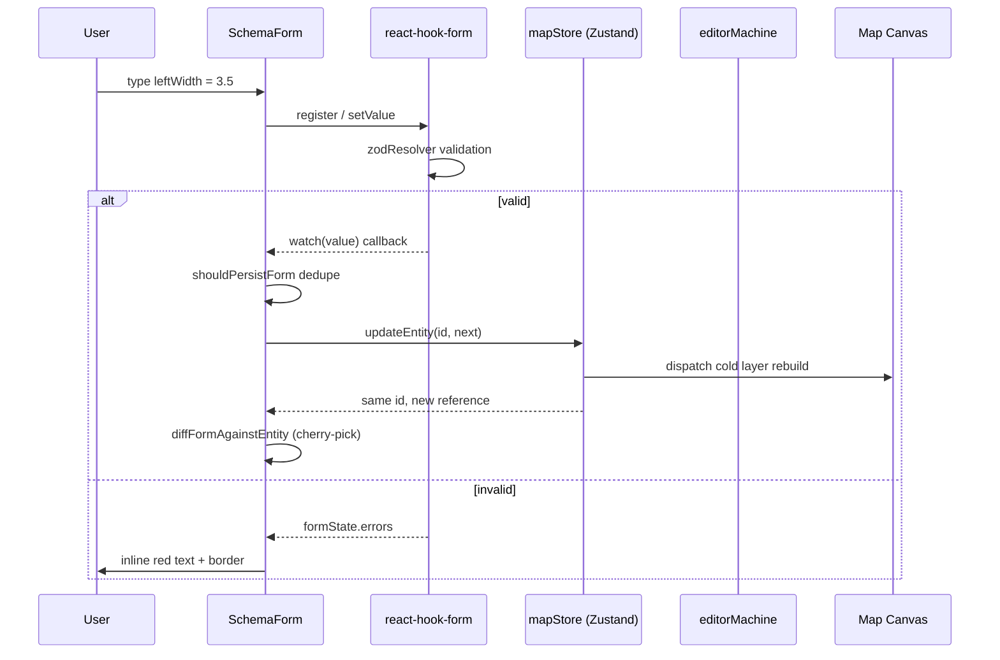

# Inspector System

> Scope: Apollo Map Studio v1, post-2026-04 builds.
> Closed risks: R1 (`onChange` validation gate + same-id sync), R2 (entityOps anti-corruption layer).

## 1. Purpose

The Inspector is the right Dockview panel that turns the currently
selected `MapEntity` into a readable, editable property surface. It must
satisfy three hard contracts:

1. **Type completeness**: cover every one of the 17 entity types
   (lane, junction, parkingSpace, signal, stopSign, road, pncJunction,
   overlap, area, barrierGate, crosswalk, speedBump, yieldSign,
   clearArea, rsu, plus six drawing primitives) with a view that is
   richer than the generic `DrawingForm` placeholder.
2. **Two-way sync without infinite loops**: keystrokes flow form →
   store; undo / canvas drag flows store → form. Neither direction can
   drive the other into a `watch → updateEntity → reset → watch`
   recursion.
3. **Live validation feedback**: `mode: 'onChange'` is non-negotiable.
   It is the gate that makes `formState.isValid` reflect the latest
   keystroke, and the Lane regression test pins it.

## 2. Data flow overview



## 3. Entry-point dispatch — `InspectorForms.tsx`

`src/components/layout/panels/InspectorForms.tsx:45-80` is the only
type-dispatch site, a plain `switch (entity.entityType)`:

```ts
switch (entity.entityType) {
  case 'lane':         return <LaneForm entity={entity as LaneEntity} />;
  case 'junction':     return <JunctionForm entity={entity as JunctionEntity} />;
  case 'parkingSpace': return <ParkingSpaceForm entity={entity as ...} />;
  // ... 14 cases
  default:             return <DrawingForm entity={entity} />;
}
```

Design intent:

- **Zero runtime reflection**: TypeScript checks the switch for
  exhaustiveness via the discriminated union. Adding a new
  `entityType` without updating this switch falls back to `default`,
  not silent crash.
- **Narrow casts**: `entity as LaneEntity` is sound inside
  `case 'lane'`.
- **Drawing fallback**: free-form geometry that is not aligned with
  Apollo proto (polyline, bezier, …) routes to the generic
  `DrawingForm`.

## 4. Three rendering strategies

| Strategy      | Representative entities               | Entry                                    |
| ------------- | ------------------------------------- | ---------------------------------------- |
| Schema-driven | `LaneEntity`                          | `SchemaForm` + `LaneInspectorSchema`     |
| Hand-written  | `Junction`/`Signal`/`StopSign`/`Road` | named components in `simpleForms.tsx`    |
| Read-only     | `Crosswalk`/`SpeedBump`/`RSU`/...     | display-only blocks in `simpleForms.tsx` |

### 4.1 Schema-driven — Lane

`LaneForm` is a thin wrapper that hands `LaneInspectorSchema` to the
generic renderer:

```tsx
// src/components/layout/panels/InspectorForms/lane.tsx:32
export function LaneForm({ entity }: { entity: LaneEntity }) {
  return <SchemaForm schema={LaneInspectorSchema} entity={entity} />;
}
```

Detailed field / read / write / overridesPaths model lives in
[Inspector Schema](./inspector-schema.md).

### 4.2 Hand-written — Junction / Signal

Why not schema-ify everything? Signal subsignals (an array of bulb
records) and signInfo (multi-select flag set) need React-shape inputs
that would inflate the `FieldDef` union to seven variants.
`simpleForms.tsx:184` keeps the JSX explicit:

- `useForm<SignalFormValues>` with `mode: 'onChange'`
- a single `methods.watch(value => ...)` subscription
- `entityRef` always points at the freshest entity
- type changes trigger `regenerateSignalGeometry` to re-derive
  boundary + subsignals

### 4.3 Read-only summary

`Crosswalk`, `SpeedBump`, `YieldSign`, `ClearArea`, and `RSU` only
expose id + geometry + foreign keys at the proto level. Geometry is
edited on the canvas; the FK fields are computed by the topology /
overlap reconciler. The Inspector should not own these — it shows
counts (vertices / overlapIds) instead (`simpleForms.tsx:544`+).

## 5. The R1 closure for two-way sync

R1 is documented at `SchemaForm.tsx:18-23`:

> **Behavior contract**: this component MUST preserve the validation
> gate fix from commit 6a83d9d — `mode: 'onChange'` is the gate that
> makes `formState.isValid` reflect the live keystroke status, which
> the Lane regression test pins.

Three layers of defense:

1. **`mode: 'onChange'`** — never switch to `'onSubmit'`. Under
   `onSubmit` the legacy `formState.isValid` gate stays false during
   typing and silently blocks persistence.
2. **id-swap reset** — `useEffect(..., [entity.id])` only resets when
   the entity reference changes id, so a same-id store update does
   not erase what the user is typing.
3. **same-id cherry-pick** — `useEffect(..., [entity])` runs
   `diffFormAgainstEntity` to compute the per-field gap between the
   form value and the entity reading; only those fields are
   `setValue`-ed with `shouldDirty: false`.

The third effect is what keeps the panel "in sync with the canvas"
during undo, redo, and drag-handle edits.

## 6. The `shouldPersistForm` gate against death loops

```ts
// src/components/layout/panels/SchemaForm.tsx:106-114
useEffect(() => {
  const subscription = methods.watch((value) => {
    const liveEntity = entityRef.current;
    if (!shouldPersistForm(schema, value as Partial<TFormValues>, liveEntity)) return;
    const next = applyFormValuesToEntity(schema, liveEntity, value as Partial<TFormValues>);
    updateEntity(liveEntity.id, next);
  });
  return () => subscription.unsubscribe();
}, [methods, updateEntity, schema]);
```

Without the gate the cycle is:

```
keystroke → setValue → watch → updateEntity → store new ref
       → cherry-pick effect → setValue → watch → updateEntity → ...
```

`shouldPersistForm` short-circuits when the form value already matches
the entity projection, breaking the loop.

`entityRef.current` (instead of the closed-over `entity`) is the
second guard — the closure must always read the freshest snapshot or
stale data leaks back into the store.

## 7. User override tagging (`_userOverrides`)

Some fields have derive rules (e.g. `length` is normally integrated
from `centralCurve`). After a user manually types `length`, future
geometry edits must not clobber that value.

`applyFormValuesToEntity` enforces this:

```ts
// src/types/inspectorSchema.ts:507-540
const prevValue = (field.read as (e: TEntity) => unknown)(next);
next = writer(next, v);
const newValue = (field.read as (e: TEntity) => unknown)(next);
if (prevValue !== newValue) {
  const paths = field.overridesPaths ?? [String(field.name)];
  for (const path of paths) {
    next = markUserOverride(next, path);
  }
}
```

Only **actual** changes are tagged; redundant writes (re-seeding the
same value) must not promote a derived value into a manual override.

## 8. Public API summary

| Symbol                        | File / line                              | Use                             |
| ----------------------------- | ---------------------------------------- | ------------------------------- |
| `EntityForm`                  | `InspectorForms.tsx:45`                  | Top-level switch                |
| `LaneForm`                    | `InspectorForms/lane.tsx:32`             | Schema wrapper                  |
| `SchemaForm`                  | `panels/SchemaForm.tsx:53`               | Generic schema renderer         |
| `JunctionForm` / `SignalForm` | `InspectorForms/simpleForms.tsx:61, 184` | Hand-written variants           |
| `OverlapForm`                 | `InspectorForms/overlap.tsx`             | Object pair editor              |
| `PNCJunctionForm`             | `InspectorForms/pncJunction.tsx`         | Passage / control               |
| `DrawingForm`                 | `InspectorForms/DrawingForm.tsx`         | Generic geometry summary        |
| `LaneRef` / `LaneRefList`     | `panels/LaneRefList.tsx`                 | Topology ID jump chip           |
| `zodResolverZ4`               | `InspectorForms/resolver.ts`             | zod v4 + react-hook-form bridge |

## 9. Type contract: discriminated union + zod

`MapEntity` is a union of 17 `entityType` literals; the
`InspectorForms.tsx` switch is exhaustive under strict TypeScript.
`@/lib/schemas.ts` exports a zod schema per entity, e.g.
`laneSchema: ZodType<LaneFormValues, LaneFormValues>`. `zodResolverZ4`
adapts it to react-hook-form's resolver shape.

```ts
const methods = useForm<LaneFormValues>({
  resolver: zodResolverZ4<LaneFormValues>(laneSchema),
  mode: 'onChange',
  defaultValues: laneFormValuesFromEntity(entity),
});
```

## 10. Performance and accessibility

- The Inspector renders **one** entity form at a time; multi-select
  yields an empty pane (extension point for future "shared fields").
- `methods.watch` subscriptions are mounted once per form lifetime
  (deps `[methods, updateEntity, schema]`).
- `groupBySections` is wrapped in `useMemo([schema])` so the section
  layout is computed once per schema.
- All inputs use semantic `<Input />` / `<Select />` components with
  matching `name` and `aria-label` so the panel is keyboard reachable
  and screen-reader friendly.

## 11. Pitfalls

1. **Do not call `methods.setValue` inside the watch callback** — it
   creates an internal signal loop. Only write to the store there.
2. **Do not regress `mode` to `'onSubmit'`** — the Lane regression
   test will fail (see
   `src/components/layout/panels/__tests__/InspectorForms.test.ts`).
3. **Never drop `entityRef.current`**. The closed-over `entity`
   becomes stale across watch ticks; always read from the ref.
4. **When schema-ifying a new entity**, declare its sections in
   `sectionOrder`. Sections that are referenced but absent will be
   appended in declaration order, breaking the visual layout.
5. **`applyFormValuesToEntity` is order-sensitive**: writes apply
   left-to-right and each step sees the result of the previous. Place
   "depended-on" fields before fields that derive from them.

## 12. Test coverage

| Test                                                              | Asserts                                                        |
| ----------------------------------------------------------------- | -------------------------------------------------------------- |
| `src/components/layout/panels/__tests__/InspectorForms.test.ts`   | Lane R1: `shouldPersistLaneForm` / `diffLaneFormAgainstEntity` |
| `src/components/layout/panels/__tests__/overlapInspector.test.ts` | Overlap selector + object pair editor                          |
| `src/hooks/__tests__/undoCancel.test.ts`                          | FSM `CANCEL` ordered before `temporal.undo()` (R1 protector)   |
| `src/lib/__tests__/entityOps.test.ts`                             | entityOps anti-corruption layer (R2)                           |

## 13. Source map

```
src/
├── components/layout/panels/
│   ├── InspectorForms.tsx              ← entry switch
│   ├── SchemaForm.tsx                  ← generic schema renderer
│   ├── LaneRefList.tsx                 ← topology chip
│   └── InspectorForms/
│       ├── DrawingForm.tsx
│       ├── lane.tsx                    ← schema-driven Lane
│       ├── overlap.tsx
│       ├── pncJunction.tsx
│       ├── resolver.ts
│       └── simpleForms.tsx             ← hand-written + read-only forms
├── types/
│   ├── inspectorSchema.ts              ← FieldDef / EntitySchema / helpers
│   └── entities.ts                     ← MapEntity discriminated union
├── lib/
│   ├── schemas.ts                      ← zod schemas + options
│   └── enumLabels.ts                   ← display label dictionary
└── core/elements/derive.ts             ← markUserOverride
```

## 14. Cooperation with the FSM

XState 5's `editorMachine` lives outside the Inspector and manages
"are we currently drawing / editing a vertex". The Inspector does not
subscribe to the FSM, but two implicit contracts exist:

1. **CANCEL first**: undo / redo dispatch must call
   `actorRef.send({ type: 'CANCEL' })` before invoking
   `temporal.undo()`. Otherwise mapStore rolls back while the FSM
   keeps its stale `drawPoints`, and the next schema → entity
   projection diverges. Enforced by `useActionDispatcher`; pinned by
   `undoCancel.test.ts`.
2. **Canvas selection drives entity ref**: changes to
   `uiStore.selectedIds` swap the Inspector entity, and both
   internal `useEffect`s react automatically.

## 15. Internationalisation (current state)

Per the user memory, `i18next` has not been adopted. Every label is
hardcoded English: `Type` / `Length` / `Predecessors`, etc. Enum
display passes through `getEnumLabel` (`src/lib/enumLabels.ts`),
which is the only future i18n hook — translating that function
covers enum option labels, but ordinary field labels still have no
translation pathway.

## 16. See also

- [Inspector Schema](./inspector-schema.md) — field shapes, validators, lane refs, overlap pinning
- [Anti-corruption Layer](./anti-corruption-layer.md) — entityOps insulation between UI and proto
- [State Management](./state-management.md) — Zustand + zundo undo stack
- [FSM Design](./fsm-design.md) — how the editor state machine interacts with forms
- [Testing Strategy](./testing-strategy.md) — Inspector regression tests and fixtures
