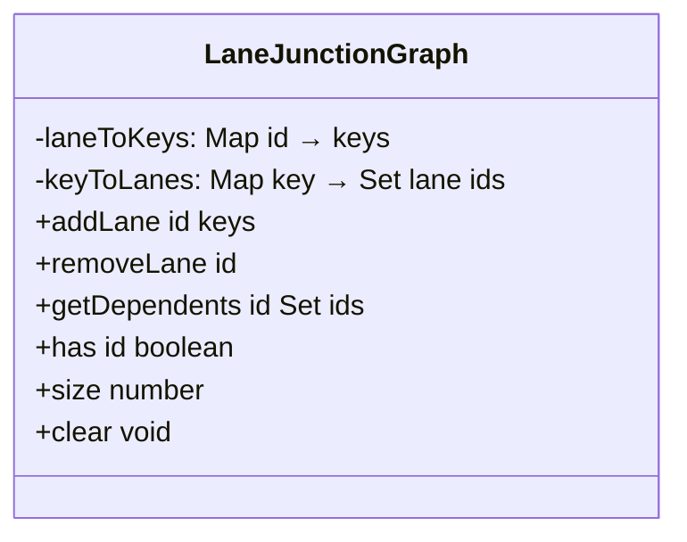
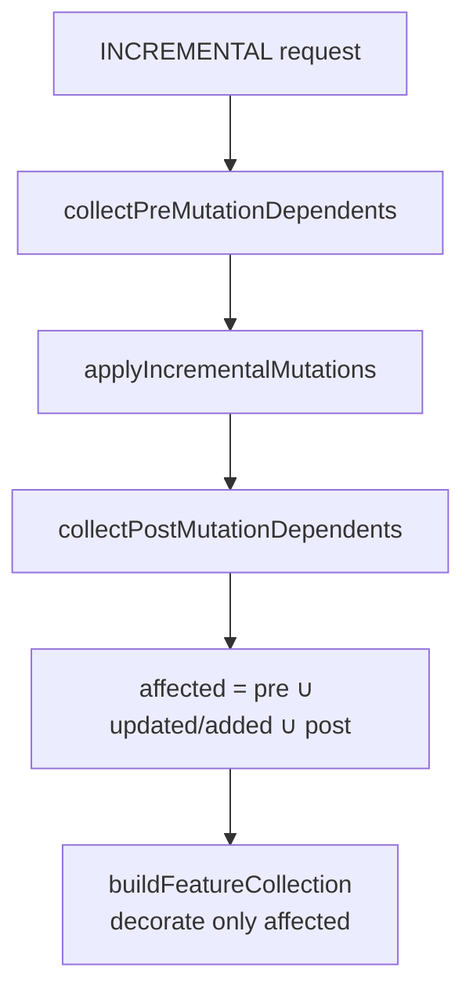
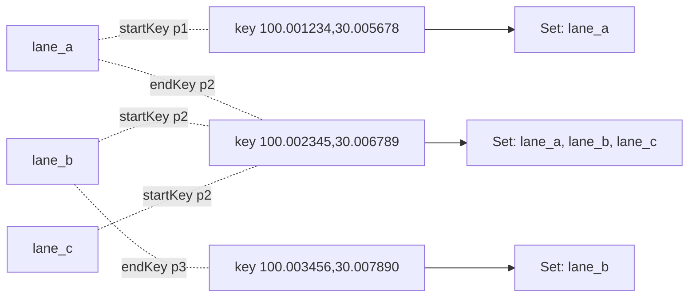

# Lane Junction Graph

`src/core/workers/laneJunctionGraph.ts` is one of the spatial worker's
core data structures. It answers a deceptively simple question that
turned out to be expensive: **"which lanes share an endpoint with
lane X?"** Every lane edit triggers stitching + decoration of those
neighbours, and without a reverse index we are forced into a
full-table scan.

## 1. Why we need it

### 1.1 Cost of the naïve approach

Without a reverse index, every INCREMENTAL must run the full
`applyLaneJunctions`:

- Collect every lane endpoint (O(L))
- 1cm precision merge (O(L))
- Decorate every lane's boundary (~3ms per lane × L)

At 1 000 lanes a single INCREMENTAL took ~3 seconds — that was the
real-world stall before Phase E.

### 1.2 What endpoint reverse lookup unlocks

If the worker can fetch the lanes sharing an endpoint with X in O(K)
(K = junction fan-out, typically 2-4), it can re-decorate **only the
affected lanes** and reuse `decorationCache` for the rest. This is
Phase E in one sentence.

## 2. Data structure

```ts
// src/core/workers/laneJunctionGraph.ts:38-95
export class LaneJunctionGraph {
  private laneToKeys = new Map<string, [EndpointKey, EndpointKey]>();
  private keyToLanes = new Map<EndpointKey, Set<string>>();
  // ...
}
```

Two mutually inverse Maps:

| Map          | Key           | Value                            | Purpose                                         |
| ------------ | ------------- | -------------------------------- | ----------------------------------------------- |
| `laneToKeys` | `lane id`     | `[startKey, endKey]` string pair | O(1) lookup of a lane's endpoints when removing |
| `keyToLanes` | endpoint hash | `Set<lane id>`                   | The reverse index used by `getDependents`       |

`EndpointKey = ${x.toFixed(6)},${y.toFixed(6)}` — **the same 1cm
quantisation as the stitcher (`laneJunctions.ts`)**. The two must
remain in lockstep.



## 3. API

### 3.1 `addLane(id, [startKey, endKey])`

**Idempotent**: calls `removeLane(id)` first to clean any prior entry,
then inserts the fresh keys. The worker invokes it inside
`insertEntity`:

```ts
// src/core/workers/spatialState.ts:68-74
function addLaneToGraph(state, entity) {
  if (entity.entityType !== 'lane') return;
  state.laneCount++;
  const keys = laneEndpointKeys(entity as LaneEntity);
  if (keys) state.junctionGraph.addLane(entity.id, keys);
  state.decorationCache.delete(entity.id);
}
```

Note: inserting a fresh lane also clears its **own** decorationCache —
the previous entry could be a residual from a recycled id (rare, but
defensive).

### 3.2 `removeLane(id)`

Drops references in both maps. Empty buckets are deleted to avoid
memory leaks:

```ts
// src/core/workers/laneJunctionGraph.ts:61-71
removeLane(id: string): void {
  const keys = this.laneToKeys.get(id);
  if (!keys) return;
  for (const key of keys) {
    const bucket = this.keyToLanes.get(key);
    if (!bucket) continue;
    bucket.delete(id);
    if (bucket.size === 0) this.keyToLanes.delete(key);
  }
  this.laneToKeys.delete(id);
}
```

### 3.3 `getDependents(id)` — O(K)

```ts
// src/core/workers/laneJunctionGraph.ts:73-86
getDependents(id: string): Set<string> {
  const out = new Set<string>();
  const keys = this.laneToKeys.get(id);
  if (!keys) return out;
  for (const key of keys) {
    const bucket = this.keyToLanes.get(key);
    if (!bucket) continue;
    for (const other of bucket) {
      if (other !== id) out.add(other);
    }
  }
  return out;
}
```

K = sum of bucket sizes for the lane's two endpoints (excluding
itself), measured 1-6 in real maps. **Independent of the total lane
count L** — that's the key complexity drop in Phase E.

## 4. Affected-set computation on INCREMENTAL

`spatialRequests.ts` runs three collection phases on every
INCREMENTAL:



### 4.1 Pre-mutation dependents

```ts
// src/core/workers/spatialRequests.ts:17-30
function collectPreMutationDependents(state, req, affected) {
  for (const id of req.removed) {
    const entity = state.entityMap.get(id);
    if (entity?.entityType === 'lane') addLaneDependents(state, id, affected);
  }
  for (const entity of req.updated) {
    if (entity.entityType === 'lane') addLaneDependents(state, entity.id, affected);
  }
}
```

Why: a lane X's neighbours **before** the mutation may need re-stitching
because X's endpoints will move. Record them up front.

### 4.2 Apply the mutation

`applyIncrementalMutations` actually modifies `tree` / `entityMap` /
`featureCache` / `junctionGraph`.

### 4.3 Post-mutation dependents

```ts
// src/core/workers/spatialRequests.ts:44-58
function collectPostMutationDependents(state, req, affected) {
  for (const entity of req.updated) {
    if (entity.entityType === 'lane') {
      for (const dep of state.junctionGraph.getDependents(entity.id)) affected.add(dep);
    }
  }
  for (const entity of req.added) {
    if (entity.entityType === 'lane') addLaneDependents(state, entity.id, affected);
  }
}
```

Why: after the mutation, X's endpoints have moved to new locations;
new neighbours also need stitching.

### 4.4 Merge

`affected = pre ∪ updated/added ∪ post`. `buildFeatureCollection`
passes this set to `applyLaneJunctions` as `decorateOnly` so only those
lanes go through `decorateBoundary`.

## 5. Public surface

| Export                    | File                         | Notes                               |
| ------------------------- | ---------------------------- | ----------------------------------- |
| `endpointKeyOf(pt)`       | `laneJunctionGraph.ts:25-27` | 1cm precision endpoint key          |
| `laneEndpointKeys(lane)`  | `laneJunctionGraph.ts:30-36` | Extract centerline first/last point |
| `LaneJunctionGraph` class | `laneJunctionGraph.ts:38-95` | The reverse index itself            |

## 6. Performance and memory

| Scale       | Total LaneJunctionGraph memory | Per `getDependents` |
| ----------- | ------------------------------ | ------------------- |
| 100 lanes   | ~6 KB (Map overhead)           | < 1μs               |
| 1 000 lanes | ~60 KB                         | < 5μs               |
| 5 000 lanes | ~300 KB                        | < 10μs              |

Memory is dominated by Map buckets plus string endpoint keys
(~25 chars × 2 × L).

## 7. Pitfalls

1. **Quantisation precision must match the stitcher**: today it is six
   fractional digits everywhere. Lowering to five digits in the graph
   while stitching still uses six (or vice versa) would produce
   "should be neighbours but not in dependents" gaps.
2. **CRUD ordering**: `addLane(id)` is idempotent (it calls
   `removeLane` first), but reusing an id (delete then re-create)
   must go through the worker's `removeEntity → insertEntity` pair.
   Skipping straight to `state.junctionGraph.addLane(...)` desyncs
   state.
3. **No tracking of lane × non-lane relations**: the graph only knows
   lane endpoints. Dependencies from junction polygons / crosswalks /
   stop lines are managed by the overlap pipeline.
4. **No Z dimension support**: the current endpoint key uses (x, y).
   Should elevation matter (multi-level lanes at the same plane
   coordinate), the key needs to expand to (x, y, z).

## 8. Source map

| Concept                  | File                                    | Lines |
| ------------------------ | --------------------------------------- | ----- |
| `endpointKeyOf`          | `src/core/workers/laneJunctionGraph.ts` | 25-27 |
| `laneEndpointKeys`       | same                                    | 30-36 |
| `LaneJunctionGraph`      | same                                    | 38-95 |
| Inject into SpatialState | `src/core/workers/spatialState.ts`      | 68-99 |
| Affected-set collection  | `src/core/workers/spatialRequests.ts`   | 12-66 |
| Stitcher interaction     | `src/core/geometry/laneJunctions.ts`    | 47-68 |

## 9. Testing notes

| Test                        | Covers                                                     |
| --------------------------- | ---------------------------------------------------------- |
| `laneJunctionGraph.test.ts` | addLane / removeLane / getDependents; empty-bucket cleanup |
| `spatialRequests.test.ts`   | Affected-set closure correctness on INCREMENTAL            |
| `spatialState.test.ts`      | Graph state stays consistent across lane insert/remove     |

Conventions: tests directly construct `new LaneJunctionGraph()`,
require no mocks, and exercise idempotence and edge cases (self-
exclude, empty keys, null pts).

## 10. Memory layout



`getDependents('lane_a')` = `(Set in K1 ∪ K2) \ {lane_a}`
= `{lane_b, lane_c}`.

Complexity: `laneToKeys.get('lane_a')` is O(1); iterating two buckets
(K1: 1, K2: 3) costs K=3 comparisons total.

## 11. FAQ

**Q: If two lanes' endpoints differ by 0.005m (well below the 1cm
threshold), do they count as neighbours?**

A: Yes — `toFixed(6)` maps the 0 → 0.000005 range into the same key
`0.000000`.

**Q: Will floating-point drift break endpoint matching?**

A: Empirically no. A 0.0000005 perturbation might cross the fifth
decimal but not the sixth (i.e. 0.0000010). Stitching uses the same
precision; the two stay consistent.

**Q: Do bezier-backed lanes drift at the endpoints?**

A: Depends on whether `_source.anchors` brackets the endpoints.
`curvePoints(centralCurve)` returns the sampled sequence, and the
first/last points equal `anchor[0].point` / `anchor[N-1].point`.
Bezier lane endpoints stay stable.

## 12. Debugging tips

- **`getDependents` returns an empty set**: check
  `laneToKeys.has(id)`; if false, the worker did not add this lane
  (entityType is not `'lane'`, or `laneEndpointKeys` returned null).
- **Decoration not updating**: the affected set missed someone. Log
  inside `collectPreMutation` / `collectPostMutation` to verify all
  relevant lanes were collected.
- **Graph and stitcher endpoints disagree**: confirm both use
  `toFixed(6)` precision via the shared `endpointKeyOf` helper.

## 13. Glossary

| Term           | Definition                                                          |
| -------------- | ------------------------------------------------------------------- |
| Endpoint       | First / last point of a lane centerline                             |
| Endpoint key   | `${x.toFixed(6)},${y.toFixed(6)}` 1cm-precision hash                |
| Reverse lookup | The endpoint → lane-id set provided by `keyToLanes`                 |
| Dependent      | Another lane that shares an endpoint with this lane                 |
| Affected set   | The set of lanes whose decoration must be recomputed in INCREMENTAL |

## 14. See also

- [Junction Stitching](./junction-stitching.md)
- [Cold / Hot Layers](./cold-hot-layers.md)
- [Rendering Pipeline](./rendering-pipeline.md)
- [Geometry Engine](./geometry-engine.md)
- [Spatial Index](./spatial-index.md)
