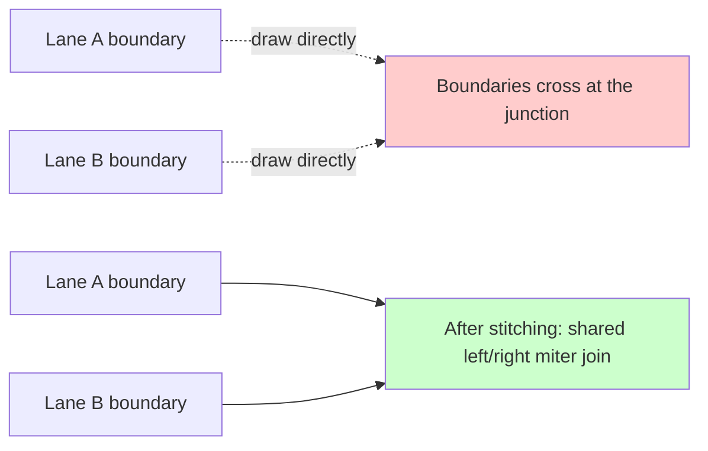
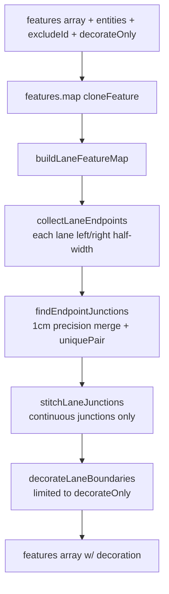

# Junction Stitching

`src/core/geometry/laneJunctions.ts:applyLaneJunctions` is the
**visual hot path** of cold-layer rendering. It miter-joins
"two lanes that share an endpoint" at the boundary level so the user
sees a smooth connection at junctions instead of two boundaries
crossing each other. This page lays out the full algorithm and the
"full-stitch + incremental-decorate" dual-track strategy introduced
in Phase E.

## 1. Why stitching exists



Apollo proto stores lane boundaries as two independent curves
(`leftBoundary` / `rightBoundary`). Adjacent lanes' left/right
endpoints are geometrically close but never aligned 1:1. Without
stitching the user sees:

- T-shaped overshoots / gaps
- Boundaries that extend past the junction independently
- Sharp corners

Stitching computes a **shared left point (`leftJoin`)** and **shared
right point (`rightJoin`)**, then drags the two lanes' boundary
endpoints to those points.

## 2. Pipeline overview



## 3. Key algorithms

### 3.1 Endpoint collection

```ts
// laneJunctions.ts:26-45
for (const entity of entities) {
  if (entity.entityType !== 'lane' || entity.id === excludeId) continue;
  if (!featureMap.has(lane.id)) continue;
  laneMap.set(lane.id, lane);
  endpoints.push(...laneEndpointsFromEntity(lane)); // includes isStart
}
```

Each lane produces two `LaneEndpoint`s — `start` and `end`. Local
`leftWidth` / `rightWidth` come from `leftSamples[0]?.width` /
`rightSamples[0]?.width`, falling back to
`DEFAULT_LANE_HALF_WIDTH`.

### 3.2 Endpoint quantisation

```ts
// laneJunctions.ts:47-71
const endpointIndex = new Map<string, LaneEndpoint[]>();
for (const endpoint of endpoints) {
  const pt = endpoint.isStart ? endpoint.pts[0]! : endpoint.pts[endpoint.pts.length - 1]!;
  const key = `${pt.x.toFixed(6)},${pt.y.toFixed(6)}`;
  ...
}
```

1cm precision hash key — identical to
[`LaneJunctionGraph`](./junction-graph.md). When `uniquePair` returns
exactly two endpoints under the same key, that group is a continuous
junction candidate.

### 3.3 The "continuous" predicate

```ts
// laneJunctions.ts:88-90
function isContinuousJunction(a, b) {
  return a.isStart !== b.isStart; // one start + one end = continuation
}
```

- `start-start` = fork: two lanes leave the same point
- `end-end` = merge: two lanes converge to the same point
- `end-start` or `start-end` = a real "before/after" connection

Only the third case is stitched. Forks / merges are owned by the
overlap pipeline (see [Overlap Derivation](./overlap-derivation.md)).

### 3.4 Miter join calculation

```ts
// laneJunctions.ts:96-123
const cosLat = Math.cos((pt.y * Math.PI) / 180);
const dirA = endpointDirection(a, cosLat); // unit direction vector
const dirB = endpointDirection(b, cosLat);

const leftOffset = sideJoinOffset('left', a, b, dirA, dirB);
const rightOffset = sideJoinOffset('right', a, b, dirA, dirB);

const leftJoin = offsetToLngLat(pt, leftOffset, cosLat);
const rightJoin = offsetToLngLat(pt, rightOffset, cosLat);
```

`sideJoinOffset` computes the offset (in meter space) of the shared
endpoint from the miter intersection of the two direction normals.
`offsetToLngLat` converts back to lng/lat. `updateLineEndpoint`
rewrites the left/right boundary endpoint, and `syncPolygonFromEdges`
keeps the polygon feature in sync.

### 3.5 Boundary decoration

```ts
// laneJunctions.ts:130-148
function decorateLaneBoundaries(featureMap, laneMap, decorateOnly) {
  const out: GeoJSON.Feature[] = [];
  for (const [id, refs] of featureMap) {
    if (decorateOnly && !decorateOnly.has(id)) continue;
    const lane = laneMap.get(id);
    if (!lane) continue;
    out.push(...decorateBoundary(lane, 'left', refs.left));
    out.push(...decorateBoundary(lane, 'right', refs.right));
  }
  return out;
}
```

`decorateBoundary` segments the boundary by `lane.boundaryType[]`
(dashed / solid / double-yellow / curb) and emits extra GeoJSON
features:

- Double yellow: two parallel lines separated by
  `DOUBLE_YELLOW_GAP_METERS`
- Dashed / dotted: encoded by paint-expression dasharray; no extra
  features needed
- Curb: solid + colour

**Phase E key point**: when `decorateOnly` is provided (the
affected-set from the worker), only those lanes get processed; the
others' decoration is restored from the worker's `decorationCache` in
`buildFeatureCollection`.

## 4. The dual-track strategy

| Path        | Stitching scope         | Decoration scope      |
| ----------- | ----------------------- | --------------------- |
| SYNC (full) | All lanes               | All lanes             |
| INCREMENTAL | All lanes (still full!) | Only the affected set |

Why is stitching still full?

- A single stitch is ~0.01ms × N junctions (still under 5ms at 50k
  entities).
- The stitch algorithm is **idempotent**: unaffected lanes' endpoint
  positions do not change, so re-running yields the same
  leftJoin/rightJoin.
- Incremental stitching would need a reverse index of "which boundary
  endpoint changed?" — costlier than full stitching.

Why must decoration be incremental?

- A single `decorateBoundary` is ~3ms × N lanes (50k entities = 150
  seconds; fatal).
- Its output is large (dozens of features per lane); incremental
  yields huge wins.

## 5. decorationCache invalidation

`SpatialState` keeps:

```ts
// spatialState.ts:27
decorationCache: Map<string, GeoJSON.Feature[]>; // lane id → features
```

Invalidation triggers:

1. **Lane edited / removed / added**: the worker's
   `addLaneToGraph(state, entity)` calls
   `state.decorationCache.delete(entity.id)` inside `insertEntity`;
   `removeEntity` does the same.
2. **After stitching**: `buildFeatureCollection` runs
   `for (const id of affectedLaneIds) state.decorationCache.delete(id)`
   before writing the new decoration back.
3. **Full SYNC**: `state.decorationCache.clear()`.

Cache replay:

```ts
// spatialFeatures.ts:108-115
if (isIncremental) {
  for (const [id, decoration] of state.decorationCache) {
    if (affectedLaneIds!.has(id)) continue;
    stitched.push(...decoration);
  }
}
```

Unaffected lanes' old decoration is appended to the stitched array
directly, with no re-computation.

## 6. Public surface

| Entry                                                                               | File                        | Purpose                                 |
| ----------------------------------------------------------------------------------- | --------------------------- | --------------------------------------- |
| `applyLaneJunctions(features, entities, excludeId, decorateOnly)`                   | `laneJunctions.ts:150-165`  | Worker entry                            |
| `decorateBoundary(lane, side, feature)`                                             | `laneJunctions/internal.ts` | Emit decoration features                |
| `endpointDirection`, `sideJoinOffset`, `updateLineEndpoint`, `syncPolygonFromEdges` | `laneJunctions/internal.ts` | Internal vec2 / miter helpers           |
| `endpointKeyOf`                                                                     | `laneJunctionGraph.ts`      | Endpoint hash key shared with stitching |

## 7. Pitfalls

1. **Forks / merges are not stitch scenarios**: only after
   `isContinuousJunction` returns true does stitching kick in.
   start-start and end-end go to overlap and topology, respectively
   (no pred/succ link is established).
2. **decorationCache granularity is per-lane** while stitching is
   per-junction. The two pivot through the affected-set: any lane
   that participates in any modified junction enters the affected set.
3. **`excludeId`**: the currently selected lane (rendered by the hot
   layer) is excluded from stitching to avoid flicker. Both SYNC and
   INCREMENTAL requests may pass `excludeId`.
4. **Boundary feature `role`**: decoration features carry
   `properties.role = 'laneBoundaryDecor'`.
   `spatialFeatures.ts:97-108` adds them back into the cache by
   matching that role. Renaming it breaks the cache.

## 8. Source map

| Concept                      | File                                                      | Lines  |
| ---------------------------- | --------------------------------------------------------- | ------ |
| Main entry                   | `src/core/geometry/laneJunctions.ts`                      | 1-165  |
| Internal vec2 / miter        | `src/core/geometry/laneJunctions/internal.ts`             | —      |
| Lane endpoint extraction     | `src/core/geometry/apolloCompile/laneBoundaryGeometry.ts` | —      |
| Stitching caller             | `src/core/workers/spatialFeatures.ts`                     | 65-118 |
| decorationCache invalidation | `src/core/workers/spatialState.ts`                        | 68-99  |
| Bridge to graph              | `src/core/workers/laneJunctionGraph.ts`                   | —      |

## 9. Visual demo

The visual difference between unstitched and stitched at a junction
(schematic, not real screenshots):

| Before stitch                                                 | After stitch                                              |
| ------------------------------------------------------------- | --------------------------------------------------------- |
| Two lanes' left/right boundaries cross past the junction edge | Shared `leftJoin` / `rightJoin`; boundaries close cleanly |
| Polygon features show a hairline gap at the junction          | Polygon and boundaries stay synced — no seam              |
| Double-yellow decoration breaks at the junction               | Decoration follows the continuous endpoint                |

## 10. Testing notes

| Test                              | Covers                                            |
| --------------------------------- | ------------------------------------------------- |
| `laneJunctions.test.ts`           | Continuous vs fork/merge branches; trim option    |
| `spatialFeatures.test.ts`         | decorationCache merging after `decorateOnly`      |
| `internal/sideJoinOffset.test.ts` | miter formula (acute angles, opposing directions) |

## 11. FAQ

**Q: Why are forks (start-start) not stitched?**

A: Two lanes departing from the same point are diverging; their
left-left / right-right boundaries are physically separate (one
turns left, the other right). Forcing a miter would pull both lanes'
boundaries to a single point — producing a triangle instead of a
fork.

**Q: What about a junction with 3+ shared lanes?**

A: `findEndpointJunctions` with `uniquePair` only handles the
"exactly two" case. Complex junctions with 3+ shared endpoints are
modelled by junction polygons and overlap relations, not stitching.

**Q: If a lane has no explicit boundary (e.g. a freshly created
polyline lane), can stitching run?**

A: Stitching can't run, but `decorateBoundary` infers the boundary
from `centralCurve` + `leftSamples` / `rightSamples` (half-widths)
through `offsetPolylineDeg`, after which stitching applies normally.

## 12. Performance log

- **Pre-Phase E** (before 2026-04): 1k lanes, single INCREMENTAL
  ~3000ms.
- **Post-Phase E**: 1k lanes, single INCREMENTAL (dirty=1) ~5ms.
  600× improvement.
- **5k lanes, full SYNC**: stitch ~10ms + decorate ~150ms.

## 13. Debugging tips

- **No stitching at a junction**: check whether
  `findEndpointJunctions` paired the two lanes; `uniquePair` may
  return null because a third lane shares the same endpoint.
- **Twisted boundary after stitching**: `endpointDirection` reads
  from the nearest segment to the endpoint. If the lane has an
  ultra-short segment there, direction noise distorts the miter; add
  a minimum-segment-length filter in `endpointDirection`.
- **Missing decoration**: confirm the lane id is in `decorateOnly` —
  look at `affectedLaneIds` inside `spatialFeatures.ts`.

## 14. Glossary

| Term                | Definition                                                             |
| ------------------- | ---------------------------------------------------------------------- |
| Stitching           | Pulling two endpoint-sharing lanes' boundaries to a common miter point |
| Decoration          | Additional boundary features (dashed / double-yellow / curb)           |
| Continuous junction | An end + start pairing that represents a real connection               |
| Fork / Merge        | start-start fork / end-end merge                                       |
| Miter join          | The intersection of two direction-vector normals                       |

## 15. See also

- [Junction Graph](./junction-graph.md)
- [Cold / Hot Layers](./cold-hot-layers.md)
- [Rendering Pipeline](./rendering-pipeline.md)
- [Geometry Engine](./geometry-engine.md)
- [Overlap Derivation](./overlap-derivation.md)
- [Spatial Index](./spatial-index.md)
