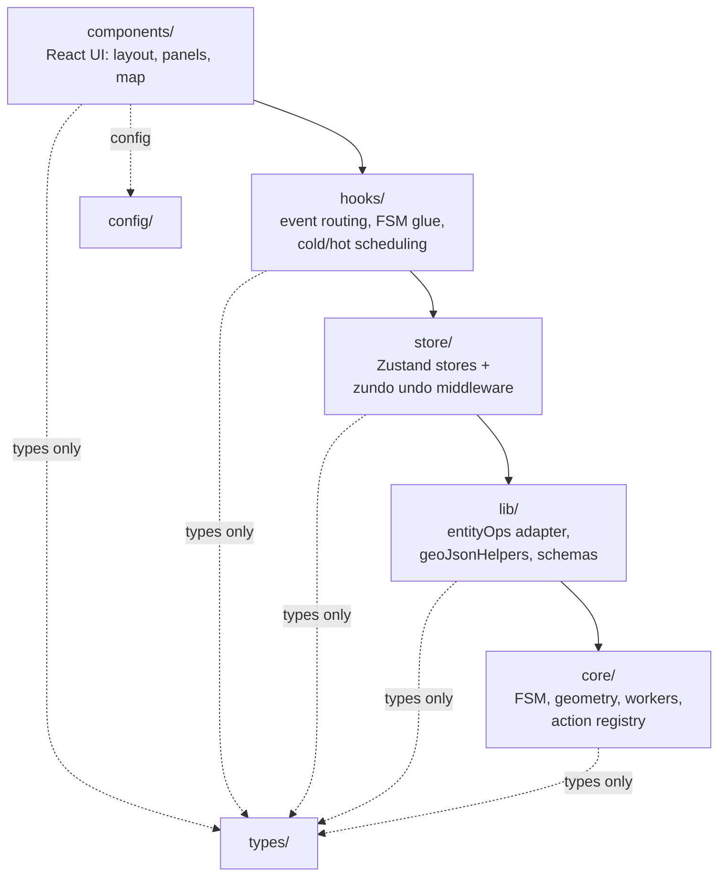
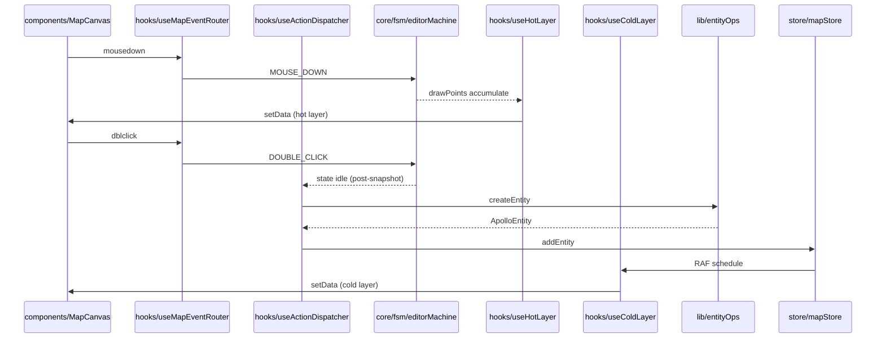

# Layered Architecture

The codebase is **strictly layered**. Imports flow downward only — an outer
layer may reference inner layers but never the reverse. This page expands the
matrix from `ARCHITECTURE.md` into an executable audit checklist and explains
_why_ each forbidden direction would, if allowed, collapse refactor / worker /
ACL work all at once.

::: tip One-liner
`components → hooks → store → lib → core`. `types/` and `config/` are
pure-definition modules anyone can read. Tests (`__tests__`, `*.test.ts`) are
not business code and do not participate in the import graph.
:::

## 1. The five layers



The directionality is more than convention — it is **physical isolation**.
Forbidding `core/` from importing `store/` keeps `core/geometry/apolloCompile.ts`
a pure function, which means it can be relocated to a Web Worker, fuzzed, or
unit-tested without spinning up React.

## 2. Layer responsibilities

### 2.1 `core/` — domain core

| Subdirectory     | Responsibility                                                                                               |
| ---------------- | ------------------------------------------------------------------------------------------------------------ |
| `core/actions/`  | Action registry — `registry.ts` re-exports `ACTION_DEFS` and 12 query helpers                                |
| `core/elements/` | Apollo element metadata (`MapElementType`, `derive` engine)                                                  |
| `core/fsm/`      | XState 5 editor machine                                                                                      |
| `core/geometry/` | Parametric → GeoJSON compilation (`apolloCompile.ts`, `interpolate.ts`, `validation.ts`, `laneJunctions.ts`) |
| `core/spatial/`  | Shared RBush spatial index                                                                                   |
| `core/workers/`  | Web Worker scripts + protocol + bridge                                                                       |

**Forbidden imports:** `lib/`, `store/`, `hooks/`, `components/`.

### 2.2 `lib/` — application-level pure helpers

| Module                                 | Responsibility                     |
| -------------------------------------- | ---------------------------------- |
| `lib/entityOps.ts` + `lib/entityOps/*` | proto anti-corruption facade (R2)  |
| `lib/schemas.ts`                       | zod schemas (Inspector forms)      |
| `lib/geoJsonHelpers.ts`                | GeoJSON utilities                  |
| `lib/editable-guard.ts`                | License + read-only mode gate      |
| `lib/license-bridge.ts`                | IPC bridge to the Electron preload |
| `lib/idGenerator.ts`                   | nanoid wrapper                     |
| `lib/enumLabels.ts`                    | Enum → human label                 |
| `lib/mapIcons.ts`                      | MapLibre symbol icon metadata      |

**Forbidden:** `store/`, `hooks/`, `components/`. **Allowed:** `core/`,
`types/`, `config/`.

### 2.3 `store/` — global state

| File                         | Responsibility                                   |
| ---------------------------- | ------------------------------------------------ |
| `store/mapStore.ts`          | Entity store (Map<id, MapEntity>) + zundo        |
| `store/uiStore.ts`           | UI prefs / layer visibility / connect mode       |
| `store/settingsStore.ts`     | User settings (history limit, lane width)        |
| `store/licenseStore.ts`      | Mirror of main-process license state             |
| `store/taskProgressStore.ts` | Long-task progress overlay                       |
| `store/projDialogStore.ts`   | PROJ.4 picker promise gate                       |
| `store/apolloMapStore.ts`    | Imported raw Apollo Map (header / bounds / info) |

**Allowed:** `core/`, `lib/`, `types/`. **Forbidden:** `hooks/`,
`components/`.

### 2.4 `hooks/` — React glue

`useMapEventRouter` (input dedup + routing), `useColdLayer` (RAF coalescing),
`useHotLayer`, `useActionDispatcher` (R1 closure), `useDrawCommit`
(post-snapshot commit), `useLicense`, etc.

**Allowed:** `core/`, `lib/`, `store/`, `types/`. **Forbidden:**
`components/`.

### 2.5 `components/` — UI top

May import from any layer below. Must not export shared mutable state (e.g. a
top-level mutable ref).

## 3. Allowed / forbidden matrix

| Layer                | Allowed                                  | Forbidden                                 |
| -------------------- | ---------------------------------------- | ----------------------------------------- |
| `core/`              | `core/`, `types/`, `config/`             | `lib/`, `store/`, `hooks/`, `components/` |
| `lib/`               | `core/`, `types/`, `config/`             | `store/`, `hooks/`, `components/`         |
| `store/`             | `core/`, `lib/`, `types/`                | `hooks/`, `components/`                   |
| `hooks/`             | `core/`, `lib/`, `store/`, `types/`      | `components/`                             |
| `components/`        | everything                               | nothing                                   |
| `types/` / `config/` | (pure type/constant, no runtime imports) | any runtime module                        |

## 4. Audit grep recipes (CI-ready)

::: tip Wire these into PR check
Any non-empty result blocks merge.
:::

```bash
# 4.1 core may not import lib / store / hooks / components
git grep -nE "from '@/(lib|store|hooks|components)/" -- 'src/core/**'

# 4.2 lib may not import store / hooks / components
git grep -nE "from '@/(store|hooks|components)/" -- 'src/lib/**'

# 4.3 store may not import hooks / components
git grep -nE "from '@/(hooks|components)/" -- 'src/store/**'

# 4.4 hooks may not import components
git grep -nE "from '@/components/" -- 'src/hooks/**'

# 4.5 ACL guard: UI may not import apolloCompile directly
git grep "from '@/core/geometry/apolloCompile'" -- 'src/components/**' 'src/hooks/**'

# 4.6 R1 closure: every undo path must CANCEL first
git grep -n "temporal.undo" -- 'src/' | grep -v useActionDispatcher
```

::: warning P2 backlog
The `import/no-cycle` ESLint rule and a tier-enforcement script are still on
the P2 backlog. Until they ship, the grep above is the only line of defence in
review.
:::

## 5. Cross-layer sequence (drawing a polyline)



Every arrow runs inward or sideways — never `core` pushing to `components`.
Core's output is always relayed by a store or a hook.

## 6. Public surface (relevant to this page)

| Module                     | Entry                               | Consumed by                       |
| -------------------------- | ----------------------------------- | --------------------------------- |
| `@/types/apollo`           | `src/types/apollo.ts`               | every layer (types)               |
| `@/types/entities`         | `src/types/entities.ts`             | every layer (types)               |
| `@/config/mapConstants`    | `src/config/mapConstants.ts`        | every layer (constants)           |
| `@/lib/entityOps`          | `src/lib/entityOps.ts:1`            | `store/`, `hooks/`, `components/` |
| `@/core/actions/registry`  | `src/core/actions/registry.ts:1`    | `hooks/`, `components/`           |
| `@/core/fsm/editorMachine` | `src/core/fsm/editorMachine.ts:130` | `hooks/`, `components/`           |

## 7. Internal layering details

### 7.1 No implicit cross-subdir coupling inside `core/`

`core/geometry/laneJunctions.ts` does not import
`core/spatial/SharedSpatialIndex` directly; it routes through
`core/elements/overlap.ts`. This convention lets the spatial index be cloned
into a worker without disturbing geometry.

### 7.2 Hooks must not hold shadow state

`useColdLayer` does not keep "already-compiled features" in React state. It
forwards `entities` from the store to the worker, and the worker's
`featureCache` is the single cache.

### 7.3 Components do not subscribe to workers

Worker output always passes through `useColdLayer` / `useHotLayer` and lands
in the store or in MapLibre. Components subscribe to the store, never to the
worker bridge directly.

## 8. Common pitfalls

::: danger Importing a hook from a store
`store/*` is plain JavaScript outside React. Once
`import { useColdLayer } from '@/hooks/...'` appears in a store, the store can
only be used inside a React tree, breaking the "stores are independently
testable" contract.
:::

::: danger Smuggling reverse references through barrels
A top-level `src/lib/index.ts` re-exporting hooks would let `core/` reach
hooks via `import { ... } from '@/lib'`. This repo only allows
subdirectory-level barrels (`@/lib/entityOps`); there is no top-level
`@/lib` barrel.
:::

::: danger ESLint flat-config `paths` does not enforce tiers
`paths` only resolves aliases; it does not prevent cross-layer imports. The
tier check must be a dedicated script.
:::

## 9. SOP for moving a module across layers

| Step | Action                                                     |
| ---- | ---------------------------------------------------------- |
| 1    | Determine the target layer (usually `core/` or `lib/`)     |
| 2    | Create the file there; write the pure type signature first |
| 3    | Once it compiles, import it from `store/` or `hooks/`      |
| 4    | Run the six grep recipes from §4                           |
| 5    | Run `pnpm typecheck && pnpm test`                          |

## 10. Source map

- `ARCHITECTURE.md:7-41` — layer table and allowed/forbidden matrix
- `src/core/actions/registry.ts:1` — barrel re-export pattern
- `src/lib/entityOps.ts:12-39` — entityOps submodule re-export
- `src/store/mapStore.ts:5-25` — what a store may import
- `src/hooks/useActionDispatcher.ts` — example hook subscribing to store + FSM
- `eslint.config.js` — flat config (no import/no-cycle yet)
- `tsconfig.json` — `paths` aliases

## 11. Layers and test boundaries

| Layer         | Test location                 | Boundary handling                                                                           |
| ------------- | ----------------------------- | ------------------------------------------------------------------------------------------- |
| `core/`       | `src/core/**/__tests__`       | Pure JS; no mocks; vitest's default env is enough                                           |
| `lib/`        | `src/lib/**/__tests__`        | Inject fake `MapEntity` maps; mock `core/geometry/apolloCompile` only in ACL boundary tests |
| `store/`      | `src/store/__tests__`         | Drive directly via `useFooStore.getState()`; `renderHook` is unnecessary                    |
| `hooks/`      | `src/hooks/__tests__`         | `@testing-library/react` `renderHook`; mock the global stores                               |
| `components/` | `src/components/**/__tests__` | RTL `render`; few exist — unit tests live in lower layers                                   |

::: tip Golden rule
Unit tests mock the layer below; integration tests run the real layer below.
`vi.mock('@/lib/entityOps')` is routine in hook tests.
:::

## 12. ESLint flat config and layers

```ts
// eslint.config.js (sketch)
export default [
  // ...
  {
    files: ['src/core/**/*.ts'],
    rules: {
      'no-restricted-imports': [
        'error',
        {
          patterns: ['@/lib/*', '@/store/*', '@/hooks/*', '@/components/*'],
        },
      ],
    },
  },
  // analogous blocks for the other layers
];
```

::: warning Currently disabled
`no-restricted-imports` interacts ambiguously with the `paths` alias
resolver. The P2 backlog has a custom ESLint plugin task to fix this. Until
then, the §4 grep recipes are the only line of defence.
:::

## 13. Refactor path example

**Scenario**: extract the geometry trim logic from
`src/components/map/laneRenderer.ts` into core.

1. Create a pure function at `src/core/geometry/laneCorridor.ts`.
2. Delete the inline implementation in the component; import from
   `@/core/geometry/laneCorridor`.
3. Run §4 grep — it must not fire, because components may import core.
4. Add a unit test at
   `src/core/geometry/__tests__/laneCorridor.test.ts`.
5. `pnpm typecheck && pnpm test && pnpm bench`.

## 14. Anti-patterns that introduce cross-layer coupling

| Anti-pattern                                            | Fix                                                          |
| ------------------------------------------------------- | ------------------------------------------------------------ |
| `src/lib/foo.ts` imports `useMapStore`                  | Have `lib/foo` accept entities as a parameter                |
| `src/core/bar.ts` imports `useUIStore`                  | `core/bar` should not read UI prefs; the caller injects them |
| `src/store/laneTopology.ts` imports `useMapEventRouter` | Move event handling to a hook                                |
| `src/components/MapCanvas.tsx` imports `apolloCompile`  | Use `entityOps.compileEntity`                                |

## 15. Layers and bundle slicing

Vite splits chunks on dynamic imports. The relationship between layers
and chunks:

| Layer         | Chunk strategy                                                                       |
| ------------- | ------------------------------------------------------------------------------------ |
| `core/`       | Mostly main chunk; `core/workers/*.worker.ts` becomes a separate worker chunk        |
| `lib/`        | Main chunk                                                                           |
| `store/`      | Main chunk                                                                           |
| `hooks/`      | Main chunk                                                                           |
| `components/` | Top-level components in main; panel-local components carved out via `lazyPanels.tsx` |

`maplibre-gl` (a heavy dependency) sits behind `LazyMapCanvas`'s dynamic
import and never enters the main chunk.

## 16. File naming conventions

| Pattern       | Meaning                                      |
| ------------- | -------------------------------------------- |
| `*.test.ts`   | vitest unit test                             |
| `*.bench.ts`  | vitest benchmark                             |
| `*.worker.ts` | Web Worker entry; vite handles via `?worker` |
| `*.cts`       | CommonJS (Electron main / preload)           |
| `*.tsx`       | Module containing JSX                        |

## 17. See also

- [Architecture Overview](./overview.md)
- [Anti-Corruption Layer](./anti-corruption-layer.md) — Apollo proto rule
- [entityOps Module](./entityops.md)
- [State Management](./state-management.md)
- [Testing Strategy](../../architecture/testing-strategy.md) — layer/mock boundaries
