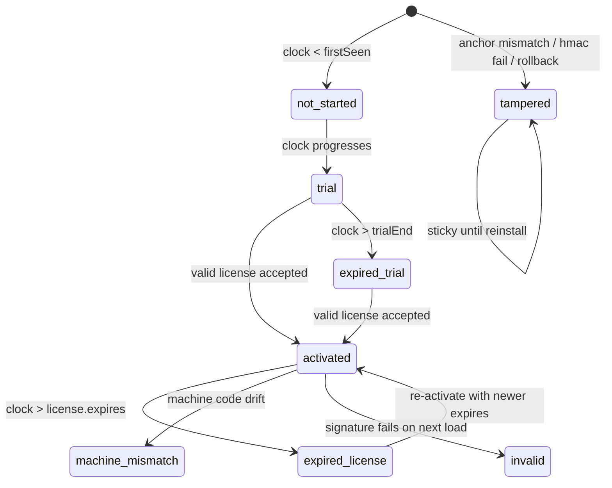
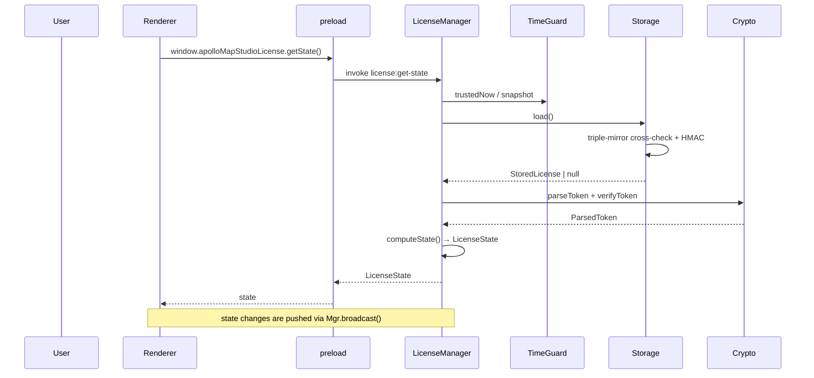
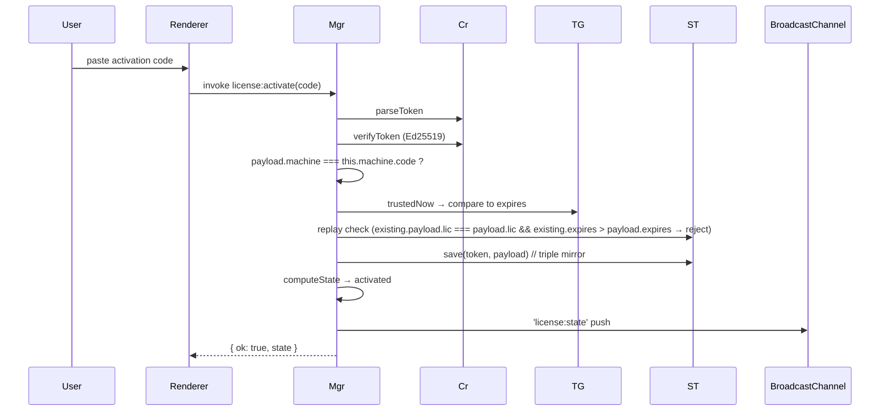

# License System

> Desktop only. Web builds use the renderer fallback in
> `src/lib/license-bridge.ts` and stay in a perpetual trial.
> Key files:
>
> - `electron/license/manager.cts` — state machine + IPC handlers
> - `electron/license/machine-id.cts` — 16-character machine code
> - `electron/license/time-guard.cts` — clock rollback defense
> - `electron/license/storage.cts` — three-mirror encrypted storage
> - `electron/license/crypto.cts` — Ed25519 / AES-GCM / HKDF / HMAC
> - `electron/license/public-key.cts` — embedded public key + pepper
> - `electron/license/types.cts` — shared types
> - `src/lib/license-bridge.ts` — renderer adapter
> - `src/lib/editable-guard.ts` — edit interception

## 1. Goals

1. **Fully offline**: no network call. The activation code carries
   everything required for verification.
2. **Machine bound**: each issued license is valid on exactly one
   machine; switching hardware requires re-issuance.
3. **Anti-abuse**: detect clock rollback, file tampering, replay, and
   machine fingerprint drift.
4. **Graceful degradation**: failed validation drops to read-only
   instead of crashing; the UI surfaces the reason.
5. **Zero runtime deps**: pure Node `crypto`, no third-party packages.

## 2. State machine overview



`canEdit: true` only in `trial` and `activated`. Everything else is
read-only.

## 3. End-to-end flow



## 4. Token and signature

### 4.1 Wire format

```
APMS1.<base64url(payload)>.<base64url(ed25519-sig)>
```

`TOKEN_PREFIX = 'APMS1'`. Bumping the prefix invalidates every
existing token (because `parseToken` rejects unknown prefixes), giving
us emergency key rotation.

### 4.2 LicensePayload

```ts
// electron/license/types.cts:25
interface LicensePayload {
  v: 1;
  lic: string; // unique per issuance
  machine: string; // bound machine code
  issued: number; // epoch ms
  expires: number; // epoch ms; 0 = perpetual
  features?: string[];
  name?: string;
  nonce: string; // makes two identical-ish licenses produce different bytes
}
```

### 4.3 Verify

```ts
// crypto.cts:101-109
export function verifyToken(parsed): boolean {
  try {
    const sig = fromB64url(parsed.sigB64);
    if (sig.length !== 64) return false;
    return edVerify(null, Buffer.from(parsed.bodyB64, 'utf8'), getPublicKey(), sig);
  } catch {
    return false;
  }
}
```

The public key is embedded in `public-key.cts`:

```
-----BEGIN PUBLIC KEY-----
MCowBQYDK2VwAyEAc2wnOyeb2Mb5p/byoxXv5WEJfiRMGbI54BCVSWVp63s=
-----END PUBLIC KEY-----
```

The matching private key lives in
`tools/license-gen/keys/private.pem` and never ships with the app.

## 5. Machine code — `machine-id.cts`

### 5.1 Signal collection

`collectSignals()` (`machine-id.cts:99-117`) gathers:

- `platform` / `arch`
- `release-major` (kernel major version)
- `hostname`
- first CPU model + core count
- `totalmem` rounded to GiB
- `stableMac()`: lexicographically smallest non-internal,
  non-virtual MAC after filtering Docker / VBox / KVM / VMware OUIs
- `diskSerial()`: Linux `/etc/machine-id`, macOS `IOPlatformUUID`,
  Windows `wmic csproduct UUID`

### 5.2 Derivation

```
ikm = signals.join('||')
digest = HMAC_SHA256(APP_PEPPER, ikm)
code = base32_crockford(digest[0..10]) → "XXXX-XXXX-XXXX-XXXX"
```

80 bits (16 base32 chars). Collision probability is negligible.

### 5.3 Persisted hint

`userData/.lic-machine.dat` stores the first computed code.
`readPersistedHint()` lets LicenseManager detect drift:

```ts
// manager.cts:160-163
const persistedHint = readPersistedHint(this.userDataDir);
const machineDrift = persistedHint && persistedHint !== this.machine.code;
```

Drift → status `tampered`.

## 6. TimeGuard — clock defense

`time-guard.cts` implements three persisted defense signals:

1. **Monotonic high-water-mark**: persisted `lastSeen`, ticked every
   60 s as `max(now, lastSeen)`. `now < lastSeen - GRACE(5min)`
   → `tampered`.
2. **Anchor mtime**: app binary / package.json install time as a
   lower bound; `now < anchorMtime` is impossible.
3. **Session counter**: decoupled from wallclock, partially limits
   the "delete userData to reset trial" abuse (recorded but not
   enforced today).

Forward wallclock jumps do not directly mark `tampered`: they cannot
extend a trial/license, and OS sleep or background suspension can
produce the same timer-pause pattern. Real rollback is still blocked
by the `lastSeen` high-water check.

State file `userData/.lic-clock.dat` is AES-GCM encrypted with an
HMAC header.

`trustedNow() = max(Date.now(), state.lastSeen)`: even if the system
clock rolls back, license decisions still use the historical maximum.

## 7. Storage — three-mirror encryption

`storage.cts` writes three files under `userData/`:

| File              | Content                                                  |
| ----------------- | -------------------------------------------------------- |
| `license.dat`     | AES-GCM encrypted PrimaryV1 (token + storedAt + machine) |
| `.lic-state.json` | plaintext JSON: tokenHash + activatedAt + nonce + HMAC   |
| `.lic-shadow.dat` | AES-GCM encrypted StateV1 mirror                         |

Read path cross-checks all three:

```ts
if (!safeEqual(computedHash, state.tokenHash)) return tampered('token hash differs');
if (!safeEqual(state.tokenHash, shadow.tokenHash)) return tampered('shadow disagrees with state');
if (!safeEqual(state.machineAtActivation, shadow.machineAtActivation))
  return tampered('shadow machine differs');
if (state.activatedAt !== shadow.activatedAt) return tampered('shadow activatedAt differs');
if (!safeEqual(state.mac, expectedMac)) return tampered('state HMAC mismatch');
```

Any disagreement → the entire license is treated as tampered.

## 8. KDF — machine code → file keys

```ts
// crypto.cts:122-130
function deriveKey(machineCode, info, length = 32) {
  const ikm = `${machineCode}|${APP_PEPPER}`;
  const salt = sha256(APP_PEPPER);
  return hkdfSync('sha256', ikm, salt, info, length);
}
```

Different `info` strings give independent sub-keys:

| Use          | info                       |
| ------------ | -------------------------- |
| AES file enc | `apms.license.enc.v1`      |
| HMAC mac     | `apms.license.mac.v1`      |
| Per-file key | `apms.file.key.v1:<label>` |

Different machine code → different keys → license files cannot be
copied between machines.

## 9. Activation flow



`ActivationResult.errorCode` taxonomy:

| code                | trigger                             |
| ------------------- | ----------------------------------- |
| `invalid_format`    | wrong length / split !== 3          |
| `invalid_signature` | Ed25519 verify failed               |
| `machine_mismatch`  | `payload.machine` ≠ this device     |
| `expired`           | `now > expires`                     |
| `replay`            | existing license has longer expires |
| `storage_error`     | filesystem write failed             |
| `unknown`           | renderer fallback (web preview)     |

## 10. computeState — single source of truth

`manager.cts:156-291` implements the full status decision:

1. drift checks (machineDrift / tg.tampered) → `tampered`
2. load storage:
   - tampered → `tampered`
   - signature fails → `invalid`
   - machine mismatch → `machine_mismatch`
   - `now > expires` → `expired_license`
   - else → `activated`
3. no license → trial path:
   - now < firstSeen → `not_started`
   - now ≥ trialEnd → `expired_trial`
   - else → `trial`

`refresh()` runs every minute and only `broadcast()`s when the JSON
representation changes.

## 11. Renderer interception — `editableGuard`

`src/lib/editable-guard.ts:21-36`:

```ts
export function assertEditable(action = 'edit'): boolean {
  const { state, promptActivation } = useLicenseStore.getState();
  if (state.canEdit) return true;
  if (now - lastWarn > WARN_INTERVAL) {
    lastWarn = now;
    console.warn(`[license] Blocked ${action}: status=${state.status}. ${state.reason}`);
    try {
      promptActivation();
    } catch {}
  }
  return false;
}
```

Call sites:

- `mapStore.addEntity / updateEntity / removeEntity / reparentEntity`
  call `assertEditable` first; falsy returns drop the write.
- `useActionDispatcher` gates every action / tool / selection
  dispatch on `assertEditable`.
- UI buttons read `isEditable()` to render their disabled state.

## 12. Public API (renderer side)

```ts
// src/lib/license-bridge.ts
licenseBridge.getState():        Promise<LicenseState>
licenseBridge.getMachineCode():  Promise<string>
licenseBridge.activate(code):    Promise<ActivationResult>
licenseBridge.deactivate():      Promise<LicenseState>
licenseBridge.onChange(handler): () => void
```

## 13. Threat model

| Threat                              | Mitigation                                                                          |
| ----------------------------------- | ----------------------------------------------------------------------------------- |
| Copy license to another machine     | Machine code binding + per-machine file keys                                        |
| Tamper with `expires`               | Ed25519 signature fails                                                             |
| Swap public key                     | Public key compiled in; ASAR + binary signing on the distribution                   |
| System clock rollback               | TimeGuard `lastSeen` watermark + 5 min grace                                        |
| Replace `.lic-state.json`           | HMAC + shadow cross-check                                                           |
| Delete userData to reset trial      | Still drops to a fresh trial (design allows; future server throttle)                |
| Reverse-engineer the pepper         | Pepper is **not** a secret — only blocks cross-app replay; rotation needs migration |
| Bypass IPC and write files manually | HMAC + AES keys derived from machine code; results in `tampered`                    |

## 14. Tooling

`tools/license-gen/`:

```bash
node tools/license-gen/gen-keys.mjs --rotate      # generate / rotate keypair
node tools/license-gen/issue.mjs --machine XXXX-XXXX-XXXX-XXXX --name "Acme" --days 365
node tools/license-gen/verify.mjs --code "APMS1.eyJ...base64..."
```

The private key stays in `tools/license-gen/keys/private.pem` (ops
only). `gen-keys.mjs` writes the matching public key back into
`electron/license/public-key.cts` automatically.

## 15. Pitfalls

1. **Don't read disk serial after `app.disableHardwareAcceleration()`**
   — unrelated, but avoid coupling unrelated subsystems to the
   license path.
2. **Never pass `LicenseState` to a worker** — workers are isolated;
   the guard runs only in main / renderer entry points.
3. **`replay` only allows extension**: an admin who issues a short
   expires by mistake can re-issue a longer one; the reverse is
   rejected.
4. **TimeGuard `tampered` is sticky** — once set only a fresh install
   (or a developer-only `reset()`) clears it. Production builds do
   not expose `reset()`.
5. **CI desktop-package job does not sign**:
   `CSC_IDENTITY_AUTO_DISCOVERY: false`. Notarisation / code signing
   is a release-engineer step done locally.

## 16. Tests

- `electron/license/__tests__/` (planned) should cover:
  - `parseToken` / `verifyToken` contract;
  - storage round trip and triple-mirror cross-check;
  - TimeGuard rollback detection;
  - LicenseManager activate / deactivate / replay.
- Renderer side: `license-bridge.test.ts` for the fallback;
  `editable-guard.test.ts` for interception ordering.

## 17. See also

- [Electron Integration](./electron-integration.md)
- [Build & Bundle](./build-and-bundle.md)
- [State Management](./state-management.md) — licenseStore and editor integration
