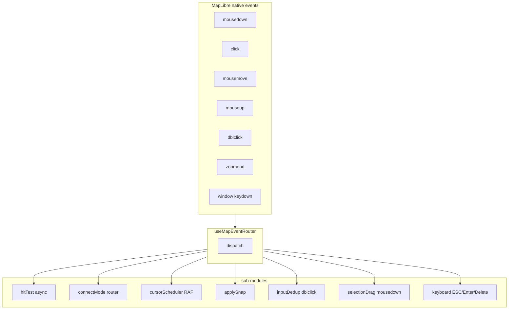
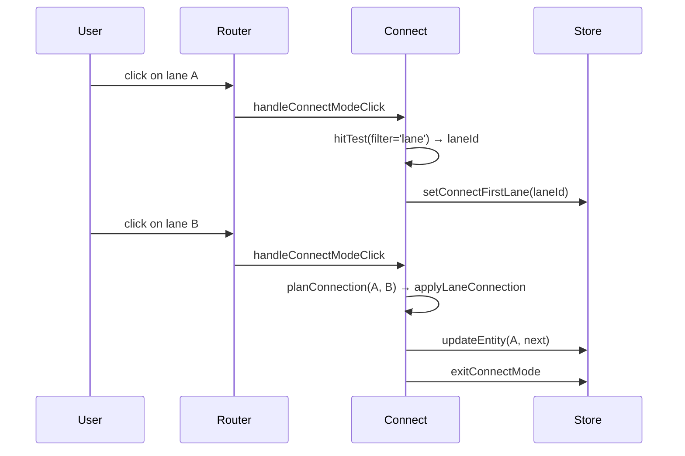

# Map Event Router

`useMapEventRouter` is the central dispatcher for map interaction. It
takes over **every** mouse and keyboard event on the MapLibre canvas
and fans them out — based on FSM state and UI store mode (e.g.
`connectMode`) — to seven sub-modules. Each sub-module owns one
semantic concern; coupling between them is by design near zero. This
file is what came out of disassembling a 100-line if/else mega-function.

## 1. Responsibilities



## 2. State branch matrix

`onClick` and `onMouseMove` are essentially "branch by FSM state".
The table below covers the major branches:

| FSM state      | mousedown                                        | click                                                         | mousemove                                  | mouseup                          |
| -------------- | ------------------------------------------------ | ------------------------------------------------------------- | ------------------------------------------ | -------------------------------- |
| `idle`         | no-op                                            | hitTest → SELECT_ENTITY \| else MOUSE_DOWN                    | clear snap target                          | MOUSE_UP                         |
| `selected`     | `selectionDrag` handles vertex / handle / center | consume hot-points hit; otherwise hitTest to switch selection | toggle cursor + clear snap                 | MOUSE_UP                         |
| `editingPoint` | no-op                                            | no-op                                                         | DRAG_MOVE (with snap + center grab offset) | DRAG_END + updateEntity          |
| `drawBezier`   | dedup → MOUSE_DOWN                               | (no MOUSE_DOWN to avoid dblclick collision)                   | MOUSE_MOVE (with snap)                     | MOUSE_UP                         |
| Other draw\*   | no-op                                            | dedup → MOUSE_DOWN                                            | MOUSE_MOVE                                 | MOUSE_UP                         |
| Any (dblclick) | —                                                | —                                                             | —                                          | DOUBLE_CLICK                     |
| Any (ESC)      | —                                                | —                                                             | —                                          | CANCEL (also clears connectMode) |

## 3. Sub-modules in detail

### 3.1 `hitTest.ts`

```ts
// src/hooks/mapEventRouter/hitTest.ts:26-42
export function workerHitTest(map, bridge, e, filter?) {
  const pt = toLngLat(e);
  return bridge
    .send({ type: 'HIT_TEST', point: pt, radius: pixelToRadius(map, HIT_TEST_RADIUS_PX) })
    .then((result) => {
      if (result.type !== 'HIT_RESULT' || result.hits.length === 0) return null;
      const hit = filter ? result.hits.find((h) => filter(h.entityType)) : result.hits[0];
      return hit?.id ?? null;
    })
    .catch(() => null);
}
```

- Translate mouse position to lng/lat, radius to lng-degrees via
  `pixelToRadius`.
- Async, goes through the worker (`bridge.send`); does not block the
  click handler.
- Optional `filter` lets callers restrict to lanes (used by
  connectMode).
- Failure-safe: `.catch(() => null)` — a dead worker does not crash
  the UI.

### 3.2 `connectMode.ts`

ConnectMode is the "connect two lanes" UI mode: pick lane A, highlight
it, pick lane B, the reconciler writes pred/succ.

`handleConnectModeClick(actorRef, hitTest, e)` returns a boolean —
`true` means it consumed the click (`useMapEventRouter` returns
immediately). Flow:



Failure handling: `finally { exitConnectMode + SELECT_ENTITY(source) }`
restores the UI even on errors.

### 3.3 `cursorScheduler.ts`

Writing `uiStore.cursorLngLat` on every mousemove is high frequency
(60+ fps). `createCursorScheduler` coalesces into a single
`setCursorLngLat` per frame:

```ts
// src/hooks/mapEventRouter/cursorScheduler.ts:4-30
let pendingCursorLngLat: LngLat | null = null;
let cursorRafId: number | null = null;
schedule(point) {
  pendingCursorLngLat = point;
  if (cursorRafId === null) cursorRafId = requestAnimationFrame(flushCursor);
}
```

Effect: the StatusBar coordinate readout is naturally throttled to
60fps without needing manual debounce.

### 3.4 `snap.ts` (router side)

`applySnap(map, actorRef, lngLat, excludeId)` is the snap entry point:

- Active only in `editingPoint` or any `draw*` state.
- Compute `radiusM = pixelsToMeters(SNAP_RADIUS_PX, lat, zoom)` from
  `mapStore.entities` and the current zoom.
- Call `findSnapTarget` (geometry layer) for a `SnapTarget`.
- Write `uiStore.setSnapTarget(target)` — this triggers the snap
  indicator render.
- Return the snapped lng/lat (or the input unchanged).

### 3.5 `inputDedup.ts`: dblclick dedup

In browsers, a double-click fires as **click + click + dblclick**.
Without dedup, the FSM would receive two MOUSE_DOWNs followed by a
DOUBLE_CLICK, dropping an extra point during drawing.
`isDuplicateInput`:

```ts
// src/hooks/mapEventRouter/inputDedup.ts:16-21
export function isDuplicateInput(prev, next) {
  if (!prev) return false;
  const dx = next.x - prev.x;
  const dy = next.y - prev.y;
  return Math.hypot(dx, dy) < 4 && next.ts - prev.ts < 350;
}
```

Thresholds: 4px / 350ms (`DBLCLICK_PX_TOLERANCE` /
`DBLCLICK_MS_WINDOW`). The router calls it on the MOUSE_DOWN path
inside draw states. On dblclick, `lastDrawInput = null` resets state.

### 3.6 `selectionDrag.ts`

Handles mousedown in the `selected` state:

- Hit on `hot-points` (vertices / handles): inspect
  `props.role` / `props.handleType` to decide `dragPointType`
  (`vertex` / `handleIn` / `handleOut`); send `START_DRAG`. Holding
  alt toggles smooth/break.
- Hit on `hot-fill` (entity body): enter "center drag" mode with
  index `-2`; capture `centerGrabOffset = mouseLngLat - entityCenter`
  so the grabbed point follows the cursor instead of the entity
  centre snapping under it.
- Otherwise: return `{ handled: false }` so the outer code can take
  another branch.

### 3.7 `keyboard.ts`

Listens to window-level `keydown`:

| Key                    | Action                                                                                     |
| ---------------------- | ------------------------------------------------------------------------------------------ |
| `Escape`               | clear centerGrabOffset → exitConnectMode → FSM `CANCEL`                                    |
| `Enter`                | FSM `CONFIRM`                                                                              |
| `Delete` / `Backspace` | When selected: vertex deletion (`deleteVertex`) or whole-entity deletion (`DELETE_ENTITY`) |

## 4. Mid-draw cancel

Design goal: if the user presses ESC mid-draw, the editor should
return **fully** to idle — `drawPoints` cleared, the undo stack
unpolluted. The FSM declares `CANCEL` transitions on every `draw*`
state (see [FSM Design](./fsm-design.md)). The router maps `Escape`
to `CANCEL`:

```ts
// src/hooks/mapEventRouter/keyboard.ts:12-18
if (e.key === 'Escape') {
  clearCenterGrabOffset();
  if (useUIStore.getState().connectMode.active) {
    useUIStore.getState().exitConnectMode();
  }
  actorRef.send({ type: 'CANCEL' });
}
```

Side effect: connectMode also exits.

## 5. Alt-key smoothing

In the `selected` state, alt-clicking a vertex toggles smooth / break
in place (whether the bezier anchor's two handles stay symmetrical):

```ts
// src/hooks/mapEventRouter/selectionDrag.ts:50-55
if (altKey && pType === 'vertex') {
  const entityId = snap.context.selectedEntityId;
  if (entityId) toggleEntitySmooth(entityId, idx);
  actorRef.send({ type: 'TOGGLE_SMOOTH', index: idx });
  return { handled: true };
}
```

`toggleEntitySmooth` distinguishes two sources: native bezier entities
go through `toggleSmooth`; Apollo entities with
`drawTool='drawBezier'` and a `_source.anchors` array go through
`toggleSmoothApollo`.

## 6. Click vs mousedown

`onClick` checks the distance between `mouseDownScreenPos` and the
current click point — anything beyond `CLICK_THRESHOLD_PX` is treated
as "the user was actually panning the map" and the click is dropped.
This prevents the post-pan click that MapLibre fires from being
mistaken for a select operation.

```ts
// src/hooks/useMapEventRouter.ts:65-69
if (mouseDownScreenPos) {
  const dx = e.point.x - mouseDownScreenPos.x;
  const dy = e.point.y - mouseDownScreenPos.y;
  if (Math.hypot(dx, dy) > CLICK_THRESHOLD_PX) return;
}
```

## 7. Public surface

| Entry                                            | File                   | Type        |
| ------------------------------------------------ | ---------------------- | ----------- |
| `useMapEventRouter(mapRef, actorRef, bridgeRef)` | `useMapEventRouter.ts` | React hook  |
| `isDuplicateInput`                               | `inputDedup.ts`        | Test export |
| `workerHitTest` / `hitBbox` / `pixelToRadius`    | `hitTest.ts`           | Sub-module  |
| `handleConnectModeClick`                         | `connectMode.ts`       | Sub-module  |
| `createCursorScheduler`                          | `cursorScheduler.ts`   | Sub-module  |
| `applySnap`                                      | `snap.ts`              | Sub-module  |
| `handleSelectedMouseDown`                        | `selectionDrag.ts`     | Sub-module  |
| `handleMapKeyDown`                               | `keyboard.ts`          | Sub-module  |

## 8. Pitfalls

1. **Do not read store and then synchronously dispatch FSM events**:
   `getSnapshot()` reflects state **before** dispatch; pushing
   refreshed store data into the FSM is the correct order, and the
   reverse will read stale `selectedEntityId`.
2. **hitTest returns a Promise**: any branch that depends on the hit
   result must **re-validate the current FSM state** inside `.then()`,
   because the user may have switched state while waiting.
3. **Always clear `centerGrabOffset` at drag end**: otherwise the next
   drag carries an old offset. `clearCenterGrabOffset` is invoked
   explicitly on both ESC and `mouseup` paths.
4. **dblclick / click ordering**: browsers fire click → click →
   dblclick. `isDuplicateInput` filters the second click; dblclick has
   its own handler.
5. **Window-level keydown**: `onKeyDown` is bound to `window`, so ESC
   fires even when focus is in an inspector input. If you want inputs
   to "swallow" keys, gate with `e.target` checks at the start of
   `handleMapKeyDown`.

## 9. Source map

| Concept         | File                                          | Lines |
| --------------- | --------------------------------------------- | ----- |
| Main router     | `src/hooks/useMapEventRouter.ts`              | 1-235 |
| hitTest         | `src/hooks/mapEventRouter/hitTest.ts`         | 1-43  |
| connectMode     | `src/hooks/mapEventRouter/connectMode.ts`     | 1-58  |
| cursorScheduler | `src/hooks/mapEventRouter/cursorScheduler.ts` | 1-32  |
| inputDedup      | `src/hooks/mapEventRouter/inputDedup.ts`      | 1-22  |
| snap            | `src/hooks/mapEventRouter/snap.ts`            | 1-40  |
| selectionDrag   | `src/hooks/mapEventRouter/selectionDrag.ts`   | 1-87  |
| keyboard        | `src/hooks/mapEventRouter/keyboard.ts`        | 1-46  |
| FSM source      | `src/core/fsm/editorMachine.ts`               | —     |

## 10. Testing notes

| Test                        | Covers                                                  |
| --------------------------- | ------------------------------------------------------- |
| `useMapEventRouter.test.ts` | click vs mouseup threshold; async hitTest race          |
| `inputDedup.test.ts`        | dblclick px / ms thresholds                             |
| `selectionDrag.test.ts`     | Center-grab-offset computation; alt smooth toggle       |
| `connectMode.test.ts`       | First / second lane clicks; error fallback              |
| `keyboard.test.ts`          | ESC clears connectMode; Delete handles vertex vs entity |

## 11. Debugging tips

- **Clicks do not register**: check the `mouseDownScreenPos`
  distance threshold; if a post-pan click is being discarded,
  `CLICK_THRESHOLD_PX` may be too low (defaults in `mapConstants.ts`).
- **Drawn point lands off-target**: snap likely returned an
  unintended target; log the target inside `applySnap` to verify.
- **dblclick still drops an extra point**: bump `PX_TOLERANCE` (e.g.
  4 → 6) for trackpad users.

## 12. See also

- [FSM Design](./fsm-design.md)
- [Spatial Index](./spatial-index.md)
- [Geometry Engine](./geometry-engine.md)
- [Cold / Hot Layers](./cold-hot-layers.md)
- [Junction Stitching](./junction-stitching.md)
