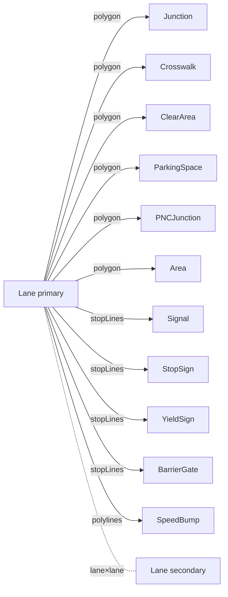

# Overlap Derivation

Apollo's HD map proto models intersections of lanes with junctions /
crosswalks / signals etc. as `OverlapEntity` instances. Each overlap
carries two `ObjectOverlapInfo`s; the lane side has a `start_s` /
`end_s` arc-length interval. Apollo Map Studio treats overlaps as a
**geometric derivation fact**: the user edits geometry, the editor
reconciles the OverlapEntity set, and export ships them to proto
unchanged.

## 1. Design choices

| Decision                                         | Rationale                                                                            |
| ------------------------------------------------ | ------------------------------------------------------------------------------------ |
| Overlaps derive from geometry; no manual draw    | Apollo proto requires `lane.overlap_id[]` to pair-match; manual edits go out of sync |
| Single ID scheme: `overlap_<sortedParticipants>` | A→B and B→A produce the same id; diff is automatically idempotent                    |
| Incremental mode walks a dirty closure           | < 16ms edit budget                                                                   |
| Users may "pin" specific fields                  | `_userOverrides` lets the user lock isMerge / region polygon                         |
| lane × lane has its own path                     | LaneOverlapInfo is the only `oneof` branch carrying startS/endS                      |

## 2. Pair-type matrix



Each pairing is described by a `PairRule`:

```ts
// src/core/elements/overlap/pairTable.ts:106-127
export const PAIR_RULES: readonly PairRule[] = [
  makeRule('junction', 'polygon', (o) => ({ objectType: 'junction', objectId: o.id })),
  makeRule('crosswalk', 'polygon', (o, opts) => { ... }, true /* computeRegion */),
  makeRule('clearArea', 'polygon', (o) => ({ objectType: 'clearArea', objectId: o.id })),
  makeRule('parkingSpace', 'polygon', (o) => ({ objectType: 'parkingSpace', objectId: o.id })),
  makeRule('pncJunction', 'polygon', (o) => ({ objectType: 'pncJunction', objectId: o.id })),
  makeRule('area', 'polygon', (o) => ({ objectType: 'area', objectId: o.id })),
  makeRule('signal', 'stopLines', (o) => ({ objectType: 'signal', objectId: o.id })),
  makeRule('stopSign', 'stopLines', (o) => ({ objectType: 'stopSign', objectId: o.id })),
  makeRule('yieldSign', 'stopLines', (o) => ({ objectType: 'yieldSign', objectId: o.id })),
  makeRule('barrierGate', 'stopLines', (o) => ({ objectType: 'barrierGate', objectId: o.id })),
  makeRule('speedBump', 'polylines', (o) => ({ objectType: 'speedBump', objectId: o.id })),
];
```

## 3. Geometric detection dispatch

`detectPair(lane, other, rule)` branches on `rule.geometry`:

| Geometry      | Algorithm                                                | Arc-length interval                                    |
| ------------- | -------------------------------------------------------- | ------------------------------------------------------ |
| `polygon`     | `polylineIntersectsPolygon` + `polylinePolygonCrossings` | Earliest/latest crossings projected to lane arc length |
| `stopLines`   | `polylinesIntersect` + `polylinePolylineCrossings`       | Min/max crossing across multiple stop lines            |
| `polylines`   | Same                                                     | Used for speedBump                                     |
| `lane × lane` | Standalone `detectLaneLanePair`                          | Per-laneA-startLat cosLat correction                   |

### 3.1 lane × lane trigger conditions

```ts
// pairTable.ts:230-272
const sameJunction = laneA.junctionId !== null && laneA.junctionId === laneB.junctionId;
const crosses = polylinesIntersect(centerA, centerB);

if (sameJunction) {
  hits = crosses || mergeAtEnd || mergeAtStart;
} else {
  hits = crosses && !anyEndpointTouch; // pure endpoint share = pred/succ, not overlap
}
```

Intent:

- **Inside the same junction**: crossings, end-end merges, and
  start-start splits all count as a conflict (the planner has to
  yield).
- **Outside any junction**: pure endpoint sharing is pred/succ
  topology; only real crossings count as overlaps (e.g. a highway
  ramp that geometrically crosses without entering a junction).

### 3.2 Region overlap (GAP-5)

lane × crosswalk additionally computes the "exact intersection
polygon" via `computeRegionPolygon`: lane corridor (left + right
boundary closed into a ring) clipped against the crosswalk polygon
using `polygon-clipping`, taking the largest piece. The result lands
in `OverlapEntity.regionOverlaps[]` as a `RegionOverlapInfo`, and the
`regionOverlapId` is embedded into both the lane-side
`LaneOverlapInfo` and the crosswalk-side `ObjectOverlapInfo`.

Pinning: `_userOverrides: ['regionOverlaps']` lets the inspector pin
the region polygon — geometric recompute will not overwrite it.

## 4. The `reconcileOverlaps` entry point

```ts
// src/core/elements/overlap/reconcile.ts:57-155
export function reconcileOverlaps(entities, mode, index?) {
  const idx = index ?? getSharedSpatialIndex();
  if (mode.mode === 'full') idx.syncFromEntities(entities);
  else idx.syncDirty(entities, mode.dirtyIds);

  const dirtyLanes = collectDirtyLanes(entities, mode, idx);
  const derived = new Map<string, DerivedOverlap>();

  for (const lane of dirtyLanes) {
    const bbox = bboxOfPoints(centerline);
    const neighbors = idx.queryBBox(bbox).filter((n) => n.id !== lane.id);

    for (const n of neighbors) {
      // lane × lane / generic PAIR_RULES dispatch
    }
  }

  return diffWithExisting(entities, derived, mode);
}
```

### 4.1 Modes

| Mode                                | Input         | Use case                                                  |
| ----------------------------------- | ------------- | --------------------------------------------------------- |
| `{ mode: 'full' }`                  | All entities  | After import / manual recompute / pre-export sanity check |
| `{ mode: 'incremental', dirtyIds }` | Dirty closure | After every store mutation during editing                 |

### 4.2 Dirty closure

`collectDirtyLanes`: lanes in `dirtyIds` go directly into the dirty
set. Non-lane overlap participants (junction / crosswalk / …) use
their bbox to query the R-tree for nearby lanes, pulling them in. So
editing a junction polygon does not require a full recompute — only
the lanes that geometrically touch the junction are revisited.

### 4.3 Set diff

`diffWithExisting` does an idempotent set diff between the derived
overlap set and the existing OverlapEntity set:

- Derived only → create OverlapEntity
- Existing only → mark for removal (skipped if outside dirty range)
- Both → update, preserving any `_userOverrides`-pinned fields

Finally `applyOverlapIdsBack` rewrites each participant's
`overlapIds[]` to match the derived set.

## 5. Public surface

| Entry                                            | File                  | Purpose                                                |
| ------------------------------------------------ | --------------------- | ------------------------------------------------------ |
| `reconcileOverlaps(entities, mode, index?)`      | `reconcile.ts:57`     | Main entry                                             |
| `invalidateLaneCaches(removedIds)`               | `reconcile.ts:461`    | Clear arc-length cache on lane removal                 |
| `getSharedSpatialIndex`                          | `spatialIndex.ts:212` | Module-level singleton                                 |
| `bboxForEntity`                                  | `spatialIndex.ts:37`  | Compute entity bbox                                    |
| `makeOverlapId(participants)`                    | `overlapId.ts`        | Sorted derived id                                      |
| `isDerivedOverlapId(id)`                         | same                  | Distinguish derived from imported residue              |
| `PAIR_RULES`, `detectPair`, `detectLaneLanePair` | `pairTable.ts`        | Geometric detection                                    |
| `laneArcLength`, `projectSegmentParam`           | `computeLaneS.ts`     | Arc length + segment-param projection                  |
| `laneCorridorPolygon`                            | `laneCorridor.ts`     | Corridor polygon (subject for region polygon clipping) |

## 6. Recompute triggers

| Trigger                                            | Path                                  | Mode        |
| -------------------------------------------------- | ------------------------------------- | ----------- |
| `mapStore.addEntity / updateEntity / removeEntity` | Dirty closure                         | incremental |
| Apollo import completes                            | apolloMapStore takeover               | full        |
| Inspector "Recompute overlaps" button              | Command palette dispatch              | full        |
| Pre-export sanity check                            | Just before write                     | full        |
| Undo / redo                                        | mapStore restores entities, dirty=ALL | full        |

## 7. Performance budget

| Scale        | Full reconcile | Incremental (dirty=1) |
| ------------ | -------------- | --------------------- |
| 1k entities  | 5-10ms         | < 1ms                 |
| 5k entities  | 30-50ms        | 1-3ms                 |
| 50k entities | 200-500ms      | 5-10ms                |

Major costs: polygon intersection in `detectPair` (O(L · P) per
lane × polygon) and lane × lane `polylinePolylineCrossings` (O(N · M)).
The spatial index keeps the "neighbour count" near constant.

## 8. Pitfalls

1. **Do not mutate entities inside reconcile**: reconcile is a pure
   function; it returns `ReconcilePatch` and the store applies it
   atomically (preserving the zundo single-transaction property).
2. **`lane.junctionId` and `OverlapEntity{lane, junction}` must
   agree**: both `laneTopology`'s junctionId derivation and overlap's
   `lane × junction` detection rely on "centerline crosses polygon".
   Editing a junction polygon without re-running reconcile desynchs
   the two.
3. **Arc-length cache invalidation**: `reconcile.ts:461`'s
   `invalidateLaneCaches(removedIds)` must be called on the lane
   removal path; otherwise `laneArcLength` returns stale prefixes.
4. **`bboxOfPoints` returns null on empty input**: an old buggy
   version returned a zero bbox, which the R-tree treated as
   matching every query containing the origin. All callers now
   null-guard.
5. **lane × lane endpoint touch**: only counted as an overlap inside
   the same junction. Endpoint sharing outside any junction
   (start-start / end-end / end-start / start-end) is pred/succ
   topology, owned by `laneTopology` — **not** an overlap.

## 9. Source map

| Concept              | File                                            | Lines |
| -------------------- | ----------------------------------------------- | ----- |
| reconcile entry      | `src/core/elements/overlap/reconcile.ts`        | 1-463 |
| Pair rules           | `src/core/elements/overlap/pairTable.ts`        | 1-281 |
| Geometric primitives | `src/core/elements/overlap/intersect.ts`        | 1-212 |
| Polygon clipping     | `src/core/elements/overlap/polyClip.ts`         | 1-126 |
| Lane corridor        | `src/core/elements/overlap/laneCorridor.ts`     | 1-61  |
| Arc length           | `src/core/elements/overlap/computeLaneS.ts`     | 1-76  |
| Spatial index        | `src/core/elements/overlap/spatialIndex.ts`     | 1-219 |
| ID generation        | `src/core/elements/overlap/overlapId.ts`        | 1-30  |
| Region ID            | `src/core/elements/overlap/regionId.ts`         | 1-30  |
| Geometry adapters    | `src/core/elements/overlap/geometryAdapters.ts` | 1-132 |
| Public types         | `src/core/elements/overlap/types.ts`            | 1-70  |

## 10. Testing notes

| Test                   | Covers                                                             |
| ---------------------- | ------------------------------------------------------------------ | ----- | --- |
| `reconcile.test.ts`    | full vs incremental; id derivation stability; overlapIds writeback |
| `pairTable.test.ts`    | Each PAIR_RULE plus lane × lane branches                           |
| `intersect.test.ts`    | Geometric intersection primitives (including degenerate input)     |
| `polyClip.test.ts`     | Polygon intersection, `largestRing`                                |
| `computeLaneS.test.ts` | Arc-length prefix cache + invalidation                             |
| `spatialIndex.test.ts` | bbox-signature dedup; `syncDirty` O(                               | dirty | )   |

## 11. FAQ

**Q: If `detectPair` fires on both `A → B` and `B → A`, do duplicate
overlaps get created?**

A: No. `makeOverlapId([A, B])` sorts participants internally so both
directions hash to the same overlap id; the `derived` map dedupes
naturally.

**Q: After pinning `isMerge=true` on an overlap, what happens if one
of the lanes is deleted?**

A: That overlap drops out of the derived set, gets added to
`removedOverlapIds`, and is removed. Pinning protects "preserve if
still present"; it does **not** revive deleted overlaps.

**Q: Where do `lane × stopLine` detections get their stop lines from?**

A: `getStopLines(other)` (`geometryAdapters`): signal's
`stopLines: Curve[]`, stopSign / yieldSign's `stopLines`,
barrierGate's `stopLine`. Each stop line is treated as a polyline for
intersection.

**Q: Which boundary does the lane corridor polygon use?**

A: Prefer `explicitLaneBoundaryEdges(lane)` if explicit left/right
boundaries exist; fall back to centerline + half-width
`offsetPolyline`.

## 12. Relation to other derivation systems

| System                              | Input                | Output                | When                        |
| ----------------------------------- | -------------------- | --------------------- | --------------------------- |
| `applyDerive` (lane / parkingSpace) | Single entity + ctx  | Single entity         | On mutate                   |
| `reconcileLaneTopology`             | (entities, dirtyIds) | Lane diff             | After mutate                |
| `reconcileOverlaps`                 | (entities, mode)     | Overlap diff          | After mutate / on full sync |
| `applyLaneJunctions` (worker)       | features + entities  | features + decoration | Every cold rebuild          |

The four **do not call each other**. The store runs them in order:
`derive → topology reconcile → overlap reconcile`, and finally the
worker synchronises the cold layer.

## 13. Debugging tips

- **Overlap count explodes**: usually "almost parallel but
  geometrically crossing" lanes; verify `polylinesIntersect` inputs
  are not riddled with ultra-short segments.
- **`lane.overlapIds` desyncs from `OverlapEntity`**: the
  `applyOverlapIdsBack` `inScope` filter missed an entity; verify
  `mode.dirtyIds` coverage.
- **Region polygon always null**: lane corridor + crosswalk polygon
  produce degenerate input. After `largestRing(pieces)` the empty
  array means polygon-clipping produced no polygon (extreme
  collinearity / self-intersection).

## 14. Performance monitoring

`reconcileOverlaps` returns a `stats` object:

```ts
stats: {
  pairsTested: number;
  pairsMatched: number;
  overlapsCreated: number;
  overlapsRemoved: number;
  durationMs: number;
}
```

The UI side can surface these via telemetry or a perf overlay;
`durationMs > 50` is a smell (likely a dirty closure runaway).

## 15. See also

- [Geometry Engine](./geometry-engine.md)
- [Spatial Index](./spatial-index.md)
- [Junction Stitching](./junction-stitching.md)
- [Derive Engine](./derive-engine.md)
- [Coordinate System](./coordinate-system.md)
- [State Management](./state-management.md) — how the store orchestrates derive / reconcile
