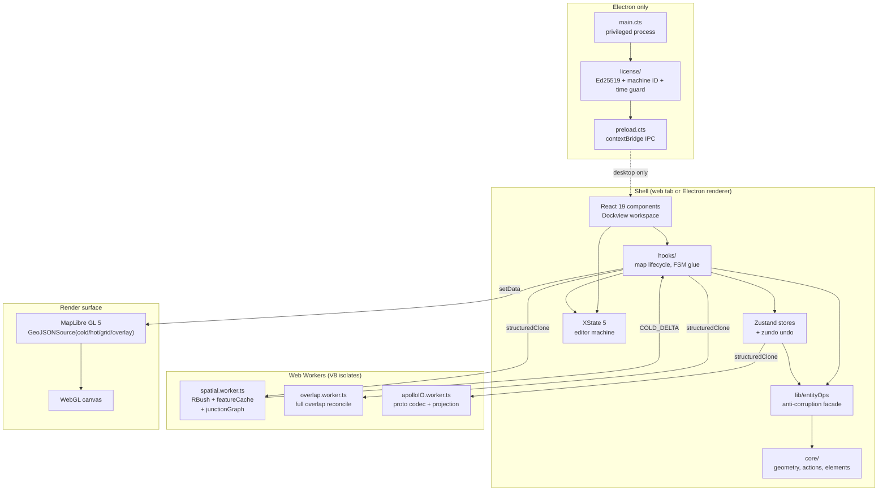
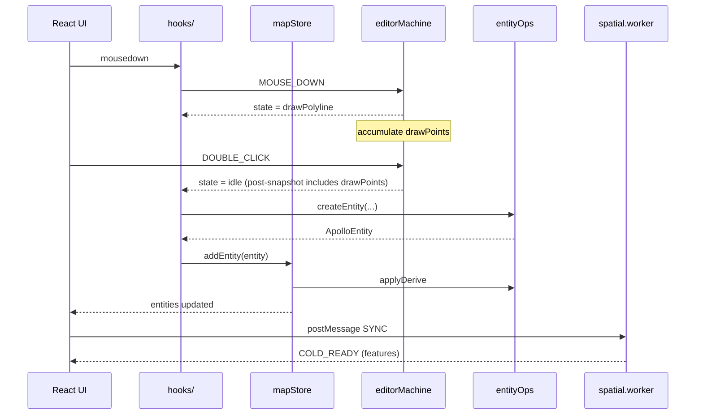

# Architecture Overview

Apollo Map Studio is a TypeScript editor for Apollo HD-map data. It ships in
two surface forms — a standalone web build and an Electron desktop bundle —
sharing a single React 19 codebase. This page is the project's topographic map:
every layer, every worker, every Electron process appears in one diagram, with
module counts and the invariants that hold the system together. When this page
disagrees with `/ARCHITECTURE.md`, **the root summary wins**; this document is
its clickable index.

::: tip Reading order

- Skim the mermaid diagram first to build a spatial sense of the system.
- Follow "See also" cross-links to drill into a subsystem.
- The invariants list is your audit checklist — any PR that breaks one must be
  defended explicitly in review.
  :::

## 1. Purpose and positioning

This project is **not** a traditional Web GIS annotation page. It is a
**lightweight CAD rendering engine plus relational spatial database** running
inside the browser. Goals (DESIGN.md §1):

- **60 fps interaction at 100 000+ features.** Roads, lanes, signals, stop
  lines, parking spaces, crosswalks, speed bumps, PNC junctions and overlaps
  all live in the GPU pipeline of the main thread.
- **Parametric geometry.** No hard-coded shapes — every entity is compiled to
  GeoJSON in real time from a minimal parameter set (origin, dimensions,
  rotation, control points).
- **Strict decoupling.** UI views, render canvas, spatial compute and state
  reference one another only by ID; deep object nesting is forbidden.
- **Protocol fidelity.** TypeScript types map 1:1 to Apollo `map_*.proto` so
  protobuf round-trips lose no fields.

::: info Design intent
We are building a **CAD that can evolve down to a Rust/WebAssembly compute
layer**. Every module must therefore be replaceable, relocatable, and
parallelisable — that is the root cause of the layering, the anti-corruption
layer, and the worker boundaries.
:::

## 2. Top-level system view



## 3. Module count by layer

| Layer         | Files (≈) | Representative modules                                                                                           |
| ------------- | --------- | ---------------------------------------------------------------------------------------------------------------- |
| `components/` | ~70       | `WorkspaceLayout`, `MapCanvas`, `InspectorForms`, `SidebarPanel`                                                 |
| `hooks/`      | ~25       | `useMapEventRouter`, `useColdLayer`, `useHotLayer`, `useActionDispatcher`, `useDrawCommit`                       |
| `store/`      | 7         | `mapStore`, `uiStore`, `settingsStore`, `licenseStore`, `taskProgressStore`, `projDialogStore`, `apolloMapStore` |
| `lib/`        | ~12       | `entityOps.ts` and submodules, `schemas.ts`, `geoJsonHelpers.ts`, `editable-guard.ts`                            |
| `core/`       | ~50       | `actions/registry`, `elements/`, `fsm/editorMachine`, `geometry/`, `workers/`, `spatial/`                        |
| `types/`      | 4         | `apollo.ts`, `editor.ts`, `entities.ts`, `inspectorSchema.ts`                                                    |
| `electron/`   | 3         | `main.cts`, `preload.cts`, `license/`                                                                            |

> Counts drift with refactors; the figures above reflect the 2026-04
> architecture audit. Use `git ls-files | wc -l` for the live number.

## 4. Load-bearing invariants

This is where audits start. Every invariant maps to a fact you can reproduce
with `git grep`.

::: warning 1. Unidirectional imports
`components → hooks → store → lib → core`. Reverse arrows are bugs.
Audit: `git grep -nE "from '@/(components|hooks)/" -- src/core src/lib src/store`.
:::

::: warning 2. Apollo proto anti-corruption
UI may not import `@/core/geometry/apolloCompile` or specific `@/types/apollo`
fields directly; everything flows through `@/lib/entityOps`.
Audit: `git grep "from '@/core/geometry/apolloCompile'" -- 'src/components/**' 'src/hooks/**'`.
:::

::: warning 3. FSM as the single source of truth
Editor macro-state lives only in `editorMachine`
(`src/core/fsm/editorMachine.ts:130`). Components must not maintain shadow
"am-I-currently-drawing" booleans.
:::

::: warning 4. CANCEL before undo
`useActionDispatcher.ts:76-82` sends `CANCEL` to the FSM **before** invoking
`temporal.undo()`. Without this, mid-draw Ctrl+Z desyncs FSM `drawPoints` from
`mapStore.entities` (R1 closure). Regression test:
`src/hooks/__tests__/undoCancel.test.ts`.
:::

::: warning 5. Cold/hot separation
Committed entities → cold layer (worker compiles, single `setData`).
Currently edited / dragged entity → hot layer (main thread, `setData` per
frame). Sharing a GeoJSONSource between the two is a flaky-test factory.
:::

::: warning 6. Input-layer dedup is canonical
`useMapEventRouter`'s `isDuplicateInput` already swallows the second `click`
of a `dblclick` — the FSM must not perform compensatory `slice(-1)`. The
historical "polyline missing its last point" bug was double-compensation. See
the comment block at `editorMachine.ts:83-87`.
:::

::: warning 7. Single zundo transaction per import
`mapStore.batchImport` collapses "write entities → reconcile topology →
reconcile overlaps" into one immer producer, producing exactly one zundo
history entry. Per-entity `addEntity` calls would blow up the history stack
and exceed the limit configured by `settingsStore.historyLimit`.
:::

## 5. Top-level public surface

| Entry             | File                                            | Role                                                |
| ----------------- | ----------------------------------------------- | --------------------------------------------------- |
| `WorkspaceLayout` | `src/components/layout/WorkspaceLayout.tsx:186` | Root layout — Dockview, FSM provider, license hooks |
| `editorMachine`   | `src/core/fsm/editorMachine.ts:130`             | XState 5 machine definition                         |
| `ACTION_DEFS`     | `src/core/actions/registry/definitions.ts:22`   | Global action table                                 |
| `useMapStore`     | `src/store/mapStore.ts:86`                      | Entity store + zundo undo                           |
| `entityOps`       | `src/lib/entityOps.ts:1`                        | Apollo anti-corruption facade                       |

## 6. Cross-subsystem interaction



## 7. Three-axis decomposition

Every file participates in three hierarchies at once:

### Axis 1 — State

```
mapStore (entities + zundo)
  └─ FSM (editorMachine drawing / selection state)
       └─ uiStore (preferences, layer visibility)
            └─ derived caches (spatial.worker, overlap.worker)
```

State flows downward: a `mapStore` mutation triggers FSM cleanup
(`src/hooks/useActionDispatcher.ts:104-110`) which triggers worker
re-decoration (`src/hooks/useColdLayer.ts:236-275`).

### Axis 2 — Pipeline

```
input → FSM event → store mutation → worker SYNC/INCREMENTAL → MapLibre setData
```

Hot edits run every frame; cold commits coalesce on RAF.

### Axis 3 — Shell

```
electron main ↔ contextBridge IPC ↔ renderer ↔ web workers
```

Only the desktop surface populates the leftmost link; everything to the right
of `renderer` is identical between web and desktop builds.

## 8. Execution boundaries

| Boundary                 | Implementation                         | What crosses                                                        |
| ------------------------ | -------------------------------------- | ------------------------------------------------------------------- |
| Renderer ↔ Web Worker    | `postMessage` + `structuredClone`      | `WorkerRequest` / `WorkerResponse` (`src/core/workers/protocol.ts`) |
| Renderer ↔ Electron main | `contextBridge` + `ipcRenderer.invoke` | typed license payloads only — no `Map`, no `Buffer`, no DOM         |
| Cold layer ↔ MapLibre    | `GeoJSONSource.setData / updateData`   | feature collections, never raw entities                             |
| FSM ↔ store              | actor `subscribe` + manual `send`      | events (`SELECT_TOOL`, `MOUSE_DOWN`, `CONFIRM`, `CANCEL`, …)        |

::: warning Worker boundary cost
`structuredClone` is the dominant cost above ~5 000 entities. Two mitigations:
chunked `SYNC_BEGIN` / `SYNC_CHUNK` / `SYNC_FINISH`
(`src/core/workers/spatialRequests.ts:82-115`) and `COLD_DELTA` responses that
ship only the changed entity groups
(`src/core/workers/spatialRequests.ts:117-137`).
:::

## 9. Common pitfalls

::: danger Cross-layer imports
`components/` reaching for `import x from '@/types/apollo'` is the first sign
of an anti-corruption breach. Apollo field access must travel through
`entityOps`'s `MapEntity` shape.
:::

::: danger Double compensation
Be wary of `drawPoints.slice(0, -1)` inside the FSM. Input dedup already
removed the duplicate click; another slice deletes a real point. See the
comment at `editorMachine.ts:83-87`.
:::

::: danger Drift during undo
Calling `temporal.undo()` while the FSM is still in a draw state breaks the R1
closure. Always `CANCEL` first.
:::

::: danger Mutating entities outside an immer producer
zundo snapshots at the close of `set((state) => ...)`. Side effects outside
the producer never enter the history stack.
:::

## 10. Source map (file:line refs)

- `src/components/layout/WorkspaceLayout.tsx:186` — `WorkspaceLayout` entry
- `src/core/fsm/editorMachine.ts:130` — `setup({...}).createMachine` body
- `src/core/fsm/editorMachine.ts:18-25` — `DRAW_STATES` single source of truth
- `src/core/actions/registry.ts:1-22` — `ACTION_DEFS` re-export
- `src/store/mapStore.ts:86-263` — `useMapStore` + zundo middleware
- `src/store/mapStore.ts:184-198` — `batchImport` single transaction
- `src/lib/entityOps.ts:12-39` — entityOps facade exports
- `src/lib/entityOps/edit.ts:76-85` — `createEntity` + applyDerive
- `src/hooks/useActionDispatcher.ts:76-82` — R1 CANCEL closure
- `ARCHITECTURE.md` — single-page authoritative summary

## 11. Surfaces: web vs desktop

| Surface | Entry                                                         | License                                                                                           | File I/O                                                     | Process boundary                                     |
| ------- | ------------------------------------------------------------- | ------------------------------------------------------------------------------------------------- | ------------------------------------------------------------ | ---------------------------------------------------- |
| Web     | `index.html` → `src/main.tsx`                                 | none — `licenseBridge` falls back to a permissive trial state (`src/lib/license-bridge.ts:62-75`) | browser File API + downloads                                 | single renderer + workers                            |
| Desktop | Electron `BrowserWindow` boots from `electron/main.cts:18-54` | `LicenseManager` enforces Ed25519 + machine binding (`electron/license/manager.cts:31-313`)       | same browser-style API; main process never touches user maps | renderer + workers + Electron main + license process |

The renderer code is **identical in both modes**. The single seam is
`window.apolloMapStudioLicense`, wired in `electron/preload.cts:13-47` and
read by `src/lib/license-bridge.ts:77-101`. When the bridge is absent
(`isDesktopBuild() === false`), every license call resolves to the
permissive `fallbackState()`.

## 12. Performance budgets

| Metric                        | Threshold                     | Source                           |
| ----------------------------- | ----------------------------- | -------------------------------- |
| 50 000 entity import          | ≤500 ms                       | `bench-budgets.json`             |
| Cold layer setData (50k)      | ≤180 ms                       | `bench-budgets.json`             |
| Incremental overlap reconcile | ≤8 ms per mutation            | `bench-budgets.json`             |
| `pnpm bench` in CI            | fails if any budget regresses | `scripts/check-bench-budget.mjs` |

::: tip Performance gating
Any PR that bumps `bench-results.json` above the budget fails CI without
human review.
:::

## 13. Security and threat model

| Threat                              | Mitigation                                                                                                     |
| ----------------------------------- | -------------------------------------------------------------------------------------------------------------- |
| License bypass                      | Desktop `LicenseManager` checks Ed25519 signature + machine ID binding (`electron/license/manager.cts:31-313`) |
| Debugger tampering with React state | Renderer only receives typed IPC payloads from the main process via contextBridge                              |
| Worker XSS                          | Workers have no DOM access; postMessage payloads are structured data                                           |
| Third-party proto field churn       | The anti-corruption layer (R2); UI never reads proto fields                                                    |

## 14. See also

- [Layered Architecture](./layered-architecture.md) — the import-direction rule
  and audit grep
- [Tech Stack](./tech-stack.md) — every dependency, version, and rationale
- [Workspace Layout](./workspace-layout.md) — Dockview panels and persistence
- [State Management](./state-management.md) — Zustand + zundo stores
- [Action Registry](./action-registry.md) — the central action catalogue
- [FSM Design](./fsm-design.md) — XState 5 editor machine
- [entityOps Module](./entityops.md) — proto anti-corruption facade
- [Anti-Corruption Layer](./anti-corruption-layer.md) — the broader treatise
- [Cold/Hot Layers](../../architecture/cold-hot-layers.md) — render pipeline
- [Worker Protocol](../../architecture/worker-protocol.md) — postMessage tables
- [Electron Integration](../../architecture/electron-integration.md) — dual surface
- [License System](../../architecture/license-system.md) — offline activation
- [Testing Strategy](../../architecture/testing-strategy.md) — regression matrix
