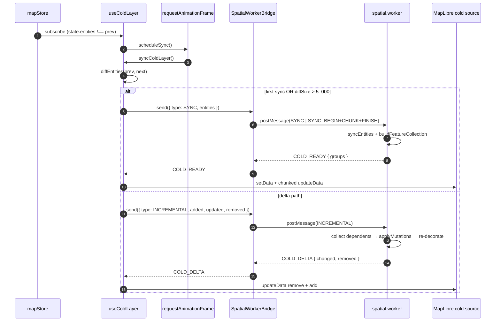
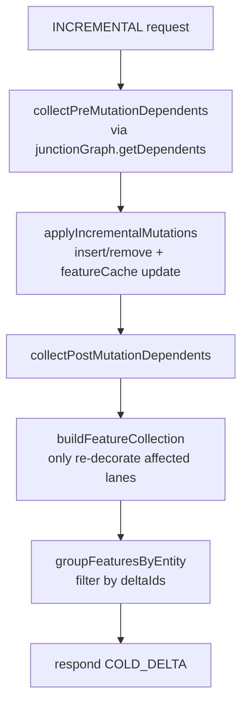
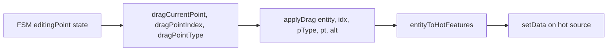

# Rendering Pipeline Deep Dive

This page breaks the rendering pipeline down to the granularity of
"every postMessage, every RAF tick". Audience: engineers who need to
modify performance or correctness boundaries — for example moving
bezier compilation into WASM, or replacing the worker protocol with
SharedArrayBuffer.

## 1. Pipeline overview



## 2. Cold pipeline

### 2.1 Triggers

`useColdLayer` registers two subscriptions:

```ts
// src/hooks/useColdLayer.ts:296-300
const unsubscribeStore = useMapStore.subscribe((state, prevState) => {
  if (state.entities !== prevState.entities) {
    scheduleSync();
  }
});
```

It also subscribes to the FSM (`actorRef.subscribe(onActorChange)`) to
react to `selectedEntityId` changes (used for the cold-layer selection
filter). `scheduleSync` does not synchronise immediately; it schedules
work into the next RAF:

```ts
// src/hooks/useColdLayer.ts:278-281
const scheduleSync = () => {
  if (syncFrameRef.current !== null) return;
  syncFrameRef.current = requestAnimationFrame(syncColdLayer);
};
```

**Why RAF coalescing matters**: a burst of `addEntity` / `updateEntity`
calls (e.g. batch import or `reconcileOverlaps`) collapses into one
worker round-trip per frame.

### 2.2 Diff and path selection

`diffEntities(prev, next)` returns `{ added, updated, removed }`. It
uses **reference comparison** (`previousEntity !== entity`) to detect
updates — Zustand + Immer guarantee that unchanged entities preserve
their object identity.

Threshold decision:

| Condition                                              | Path              |
| ------------------------------------------------------ | ----------------- |
| `prevEntitiesRef === null` (first sync)                | Full SYNC         |
| `diffSize > FULL_SYNC_ENTITY_CHANGE_THRESHOLD = 5_000` | Full SYNC         |
| Otherwise                                              | INCREMENTAL delta |

Source: `src/hooks/useColdLayer.ts:227-247`.

### 2.3 The postMessage clone boundary

The main thread and the worker exchange `SerializedEntity[]` through
structured cloning. **There is no ArrayBuffer transfer and no shared
WASM memory** — this is the largest cost (a 50k-entity SYNC takes
roughly 200ms on a typical laptop). `SpatialWorkerBridge` mitigates it
with:

1. Threshold-based chunking: `SYNC_ENTITY_CHUNK_SIZE = 2_000`. Beyond
   that, the bridge switches to `SYNC_BEGIN → SYNC_CHUNK*N → SYNC_FINISH`.
2. `await yieldToMain()` between chunks lets the main thread paint
   intervening frames.
3. INCREMENTAL is not chunked (typical dirty sets stay below 50).

The reverse direction is also chunked: `COLD_GROUP_CHUNK_SIZE = 1_000`
in `spatial.worker.ts:respondChunked` splits oversized `COLD_READY`
responses into ordered `COLD_GROUPS_CHUNK[]` messages, which the
bridge merges via `mergeChunks`.

### 2.4 Worker internals



Key files:

| Step                            | File:line                                     |
| ------------------------------- | --------------------------------------------- |
| Dispatch                        | `src/core/workers/spatialRequests.ts:139-164` |
| Affected-lane collection        | `src/core/workers/spatialRequests.ts:12-58`   |
| Feature cache + RBush           | `src/core/workers/spatialState.ts:76-115`     |
| FC builder                      | `src/core/workers/spatialFeatures.ts:65-118`  |
| Junction stitching + decoration | `src/core/geometry/laneJunctions.ts:150-165`  |

### 2.5 Main-thread application

After receiving a response, `useColdLayer` does:

- `COLD_READY`: `groupsToFeatureMap(groups)` writes back into
  `entityFeatureCacheRef`, then it clears the source and calls
  `updateData({ add })` in batches of 4 000.
- `COLD_DELTA`: derive `previousFeatures` (to remove) from the cache,
  merge `changed` into the cache, then call `applyColdDeltaToSource`:
  one `updateData({ remove })` followed by chunked
  `updateData({ add })`.

```ts
// src/hooks/useColdLayer.ts:96-115
const remove = previousFeatures.map(featureId).filter(...);
if (remove.length > 0) await updateColdSourceChunk(src, { remove });
let add: GeoJSON.Feature[] = [];
for (const group of changed) {
  for (const feature of group.features) {
    add.push(withPromotedFeatureId(feature));
    if (add.length >= SOURCE_UPDATE_CHUNK_SIZE) {
      await updateColdSourceChunk(src, { add });
      add = [];
    }
  }
}
if (add.length > 0) await updateColdSourceChunk(src, { add });
```

`promoteId` together with `withPromotedFeatureId` lets MapLibre track
each feature deterministically across delta updates.

### 2.6 Versioning to defeat out-of-order responses

`useColdLayer` keeps a `syncVersionRef`. Each `syncColdLayer`
invocation does `++syncVersionRef.current` and captures the value as
`requestVersion`; the response handler checks
`if (cancelled || requestVersion !== syncVersionRef.current) return;`.
The effect: if the user fires five edits in rapid succession,
spawning five concurrent INCREMENTAL requests, only the latest
response actually applies. The intermediate stale responses are
discarded — preventing a "newer state is overwritten by an older
delta" race.

## 3. Hot pipeline

### 3.1 Triggers

`useHotLayer` subscribes to both the FSM (`actorRef.subscribe`) and
mapStore. Either change schedules a render via RAF.

### 3.2 Render-state deduplication

It builds a `HotRenderState` and compares with the previous via
`sameHotRenderState`. **Identical states return early** without
calling setData.

```ts
// src/hooks/useHotLayer.ts:30-41
function sameHotRenderState(a, b) {
  return (
    !!a &&
    a.selectedEntityId === b.selectedEntityId &&
    a.entity === b.entity && // reference equality is enough
    a.isEditingPoint === b.isEditingPoint &&
    a.dragPointIndex === b.dragPointIndex &&
    a.dragPointType === b.dragPointType &&
    a.dragAltKey === b.dragAltKey &&
    samePoint(a.dragCurrentPoint, b.dragCurrentPoint)
  );
}
```

### 3.3 Drag preview



- `applyDrag` is **a pure function**: it returns a new entity without
  writing to the store, so the preview never pollutes the data layer;
  on `mouseup`, `onMouseUp` calls `updateEntity` once to commit.
- `entityToHotFeatures` compiles the entity into three GeoJSON groups:
  the geometry shape, the vertices, and the control handles.

### 3.4 Why hot bypasses the worker

The hot layer renders one entity. Compilation cost is below 0.5ms
(48-segment bezier sampling). At that scale, the postMessage clone
itself becomes the bottleneck. Keeping hot on the main thread holds
60fps.

## 4. Overlay / Snap / Grid pipelines

| Pipeline          | Source of change                                                     | Frequency         | Sync primitive                            |
| ----------------- | -------------------------------------------------------------------- | ----------------- | ----------------------------------------- |
| `useOverlayLayer` | FSM `currentState` + `drawPoints` + `bezierAnchors` + `previewPoint` | mousemove         | RAF                                       |
| `useGridLayer`    | `uiStore.gridEnabled` + `moveend` / `zoomend`                        | viewport changes  | direct (no RAF; events are low-frequency) |
| Snap indicator    | `uiStore.currentSnapTarget`                                          | mousemove         | UI store dedup                            |
| `useApolloLayer`  | `apolloMapStore.bounds`                                              | import completion | one-shot `fitBounds`                      |

`useOverlayLayer` uses an `OVERLAY_BUILDERS` dispatch map for each
draw state:

```ts
// src/hooks/useOverlayLayer.ts:157-164
const OVERLAY_BUILDERS: Record<string, OverlayBuilder> = {
  drawPolyline: buildPolylineFeatures,
  drawCatmullRom: buildCatmullRomFeatures,
  drawBezier: buildBezierFeatures,
  drawArc: buildArcFeatures,
  drawRotatedRect: buildRotatedRectFeatures,
  drawPolygon: buildPolygonFeatures,
};
```

## 5. Public surface

`useColdLayer` / `useHotLayer` / `useOverlayLayer` all return `void` —
they are effect hooks; subscriptions and `setData` calls happen inside
`useEffect`.

Helpers exported for tests and diagnostics (mocked in vitest):

| Export                  | File                         | Purpose                                |
| ----------------------- | ---------------------------- | -------------------------------------- |
| `groupFeaturesByEntity` | `useColdLayer.ts:20-32`      | Group features by `properties.id`      |
| `diffEntities`          | `useColdLayer.ts:121-144`    | Test add/update/remove paths           |
| `flattenEntityFeatures` | `useColdLayer.ts:70-76`      | Flatten the per-entity feature buckets |
| `sameHotRenderState`    | `useHotLayer.ts:30-41`       | Unit test render dedup                 |
| `buildOverlayFeatures`  | `useOverlayLayer.ts:166-169` | Direct dispatch lookup                 |
| `metersForZoom`         | `useGridLayer.ts:9-21`       | Grid step ladder                       |

## 6. Performance budget

| Stage                          | Budget           | Source                                      |
| ------------------------------ | ---------------- | ------------------------------------------- |
| INCREMENTAL (dirty=1 lane)     | < 5ms end-to-end | `pnpm bench` + `scripts/bench-budgets.json` |
| `applyDrag` on Catmull-Rom     | < 1ms            | derived from 60fps hot-layer                |
| postMessage SYNC (5k entities) | < 50ms per chunk | < 25ms per chunk after splitting            |
| RBush hitTest (1k entities)    | < 0.5ms          | rbush 4.x benchmark                         |

## 7. WASM hooks

**There is no WASM today**. We evaluated moving `applyLaneJunctions`
and RBush into Rust + wasm-bindgen and deferred to P3:

- Marginal gain: JS rbush already handles 50k entities; the bottleneck
  is the postMessage clone, not the algorithms.
- WASM shared memory (SharedArrayBuffer + Atomics) requires COOP/COEP
  headers, which adds complexity to Electron packaging.
- The TS spatial stack is already < 700 LOC. Cross-language stitching
  loses readability with little benefit.

Should WASM ever be needed: the worker's `handleRequest` dispatch is a
clean boundary. Start with `intersect.ts` / `polyClip.ts` — they are
CPU-bound and called repeatedly by the overlap pipeline.

## 8. Pitfalls

1. **Do not read `featureCache` from React components**: it lives in
   the worker. The main-thread `entityFeatureCacheRef` is a mirror used
   only by the delta-apply path; it is not the source of truth.
2. **Avoid long awaits inside RAF callbacks**: `updateData` returns
   a `Promise`, but waiting too long defeats coalescing — a single
   frame can end up paying for two `SOURCE_UPDATE_CHUNK_SIZE` add
   queues.
3. **Snapshot before scheduling**: `prevEntitiesRef.current = snapshot`
   is set before the schedule, so a worker failure does not cause a
   double-send on the next tick.
4. **`syncVersionRef` is monotonic, not per-worker**: if you ever add
   a worker pool, switch to `Map<workerId, version>`.

## 9. Source map

| Concept          | File                                  | Lines   |
| ---------------- | ------------------------------------- | ------- |
| Cold hook        | `src/hooks/useColdLayer.ts`           | 161-334 |
| Cold helpers     | `src/hooks/useColdLayer.ts`           | 20-159  |
| Hot hook         | `src/hooks/useHotLayer.ts`            | 43-132  |
| Overlay hook     | `src/hooks/useOverlayLayer.ts`        | 219-285 |
| Bridge           | `src/core/workers/spatialBridge.ts`   | 1-143   |
| Worker entry     | `src/core/workers/spatial.worker.ts`  | 1-38    |
| Request dispatch | `src/core/workers/spatialRequests.ts` | 1-165   |
| Worker state     | `src/core/workers/spatialState.ts`    | 1-116   |
| Feature builder  | `src/core/workers/spatialFeatures.ts` | 1-118   |
| Hit test         | `src/core/workers/spatialHitTest.ts`  | 1-81    |
| Protocol types   | `src/core/workers/protocol.ts`        | 1-74    |

## 10. Debugging

- **Cold layer stale**: log `diff` inside `useColdLayer` —
  if `added/updated/removed` are all empty while the store does
  change, the `state.entities` reference isn't changing; check the
  mutate path returns a fresh Map.
- **Worker deadlock**: `SpatialWorkerBridge`'s default timeout is
  120s. Stuck requests are rejected and cleared from the pending
  table. Chrome devtools' Workers panel shows every in-flight
  message.
- **Duplicate feature ids in `COLD_DELTA` add**:
  `withPromotedFeatureId` must produce a unique id per feature;
  earlier code paths that skipped it produced ghost features.

## 11. See also

- [Cold / Hot Layers](./cold-hot-layers.md)
- [Spatial Index](./spatial-index.md)
- [Junction Graph](./junction-graph.md)
- [Junction Stitching](./junction-stitching.md)
- [Worker Protocol](./worker-protocol.md)
