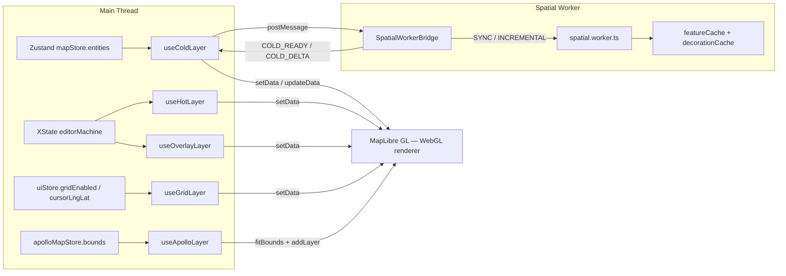
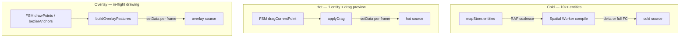
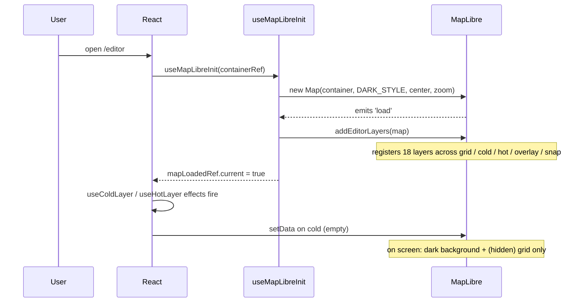
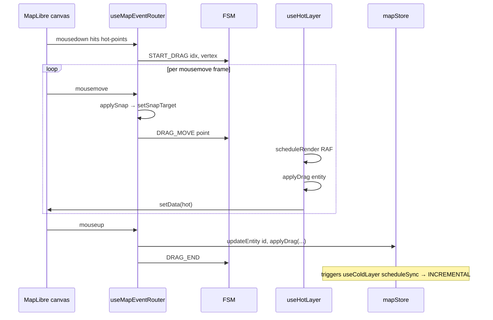

# Rendering Layer Overview

Apollo Map Studio runs a CAD-like editor in the browser, using
[MapLibre GL](https://maplibre.org/) as a pure WebGL renderer while
**all business logic, geometry inference, and spatial indexing are
pushed out to Workers and pure-function modules**. This page lays out
the topology of the rendering layer: how the MapLibre instance boots,
which sources and layers exist, the draw order, how paint properties
are driven by `ams-*` design tokens, and the engineering rationale
behind the static/dynamic split (cold / hot / overlay / grid / snap /
apollo).

## 1. Design goals

| Goal                               | Mechanism                                                                                              |
| ---------------------------------- | ------------------------------------------------------------------------------------------------------ |
| 60fps drag interaction             | High-frequency entities live in `hot`; we bypass React diff and call `setData()` directly              |
| Sub-second render of 10k+ entities | `cold` GeoJSON is compiled once in a Worker and cached; main thread only pushes full or delta payloads |
| Sub-16ms edit budget               | INCREMENTAL path re-decorates only the affected lanes                                                  |
| Hot-swappable visual tokens        | Paint expressions reference colors derived from `--color-ams-*` CSS variables                          |
| Multi-source coexistence           | `apollo-*` layers sit beneath `cold-*`, keeping imported Apollo data visually distinct                 |

## 2. Pipeline overview



## 3. Source / Layer inventory

`addEditorLayers` registers every source and layer once the map fires
`load`. The registration order **is** the z-order — earlier registrations
draw first and later ones stack on top:

| Order             | Source                                                                     | Layer ids                                                                                                                                                | Purpose                                                   |
| ----------------- | -------------------------------------------------------------------------- | -------------------------------------------------------------------------------------------------------------------------------------------------------- | --------------------------------------------------------- |
| 1                 | `grid`                                                                     | `grid-line`                                                                                                                                              | Metric grid (Photoshop-style guides)                      |
| 2                 | `cold`                                                                     | `cold-fill` / `cold-fill-crosswalk` / `cold-fill-cleararea` / `cold-line` / `cold-line-dotted` / `cold-line-dashed` / `cold-labels` / `cold-lane-arrows` | Committed entities (lane, junction, crosswalk, signal, …) |
| 3                 | `hot`                                                                      | `hot-fill` / `hot-line` / `hot-points`                                                                                                                   | Selected entity geometry plus draggable handles           |
| 4                 | `overlay`                                                                  | `overlay-fill` / `overlay-line` / `overlay-points` / `overlay-handles` / `overlay-handle-lines`                                                          | In-flight drawing previews (polyline, bezier anchors, …)  |
| 5                 | `snap`                                                                     | `snap-ring` / `snap-dot`                                                                                                                                 | Snap indicator (cyan ring under the cursor)               |
| `apollo-*` (lazy) | `apollo-lane-center` / `apollo-lane-boundary` / `apollo-road-boundary` / … | Read-only imported Apollo source data (distinct palette)                                                                                                 |

Note: `useApolloLayer` inserts `apollo-*` layers **below** the cold
layers so user edits float visually on top of imported source data.

Source map: `src/hooks/mapLibreInit/layers.ts:270-277` is the canonical
registration point.

## 4. Static/Dynamic split: cold / hot / overlay



- **Cold layer**: the bulk of the map; rebuilds go through the worker,
  and edits ride the INCREMENTAL delta path so the main thread never
  stalls. Detailed in
  [rendering-pipeline](./rendering-pipeline.md) and
  [cold-hot-layers](./cold-hot-layers.md).
- **Hot layer**: renders only the currently selected entity plus its
  draggable handles; during a drag, `applyDrag` synthesises the preview
  geometry on the main thread and calls `setData` directly, **bypassing
  the worker** entirely.
- **Overlay layer**: visualises the in-progress drawing state
  (`drawPolyline`, `drawCatmullRom`, `drawBezier`, `drawArc`,
  `drawRotatedRect`, `drawPolygon`). The `OVERLAY_BUILDERS` dispatch
  table inside `useOverlayLayer` routes each draw state to its own
  feature builder.
- **Snap layer**: kept as an independent source so the indicator can
  appear during vertex drags (i.e. outside any draw state); it
  subscribes to `uiStore.currentSnapTarget`.

## 5. Paint properties and ams-\* tokens

Cold-layer colors are not hard-coded in hooks. They are written into
the GeoJSON `properties` and read back by MapLibre data-driven paint
expressions (see `addColdLayers`):

```ts
// src/hooks/mapLibreInit/layers.ts:30-40
map.addLayer({
  id: 'cold-fill',
  type: 'fill',
  source: 'cold',
  paint: {
    'fill-color': ['get', 'color'],
    'fill-opacity': ['coalesce', ['get', 'fillOpacity'], 0.15],
  },
});
```

The entity compilers (`compileColdFeatures`, `compileApolloFeatures`)
translate **semantic design tokens** (`ams-bg-base`, `ams-accent` and
friends, declared inside the `@theme` block of `src/index.css`) into
hex / rgba values. The architecture leaves a door open for future direct
CSS-variable reads — today, paint expressions still serialize to JSON,
so we lower tokens to literal colors via `mapConstants`. The crucial
property: **components never write `#ff4444` directly; everything
flows through token modules**.

Hot- and snap-layer colors are fixed (red `#ff4444` / cyan `#00d4ff`).
They denote "an edit / snap is happening right now" and are excluded
from token swaps on purpose.

## 6. Fonts, icons, and SDF assets

`registerRuntimeImages` injects runtime-generated textures after
`load`:

| Resource       | Type                        | Purpose                                                               |
| -------------- | --------------------------- | --------------------------------------------------------------------- |
| `zebra-stripe` | 16×16 raster                | Crosswalk fill-pattern (horizontal stripes)                           |
| `red-hatch`    | 12×12 raster                | Clear-area fill-pattern (red diagonal hatch)                          |
| `lane-arrow`   | 20×20 SDF                   | Direction arrows along the lane centerline (`symbol-placement: line`) |
| Map icons      | via `registerMapIcons(map)` | Signal / stop sign / yield sign etc. SVG → bitmap                     |

Fonts use the default glyph URL
(`https://demotiles.maplibre.org/font/{fontstack}/{range}.pbf`) only as
a fallback. The editor UI fonts (Syne + JetBrains Mono) are loaded by
the React side's global stylesheet; they never enter the MapLibre
pipeline.

## 7. Public surface

| Hook               | Inputs                                            | Responsibility                                                           |
| ------------------ | ------------------------------------------------- | ------------------------------------------------------------------------ |
| `useMapLibreInit`  | `containerRef`                                    | Construct the MapLibre instance, register all sources/layers             |
| `useColdLayer`     | `mapRef`, `mapLoadedRef`, `actorRef`, `bridgeRef` | Watch `mapStore`, RAF-coalesce, send SYNC/INCREMENTAL to the worker      |
| `useHotLayer`      | `mapRef`, `mapLoadedRef`, `actorRef`              | Watch FSM + selected entity, `setData` per frame                         |
| `useOverlayLayer`  | `mapRef`, `mapLoadedRef`, `actorRef`              | Watch FSM draw states + `currentSnapTarget`                              |
| `useGridLayer`     | `mapRef`, `mapLoadedRef`                          | Recompute grid step on viewport changes                                  |
| `useApolloLayer`   | `mapRef`, `mapLoadedRef`                          | Register `apollo-*` placeholder layers below cold + fit bounds on import |
| `useCursorManager` | `mapRef`, `actorRef`                              | Switch canvas cursor based on FSM state                                  |
| `useDragPan`       | `mapRef`, `actorRef`                              | Disable MapLibre's built-in dragPan during entity drags                  |

## 8. Performance notes

- **postMessage clone boundary**: a cold SYNC structurally clones the
  entire entities array. `SpatialWorkerBridge` switches to a
  `SYNC_BEGIN / SYNC_CHUNK / SYNC_FINISH` three-stage protocol when
  count > 2 000, preventing main-thread stalls (see
  [rendering-pipeline](./rendering-pipeline.md)).
- **RAF coalescing**: `useColdLayer`, `useHotLayer`, and
  `useOverlayLayer` all gate their work behind `requestAnimationFrame`
  so multiple store pushes within one frame coalesce into a single
  paint. In practice, mousemove storms still hold 60fps.
- **Chunked updateData**: cold-layer delta application chunks add lists
  in batches of `SOURCE_UPDATE_CHUNK_SIZE = 4_000`. Single oversized
  `add` payloads can stall MapLibre's internal layout step.
- **promoteId**: cold source has `promoteId: 'featureId'`, so MapLibre
  can identify each feature deterministically; hover/highlight filters
  do not require re-ordering features.

## 9. Pitfalls

1. **Order matters**: the order in which `addColdLayers`,
   `addHotLayers`, and `addOverlayLayers` register their layers is the
   final z-order. Do not swap them. Apollo layers must remain _below_
   cold; hot must remain above cold; overlay must remain above hot so
   the in-progress drawing renders on top.
2. **`map.once('load')` timing**: `useColdLayer` handles both the
   already-loaded and not-yet-loaded paths. Reading `map.getStyle()`
   before `mapLoadedRef.current === true` will hand you an empty
   layers array.
3. **Selected entity must stay in cold**: `buildColdLayerFilter` keeps
   the selected entity visible in the cold layer; hot only stacks
   handles and the red highlight on top. This avoids a one-frame flash
   on selection (see `src/components/map/coldLayerConfig.ts:50-60`).
4. **Grid step ladder**: `metersForZoom` is hand-tuned. When changing
   it, mind the `MAX_LINES_PER_AXIS = 240` guard rail — extreme
   zoom-out can otherwise generate tens of thousands of lines and OOM
   the GPU.

## 10. Source map

| Concept                        | File                                    | Lines |
| ------------------------------ | --------------------------------------- | ----- |
| MapLibre boot                  | `src/hooks/useMapLibreInit.ts`          | 1-46  |
| Source/Layer registration      | `src/hooks/mapLibreInit/layers.ts`      | 1-277 |
| Runtime textures               | `src/hooks/mapLibreInit/assets.ts`      | 1-77  |
| Cold layer hook                | `src/hooks/useColdLayer.ts`             | 1-335 |
| Cold layer filters / selection | `src/components/map/coldLayerConfig.ts` | 1-60  |
| Hot layer hook                 | `src/hooks/useHotLayer.ts`              | 1-133 |
| Overlay layer hook             | `src/hooks/useOverlayLayer.ts`          | 1-286 |
| Grid layer hook                | `src/hooks/useGridLayer.ts`             | 1-149 |
| Apollo read-only layer         | `src/hooks/useApolloLayer.ts`           | 1-237 |
| MapCanvas composition          | `src/components/map/MapCanvas.tsx`      | 1-46  |

## 11. End-to-end timeline examples

### 11.1 First map load



### 11.2 User drags a lane vertex



## 12. Extensibility

### 12.1 Adding a new source / layer

If you ever want a "thumbnail" overview layer, the canonical flow:

1. Append `addThumbnailLayer(map)` to `addEditorLayers`, mind z-order.
2. Write a `useThumbnailLayer(mapRef, mapLoadedRef, store)` hook,
   honouring the "sole writer" rule.
3. Mount it in `MapCanvas.tsx`.
4. Drive paint via `properties.color` + `['get', 'color']` — never
   hard-code color literals in hooks.

### 12.2 Adding a new entity type

The cold-layer paint expressions are all data-driven, so **adding an
entity type does not require adding a layer**. The minimum:

1. Add a dispatch branch in `compileColdFeatures` that emits features
   with `properties.color` / `properties.entityType` /
   `properties.role`.
2. If a custom fill-pattern is needed, register it in
   `registerRuntimeImages` (e.g. `addStripeImage`).
3. If layer-level filtering by entityType is required (a new area
   type with its own pattern), add a layer + filter in
   `coldLayerConfig.ts`.

## 13. Debugging tips

- **No entities visible**: check whether `mapLoadedRef.current` ever
  becomes true; whether the worker bridge `onerror` fires; whether
  the browser console shows GeoJSON parse errors.
- **Grid does not show**: confirm `uiStore.gridEnabled === true` and
  zoom is not in the extreme range (zoom < 0 produces no grid).
- **Apollo source layers hidden under user edits**: verify that
  `useApolloLayer`'s `beforeId = coldLayer?.id` is inserting the
  layers below cold.
- **Main-thread stalls during drags**: record 10s with Chrome
  DevTools Performance; if cold-layer setData appears inside
  mousemove frames, `prevEntitiesRef` is not effective, leading to
  an INCREMENTAL re-send every mousemove.

## 14. See also

- [Rendering Pipeline](./rendering-pipeline.md) — step-by-step cold/hot pipelines and worker protocol
- [Cold / Hot Layers](./cold-hot-layers.md) — strict definitions and read/write rules
- [Spatial Index](./spatial-index.md) — the role of RBush inside the worker
- [Map Event Router](./map-event-router.md) — how mouse events fan out into FSM and rendering
- [Design Tokens](./design-tokens.md) — `ams-*` namespace and extension rules
- [State Management](./state-management.md) — Zustand + zundo's interface to cold-layer RAF scheduling
- [FSM Design](./fsm-design.md) — XState driving the hot / overlay layers
- [Junction Stitching](./junction-stitching.md) — visual behaviour of lane boundary stitching
