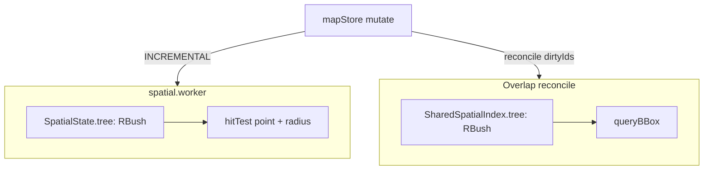
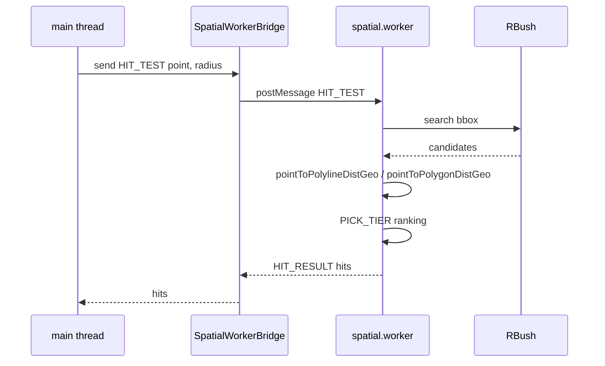

# Spatial Index

At tens of thousands of entities, "O(N) full-table scan" is the root
cause of nearly every interactive stall. Apollo Map Studio uses
[RBush](https://github.com/mourner/rbush) in two places to drop
spatial queries from O(N) to O(log N + k): one inside the spatial
worker (hit test / cold layer), the other in the overlap pipeline
(lane × neighbour scan). This page documents node shapes, BBox rules,
the hit-test path, and the geographic distance conventions in full.

## 1. Why RBush

| Metric          | RBush 4.x              | Grid index        | KD-tree                     |
| --------------- | ---------------------- | ----------------- | --------------------------- |
| Insert          | O(log N)               | O(1)              | O(log N)                    |
| Range query     | O(log N + k)           | density-dependent | O(N^0.5 + k)                |
| Memory          | 2-3 KB / k nodes       | high              | medium                      |
| Maintenance     | single 4.x stable file | hand-tuned        | hand-rolled                 |
| Range semantics | yes (bbox query)       | yes               | no (nearest neighbour only) |

At 50k entities with dense lane clusters, a grid index can pile
thousands of nodes into a single cell, producing a "fake O(N)";
RBush's split heuristic adapts to dense regions.

## 2. Two RBush trees



The two trees are **not shared**. They use different node shapes:

| Location         | Node type                                    | Purpose                       | Sync source               |
| ---------------- | -------------------------------------------- | ----------------------------- | ------------------------- |
| `spatial.worker` | `SpatialItem { id, entityType, minX..maxY }` | Hit test + cold layer rebuild | Worker SYNC / INCREMENTAL |
| Overlap pipeline | `IndexNode extends BBox { id, entityType }`  | Lane × neighbour pairing      | mapStore dirtyIds         |

## 3. BBox computation

### 3.1 Editor entities

`entityBBox(entity)` (`src/core/geometry/compile.ts:104-117`) takes
the AABB of `entityCoords(entity)`. Drawing entities (polyline,
catmullRom, bezier, arc, rect, polygon) use the resampled curve from
`interpolate`.

### 3.2 Apollo entities

`bboxForEntity(entity)`
(`src/core/elements/overlap/spatialIndex.ts:37-60`) branches by type:

- `lane` → bbox of the centerline
- Polygon entities (junction, crosswalk, parkingSpace, signal, …) →
  bbox of `polygon.points`
- `stopLines` (signal stop lines) → union of stop-line bboxes plus a
  probe radius
- `polylines` (e.g. speedBump.position) → union of polyline bboxes
  (no probe radius)

Both rely on `bboxOfPoints` / `bboxUnion`
(`overlap/intersect.ts`).

## 4. Worker-side SpatialState and RBush

### 4.1 Data structure

```ts
// src/core/workers/spatialState.ts:22-31
export interface SpatialState {
  tree: RBush<SpatialItem>;
  entityMap: Map<string, MapEntity>;
  itemMap: Map<string, SpatialItem>;
  featureCache: Map<string, GeoJSON.Feature[]>;
  decorationCache: Map<string, GeoJSON.Feature[]>;
  junctionGraph: LaneJunctionGraph;
  pendingSyncs: Map<string, ...>;
  laneCount: number;
}
```

`tree` and `itemMap` are kept in lock-step: `itemMap` provides O(1)
reverse lookup to "the previously registered node object". RBush's
`remove(node)` requires the **same object identity** — passing a
fresh object with identical fields will silently fail to remove.

### 4.2 Sync paths

| Request               | Operation                                            |
| --------------------- | ---------------------------------------------------- |
| `SYNC`                | `resetSpatialState` + `tree.load(items)` (bulk load) |
| `INCREMENTAL` removal | `tree.remove(item)` + `itemMap.delete`               |
| `INCREMENTAL` add     | `tree.insert(item)` + `itemMap.set`                  |
| `INCREMENTAL` update  | remove + insert (RBush has no in-place update)       |

### 4.3 Hit test

```ts
// src/core/workers/spatialHitTest.ts:43-80
const cosLat = Math.max(Math.cos((py * Math.PI) / 180), 1e-6);
const rLat = r * cosLat; // note: lat radius = r * cosLat (compress lat)
const candidates = state.tree.search({
  minX: px - r,
  minY: py - rLat,
  maxX: px + r,
  maxY: py + rLat,
});
```

The candidate set then runs through latitude-corrected distance
functions (`pointToPolylineDistGeo` / `pointToPolygonDistGeo` at
`src/core/geometry/hitTest.ts:118-143`) for accurate measurement in
"lng-degree equivalent space". Final ranking sorts by PICK_TIER then
distance.

PICK_TIER:

```ts
// src/core/workers/spatialHitTest.ts:13-31
const PICK_TIER: Record<string, number> = {
  signal: 0, stopSign: 0, yieldSign: 0, rsu: 0, ...
  crosswalk: 1, speedBump: 1, parkingSpace: 1,
  lane: 2, road: 2, overlap: 2,
  clearArea: 3, junction: 3, pncJunction: 3, parkingLot: 3, area: 3,
};
```

Meaning: when a click hits both a signal icon and the junction
polygon below it, **the signal wins** (tier 0); ties within the same
tier are broken by distance. This is the engineering guarantee that
"small symbols are not stolen by the big polygons underneath them".

## 5. Overlap-side SpatialIndex (with signature cache)

The `SpatialIndex` class in
`src/core/elements/overlap/spatialIndex.ts` adds two features:

1. **BBox signature cache**:
   `bboxSig: Map<id, "minX|minY|maxX|maxY">`. On insert, if the
   signature is unchanged, the tree mutation is skipped. Useful when
   a non-geometric field like `lane.junctionId` changes — the bbox
   stays put and the index avoids rebuilding.
2. **Dirty-id incremental sync**:
   `syncDirty(entities, dirtyIds)` is O(|dirtyIds|).

Public methods:

| Method                                   | Purpose                                                   |
| ---------------------------------------- | --------------------------------------------------------- |
| `build(entities)`                        | Full bulk build (after import)                            |
| `syncFromEntities(entities)`             | Signature-diff full sync (cold start / undo / large edit) |
| `syncDirty(entities, dirtyIds)`          | Dirty-closure sync (during editing)                       |
| `insert(entity)` / `remove(id)`          | Single-entity ops                                         |
| `queryBBox(bbox)` / `queryNeighbors(id)` | Range queries                                             |

Module-level singleton: `getSharedSpatialIndex()` avoids re-loading N
nodes per reconcile.

## 6. Public surface

| File                                        | Export                                                               | Role              |
| ------------------------------------------- | -------------------------------------------------------------------- | ----------------- |
| `src/core/workers/spatialState.ts`          | `createSpatialState`, `insertEntity`, `removeEntity`, `syncEntities` | Worker internals  |
| `src/core/workers/spatialHitTest.ts`        | `hitTest(state, point, radius)`                                      | Worker `HIT_TEST` |
| `src/core/elements/overlap/spatialIndex.ts` | `SpatialIndex` class, `bboxForEntity`, `getSharedSpatialIndex`       | Overlap reconcile |
| `src/core/elements/overlap/intersect.ts`    | `bboxOfPoints`, `bboxUnion`, `bboxOverlap`                           | BBox helpers      |
| `src/core/geometry/compile.ts`              | `entityBBox`                                                         | Worker            |

## 7. Performance and correctness

| Scenario                                     | Measured | Budget                               |
| -------------------------------------------- | -------- | ------------------------------------ |
| Worker hitTest (5k entities, ~50 candidates) | ~0.3ms   | < 0.5ms (back-derived from snap fps) |
| Overlap syncDirty (dirty=1)                  | ~0.1ms   | < 0.5ms                              |
| Overlap full reconcile (50k entities)        | 60-80ms  | < 100ms                              |
| Worker SYNC build (5k)                       | ~25ms    | < 50ms                               |

## 8. Pitfalls

1. **`tree.remove(node)` must be passed the same reference**: keeping
   `itemMap` is mandatory — "mutate the fields then remove" silently
   fails.
2. **The bbox signature cache is geometry-only**: if you need "non-
   geometric field change triggers reindex" (rare), bypass the cache
   and call `tree.remove + insert` directly.
3. **cosLat at the poles**: `cosLat → 0` near the poles would shrink
   `rLat` to zero and starve hit-test candidates;
   `Math.max(cosLat, 1e-6)` is the defence.
4. **Do not transport RBush nodes across threads**: `tree.search`
   results are references owned by the current thread's tree instance.
   Sending them to the main thread and calling `tree.remove` later
   will fail.
5. **`syncDirty` requires accurate dirty sets**: there is no fallback
   "full ref scan". Missing dirtyIds means a stale index.

## 9. Source map

| Concept                 | File                                        | Lines   |
| ----------------------- | ------------------------------------------- | ------- |
| Worker SpatialState     | `src/core/workers/spatialState.ts`          | 1-116   |
| Worker hit test         | `src/core/workers/spatialHitTest.ts`        | 1-81    |
| Overlap SpatialIndex    | `src/core/elements/overlap/spatialIndex.ts` | 1-219   |
| BBox helpers            | `src/core/elements/overlap/intersect.ts`    | 18-55   |
| Entity bbox computation | `src/core/geometry/compile.ts`              | 104-117 |
| Geo distance            | `src/core/geometry/hitTest.ts`              | 84-143  |

## 10. Testing notes

Relevant tests in `src/core/workers/__tests__/` and
`src/core/elements/overlap/__tests__/`:

| Test                             | Covers                                             |
| -------------------------------- | -------------------------------------------------- |
| `spatialHitTest.test.ts`         | PICK_TIER ordering; cosLat correction; empty input |
| `spatialState.test.ts`           | insert / remove / sync idempotence                 |
| `spatialIndex.test.ts` (overlap) | bbox-signature dedup; `syncDirty` complexity       |
| `intersect.test.ts`              | `bboxOfPoints` empty → null; `bboxUnion`           |

## 11. FAQ

**Q: Why not share the worker's RBush with the overlap pipeline?**

A: Different hot paths. The worker's hot path is hitTest ("which lane
is under the cursor?"); the overlap pipeline's hot path is queryBBox
("which entities overlap this bbox?"). The node payloads differ too
(the worker does not need entityType tiers; overlap does). Sharing
would force cross-thread cooperation, which buys nothing.

**Q: What changes if rbush goes from 4.x to 5.x?**

A: The API is near-identical (`load / insert / remove / search`); the
main changes are split heuristics and single-file ESM. We would just
update the import path; the `OverlapRBush` override signatures stay
the same.

**Q: Do extremely dense lanes (e.g. a parking lot with hundreds of
short lanes) cause the R-tree to degrade?**

A: Yes, but not to O(N). RBush's R\*-tree split keeps queries at
O(log N + k); the number of candidates k grows. The dominant cost
shifts to precise distance evaluation — still typically below 1ms.

**Q: Why bbox signatures instead of ref equality in the overlap
SpatialIndex?**

A: Immer freezes the entities map at the producer exit, replacing
every entity reference. Earlier ref `===` checks led to permanent
ref-misses in `syncFromEntities` → cold rebuilds. The bbox signature
only inspects geometry and is immune to immer-driven ref churn.

## 12. Performance history

- **2025-12**: switched the worker from quadtree to rbush; hitTest
  dropped from ~1.5ms to ~0.3ms at 5k entities.
- **2026-02**: introduced SpatialIndex on the overlap side
  (previously O(N²) scan); full reconcile dropped from 1.2s to 80ms
  at 5k entities.
- **2026-04**: added bbox-signature cache to the overlap
  SpatialIndex, immune to immer freeze; reconcile after undo dropped
  from 80ms to 5ms.

## 13. Debugging tips

- **`hitTest` always returns null**: confirm the RBush has been
  synced (`syncEntities` ran). Inside the worker,
  `console.log(state.tree.all().length)` verifies the node count.
- **A specific entity is not selectable**: log its bbox from
  `entityBBox`. An empty array (zero curve points) means
  `ApolloCompile.curvePoints` returned empty — usually because
  `lane.centralCurve` is malformed.
- **PICK_TIER ordering looks wrong**: log `result.hits` from inside
  hitTest before returning, and confirm both entityType and distance
  are reasonable.

## 14. Cooperation with the worker protocol



Note: HIT_TEST is asynchronous. The main thread's click handler must
**re-validate the FSM state** inside `.then` (the user may have
transitioned while waiting).

## 15. Future work

- **WASM RBush**: rbush-rs exists, but cross-thread communication is
  still the bottleneck — defer until the dominant hotspot moves to
  geometric intersection.
- **GPU-accelerated hitTest**: MapLibre's
  `queryRenderedFeatures` is precision-limited at large scales
  (tile rounding); reconsider when MapLibre 5.x improves it.
- **Persistent index**: today the worker must rebuild from scratch
  on every startup; large maps (50k+ entities) cost ~30ms at first
  paint. Serialising RBush nodes to IndexedDB is a candidate.

## 16. See also

- [Rendering Pipeline](./rendering-pipeline.md)
- [Junction Graph](./junction-graph.md) — endpoint inverted index complementary to RBush
- [Map Event Router](./map-event-router.md) — caller of hitTest
- [Overlap Derivation](./overlap-derivation.md) — consumer of `SharedSpatialIndex`
- [Coordinate System](./coordinate-system.md) — cosLat / pixelsToMeters formulas
- [Worker Protocol](./worker-protocol.md) — postMessage protocol
