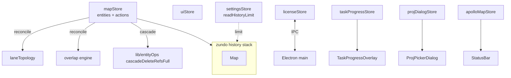
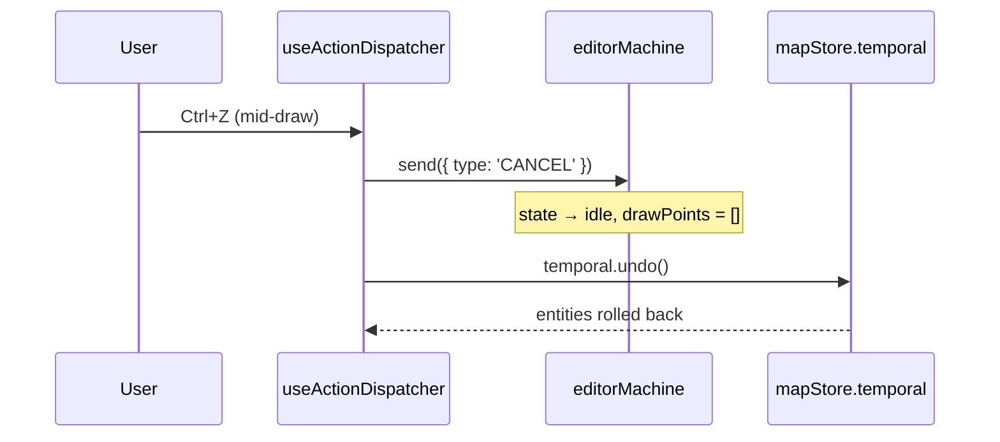
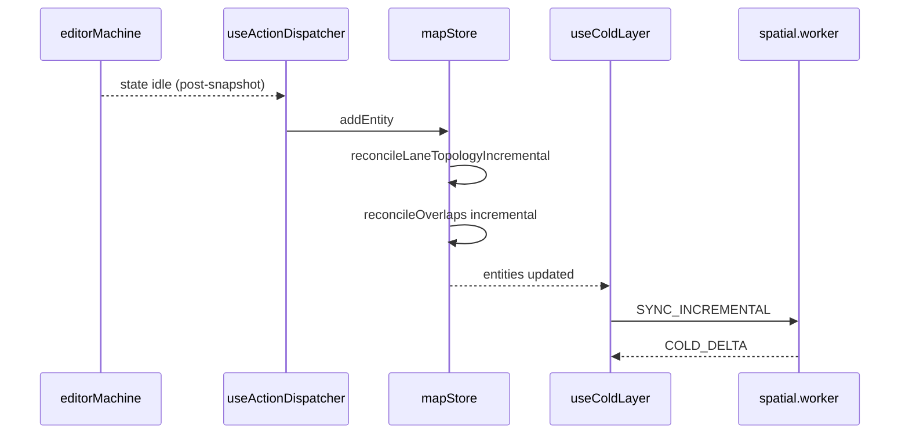

# State Management

Application state is split across **seven Zustand stores**. Only the entity
store is wrapped with `zundo` undo middleware. This page documents every
store's ownership boundary, what is and isn't undoable, and the **R1
closure** that protects FSM consistency during mid-draw undo.

## 1. Purpose & invariants

::: tip Goals

- **Separate business parameters from UX preferences** — what should and
  shouldn't enter the history stack.
- **Undo never desyncs the FSM** — the order CANCEL → temporal.undo() is
  load-bearing.
- **Imports are a single transaction** — never per-entity.
- **Cross-process mirror** — `licenseStore` is a read-only mirror of
  main-process state.
  :::

::: warning Invariants (audit points)

- Only `mapStore.entities` enters the zundo history (partialize).
- Every `mapStore` mutation runs inside one `set((state) => ...)` immer
  producer.
- `mapStore.batchImport` and `replaceImportedEntityMap` call
  `temporal.pause()` / `temporal.clear()` to keep imports out of history.
- `useActionDispatcher.ts:76-82` sends `CANCEL` before undo / redo (R1).
  :::

## 2. Store catalogue

| Store                  | File                                | Undoable       | Scope                                            |
| ---------------------- | ----------------------------------- | -------------- | ------------------------------------------------ |
| `useMapStore`          | `src/store/mapStore.ts:86`          | yes (entities) | Entity store + topology + overlap reconciliation |
| `useUIStore`           | `src/store/uiStore.ts:108`          | no             | Preferences, layer visibility, connect mode      |
| `useSettingsStore`     | `src/store/settingsStore.ts:107`    | no             | History limit, map zoom, lane half-width, etc    |
| `useLicenseStore`      | `src/store/licenseStore.ts:36`      | no             | Mirror of main-process license state             |
| `useTaskProgressStore` | `src/store/taskProgressStore.ts:28` | no             | Single active-task progress                      |
| `useProjDialogStore`   | `src/store/projDialogStore.ts:25`   | no             | PROJ.4 picker promise gate                       |
| `useApolloMapStore`    | `src/store/apolloMapStore.ts:56`    | no             | Imported raw Apollo metadata                     |

## 3. Module map



## 4. mapStore deep-dive

### 4.1 Public surface

```ts
// mapStore.ts:33-63
interface MapActions {
  addEntity(entity: MapEntity): void;
  updateEntity(id: string, entity: MapEntity): void;
  removeEntity(id: string): void;
  reparentEntity(childId: string, target: ParentTarget): ReparentResult;
  batchImport(entities: MapEntity[]): void;
  replaceImportedEntities(entities: MapEntity[]): void;
  replaceImportedEntityMap(entities: Map<string, MapEntity>): void;
  recomputeOverlapsAsync(): Promise<{...} | null>;
}
```

### 4.2 zundo configuration

```ts
// mapStore.ts:259-263
{
  partialize: (state) => ({ entities: state.entities }),
  limit: readHistoryLimit(),  // settingsStore (10–1000, default 100)
}
```

`partialize` keeps zundo focused on `entities` only. Cursor moves and
connect-mode toggles never enter history.

### 4.3 Mutation pipeline

Every mutation runs three steps inside `immer((set, get) => ...)`:

1. **Write the body** — `state.entities.set(id, entity)`
2. **Incremental topology reconcile** — only when entity type ∈
   {lane, junction} (`topologyAffectingType`); calls
   `reconcileLaneTopologyIncremental`
3. **Incremental overlap reconcile** — merges all dirty IDs and calls
   `reconcileOverlaps({ mode: 'incremental', dirtyIds })`

All three steps share **one** immer producer → **one** zundo snapshot. R1
closure unbroken.

### 4.4 batchImport: many steps in one transaction

```ts
// mapStore.ts:184-198
batchImport(entities) {
  if (entities.length === 0) return;
  set((state) => {
    for (const e of entities) state.entities.set(e.id, e);
    const { changes: topoChanges } = reconcileLaneTopology(state.entities);
    for (const [cid, c] of topoChanges) state.entities.set(cid, c);
    const patch = reconcileOverlaps(state.entities, { mode: 'full' });
    for (const oid of patch.removedOverlapIds) state.entities.delete(oid);
    for (const [oid, e] of patch.changes) state.entities.set(oid, e);
  });
}
```

::: tip ~450 ms for 50 000 entities
Full reconcile is constrained by `bench-budgets.json`. For very large maps
prefer `recomputeOverlapsAsync()` (worker path).
:::

### 4.5 replaceImportedEntityMap: pause history

```ts
// mapStore.ts:206-216
replaceImportedEntityMap(entities) {
  const temporal = useMapStore.temporal.getState();
  temporal.pause();
  try {
    set({ entities });
    temporal.clear();   // wipe history stack
  } finally {
    temporal.resume();
  }
  resetSharedSpatialIndex();
}
```

Importing a fresh map clears history — undo must not cross map boundaries.

### 4.6 removeEntity cascade

`removeEntity` queries spatial neighbours **before** the delete using
`getSharedSpatialIndex().queryBBox(bbox)` (`mapStore.ts:147-158`), then
applies cleanups from `cascadeDeleteRefsFull`. This covers the case where a
geometric neighbour lane does not hold an `overlapIds` reference but still
needs overlap re-evaluation.

## 5. R1 closure: CANCEL before undo



::: danger Wrong order
`temporal.undo()` first, then `CANCEL`: the FSM is still in `drawPolyline`
with N points; the next CONFIRM creates an entity from stale `drawPoints`,
desynced from the rolled-back store. Regression test:
`src/hooks/__tests__/undoCancel.test.ts`.
:::

## 6. uiStore details

```ts
// uiStore.ts:31-58
interface UIState {
  appMode: AppMode; // 'drawing' | 'scene'
  gridEnabled: boolean;
  snapEnabled: boolean;
  layerStates: Record<string, LayerState>;
  cursorLngLat: [number, number] | null;
  currentZoom: number;
  sidebarVisible: boolean;
  currentSnapTarget: SnapTarget | null;
  connectMode: { active: boolean; firstLaneId: string | null };
}
```

::: warning setSnapTarget debouncing
`uiStore.ts:171-187` compares `prev` vs `target` explicitly — when the snap
target hasn't changed, the store is not updated. Otherwise the overlay layer
re-renders on every mouse move.
:::

## 7. settingsStore: localStorage persistence

```ts
// settingsStore.ts:107-148
```

Each setter calls `persist(KEY, value)` synchronously. Initial values come
from `read*()` helpers that clamp localStorage values into legal ranges.

::: warning One-shot history limit read
`mapStore`'s zundo `limit` reads `readHistoryLimit()` **once** at store
creation (`mapStore.ts:261`). Changing `historyLimit` later does not
retroactively resize the existing temporal instance — restart or re-hydrate.
:::

## 8. licenseStore: cross-process mirror

```ts
// licenseStore.ts:39-44
async hydrate() {
  const next = await licenseBridge.getState();
  set({ state: next, initialized: true });
}
```

`useLicenseSync()` (called in `WorkspaceLayout.tsx:42`) subscribes to
`licenseBridge.onChange`. Whenever the main process emits
`license-state-changed`, the renderer store refreshes. The `canEdit`
selector is consumed by `lib/editable-guard.ts` to gate mutations.

## 9. Smaller stores

### 9.1 taskProgressStore

Single active-task slot. `visibleAfterMs` defaults to 1000 ms — shorter
tasks never show the overlay, preventing flicker.

### 9.2 projDialogStore

Promise gate: `request()` returns a pending Promise; the dialog calls
`resolve()` on submit. A second `request()` while one is in flight rejects
the previous one with `null`, preventing stacked dialogs.

### 9.3 apolloMapStore

```ts
// apolloMapStore.ts:33-43
rawMap: Record<string, unknown> | null;
header: ApolloMapHeader | null;
bounds: ApolloMapBounds | null;
info: ApolloMapImportInfo | null;
lastError: string | null;
```

`rawMap` is kept only for tests / legacy callers. The browser import path
keeps the entire decoded tree inside the `apolloIO.worker` so React state
does not clone a 50–200 MB map onto the main thread.

## 10. Interaction with FSM and workers



## 11. Common pitfalls

::: danger Mutating entities outside the immer producer
zundo observes `set` calls. Mutations performed via direct
`useMapStore.setState({ entities: ... })` skip history.
:::

::: danger Adding non-business fields to partialize
Anything in partialize gets snapshotted on every mutation. Adding
`cursorLngLat` (60 Hz updates) blows past the history limit in seconds.
:::

::: danger Holding entity references in uiStore
uiStore should keep only IDs or scalars. Storing entity references confuses
selector equality checks, leaving "the selected entity points at a stale
post-undo reference" bugs behind.
:::

::: danger Calling `temporal.undo()` during render
`useActionDispatcher` calls it from event callbacks. Calling it during
render triggers recursive setState.
:::

## 12. Source map

- `src/store/mapStore.ts:86-263` — full store
- `src/store/mapStore.ts:91-111` — `addEntity`
- `src/store/mapStore.ts:113-134` — `updateEntity`
- `src/store/mapStore.ts:136-182` — `removeEntity` cascade
- `src/store/mapStore.ts:184-198` — `batchImport`
- `src/store/mapStore.ts:200-216` — replace import
- `src/store/mapStore.ts:236-257` — `recomputeOverlapsAsync`
- `src/store/uiStore.ts:108-202` — entire UI store
- `src/store/settingsStore.ts:1-148`
- `src/store/licenseStore.ts:36-54`
- `src/store/taskProgressStore.ts:28-65`
- `src/store/projDialogStore.ts:25-43`
- `src/store/apolloMapStore.ts:56-86`
- `src/hooks/useActionDispatcher.ts:76-82` — R1 CANCEL

## 13. Selector patterns and re-render hygiene

```ts
// Recommended: single field
const entityCount = useMapStore((s) => s.entities.size);

// Recommended: composite selector + memoise (zustand built-in shallow)
const { ids, count } = useMapStore(
  useShallow((s) => ({ ids: [...s.entities.keys()], count: s.entities.size })),
);
```

::: warning Don't return the Map reference itself
`useMapStore(s => s.entities)` re-renders on every mutation, because immer
wraps Map with a new proxy. Components should select specific fields or an
array of IDs.
:::

## 14. zundo actor API in the dispatcher

```ts
// useActionDispatcher.ts (excerpt)
const temporal = useMapStore.temporal.getState();
// Undo:
actorRef.send({ type: 'CANCEL' }); // R1 closure
temporal.undo();
// Redo:
actorRef.send({ type: 'CANCEL' });
temporal.redo();
```

`useMapStore.temporal` is a vanilla Zustand store injected by zundo;
callable outside React, perfectly suited for the global keyboard handler
hooked from a useEffect.

## 15. Multi-store choreography: Connect Lanes

1. The user presses `C`; the dispatcher calls `useUIStore.toggleConnectMode()`.
2. `connectMode.active = true` — the map waits for the first lane click.
3. First click: `uiStore.setConnectFirstLane(id)`.
4. Second click: `mapStore.connectLanes(firstId, secondId)` (mutates
   `lane.predecessor` / `successor`), then `uiStore.exitConnectMode()`.
5. The full flow touches `uiStore` twice and `mapStore` once. zundo
   history sees only the mapStore call.

## 16. Unit test pattern

```ts
// store/__tests__/mapStore.test.ts
import { useMapStore } from '@/store/mapStore';

beforeEach(() => {
  useMapStore.setState({ entities: new Map() });
  useMapStore.temporal.getState().clear();
});

test('addEntity creates one history entry', () => {
  useMapStore.getState().addEntity(makeFakeLane('lane_1'));
  expect(useMapStore.temporal.getState().pastStates.length).toBe(1);
});
```

::: tip Test isolation
Reset state in test-local `beforeEach`. Do not move it to a global
`beforeEach` — that resets unrelated stores too.
:::

## 17. SettingsStore persistence policy

| Field            | localStorage key                     | Range     | Default                     |
| ---------------- | ------------------------------------ | --------- | --------------------------- |
| historyLimit     | `apollo-map-studio:historyLimit`     | 10–1000   | 100                         |
| mapCenterLng     | `apollo-map-studio:mapCenterLng`     | -180–180  | `MAP_DEFAULT_CENTER[0]`     |
| mapCenterLat     | `apollo-map-studio:mapCenterLat`     | -90–90    | `MAP_DEFAULT_CENTER[1]`     |
| mapZoom          | `apollo-map-studio:mapZoom`          | 1–22      | `MAP_DEFAULT_ZOOM`          |
| laneHalfWidth    | `apollo-map-studio:laneHalfWidth`    | 0.5–10 m  | `DEFAULT_LANE_HALF_WIDTH`   |
| laneArrowSpacing | `apollo-map-studio:laneArrowSpacing` | 40–500 px | `LANE_ARROW_SYMBOL_SPACING` |

`readNum(key, fallback, min, max)` (`settingsStore.ts:35-46`) is the unified
read + clamp + fallback helper, eliminating the localStorage / Number /
clamp boilerplate per field.

## 18. See also

- [Architecture Overview](./overview.md)
- [Action Registry](./action-registry.md) — undo / redo entry points
- [FSM Design](./fsm-design.md) — CANCEL semantics
- [entityOps Module](./entityops.md) — cascadeDeleteRefs / reparent
- [Anti-Corruption Layer](./anti-corruption-layer.md)
