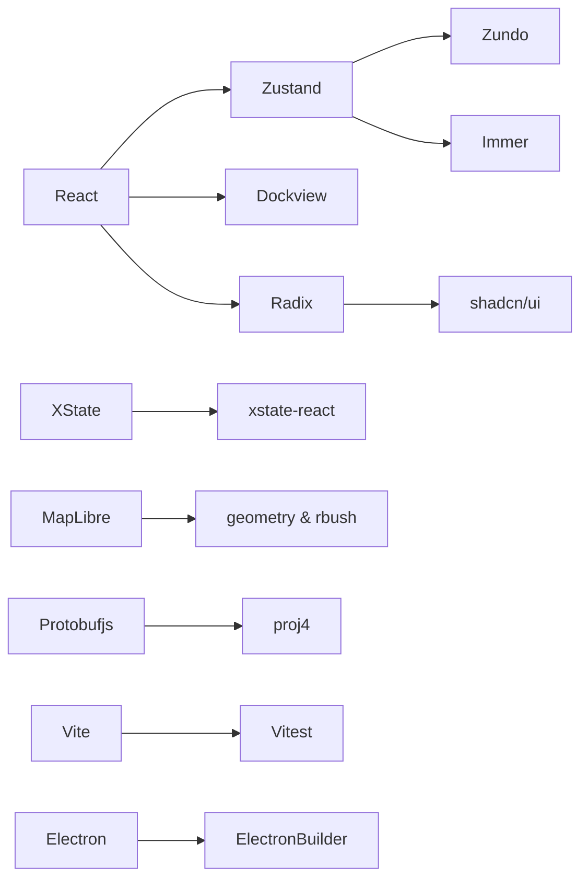

# Tech Stack

Every direct dependency in `package.json` was picked deliberately — there are
no leftover-from-the-template packages. This page lays out each package's
version, role, and rationale. When a version has become deeply load-bearing
(React 19, XState 5, MapLibre 5), we also call out the migration cost so you
don't propose downgrades casually.

::: tip TL;DR

- **Framework & UI:** `react@19`, `tailwind@4`, `@radix-ui/*`, `shadcn` (devDep), `react-icons`, `react-arborist`
- **State:** `zustand@5`, `zundo@2`, `immer@11`
- **State machines:** `xstate@5`, `@xstate/react@6`
- **Rendering:** `maplibre-gl@5`
- **Geometry:** `polygon-clipping`, `rbush`, `proj4`
- **Protocol:** `protobufjs@8`
- **Forms:** `react-hook-form`, `@hookform/resolvers`, `zod@4`
- **Desktop:** `electron@41`, `electron-builder`
- **Toolchain:** `vite@8`, `vitest@4`, `vitepress@1.6`, `typescript@6`
  :::

## 1. Runtime dependencies (`dependencies`)

### 1.1 Application bedrock

| Package                | Version   | Role         | Why                                                                                                                                      |
| ---------------------- | --------- | ------------ | ---------------------------------------------------------------------------------------------------------------------------------------- |
| `react`                | `^19.2.4` | UI framework | Adopted once the 19.x line stabilised; `useTransition` and concurrent rendering keep input responsive while large entity sets re-render. |
| `react-dom`            | `^19.2.4` | Renderer     | Paired with `react`; the same renderer ships in Electron without adaptation.                                                             |
| `tailwindcss` (devDep) | `^4.2.2`  | Atomic CSS   | The 4.x `@theme` block hosts the `ams-*` design tokens.                                                                                  |
| `@tailwindcss/vite`    | `^4.2.2`  | Vite plugin  | Skipping PostCSS shaves ~40% off HMR latency.                                                                                            |

### 1.2 UI primitives (Radix + shadcn)

| Package                         | Version   | Role                       | Why                                                                           |
| ------------------------------- | --------- | -------------------------- | ----------------------------------------------------------------------------- |
| `@radix-ui/react-context-menu`  | `^2.2.16` | Right-click menu primitive | Unstyled and accessibility-complete; shadcn/ui supplies the theme.            |
| `@radix-ui/react-dialog`        | `^1.1.15` | Modal dialog               | Backs the command palette, activation dialog, and PROJ picker.                |
| `@radix-ui/react-dropdown-menu` | `^2.1.16` | MenuBar dropdowns          | Driven by `getMenuActions(menu)` from the ActionRegistry.                     |
| `@radix-ui/react-tooltip`       | `^1.2.8`  | Tooltip                    | ToolStrip shortcut hints.                                                     |
| `cmdk`                          | `^1.1.1`  | Command palette            | Vercel's open-source palette; binds to `getCommandPaletteActions()` directly. |
| `class-variance-authority`      | `^0.7.1`  | Variant builder            | Implements `variant` props on shadcn-style components.                        |
| `clsx`                          | `^2.1.1`  | className concat           | Standard pairing with `tailwind-merge`.                                       |
| `tailwind-merge`                | `^3.5.0`  | Utility deduplication      | Resolves conflicts between user-supplied `className` and component defaults.  |
| `react-icons`                   | `^5.6.0`  | Icon set                   | `react-icons/fa6` powers `ActionDef.icon` (`registry/definitions.ts:1-19`).   |
| `react-arborist`                | `^3.4.3`  | Virtualised tree           | The Sidebar layer tree stays at 60 fps with 10 000+ entities.                 |

### 1.3 State layer

| Package   | Version   | Role                 | Why                                                                                                        |
| --------- | --------- | -------------------- | ---------------------------------------------------------------------------------------------------------- |
| `zustand` | `^5.0.12` | Global store         | Tiny, selector-based, no provider; `create<T>()(temporal(...))` chains middleware cleanly.                 |
| `zundo`   | `^2.3.0`  | undo/redo middleware | `temporal.partialize` keeps history scoped to `entities`; `limit` reads from `settingsStore.historyLimit`. |
| `immer`   | `^11.1.4` | Immutable updates    | `mapStore` uses `immer((set) => ...)`; `Map`/`Set` support requires `enableMapSet()`.                      |

### 1.4 State machines

| Package         | Version   | Role           | Why                                                                              |
| --------------- | --------- | -------------- | -------------------------------------------------------------------------------- |
| `xstate`        | `^5.30.0` | Editor FSM     | `setup({ types }).createMachine(...)` gives type-safe events / context / guards. |
| `@xstate/react` | `^6.1.0`  | React bindings | `useActorRef` / `useSelector` for component subscriptions.                       |

::: warning XState 5 typing pitfall
`editorMachine.ts:1` no longer carries `// @ts-nocheck` — the typed `setup` API
is in use. `assign(...)` calls must remain inline inside `setup.actions`;
hoisting them to top-level constants fails because `assign`'s 5-parameter
generic signature widens `_out_TEvent` and breaks the structural match against
`setup.actions`. See the inline note at `editorMachine.ts:120-128`.
:::

### 1.5 Rendering and geometry

| Package            | Version   | Role                 | Why                                                                                     |
| ------------------ | --------- | -------------------- | --------------------------------------------------------------------------------------- |
| `maplibre-gl`      | `^5.22.0` | WebGL map            | BSD fork of Mapbox v1; `GeoJSONSource.updateData` only became reliable in 5.x.          |
| `polygon-clipping` | `^0.15.7` | Polygon boolean ops  | Overlap reconciliation and lane-junction trimming.                                      |
| `rbush`            | `^4.0.1`  | R-tree spatial index | Used by `core/spatial/SharedSpatialIndex` and `spatial.worker`.                         |
| `proj4`            | `^2.20.8` | Geodetic projection  | Converts UTM / WGS84 / user-supplied PROJ.4 strings; integrates with `projDialogStore`. |

### 1.6 Protocol & serialization

| Package      | Version  | Role           | Why                                                                                                                                                                               |
| ------------ | -------- | -------------- | --------------------------------------------------------------------------------------------------------------------------------------------------------------------------------- |
| `protobufjs` | `^8.0.3` | Protobuf codec | `src/io/proto/loader.ts` bundles raw `.proto` files with `import.meta.glob('/src/proto/**/*.proto', { query: '?raw', eager: true })`, then loads `map_msgs/map.proto` at runtime. |
| `nanoid`     | `^5.1.7` | ID generator   | `${type}_${nanoid(12)}` — URL-safe, collision-free at engineering scale.                                                                                                          |

### 1.7 Forms & validation

| Package               | Version   | Role              | Why                                                                                                   |
| --------------------- | --------- | ----------------- | ----------------------------------------------------------------------------------------------------- |
| `react-hook-form`     | `^7.72.1` | Form engine       | Inspector fields register independently with zero re-renders.                                         |
| `@hookform/resolvers` | `^5.2.2`  | RHF + zod bridge  | `zodResolver(schema)` produces an RHF resolver.                                                       |
| `zod`                 | `^4.3.6`  | Runtime schemas   | `lib/schemas.ts` defines entity validation rules; the same schema feeds the auto-generated inspector. |
| `dockview`            | `^5.2.0`  | Panel layout core | Multi-panel + drag/drop + JSON-serialisable layout.                                                   |
| `dockview-react`      | `^5.2.0`  | React adapter     | `WorkspaceLayout.tsx:2` imports `DockviewReact` directly.                                             |

## 2. Dev dependencies (`devDependencies`)

### 2.1 Build & bundling

| Package                | Version   | Role                                         |
| ---------------------- | --------- | -------------------------------------------- |
| `typescript`           | `^6.0.2`  | Compiler; `noUncheckedIndexedAccess` enabled |
| `vite`                 | `^8.0.7`  | Dev server + bundler                         |
| `@vitejs/plugin-react` | `^6.0.1`  | React JSX + Fast Refresh                     |
| `cross-env`            | `^10.1.0` | Cross-platform env vars                      |

### 2.2 Tests

| Package               | Version  | Role                    |
| --------------------- | -------- | ----------------------- |
| `vitest`              | `^4.1.4` | Native Vite test runner |
| `@vitest/coverage-v8` | `4.1.4`  | V8-native coverage      |

### 2.3 Desktop

| Package            | Version   | Role                                              |
| ------------------ | --------- | ------------------------------------------------- |
| `electron`         | `^41.5.0` | Chromium shell; main + preload                    |
| `electron-builder` | `^26.8.1` | Packages .dmg / .exe / AppImage                   |
| `concurrently`     | `^9.2.1`  | Runs Vite and Electron together in `electron:dev` |
| `wait-on`          | `^9.0.5`  | Holds Electron until Vite is up                   |

### 2.4 Documentation

| Package     | Version  | Role                    |
| ----------- | -------- | ----------------------- |
| `vitepress` | `^1.6.4` | This documentation site |

### 2.5 Code style

| Package                       | Version   | Role                                          |
| ----------------------------- | --------- | --------------------------------------------- |
| `eslint`                      | `^9.39.4` | Flat config 9.x; `eslint.config.js`           |
| `@eslint/js`                  | `^9.39.4` | Built-in recommended config                   |
| `typescript-eslint`           | `^8.58.1` | TS-aware rules                                |
| `eslint-plugin-react-hooks`   | `^7.0.1`  | Hook lint rules                               |
| `eslint-plugin-react-refresh` | `^0.5.2`  | Fast Refresh friendliness                     |
| `eslint-config-prettier`      | `^10.1.8` | Disables formatting rules that fight prettier |
| `prettier`                    | `^3.8.2`  | Formatter                                     |
| `husky`                       | `^9.1.7`  | git hooks                                     |
| `lint-staged`                 | `^16.4.0` | Stage-aware lint                              |
| `globals`                     | `^17.4.0` | Environment globals presets                   |
| `shadcn`                      | `^4.2.0`  | CLI for fetching shadcn/ui components         |

## 3. Why not X?

| Chosen                      | Alternative                                   | Why we passed                                                                                                                                              |
| --------------------------- | --------------------------------------------- | ---------------------------------------------------------------------------------------------------------------------------------------------------------- |
| `zustand`                   | Redux Toolkit                                 | RTK's reducer + slice mental model produces too much boilerplate at our 100+ selector count; zundo plugging straight into zustand was the deciding factor. |
| `xstate`                    | Hand-rolled enums                             | Six draw states × multiple guards turn quickly into spaghetti; xstate gives us a visualiser and inspectability.                                            |
| `maplibre-gl`               | Mapbox / OpenLayers / Three.js + custom tiles | Mapbox v2 isn't friendly for commercial use; OpenLayers isn't WebGL-native; Three.js has no vector-tile pipeline.                                          |
| `dockview`                  | react-resizable-panels / GoldenLayout         | dockview is the rare combo of drag-tab + popout + JSON-serialisable layout; GoldenLayout lacks React 19 support.                                           |
| `protobufjs` runtime loader | Google `protoc-gen-ts`                        | Keeps Apollo's source `.proto` import tree and lets Vite bundle it as raw text — no `protoc` needed at build time.                                         |

## 4. Version pinning and upgrade risk

::: warning React 19
Both `@xstate/react@6` and `react-arborist@3` already support React 19.
Rolling back to 18.x is not a soft migration.
:::

::: warning Tailwind 4
The `@theme` block carries the `ams-*` token catalogue. Reverting to 3.x means
moving every token back into `tailwind.config.ts`.
:::

::: warning XState 5
The 4 → 5 migration cost a sprint; do not propose rollback unless an upstream
bug forces our hand.
:::

::: warning protobufjs 8
8.x changed `T.toObject` default behaviour (7.x defaulted `arrays: true`). The
IO path passes options explicitly; custom scripts that relied on defaults need
a recheck.
:::

## 5. Public surface (what each package exposes to the codebase)

| Module        | Entry                           | Consumed by                                                                              |
| ------------- | ------------------------------- | ---------------------------------------------------------------------------------------- |
| `react`       | global                          | every `components/`, `hooks/`                                                            |
| `zustand`     | `store/*`                       | `hooks/`, `components/`                                                                  |
| `zundo`       | `mapStore.ts:87`                | only `mapStore`; undo dispatcher reaches the actor via `useMapStore.temporal.getState()` |
| `xstate`      | `core/fsm/editorMachine.ts:130` | `hooks/useEditor*`, `components/MapCanvas`                                               |
| `maplibre-gl` | `core/map/createMap.ts`         | only `hooks/useColdLayer` and `useHotLayer`; UI never imports it directly                |
| `protobufjs`  | `src/io/proto/loader.ts`        | `src/io/proto/*` and `src/io/apolloIO.worker.ts`                                         |

## 6. Dependency graph

## 7. Common pitfalls

::: danger Don't import `protobufjs` from components
`protobufjs` is ~80 KiB gzip. Only `src/io/proto/*.ts` and
`src/io/apolloIO.worker.ts` may import it. UI sees the proto-agnostic
`MapEntity` shape via `entityOps`.
:::

::: danger `nanoid` is ESM-only
`nanoid@5` is pure ESM. Vitest is fine, but Electron's `.cts` main entry is
CommonJS — do not import `nanoid` there. Use `crypto.randomUUID()` instead.
:::

## 8. Source map

- `package.json` — every version
- `pnpm-lock.yaml` — resolved exact lock
- `vite.config.ts` — Vite plugin chain
- `eslint.config.js` — flat config
- `tsconfig.json` / `tsconfig.electron.json` — TS configs
- `electron-builder.yml` — packaging config

## 9. Per-package deep notes

### 9.1 Why Zustand 5 over 4.x

The 5.x selector-based store hook now uses `Object.is` by default and gives
`subscribeWithSelector` precise return-type inference. Our store has no
vanilla usage; everything goes through `useFooStore(s => ...)`. That single
improvement removed dozens of `useShallow` calls. The middleware chain
(`temporal(immer(...))`) is fully compatible with 4.x, so the migration was
free.

### 9.2 zundo partialize and limit specifics

`partialize` is a synchronous pure function called on every mutation. It
returns `{ entities }`, and zundo `structuredClone`s the result. Cloning a
`Map<string, MapEntity>` is O(N) — about 30 ms at 50 000 entities. That's why
the default `historyLimit` is 100, not 1000: 100 snapshots already occupy
~150 MB on the heap.

### 9.3 immer + Map / Set

`immer@11` does not support `Map`/`Set` writes by default — you must call
`enableMapSet()` once at module top (`mapStore.ts:27`). Otherwise
`state.entities.set(id, e)` inside a producer throws `MapSet support not
enabled`.

### 9.4 polygon-clipping precision

polygon-clipping uses 64-bit floats with Bentley-Ottmann sweep. At
coordinate magnitudes above ~1e7 accumulated error introduces sliver
artefacts. Our lane corridors stay in metre-scale WGS84 deltas (~1e-3), well
within the safe band.

### 9.5 RBush fan-out

`rbush@4` uses a default `maxEntries` of 9. We keep that default; benchmark
shows 50 000 entities give average query time of 0.4 ms — comfortably below
the 60 fps hit-test budget.

### 9.6 protobufjs + raw .proto loader

`src/io/proto/loader.ts` uses Vite `import.meta.glob('/src/proto/**/*.proto', { query: '?raw', import: 'default', eager: true })` to bundle every Apollo `.proto` under `src/proto/**` as raw text. At runtime it overrides `root.resolvePath` and `root.fetch`, then calls `root.load('map_msgs/map.proto')` so protobufjs resolves Apollo imports from the proto root. There is no generated JSON schema file and no build-time `pbjs` step.

### 9.7 dockview 5.x and React 19

`dockview-react@5.2` was the first version with React 19 compatibility. The
"active tab forgotten" bug was a `useId` misuse fixed in 5.2; that's why our
panels don't lose state on remount.

### 9.8 cmdk and accessibility

`cmdk@1.1` ships a `
` and auto-applies `aria-selected`
to `<Command.Item>`. We add no extra ARIA — cmdk handles it.

## 10. Upgrade cadence (six-month plan)

| When          | Candidates                                                          |
| ------------- | ------------------------------------------------------------------- |
| Monthly       | `react`, `vite`, `vitest` patches; `maplibre-gl` patch              |
| Quarterly     | `xstate`, `zustand`, `dockview`, `tailwindcss` minor versions       |
| Semi-annually | `electron`, `typescript` major versions (evaluate breaking changes) |

## 11. Dependency categories to avoid

::: danger No lodash
We already have nanoid + immer + RxJS-style functional helpers. Most lodash
helpers have native equivalents in modern JS; pulling in lodash adds ~25 KiB
of dead code.
:::

::: danger No moment / dayjs
There's no timezone arithmetic; `Date.now()` covers everything we need.
:::

::: danger No additional form libraries
RHF + zod is the standard. Adding formik would introduce two competing
mental models.
:::

## 12. See also

- [Build & Bundle](../../architecture/build-and-bundle.md) — Vite + Electron Builder pipeline
- [Architecture Overview](./overview.md)
- [Design Tokens](../../architecture/design-tokens.md) — Tailwind 4 `@theme`
- [Electron Integration](../../architecture/electron-integration.md) — desktop-only deps
