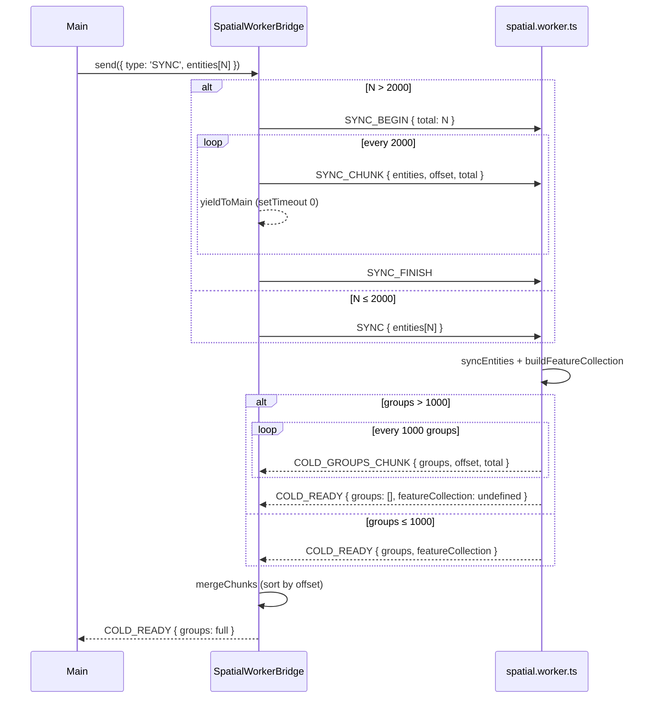
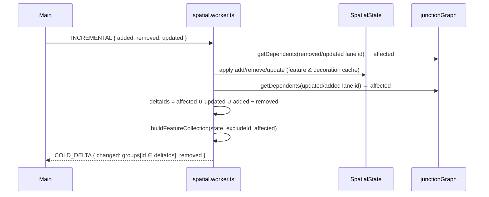
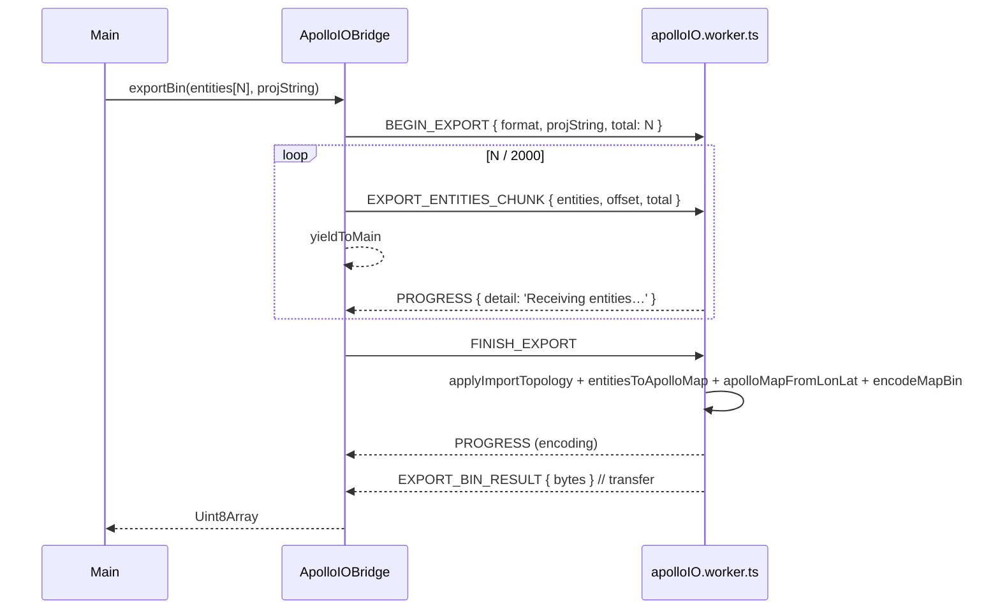

# Worker Protocol

> Key files:
>
> - `src/core/workers/protocol.ts` — spatial worker protocol definitions
> - `src/core/workers/spatial.worker.ts`, `spatialBridge.ts`, `spatialRequests.ts`
> - `src/core/workers/overlap.worker.ts`, `overlapBridge.ts`
> - `src/io/apolloIOProtocol.ts`, `apolloIO.worker.ts`, `apolloIOBridge.ts`

## 1. Three worker boundaries

Apollo Map Studio offloads the parts of the pipeline that cannot fit in
a 16 ms main-thread budget into three independent Workers:

| Worker           | File                                 | Responsibility                                                                    |
| ---------------- | ------------------------------------ | --------------------------------------------------------------------------------- |
| Spatial worker   | `src/core/workers/spatial.worker.ts` | cold layer feature compilation, RBush hit testing, lane junction decoration cache |
| Overlap worker   | `src/core/workers/overlap.worker.ts` | full overlap reconciliation                                                       |
| Apollo IO worker | `src/io/apolloIO.worker.ts`          | protobuf decode/encode, projection, import/export round trip                      |

Each worker has its own bridge, and the protocols are deliberately
separate — one worker file never reuses another's protocol.

## 2. Spatial worker protocol

### 2.1 Request / response types

```ts
// src/core/workers/protocol.ts:7-29
export type WorkerPublicRequest =
  | { type: 'SYNC'; requestId: string; entities: SerializedEntity[]; excludeId?: string | null }
  | {
      type: 'INCREMENTAL';
      requestId: string;
      added: SerializedEntity[];
      removed: string[];
      updated: SerializedEntity[];
      excludeId?: string | null;
    }
  | { type: 'HIT_TEST'; requestId: string; point: [number, number]; radius: number };

export type WorkerRequest =
  | WorkerPublicRequest
  | { type: 'SYNC_BEGIN'; requestId: string; total: number; excludeId?: string | null }
  | {
      type: 'SYNC_CHUNK';
      requestId: string;
      entities: SerializedEntity[];
      offset: number;
      total: number;
    }
  | { type: 'SYNC_FINISH'; requestId: string };
```

```ts
// src/core/workers/protocol.ts:41-67
export type WorkerResponse =
  | {
      type: 'COLD_GROUPS_CHUNK';
      requestId: string;
      groups: EntityFeatureGroup[];
      offset: number;
      total: number;
    }
  | {
      type: 'COLD_READY';
      requestId: string;
      featureCollection?: GeoJSON.FeatureCollection;
      groups: EntityFeatureGroup[];
    }
  | { type: 'COLD_DELTA'; requestId: string; changed: EntityFeatureGroup[]; removed: string[] }
  | { type: 'HIT_RESULT'; requestId: string; hits: HitResult[] };
```

### 2.2 Sequence: full SYNC



### 2.3 INCREMENTAL — Phase E incremental decoration



`affected` = pre-update dependents ∪ changed lanes ∪ post-update
dependents (`spatialRequests.ts:12-58`), computed via
`LaneJunctionGraph.getDependents(id)` in O(K) (K = junction fan-out,
typically 2–4). Junction stitching still runs over every junction every
time but each call is ~0.01 ms and idempotent — only decoration is
incremental.

### 2.4 HIT_TEST

```ts
// spatialRequests.ts:156-162
case 'HIT_TEST':
  respond({ type: 'HIT_RESULT', requestId: req.requestId,
            hits: hitTest(state, req.point, req.radius) });
```

`HitResult { id, entityType, distance }` is RBush-prefiltered then
re-sorted with Mercator-aware geometric distance.

## 3. SpatialWorkerBridge — main-thread wrapper

`src/core/workers/spatialBridge.ts:16-142`:

| Concern               | Implementation                                                                                 |
| --------------------- | ---------------------------------------------------------------------------------------------- |
| Request id allocation | monotonic counter: `req_${++this.counter}`                                                     |
| Timeout               | default 120 s; large-map SYNC observed up to ~10 s, leave headroom                             |
| Chunked SYNC          | `>2000` entities split per batch; each batch awaits `yieldToMain()` (setTimeout 0)             |
| Chunked COLD_READY    | worker sends multiple `COLD_GROUPS_CHUNK`, then an empty `COLD_READY`; bridge merges by offset |
| Timeout cleanup       | `setTimeout` rejection deletes pending entry                                                   |
| Error propagation     | `worker.onerror` rejects all pending                                                           |
| Dispose               | `worker.terminate()` + reject all pending (`Worker terminated`)                                |

## 4. Overlap worker protocol

```ts
// overlap.worker.ts:18-35
interface OverlapRequest {
  type: 'RECONCILE_FULL';
  requestId: string;
  entities: MapEntity[];
}
interface OverlapResponse {
  type: 'RECONCILE_RESULT';
  requestId: string;
  changes: Array<[string, MapEntity]>;
  removedOverlapIds: string[];
  stats: { pairsTested; pairsMatched; overlapsCreated; overlapsRemoved; durationMs };
}
```

Use cases: import completion, manual "Recompute overlaps", and the
pre-export full rebuild all run in the worker. Incremental edits
(<6 ms each) stay on the main thread because the postMessage round-trip
costs more than the work itself. `OverlapWorkerBridge.reconcileFull`
returns a Promise with a 30 s timeout.

## 5. Apollo IO worker protocol

`src/io/apolloIOProtocol.ts` defines the request / response surface:

| Request                 | Note                                                      |
| ----------------------- | --------------------------------------------------------- |
| `IMPORT_BIN`            | bytes (Uint8Array, transferable)                          |
| `IMPORT_TEXT`           | bytes                                                     |
| `RESOLVE_PROJECTION`    | sent when the proto header carries no PROJ string         |
| `BEGIN_EXPORT`          | starts a chunked export (`format`, `projString`, `total`) |
| `EXPORT_ENTITIES_CHUNK` | 2000 entities per chunk                                   |
| `FINISH_EXPORT`         | triggers actual encoding                                  |
| `CLEAR`                 | drops the worker's cached raw lonLat map                  |

| Response                | Use                                                  |
| ----------------------- | ---------------------------------------------------- |
| `PROGRESS`              | `{ label, detail, progress: 0..1 \| null }`          |
| `NEEDS_PROJECTION`      | UI prompts via `useProjDialogStore`                  |
| `IMPORT_ENTITIES_CHUNK` | progressively streams entities back (2000 at a time) |
| `IMPORT_RESULT`         | `{ info, header, bounds, stats }`                    |
| `EXPORT_BIN_RESULT`     | `bytes` — sent with `[bytes.buffer]` transfer        |
| `EXPORT_TEXT_RESULT`    | same                                                 |
| `CLEARED`               | sync ack                                             |
| `ERROR`                 | `{ message, stack? }`                                |

### 5.1 Chunked export sequence



## 6. Clone boundary and transfer optimisation

`postMessage` uses **structuredClone** by default. Three data classes:

| Data                                | Strategy                                               |
| ----------------------------------- | ------------------------------------------------------ |
| `entities: MapEntity[]` (large)     | structuredClone (~1 KB each; 50k entities ≈ 50 MB OK)  |
| `bytes: Uint8Array` (import/export) | **Transferable**: `postMessage(msg, [bytes.buffer])`   |
| `groups: EntityFeatureGroup[]`      | structuredClone; INCREMENTAL ships only changed subset |

Apollo IO bridges every Uint8Array via transfer, saving one full copy.

## 7. requestId and pending map

All three bridges keep a `pending: Map<requestId, PendingEntry>`:

```ts
type PendingEntry = {
  resolve;
  reject;
  timer;
  chunks?: ColdGroupsChunk[]; // spatial only
  onProgress?: (p) => void; // apolloIO only
  entities?: MapEntity[]; // apolloIO import accumulator
};
```

When a response arrives:

1. Look up `pending[msg.requestId]` — drop if missing (defends against
   worker resurrection races);
2. PROGRESS / mid-stream chunks update buffers without consuming the
   entry;
3. Terminal messages `clearTimeout`, `pending.delete`, then
   resolve / reject.

## 8. Cold-layer main-thread glue

`src/hooks/useColdLayer.ts` is the sole spatial-worker consumer:

- watches `mapStore.entities` for adds / removes / updates;
- coalesces changes per RAF;
- calls `spatialBridge.send({ type: 'INCREMENTAL', ... })`;
- on `COLD_DELTA`, merges into local cache, then calls `setData()` on
  the MapLibre source.

See [Cold/Hot Layers](./cold-hot-layers.md).

## 9. Errors and timeouts

| Failure class           | Handling                                                         |
| ----------------------- | ---------------------------------------------------------------- |
| Worker `throw` inside   | caught and `post({ type: 'ERROR' })`, bridge rejects             |
| Worker `onerror`        | bridge rejects all pending; spatial bridge does not auto-restart |
| Bridge `setTimeout`     | deletes pending entry, rejects `Worker request timed out`        |
| Bridge dispose          | `worker.terminate()`, rejects all pending                        |
| Apollo IO disposeWorker | sets `this.worker = null`, lazy-rebuild on next call             |

## 10. Safety and performance notes

- Workers do not hold a `useStore` reference — store mutations happen
  only on the main thread via patches.
- Workers and main thread share the `MapEntity` type definition; any
  change must be applied on both sides.
- `structuredClone` cannot transport functions or DOM nodes; strip
  callbacks from entities before serialisation.
- `excludeId` lets the cold layer skip the entity that the hot layer
  is currently animating, avoiding double-render.

## 11. Pitfalls

1. **Reusing request ids** corrupts the pending map — `${++counter}`
   must stay strictly increasing; never accept user-provided ids.
2. **Forgetting `await yieldToMain`** during chunked SYNC piles up
   hundreds of `postMessage` calls and still blocks the main thread.
3. **Failing to transfer `Uint8Array.buffer`** doubles memory on a
   50 MB export.
4. **Unthrottled HIT_TEST** during high-frequency mousemove queues up
   inside the worker — `useMapEventRouter` debounces.
5. **Cross-worker protocol reuse** would conflate responsibilities —
   the overlap worker deliberately defines its own request types.

## 12. Tests

`src/core/workers/__tests__/` covers `spatialRequests` and hit testing
as pure-function units. `src/io/__tests__/endToEnd.test.ts` runs an
import → edit → export round trip, exercising the IO worker protocol
end-to-end.

## 13. Source map

```
src/core/workers/
├── protocol.ts                   ← spatial protocol definition
├── spatial.worker.ts             ← worker entry (onmessage)
├── spatialRequests.ts            ← handleRequest dispatcher
├── spatialState.ts               ← entityMap / featureCache / decorationCache
├── spatialFeatures.ts            ← buildFeatureCollection / groupFeaturesByEntity
├── spatialHitTest.ts             ← RBush + Mercator distance
├── spatialBridge.ts              ← main-thread wrapper
├── overlap.worker.ts             ← overlap reconcile worker
├── overlapBridge.ts              ← overlap main-thread wrapper
└── laneJunctionGraph.ts          ← endpoint dependency graph

src/io/
├── apolloIOProtocol.ts           ← IO protocol definition
├── apolloIO.worker.ts            ← worker entry
└── apolloIOBridge.ts             ← main-thread wrapper
```

## 14. See also

- [Cold/Hot Layers](./cold-hot-layers.md)
- [Junction Graph](./junction-graph.md)
- [Spatial Index](./spatial-index.md)
- [Export Engine](./export-engine.md)
- [Overlap Derivation](./overlap-derivation.md)
