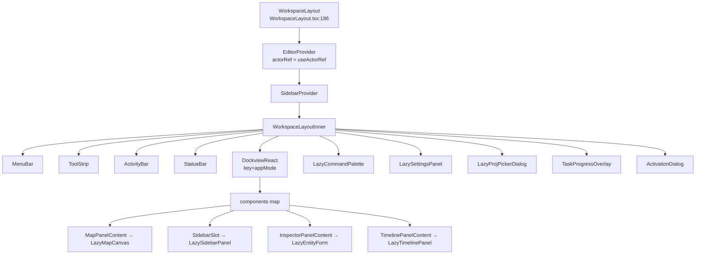
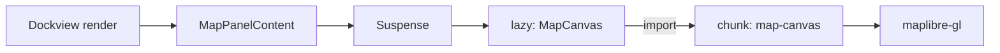
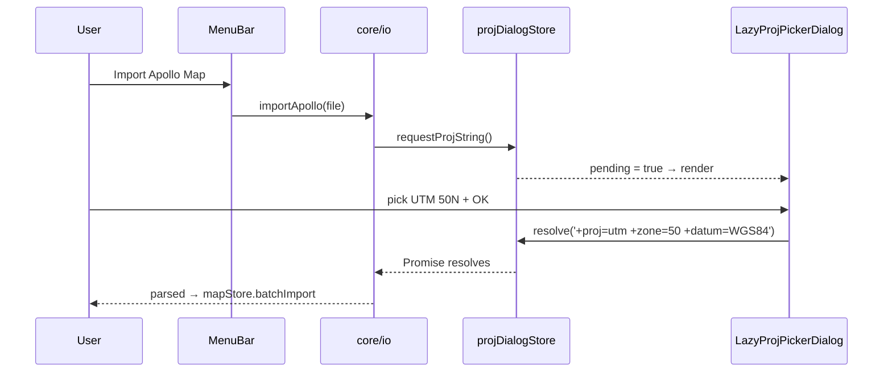

# Workspace Layout

The shell of Apollo Map Studio is `WorkspaceLayout` — a Photoshop / QGIS-style
multi-panel desktop UI. It composes a MenuBar, a ToolStrip, an ActivityBar, a
StatusBar, and a **Dockview** container into a single React tree. This page
covers panel registration, lazy loading, layout persistence with per-AppMode
storage keys, and how "Reset Layout" actually works.

## 1. Purpose & invariants

::: tip Goals

- Panels are draggable, splittable, and persisted to localStorage.
- Switching AppMode (drawing ↔ scene) keeps each layout isolated.
- Sub-panels lazy-load on demand (Map / Inspector / Sidebar / Timeline /
  CommandPalette / SettingsPanel / ProjPickerDialog).
- A single FSM actor is created at the top; every panel shares one
  `actorRef`.
  :::

::: warning Invariants

- `WorkspaceLayoutInner` must run inside `EditorProvider` + `SidebarProvider`
  — see `WorkspaceLayout.tsx:186-195`.
- `useEditorActor()` must always return the same `actorRef`. Any extra
  `useActorRef(editorMachine)` call inside a panel creates a separate actor
  and the FSM state splits.
- The Dockview node uses `key={appMode}` — switching mode forces a fresh
  Dockview instance so the `onReady` closure never captures a stale mode.
  :::

## 2. Module map



## 3. Public surface

| Symbol                              | File                                                         | Role                                                        |
| ----------------------------------- | ------------------------------------------------------------ | ----------------------------------------------------------- |
| `WorkspaceLayout`                   | `src/components/layout/WorkspaceLayout.tsx:186`              | Top-level export, root of the App                           |
| `WorkspaceLayoutInner`              | same file:41                                                 | Private; consumes the actorRef provided by `EditorProvider` |
| `createDefaultLayout`               | `src/components/layout/WorkspaceLayout/dockviewLayout.ts:34` | First boot / Reset Layout                                   |
| `loadLayout`                        | same file:21                                                 | Best-effort restore on startup                              |
| `saveLayout`                        | same file:13                                                 | Persists on `onDidLayoutChange`                             |
| `clearSavedLayout`                  | same file:9                                                  | Drops storage                                               |
| `LazyCommandPalette`                | `WorkspaceLayout/lazyPanels.tsx:21`                          | Command palette lazy import                                 |
| `LazySettingsPanel`                 | same file:26                                                 | Settings dialog                                             |
| `LazyProjPickerDialog`              | same file:31                                                 | PROJ.4 picker                                               |
| `MapPanelContent`                   | same file:57                                                 | Map main panel                                              |
| `makeSidebarPanel`                  | same file:69                                                 | Factory: closes over `onOpenSettings`                       |
| `InspectorPanelContent`             | same file:79                                                 | Inspector (depends on FSM selection)                        |
| `TimelinePanelContent`              | same file:114                                                | Timeline (scene mode only)                                  |
| `OverlayFallback` / `PanelFallback` | same file:41-55                                              | Suspense fallbacks                                          |

## 4. Dockview component registration

```ts
// WorkspaceLayout.tsx:56-61
const components = useRef({
  map: MapPanelContent,
  sidebar: makeSidebarPanel(openSettings),
  inspector: InspectorPanelContent,
  timeline: TimelinePanelContent,
}).current;
```

- `useRef` pins the components map so Dockview sees a stable identity. Giving
  it a fresh object each render forces panels to re-mount.
- `makeSidebarPanel(openSettings)` is a factory pattern: it closes the "open
  settings" callback inside the panel, avoiding an extra prop pipe.

## 5. Layout persistence

```ts
// dockviewLayout.ts:4-7
const LAYOUT_KEY_BY_MODE: Record<AppMode, string> = {
  drawing: 'ams-layout-v3-drawing',
  scene: 'ams-layout-v3-scene',
};
```

- Each AppMode has its own key — switching modes can never pollute the other
  layout.
- The `v3` suffix is a schema version: bump it when Dockview upgrades change
  the JSON shape, so old user storage falls through.
- `loadLayout` silently `clearSavedLayout` on parse error so users never get
  stuck on a broken layout.

## 6. Reset Layout

`handleResetLayout` (`WorkspaceLayout.tsx:80-86`):

1. `clearSavedLayout(appMode)`
2. `apiRef.current.clear()` — drop every panel
3. `createDefaultLayout(apiRef.current, appMode)` — rebuild for the current
   mode

`drawing` mode default: `map` centre, `sidebar` 240 px left, `inspector` 280 px
right. `scene` mode adds a `timeline` 180 px tall along the bottom.

## 7. Lazy-loading strategy



| Panel                  | Trigger                   | Approx chunk size                      |
| ---------------------- | ------------------------- | -------------------------------------- |
| `LazyMapCanvas`        | App boot                  | dominated by maplibre-gl, ~250 KB gzip |
| `LazySidebarPanel`     | App boot                  | small                                  |
| `LazyTimelinePanel`    | switching to scene mode   | small                                  |
| `LazyCommandPalette`   | first Cmd+K               | cmdk ~30 KB                            |
| `LazySettingsPanel`    | first Settings open       | small                                  |
| `LazyProjPickerDialog` | import without projection | small                                  |
| `LazyEntityForm`       | first entity selection    | RHF + zod resolver                     |

::: warning Per-panel Suspense
Each panel wraps its own Suspense (e.g. `MapPanelContent` at
`lazyPanels.tsx:60`) so a slow / failed panel does not stall the whole
Dockview.
:::

## 8. Interaction with global stores

| Store            | Use inside WorkspaceLayout                                           |
| ---------------- | -------------------------------------------------------------------- |
| `useMapStore`    | `WorkspaceLayout.tsx:46` — `entities.size` for the StatusBar         |
| `useUIStore`     | `:47` — `appMode`; toggling forces Dockview rebuild                  |
| `useEditorActor` | `:43` — `actorRef`, `currentState` (state.value) and `activeElement` |
| `useLicenseSync` | `:42` — bidirectional sync with the main-process license state       |

## 9. Cmd/Ctrl+K opens the palette

```ts
// WorkspaceLayout.tsx:63-77
useEffect(() => {
  const handleKeyDown = (event: KeyboardEvent) => {
    if (event.key === 'k' && (event.metaKey || event.ctrlKey)) {
      event.preventDefault();
      setCommandPaletteOpen((open) => !open);
    }
    if (event.key === 'Escape') setCommandPaletteOpen(false);
  };
  document.addEventListener('keydown', handleKeyDown);
  return () => document.removeEventListener('keydown', handleKeyDown);
}, []);
```

Although Cmd+K is also defined in `ACTION_DEFS`
(`registry/definitions.ts:134-141`), the palette handles its own toggle to
avoid the close-then-immediately-reopen loop the dispatcher would otherwise
trigger.

## 10. Sequence: Apollo import triggers PROJ picker



## 11. Common pitfalls

::: danger Do not create a second actor outside `WorkspaceLayoutInner`
`useActorRef(editorMachine)` must appear exactly once at
`WorkspaceLayout.tsx:187`. Anywhere else, reach for `useEditorActor()`.
:::

::: danger Stable Dockview components map
Recreating the components object every render unmounts and remounts every
panel, losing internal state. Use `useRef({...}).current`.
:::

::: danger AppMode toggle destroys the Dockview instance
`key={appMode}` causes React to drop the old instance. `apiRef.current`
points at the stale api for one tick before `onReady` overwrites it. Any
`setTimeout` retaining `apiRef.current` must guard against this.
:::

## 12. Source map

- `src/components/layout/WorkspaceLayout.tsx:1-37` — imports
- `:41-115` — `WorkspaceLayoutInner` (state, effects, callbacks)
- `:117-181` — JSX body
- `:186-195` — top wrapper + providers
- `src/components/layout/WorkspaceLayout/dockviewLayout.ts:1-60` — layout
  load/save
- `src/components/layout/WorkspaceLayout/lazyPanels.tsx:1-120` — lazy-loading
  and panel contents
- `src/store/uiStore.ts:29` — `AppMode`

## 13. ToolStrip and currentState

```ts
// WorkspaceLayout.tsx:127-133
<ToolStrip
  currentTool={currentState}
  currentElement={activeElement as MapElementType | null}
  onSelectTool={handleSelectTool}
  onOpenCommandPalette={() => setCommandPaletteOpen(true)}
  onExecuteAction={execute}
  getToggleState={getToggleState}
/>
```

`currentTool` flows from `useSelector(actorRef, s => s.value as string)`, so
`drawPolyline` / `drawArc` / `idle` directly drive the highlighted button in
the ToolStrip. `currentElement` tells the ToolStrip whether the user is
drawing an Apollo lane or a generic polyline, giving the right
sub-category indicator.

## 14. ActivityBar and SidebarContext

The `ActivityBar` is the leftmost tab strip (Project / Layer / Search ...).
It uses `SidebarContext` rather than the global store, because tab toggles
must not trigger a mapStore re-render. `SidebarProvider`
(`src/context/SidebarContext.tsx`) is a React Context valid only inside
the WorkspaceLayoutInner tree.

## 15. StatusBar data source

```ts
// WorkspaceLayout.tsx:149
<StatusBar mode={currentState} entityCount={entityCount} />
```

`entityCount = useMapStore(s => s.entities.size)` — a single-field selector
that re-renders the StatusBar only when the entity count changes. `mode`
mirrors the FSM `state.value`.

## 16. License sync placement

`useLicenseSync()` must be called once at the top of
`WorkspaceLayoutInner` (`:42`). It registers `licenseBridge.onChange` so
main-process state is mirrored into `licenseStore`. Calling it inside a
sub-panel creates two listeners and causes double setState on license
changes.

## 17. ActivationDialog is always mounted

```ts
// WorkspaceLayout.tsx:179
<ActivationDialog />
```

Not lazy. Reason: `licenseStore.promptActivation` may fire from anywhere,
and if the dialog were lazy the first activation request would wait for
the chunk to load — terrible UX. The dialog itself is ~3 KiB, so eager
mounting costs nothing.

## 18. AppMode toggle side effects

| Side effect                   | Source                                                                                         |
| ----------------------------- | ---------------------------------------------------------------------------------------------- |
| Dockview rebuild              | `key={appMode}` forces React to drop the old instance                                          |
| Layout restore                | `loadLayout(api, appMode)` reads the per-mode storage key; falls back to `createDefaultLayout` |
| Timeline appears / disappears | `createDefaultLayout` adds it only in scene mode                                               |
| FSM state preserved           | The actor is not rebuilt; `drawPoints` survive                                                 |
| mapStore preserved            | Entities are untouched; only the layout changes                                                |

## 19. Performance notes

| Operation              | Approx cost                                          |
| ---------------------- | ---------------------------------------------------- |
| Toggle AppMode         | ~50–80 ms (Dockview rebuild + lazy panel remount)    |
| Reset Layout           | ~20–30 ms                                            |
| Drag a split bar       | < 1 ms / frame (Dockview uses transforms internally) |
| First Cmd+K            | ~80 ms (cmdk chunk load)                             |
| First entity selection | ~120 ms (LazyEntityForm chunk + RHF init)            |

## 20. Mapping to ARCHITECTURE.md

`ARCHITECTURE.md` lists `WorkspaceLayout` as the "application shell". This
page is its expansion:

- The single-page table mentions "based on dockview-react" — this page
  spells out the panel registration details.
- It mentions "reset layout via menu action" — this page details the
  three-step `clearSavedLayout` + `clear` + `createDefaultLayout` flow.
- It mentions "appMode controls panel set" — this page explains why
  `key={appMode}` forces a Dockview rebuild.

## 21. Further reading: DESIGN.md §3

`DESIGN.md §3` divides the system into five layers (Data / Compute /
Control / Render / UI). `WorkspaceLayout` is the App UI layer; it pipes
the capabilities of layers 1–4 to the user. The three jobs listed here —
mounting Dockview, the FSM provider, and License hooks — are the App UI
layer's "wiring responsibilities".

## 22. Debugging tips

::: tip Inspect the persisted layout
F12 → console → `localStorage.getItem('ams-layout-v3-drawing')` returns
the serialized layout. When panels look wrong, clear the key and reload.
:::

::: tip Inspect the actor state
`actorRef.getSnapshot()` returns the FSM `state.value` + context. Use it
to verify `drawPoints` / `activeElement`.
:::

::: tip Panel doesn't render
Usually the panel registration name disagrees with the `addPanel({ component })`
key — check `WorkspaceLayout.tsx:56-61`.
:::

## 23. See also

- [Architecture Overview](./overview.md)
- [State Management](./state-management.md) — `uiStore.appMode`
- [Action Registry](./action-registry.md) — Reset Layout, Settings, Command
  Palette
- [FSM Design](./fsm-design.md)
- [License System](../../architecture/license-system.md) — useLicenseSync
