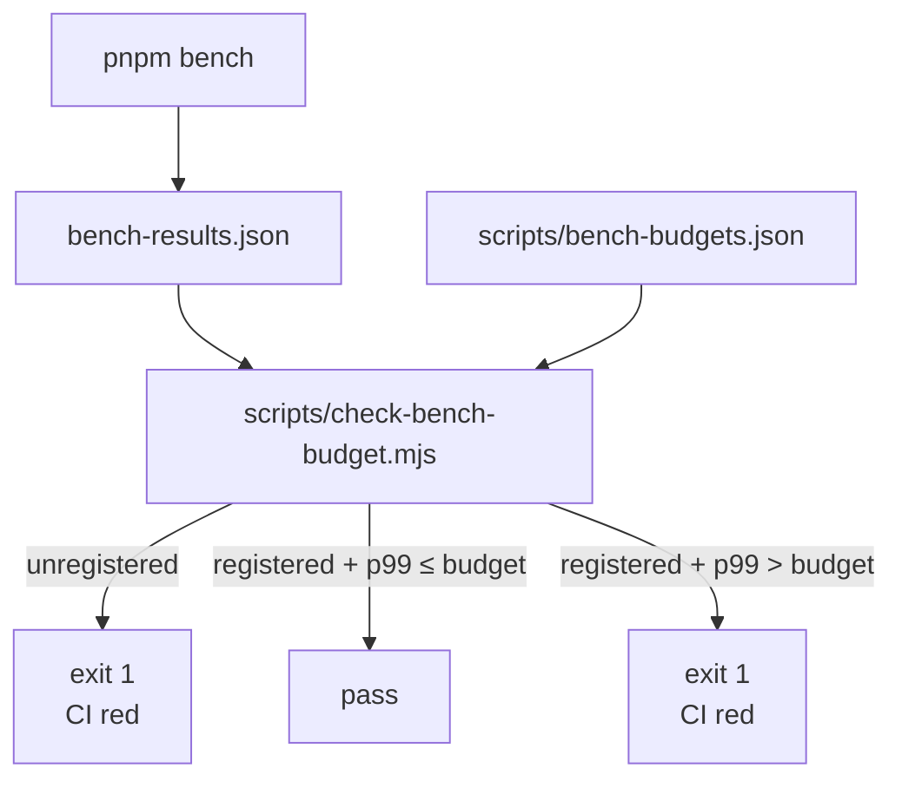

# Benchmarking

Performance is **numbers**, not vibes. `pnpm bench` runs vitest
benchmarks; `scripts/check-bench-budget.mjs` compares each p99 to
`bench-budgets.json` in CI. Over budget = CI red.

::: tip Three steps

1. **Write a bench** in `*.bench.ts` using `bench()`.
2. **Run it** locally: `pnpm bench`.
3. **Check budget** with
   `node scripts/check-bench-budget.mjs bench-results.json` —
   over budget? improve the algorithm or adjust the budget.
   :::

## Command cheat-sheet

```bash
pnpm bench                                              # all
pnpm bench:fast                                         # local run using all workers
pnpm bench src/core/workers                             # subset
pnpm bench --outputJson bench-results.json              # JSON output
node scripts/check-bench-budget.mjs bench-results.json  # budget guard
```

`bench:fast` passes `--maxWorkers=100%` explicitly and is useful for local
feedback. CI still uses `pnpm bench` to avoid multiple benchmark files
competing for CPU and inflating p99 jitter.

CI steps
([`.github/workflows/ci.yml`](https://github.com/SakuraPuare/apollo-map-studio/blob/main/.github/workflows/ci.yml)
`check` job):

```yaml
- name: Benchmarks
  run: pnpm bench --outputJson bench-results.json

- name: Perf budget guard
  run: node scripts/check-bench-budget.mjs bench-results.json
```

## Writing a bench

```ts
// src/core/geometry/offsetPolyline.bench.ts
import { bench } from 'vitest';
import { offsetPolyline } from './offsetPolyline';

const points: [number, number][] = Array.from({ length: 100 }, (_, i) => [i, 0]);

bench('offsetPolyline 100 points / 1m offset', () => {
  offsetPolyline(points, 1);
});
```

`bench()` warms up and measures; Vitest 4 reports mean / p50 / p99.

::: warning Stable inputs
Don't `Math.random()` inside a bench — different inputs each round blow
up p99 noise. Fix the input or seed it:

```ts
const seed = 12345;
let rng = seed;
function next() {
  return (rng = rng * 1664525 + 1013904223) >>> 0;
}
```

:::

## Budget file (bench-budgets.json)

```json
{
  "budgets": {
    "offsetPolyline 100 points / 1m offset": { "p99Ms": 0.5 },
    "spatial.worker SYNC 1k entities": { "p99Ms": 35 },
    "laneJunctionGraph rebuild 500 lanes": { "p99Ms": 12 }
  }
}
```

Schema:

- key = bench `name` (exact match including spaces / punctuation).
- `p99Ms` = upper bound on the 99th percentile (ms).

::: tip Why p99, not p100
`p100 = max` is too jittery; CI flakes randomly. `p99` covers the tail
without letting clear regressions through.
:::

## CI budget flow



Unregistered benches fail closed. A new bench must add a matching budget in
the same change, otherwise CI cannot detect regressions.

## Setting a budget

### First time

1. Write the `*.bench.ts`.
2. `pnpm bench --outputJson bench-results.json`.
3. Read `name` and `p99` numbers.
4. Add a line to `scripts/bench-budgets.json` with **30% headroom**:

```json
"my new bench / 1k items": { "p99Ms": 13 }
```

::: warning Don't pin to the observed value
Observed p99 = 10 ms with budget = 10 ms = CI flakes immediately. Leave
30% headroom for runner variance.
:::

### Commit

```
chore(bench): seed budget for offsetPolyline / 1k items

Initial p99 = 9.8 ms on Apple M1; budget = 13 ms (~30 % headroom)
to absorb GitHub runner variance.
```

## Updating a budget

### Algorithm got faster → tighten

```json
"existing bench": { "p99Ms": 5 }   // was 10
```

Commit:

```
perf(geometry): vectorize offset computation

Bench p99 drops from 9.2 ms to 3.1 ms.
Budget tightened from 10 ms to 5 ms.
```

::: tip Tighter is better
A low-water mark catches regressions. Don't keep the budget loose "just
in case it gets slower later".
:::

### Algorithm has to become slower → relax + explain

```
perf(workers): switch to dijkstra over a*

Bench p99 rises from 22 ms to 35 ms because the graph contains negative
edge weights now (PNCJunction). Budget raised from 25 ms → 40 ms with
a comment in bench-budgets.json explaining the trade-off.
```

::: danger Don't sneak budget bumps
"Algorithm unchanged but budget went 10 → 50" is a smell. Reviewers must
ask: did you patch a regression away by relaxing the guard? Justify or
reject.
:::

## Existing bench areas

| Area                       | Contract                                                     |
| -------------------------- | ------------------------------------------------------------ |
| `offset polyline geometry` | p99 ceilings for 10 / 100 / 1000 point offsets               |
| `lane junction derivation` | full stitch and 1 / 3 lane incremental decoration budgets    |
| `lane topology reconcile`  | full / single-dirty topology derivation across several sizes |
| `overlap reconcile`        | full recompute scales linearly; dirty edit is near-constant  |
| `spatial index syncDirty`  | single-dirty sync does not grow with whole-map entity count  |
| `interaction geometry`     | snap, hit-test distance, and polygon validation              |
| `spatial worker pipeline`  | sync, cold feature rebuild, delta, and hit-test protocol     |
| `cold/hot/overlay/grid`    | main-thread source diff/update and preview construction      |
| `entityOps/mapStore`       | reference cleanup, reparent scans, and store write txns      |
| `proto pipeline`           | bridge, projection, binary codec, and text codec             |

See `scripts/bench-budgets.json`
([source](https://github.com/SakuraPuare/apollo-map-studio/blob/main/scripts/bench-budgets.json)).

## Budget file structure

`scripts/check-bench-budget.mjs` walks the vitest JSON tree:

```
{ files: [{ groups: [{ benchmarks: [{ name, p99, ... }] }] }] }
```

It collects `(name, p99)` leaves and compares to budgets. The file can
grow new fields (`p50Ms`, `meanMs`), but today only `p99` is enforced.

## Cross-platform variance

CI runs on GitHub `ubuntu-latest` (VM, ±20% variance). Your budget must:

- Carry 30% headroom.
- For sub-1 ms benches, expand to 50% (noise dominates).
- A regression reproduces across PRs → real; one-off failure → noise,
  re-run.

::: warning Don't disable a flaky bench
If a bench is occasionally flaky but sometimes catches real
regressions, **adjust the budget, don't delete the bench**. Deleting is
blindness.
:::

## When to bench

| Change                      | Bench?                  |
| --------------------------- | ----------------------- |
| New geometry algorithm      | ✅                      |
| New worker pipeline         | ✅                      |
| Import/export codec changes | ✅                      |
| Cold-layer compile changes  | ✅                      |
| UI component                | ❌ (use React Profiler) |
| Docs                        | ❌                      |

::: tip Decision rule
"If this code became 10× slower, would the user feel it?" Yes ⇒ bench.
:::

## Separation from unit tests

`*.bench.ts` uses `bench()`, `*.test.ts` uses `it()`.

```ts
import { bench, expect, it } from 'vitest';
// You can import both, but don't mix them in one file.
```

`pnpm test` does not run benches; `pnpm bench` does not run tests.

## Profiler complements bench

Bench gives numbers. The browser Profiler shows flame graphs.

DevTools Performance:

1. `pnpm dev` to start.
2. Performance panel → Record 5s.
3. Run the slow path.
4. Bottom-Up view → find the most expensive function.
5. Anchor it with a bench.

::: tip Common hot spots in flame graphs

- `JSON.parse` / `structuredClone` on big payloads — use transferables.
- `Array.prototype.push` in tight loops — preallocate.
- Spread / `Object.assign` — mutate directly inside an immer producer.
  :::

## Common pitfalls

### Bench reports nothing

The `bench()` name does not match `bench-budgets.json` exactly — treated
as unregistered and failed. Copy the name verbatim (spaces included).

### p99 dwarfs p50

Input jitter is too large. Fix the input or seed. Or boost samples:

```ts
bench('foo', () => foo(input), { iterations: 10000 });
```

### "Fast locally, slow on CI"

GitHub runners are ~50% of M1 / Ryzen workstations. Set budgets against
CI, not local.

### Bench hangs

A bench taking > 30s = algorithm degeneration or infinite loop. Set
`vi.setConfig({ testTimeout: 5000 })` and locate.

## Source links

- [`scripts/check-bench-budget.mjs`](https://github.com/SakuraPuare/apollo-map-studio/blob/main/scripts/check-bench-budget.mjs)
- [`scripts/bench-budgets.json`](https://github.com/SakuraPuare/apollo-map-studio/blob/main/scripts/bench-budgets.json)
- [`vite.config.ts`](https://github.com/SakuraPuare/apollo-map-studio/blob/main/vite.config.ts) — vitest bench config
- [Vitest bench docs](https://vitest.dev/api/#bench)

## Advanced

### Trend tracking

Upload each CI `bench-results.json` to an artifact and chart trends.
Not yet enabled.

### bench diff in PR

Add a before/after table to the PR template:

```
| Bench                                  | Before | After |
| -------------------------------------- | ------ | ----- |
| offsetPolyline 100 points / 1m         |   0.5  |  0.3  |
| spatial.worker SYNC 1k entities        |  32    | 23    |
```

::: tip One sentence
**Perf changes need numbers**. Bench is truth, feeling is noise. Get
the numbers, then debate trade-offs.
:::
