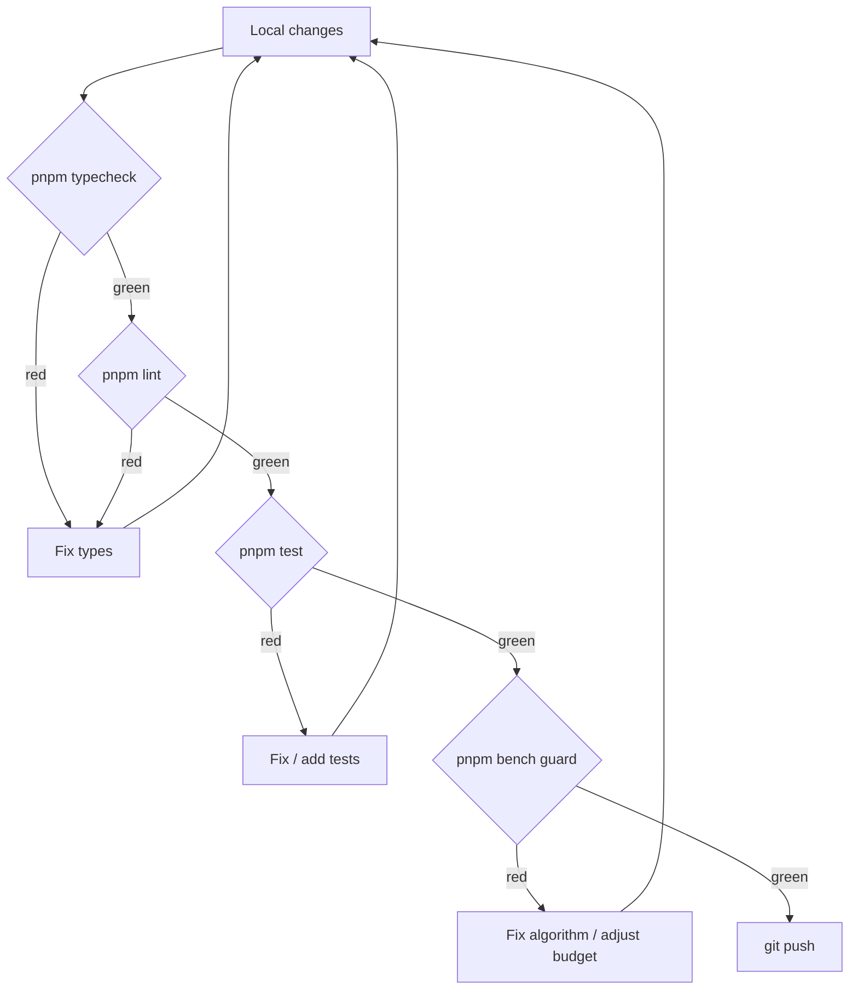

# PR Checklist

This checklist is **mandatory** self-review before requesting a code
review. CI runs most of it, but a **human** must read it first —
otherwise reviewers wait for CI to go red and the loop wastes everyone's
time.

::: tip Three layers

1. **Machine-verifiable** — auto-run (typecheck, lint, test, bench).
2. **Human cognition** — scope, naming, readability, design.
3. **Architectural discipline** — layering, anti-corruption, undo path.
   Pass all three before requesting review.
   :::

## Automated checks

```bash
pnpm typecheck       # tsc + tsc -p tsconfig.electron.json
pnpm lint            # ESLint
pnpm format:check    # Prettier
pnpm test            # Vitest run
pnpm bench           # Vitest bench
node scripts/check-bench-budget.mjs bench-results.json
pnpm build:web       # production build sanity
pnpm docs:build      # if docs changed
```



`pnpm typecheck` runs two tsc invocations (web and Electron). Forgotten
Electron-side type slips are common — keep both green.

## Scope discipline

### One PR = one thing

- Bug fix: don't drive-by refactor.
- Feature: don't smuggle a dep upgrade.
- 50-file rename: standalone PR.

::: warning Cross-scope "cleanups"
See ugly code? File an issue and **leave it alone** in this PR.
Reasons:

- Review focus shatters.
- Rollback drags innocent code along.
- Authorship is muddy (does the test cover the feature or the cleanup?).
  :::

### PR size guidance

| Size           | Impact                                  |
| -------------- | --------------------------------------- |
| ≤ 200 lines    | review feedback within an hour          |
| 200–500 lines  | half a day to a day                     |
| 500–1000 lines | split, or progress slips                |
| > 1000 lines   | **must split** (rename / upgrade aside) |

## Commit messages

Every commit must follow
[Commit Conventions](./commit-conventions):

- type + scope + subject.
- body explains why.
- one commit = one thing.
- no `Co-Authored-By`.
- husky `commit-msg` passes.

## Layering rule

```
components/  ← UI
  ↓
hooks/
  ↓
store/
  ↓
lib/
  ↓
core/
```

**No reverse imports.** Audit:

```bash
grep -R "from '@/components/" src/core/ src/lib/ src/store/ src/hooks/
grep -R "from '@/hooks/"      src/core/ src/lib/ src/store/
grep -R "from '@/store/"      src/core/ src/lib/
grep -R "from '@/lib/"        src/core/
# All MUST be empty.
```

## Anti-corruption audit

Anything touching Apollo proto must go through `entityOps`, never import
`@/core/geometry/apolloCompile` directly.

```bash
git grep "from '@/core/geometry/apolloCompile'" -- 'src/components/**' 'src/hooks/**'
# Empty.
```

A non-empty result = you introduced a new leak. Fix before merging. See
[Architecture: Anti-corruption Layer](../architecture/anti-corruption).

## Undo path (R1)

Any code that mutates `mapStore` entities:

- [ ] zundo recorded the mutation?
- [ ] No FSM state lingers after undo?
- [ ] `undoCancel.test.ts` passes?
- [ ] Manual: mid-draw Ctrl+Z without crash?

See
[State Management R1](../architecture/state-management#r1-undo-fix).

## Performance

- [ ] `pnpm bench` runs; touched benchmarks didn't regress > 10%.
- [ ] 1k-entity ops keep p99 frame time below 16 ms.
- [ ] Worker change: attach DevTools Performance before/after screenshots.
- [ ] New dep: dist size delta < 100 KB (or justify in body).

## Tests

New feature:

- [ ] Unit covers happy path + at least one edge case.
- [ ] FSM-related: FSM-path test.
- [ ] Import/export: round-trip test.
- [ ] Worker: pure-fn unit OR end-to-end worker test.

Bug fix:

- [ ] **Always** add a regression test. Untested bugs return.
- [ ] Test name references issue or commit hash.

## UI changes

- [ ] **Screenshots** in PR description (light + dark each).
- [ ] Interaction: 5-second screen capture.
- [ ] Uses `ams-*` tokens, no raw hex (see
      [Theming](../recipes/theming-with-ams-tokens)).
- [ ] Keyboard reachable; focus rings visible.

::: tip Screenshot tools

- macOS: `Cmd+Shift+4` for region.
- Linux: `gnome-screenshot -a` or `flameshot`.
- Recording: `peek` (Linux) / `Cmd+Shift+5` (macOS).
  :::

## Documentation

- [ ] New public API: add an entry in `docs/reference/`.
- [ ] Architecture change: sync `ARCHITECTURE.md` and
      `docs/architecture/*`.
- [ ] Command change: update tables in
      `docs/contributing/development-setup.md`.
- [ ] Bilingual parity: update both `docs/` (zh) and `docs/en/`.

::: warning Bilingual drift
zh and en must stay in lockstep. Updating one but not the other earns
a complaint within a week. If you can only do one side, prefix the PR
title with `[zh-only]` / `[en-only]` and open a follow-up issue.
:::

## Licensing

- [ ] No GPL / AGPL deps introduced (incompatible with CC-BY-NC-4.0).
- [ ] No copied external code (even commented out).
- [ ] Proto changes: attribute Apollo upstream (preserve Apache 2.0 header).

## CI red — what now?

In order:

1. **Type errors** — fix types, don't `as any`.
2. **Lint errors** — `pnpm lint:fix`, then manual.
3. **Format errors** — `pnpm format`.
4. **Test failures** — read stderr, reproduce locally, fix.
5. **Bench regression** — improve algorithm, or justify and adjust the
   budget.
6. **Build errors** — usually cross-platform (paths, line endings).

::: danger Never `--no-verify`
Bypassing husky or force-pushing to main destroys team trust. Fix the
problem and re-push.
:::

## PR description template

```markdown
## Summary

- One-sentence goal
- Key change 1
- Key change 2

## Motivation

- Background or issue link

## Implementation notes

- Why this approach
- Comparison with alternatives
- Known trade-offs

## Screenshots / capture

(Mandatory for UI changes)

## Test plan

- [ ] pnpm test
- [ ] pnpm bench guard
- [ ] Manual X / Y / Z
- [ ] Cross-platform (if applicable)

## Checklist

- [ ] Bilingual docs synced (if applicable)
- [ ] New dep < 100 KB (if applicable)
- [ ] anti-corruption audit clean
- [ ] Undo path manually verified
```

## Self-review

Before pushing, **read your own diff end-to-end**:

- [ ] No leftover `console.log` / `debugger`.
- [ ] No bare `// TODO` without an issue ref.
- [ ] No commented-out dead code (delete, don't park).
- [ ] No `it.only` / `describe.only`.
- [ ] No exports without test coverage (cover or delete).

::: tip One habit
`git diff main` and **read top to bottom**. If you can't, the diff is
too big or the logic too tangled — split or simplify first.
:::

## Common rejection reasons

| Reason                      | Fix                         |
| --------------------------- | --------------------------- |
| PR changes too many things  | Split                       |
| No undo regression test     | Add `undoCancel`-style test |
| Direct apolloCompile import | Route through entityOps     |
| Function > 80 lines         | Decompose                   |
| File > 400 lines            | Sibling-module split        |
| Tests only happy path       | Add at least one edge case  |
| `as unknown as`             | Use a type guard            |
| `wip` / `fix typo` commit   | Rewrite conventional        |
| Bilingual docs drift        | Sync the other side         |

## Source links

- [`.husky/`](https://github.com/SakuraPuare/apollo-map-studio/tree/main/.husky/)
- [`.github/workflows/ci.yml`](https://github.com/SakuraPuare/apollo-map-studio/blob/main/.github/workflows/ci.yml)
- [Commit Conventions](./commit-conventions)
- [Code Style](./code-style)
- [Architecture: Anti-corruption](../architecture/anti-corruption)

::: warning Don't pass review for review's sake
If you address a comment cosmetically just to merge, the same bug will
return in 6 months. Treat reviews as learning — understand before fixing.
:::
