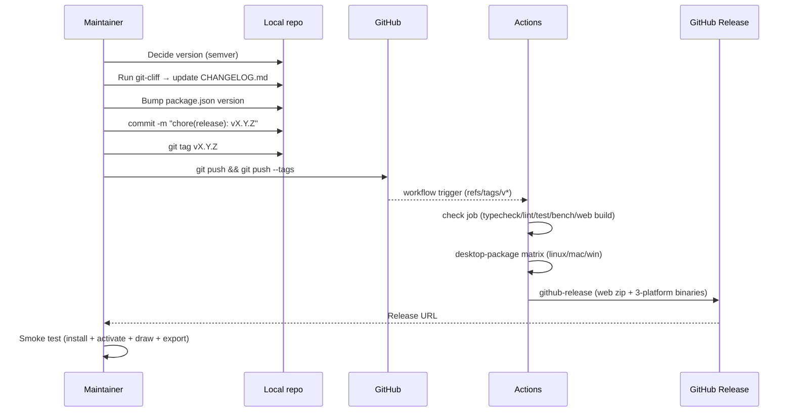
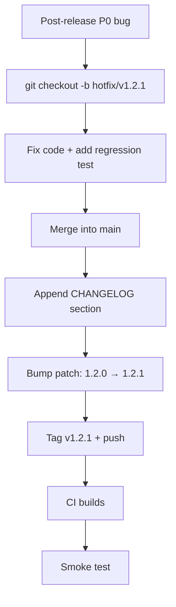

# Release Process

Releasing = bump version + generate CHANGELOG + tag + push + wait for
CI + smoke test. The whole flow runs in **30 minutes**, no manual
uploads.

::: tip Three pillars

1. **CHANGELOG generated automatically** — `cliff.toml` parses
   conventional commits.
2. **CI packages automatically** — `tags: [v*]` triggers
   desktop-package + github-release.
3. **Smoke test** — 5 steps that prove the user-facing flow works.
   :::

## Release flow



## Step-by-step

### 1. Decide the version (semver)

| Change                       | Bump  | Example       |
| ---------------------------- | ----- | ------------- |
| Only docs / chore / refactor | patch | 1.0.0 → 1.0.1 |
| feat / perf, no API break    | minor | 1.0.1 → 1.1.0 |
| BREAKING CHANGE              | major | 1.1.0 → 2.0.0 |

::: warning Decide from `git log`
`git log v<last>..HEAD --oneline` and look for `feat:` / `BREAKING`.
Don't guess.
:::

### 2. Verify main is clean

```bash
git checkout main
git pull
git status        # working tree clean
git log --oneline v<last>..HEAD   # commits to release
```

### 3. Pre-flight checks

```bash
pnpm typecheck
pnpm lint
pnpm format:check
pnpm test
pnpm bench --outputJson bench-results.json
node scripts/check-bench-budget.mjs bench-results.json
pnpm build:web
pnpm docs:build
pnpm build:desktop      # validate Electron main compile
```

Any red? Stop. Fix it; don't release a broken build.

### 4. Generate CHANGELOG

```bash
pnpm exec git-cliff -o CHANGELOG.md
```

`cliff.toml` auto-categorizes:

```markdown
## [1.2.0] - 2026-05-15

### 🚀 Features

- _(actions)_ Add edit.duplicateSelection
- _(fsm)_ Add drawEllipse FSM state

### 🐛 Bug Fixes

- _(fsm)_ Cancel before temporal.undo() in dispatcher

### ⚡ Performance

- _(workers)_ Incremental cold-layer update
```

::: tip Inspect output
Skim the CHANGELOG for un-conventional commits that fell into the
"💼 Other" bucket. If anything's there, fix and rerun, or rewrite the
section.
:::

### 5. Bump version

Two places:

```jsonc
// package.json
{ "version": "1.2.0" }
```

```jsonc
// tools/license-gen/package.json (optional; if issue.mjs embeds version)
```

`electron-builder.yml` reads `package.json.version` automatically.

::: warning Don't use `npm version`
It auto-commits and tags, but the commit message is not conventional.
Commit by hand to keep the message correct.
:::

### 6. Commit & tag

```bash
git add CHANGELOG.md package.json
git commit -m "chore(release): v1.2.0

- Highlight 1
- Highlight 2

See CHANGELOG.md for full details."

git tag v1.2.0
```

::: danger Tag MUST start with `v`
CI is configured `tags: [v*]`. Without the leading `v` no release job
fires.
:::

### 7. Push

```bash
git push origin main
git push origin v1.2.0
```

### 8. Wait for CI

Open
`GitHub Actions`.

Three jobs:

| Job               | Duration | Failure impact                 |
| ----------------- | -------- | ------------------------------ |
| `check`           | ~5 min   | Blocks all subsequent jobs     |
| `desktop-package` | ~15 min  | Just that platform's artifacts |
| `github-release`  | ~2 min   | Binaries fail to upload        |

::: tip Rollback if it fails
`git push --delete origin v1.2.0` to remove the tag,
`git tag -d v1.2.0` locally, fix, re-tag. If the GitHub Release page
already created, use the page's "Delete this release".
:::

### 9. Release page checks

Visit
`releases/tag/v1.2.0`.

- [ ] CHANGELOG section present.
- [ ] `apollo-map-studio-web.zip` exists.
- [ ] `Apollo Map Studio-1.2.0-mac-x64.dmg` etc. macOS artifacts.
- [ ] `*.exe` / `*.zip` Windows artifacts.
- [ ] `*.AppImage` / `*.deb` Linux artifacts.

### 10. Smoke test

At least one real machine per platform:

1. **Download** the installer.
2. **Install** — Linux double-click AppImage / `dpkg -i deb`, macOS
   drag to Applications, Windows run `.exe`.
3. **Activate** with a test code (see
   [Issuing License Keys](../recipes/issuing-license-keys)).
4. **Import** an example map from `map_data/sample/`.
5. **Draw a lane** — ToolStrip → polyline → click → Enter to commit.
6. **Export** — File → Export → Apollo Binary; sanity-check size.
7. **Uninstall** — Linux `dpkg -r` / macOS Trash / Windows Control
   Panel.

All five OK = users can run it. Any failure = emergency hot fix.

### 11. Announce

- Internal: post in the channel, link the release + key CHANGELOG bits.
- External: blog / X / email per marketing flow.
- Docs site: optional banner.

## Emergency hot fix



Budget: hot fix out within 4 hours. Beyond that = team retrospective.

## Retracting a release

::: danger Rare
A GitHub Release that's already been downloaded cannot be uninstalled.
Retracting only stops **new** downloads.

Steps:

1. GitHub UI → Edit release → mark "Pre-release" or delete.
2. Banner on README / docs site warning.
3. Ship vX.Y.Z+1 hot fix immediately.
4. Top of new release notes: "v1.2.0 has been retracted, please use
   1.2.1."
   :::

## CHANGELOG style

`cliff.toml` configures most of it, but humans still decide:

- Merge multiple commits per scope?
  - **No.** Each commit is independently revertable.
- Render PR / issue numbers?
  - cliff doesn't by default. Customize
    `cliff.toml.changelog.body` if needed.
- Chinese release notes?
  - CHANGELOG is English (developer record). Chinese release notes go
    in a blog or docs site.

## Coordination with `tools/license-gen`

Major bumps (1.x → 2.x) typically mean:

- New public key (old activation codes invalidated).
- Proto schema breaking changes (old maps need migration).
- Electron major upgrade (new Node ABI).

**Do not** sneak any of these into a minor bump. Force users to notice
— major is the signal.

## Docs site release

```bash
pnpm docs:build
# Deploy docs/.vitepress/dist to your static host.
```

CI already wires `docs-preview.yml` for PR previews. Production deploy
depends on team setup.

## Source links

- [`cliff.toml`](https://github.com/SakuraPuare/apollo-map-studio/blob/main/cliff.toml)
- [`.github/workflows/ci.yml`](https://github.com/SakuraPuare/apollo-map-studio/blob/main/.github/workflows/ci.yml)
- [`electron-builder.yml`](https://github.com/SakuraPuare/apollo-map-studio/blob/main/electron-builder.yml)
- [`package.json`](https://github.com/SakuraPuare/apollo-map-studio/blob/main/package.json) — scripts
- [Packaging Desktop Builds](../recipes/packaging-desktop-builds)
- [Issuing License Keys](../recipes/issuing-license-keys)

## Advanced

### Multi-channel (stable / beta)

```bash
git tag v1.3.0-beta.1
git push origin v1.3.0-beta.1
```

CI fires the same way; mark the release as "Pre-release". With
electron-updater, beta channels deliver pre-release packages to opt-in
users.

### Auto-generated release notes

GitHub's "Auto-generate release notes" stitches PR titles. It overlaps
cliff and lacks categorization — keep it off and rely on cliff.

### Automated signing + notarization

For macOS notarization in CI:

- secrets: MAC_CSC_LINK / MAC_CSC_KEY_PASSWORD / APPLE_ID /
  APPLE_APP_SPECIFIC_PASSWORD / APPLE_TEAM_ID.
- Set them as env in the macos-latest leg of `desktop-package`.

Not enabled today; verify the cert + notarization flow locally before
flipping it on in CI.

::: tip One sentence
**Version number is a promise; CHANGELOG is the contract.** Confirm the
commit history is clean before bumping, confirm the smoke test passes
after pushing, and only then is the release done.
:::
