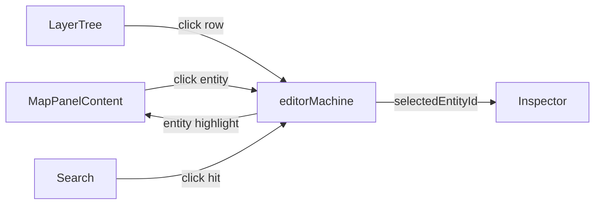

# Activity Bar & Panels

> The AMS left side is split into two layers: the **Activity Bar** (a 48 px icon rail, VS Code-style) and the **Sidebar Panel** that opens when a tab is selected. The center is a **Dockview** container hosting the Map / Inspector / Timeline panels; they support dragging, docking, and maximizing, and persist layout separately for Drawing and Scene modes.

## Overview

| Region          | File                                | Width                     | Data                        |
| --------------- | ----------------------------------- | ------------------------- | --------------------------- |
| Activity Bar    | `ActivityBar.tsx`                   | 48 px                     | 5 tabs                      |
| Sidebar Panel   | `SidebarPanel.tsx`                  | default 240 px, draggable | Current tab decides content |
| Dockview        | `WorkspaceLayout/dockviewLayout.ts` | flexible                  | 4–5 panels                  |
| Inspector Panel | `InspectorPanelContent`             | default 280 px            | Pinned right                |
| Timeline Panel  | `TimelinePanel.tsx`                 | 180 px tall               | scene mode only             |

## Activity Bar — five tabs

`ActivityBar.tsx:11-17`:

| Tab id     | Icon                 | Label    | Backing panel               |
| ---------- | -------------------- | -------- | --------------------------- |
| `explorer` | 📁 FaFolderTree      | Explorer | `MapOutline`                |
| `layers`   | 🗂 FaLayerGroup       | Layers   | `LayerTree`                 |
| `search`   | 🔍 FaMagnifyingGlass | Search   | `SearchPanel`               |
| `timeline` | ⏱ FaClock            | Timeline | (focuses central Dockview)  |
| `settings` | ⚙ FaGear             | Settings | Opens `SettingsPanel` modal |

Tabs are split into two groups (`tabs.slice(0, 4)` top, `tabs.slice(4)` bottom): four primary tabs at the top and `settings` pinned at the bottom — VS-Code style.

::: tip Active tab indicator
The selected tab gets a 2 px × 20 px cyan vertical bar (`bg-ams-accent`) on its left edge, plus icon color flips from `text-ams-text-muted` to `text-ams-text-primary`.
:::

### Tab → Sidebar routing

`SidebarPanel.tsx` switches by `activeTab`:

```ts
switch (activeTab) {
  case 'explorer': return <MapOutline />;
  case 'layers':   return <LayerTree />;
  case 'search':   return <SearchPanel />;
  case 'timeline': return <TimelinePanel inline />;
  case 'settings': onOpenSettings(); return null;
}
```

### MapOutline — Explorer

Shows imported-map metadata:

| Field                           | Source                           |
| ------------------------------- | -------------------------------- |
| Filename                        | `apolloMapStore.info.filename`   |
| PROJ.4                          | `apolloMapStore.info.projString` |
| Bounds                          | `apolloMapStore.bounds` (UTM xy) |
| Per-type entity counts          | `apolloMapStore.info.counts`     |
| Header vendor / district / date | `apolloMapStore.header.*`        |

The `MapMetadataForm` also lets you edit header fields: vendor / district / date / left / right / top / bottom.

### LayerTree — Layers {#layers}

Full details in [Layer Tree](./layer-tree.md). For the ActivityBar interface: clicking an entity in the tree → `selectEntity(id)` → Inspector swaps.

### SearchPanel — Search {#search}

```
┌──────────────────────────────────┐
│ 🔍  search id or type...          │
├──────────────────────────────────┤
│ lane    ▸  lane_AbCd123XyZ       │
│ lane    ▸  lane_PqRs456UvW       │
│ junction▸  junc_xyz              │
└──────────────────────────────────┘
```

Real-time fuzzy match on `id` and `entityType`. Click a hit → `editorMachine.send('SELECT_ENTITY', { id })` → viewport flies to center + Inspector swaps.

### TimelinePanel — Timeline {#timeline}

Visualizes the zundo undo stack. One row per history entry; click to jump. In scene mode it docks at the bottom; in drawing mode it embeds inside the sidebar.

### Settings — modal

The `settings` tab does not enter the sidebar. It calls `onOpenSettings()` to open `SettingsPanel` modally — see [Settings](./settings.md).

## Dockview panel system

`WorkspaceLayout.tsx:139-145` renders `<DockviewReact key={appMode} ... />`. The `key={appMode}` is critical: switching Drawing/Scene rebuilds the instance to avoid stale-layout reuse.

### Default layout

`createDefaultLayout` (`dockviewLayout.ts:34-60`):

| Panel id    | component             | Initial position | Initial size | Scene-only? |
| ----------- | --------------------- | ---------------- | ------------ | ----------- |
| `map`       | MapPanelContent       | center           | flex         | no          |
| `sidebar`   | SidebarSlot           | left of map      | 240 px wide  | no          |
| `inspector` | InspectorPanelContent | right of map     | 280 px wide  | no          |
| `timeline`  | TimelinePanelContent  | below map        | 180 px tall  | **yes**     |

Dockview affordances:

- Drag panel title to change docking
- Double-click title to maximize / restore
- Create splits anywhere
- × hides a panel (no data loss)

### Layout persistence

`saveLayout` writes `api.toJSON()` to `localStorage` on every `onDidLayoutChange`:

| Mode    | Key                                | Writer                    |
| ------- | ---------------------------------- | ------------------------- |
| drawing | `apollo-map-studio:layout:drawing` | `dockviewLayout.ts:13-19` |
| scene   | `apollo-map-studio:layout:scene`   | same                      |

### Reset Layout {#reset-layout}

Two paths:

1. `View → Reset Layout` (`registry/definitions.ts:124-132`) → `handleResetLayout()` → `clearSavedLayout(mode)` + `apiRef.current.clear()` + `createDefaultLayout(api, appMode)`.
2. `Settings → Layout → Reset Layout to Default` (`SettingsPanel.tsx:226-234`) → `clearAllSavedLayouts()` + `window.location.reload()`.

::: tip Which to use?
99% of the time use `View → Reset Layout` — hot reset, no restart. Only fall back to the SettingsPanel hard reset if the dockview instance itself is broken (the menu button is dead).
:::

## Lazy loading

`lazyPanels.tsx:6-39` `React.lazy`-loads each panel as a separate chunk:

```ts
const LazyMapCanvas = lazy(() => import('@/components/map/MapCanvas'));
const LazySidebarPanel = lazy(() => import('../panels/SidebarPanel'));
const LazyTimelinePanel = lazy(() => import('../panels/TimelinePanel'));
const LazyCommandPalette = lazy(() => import('../panels/CommandPalette'));
const LazySettingsPanel = lazy(() => import('../panels/SettingsPanel'));
const LazyProjPickerDialog = lazy(() => import('@/components/dialogs/ProjPickerDialog'));
const LazyEntityForm = lazy(() => import('../panels/InspectorForms'));
```

Each lazy is wrapped in a `Suspense` fallback ("Loading map...", "Loading settings...", etc.).

The first-paint JS only carries MenuBar + ToolStrip + ActivityBar + the dockview shell — around 200 KB. Map / Inspector / Settings load on demand.

## Steps

1. Click an ActivityBar icon to switch Sidebar content.
2. Use Sidebar tools (LayerTree / Search / Outline) to locate an entity.
3. Once selected, the right-side Inspector auto-switches.
4. Drag panel splitters to resize.
5. Drag a panel title to re-dock it.
6. To restore: `View → Reset Layout`.
7. Switch Scene mode to summon Timeline (drawing mode lacks it).

## Troubleshooting

| Symptom                             | Cause                                     | Fix                                                             |
| ----------------------------------- | ----------------------------------------- | --------------------------------------------------------------- |
| Panel disappeared off-screen        | Dragged out of bounds                     | `View → Reset Layout`                                           |
| Layout flickers when switching mode | The two layout keys clobber each other    | Already isolated by `key={appMode}`; file an issue if it recurs |
| Sidebar collapsed and won't reopen  | activityBar selection lost                | Click the same tab twice or any other tab                       |
| Double-clicking title does nothing  | Single-panel layout — nothing to maximize | Add a split first                                               |
| Inspector stays empty               | No entity selected                        | Click one in the LayerTree                                      |

## Persistence

| Key                                | Writer            | Purpose               |
| ---------------------------------- | ----------------- | --------------------- |
| `apollo-map-studio:layout:drawing` | dockviewLayout.ts | drawing-mode snapshot |
| `apollo-map-studio:layout:scene`   | same              | scene-mode snapshot   |

## Source

- `src/components/layout/ActivityBar.tsx` — 5-tab rail
- `src/components/layout/panels/SidebarPanel.tsx` — sidebar router
- `src/components/layout/panels/MapOutline.tsx` — Explorer panel
- `src/components/layout/panels/LayerTree.tsx` — Layers panel
- `src/components/layout/panels/SearchPanel.tsx` — Search panel
- `src/components/layout/panels/TimelinePanel.tsx` — Timeline
- `src/components/layout/WorkspaceLayout.tsx:106-115` — Dockview onReady
- `src/components/layout/WorkspaceLayout/dockviewLayout.ts` — save/restore
- `src/components/layout/WorkspaceLayout/lazyPanels.tsx` — lazy registry
- `src/context/SidebarContext.tsx` — `useSidebar()` hook

## SidebarContext / tab switching

`src/context/SidebarContext.tsx` provides `useSidebar()` returning `{ activeTab, setActiveTab }`. Anything that wants to flip the sidebar uses this hook to avoid props drilling.

```ts
const { setActiveTab } = useSidebar();
setActiveTab('search');
```

::: tip When to use

- If the palette gains a "Focus Search" action later, it calls `setActiveTab('search')`.
- When filing issues about sidebar misbehavior, first verify `SidebarProvider` wraps the tree (`WorkspaceLayout.tsx:189`).
  :::

## Panel events

Dockview exposes three classes of events; AMS hooks two:

| Event                                | Handler                                    |
| ------------------------------------ | ------------------------------------------ |
| `onDidLayoutChange`                  | `saveLayout(api, mode)` — auto persistence |
| `onDidActivePanelChange`             | (not consumed yet — could feed telemetry)  |
| `onDidAddPanel` / `onDidRemovePanel` | same                                       |

## Performance

Per-panel first render times on a dev box:

| Panel                 | First render | Subsequent | Notes                           |
| --------------------- | ------------ | ---------- | ------------------------------- |
| MapPanelContent       | 200–400 ms   | instant    | MapLibre + WebGL init dominates |
| InspectorPanelContent | 50–100 ms    | instant    | Depends on entity field count   |
| TimelinePanelContent  | 30 ms        | instant    | No WebGL                        |
| SidebarPanel          | 20 ms        | instant    | Pure React                      |

::: warning Mode-switch memory leaks
In theory each `key={appMode}` flip **destroys the old DockviewReact + creates a new one**, releasing the MapLibre map with it. If GPU memory creeps up after frequent switches, the dispose path has a bug — verified clean as of P9 but watch for future refactors.
:::

## Differences vs VS Code

| Behavior                          | VS Code           | AMS                                |
| --------------------------------- | ----------------- | ---------------------------------- |
| Double-click same ActivityBar tab | Collapses sidebar | Just reselects (no collapse)       |
| Drag ActivityBar tab to reorder   | Supported         | Not supported (order is hardcoded) |
| Search box at top of sidebar      | Default           | Per-panel only                     |
| Open palette from ActivityBar     | Possible          | No — `⌘K` is the only entry        |

## See also

- [Layer Tree](./layer-tree.md) — what lives behind the Layers tab
- [Inspector](./inspector.md) — right-side property panel
- [Settings](./settings.md) — `⌘,` settings modal
- [MenuBar & ToolStrip](./menubar-and-toolstrip.md) — top bar
- [Troubleshooting](./troubleshooting.md) — general debugging

## Dockview theme

AMS uses dockview's builtin `dockview-theme-dark`. Optional overrides live in `src/styles/dockview.css`.

| Element          | Token                                               |
| ---------------- | --------------------------------------------------- |
| Panel background | `--dv-paneview-active-outline-color` ↔ `ams-accent` |
| Title text       | `--dv-tab-active-foreground-color`                  |
| Drag indicator   | `--dv-paneview-stripes`                             |

## Cross-panel interaction



Four panels coordinate through a single `editorMachine.context.selectedEntityId`. **There is no direct panel-to-panel messaging** — every update routes through the FSM, eliminating prop drilling and state forks.

## Adding a custom panel

To add a new Dockview panel (e.g. "Audit Log"):

1. Register in `lazyPanels.tsx`:
   ```ts
   const LazyAuditLog = lazy(() => import('../panels/AuditLog'));
   export function AuditLogPanelContent() {
     return <Suspense fallback={<PanelFallback label="Loading..." />}><LazyAuditLog /></Suspense>;
   }
   ```
2. Add `AuditLogPanelContent` to `components` in `WorkspaceLayout.tsx`.
3. Decide default placement in `createDefaultLayout` (`dockviewLayout.ts`).
4. Optionally: register an ActionDef `view → Show Audit Log` for visibility toggling.
