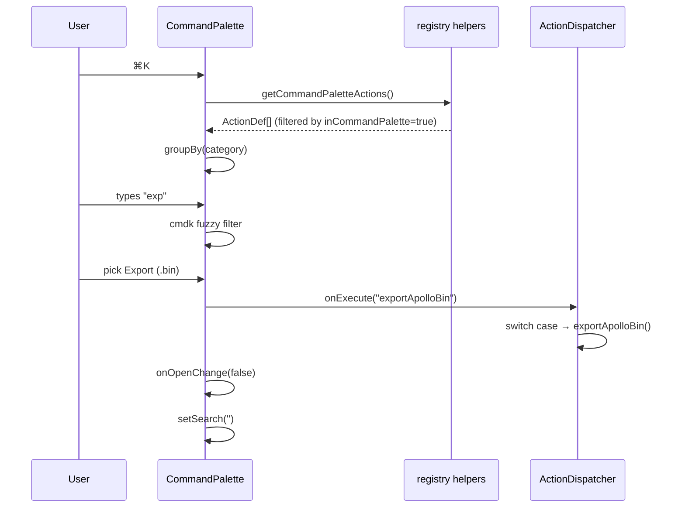

# Command Palette

> The Command Palette is the AMS **global action search box**. Regardless of focus or layout, press `⌘K` / `Ctrl+K` and type a few characters to fire any ActionDef. It is just another surface over the same Action Registry that powers MenuBar and ToolStrip — **fully data-driven**.

::: tip One-liner

> Anything you can click in the MenuBar or ToolStrip can be searched and triggered here.
> :::

## Overview

| Aspect      | Behavior                                               |
| ----------- | ------------------------------------------------------ |
| Open        | `⌘K` / `Ctrl+K` from any focus                         |
| Library     | [cmdk](https://github.com/pacocoursey/cmdk)            |
| Data source | `getCommandPaletteActions()` (`registry/helpers.ts`)   |
| Component   | `src/components/layout/panels/CommandPalette.tsx`      |
| Load        | lazy via `LazyCommandPalette` (`lazyPanels.tsx:21-24`) |
| Close       | `ESC`, click backdrop, or pick an item                 |

## UI Tour

```
                ┌────────────────────────────────────────────┐
                │ 🔍  Type a command or search...     [ESC]  │
                ├────────────────────────────────────────────┤
                │ FILE                                       │
                │   ⬆  Import Apollo Map...                  │
                │   ⬇  Export Apollo Map (.bin)        ⌘ S   │
                │   ⬇  Export Apollo Map (.txt)       ⇧⌘ S   │
                │   ⚙  Settings                        ⌘ ,   │
                │ EDIT                                       │
                │   ↶  Undo                            ⌘ Z   │
                │   ↷  Redo                           ⇧⌘ Z   │
                │   🗑  Delete Selection                ⌫     │
                │   🔗  Connect Lanes                   C    │
                │ VIEW                                       │
                │   ⊞  Toggle Grid                     ⌘ G   │
                │   🧲  Toggle Snap                          │
                │   🪟  Reset Layout                          │
                │ TOOL                                       │
                │   ✏  Draw Polyline                    P    │
                │   ⌒  Draw Bezier                      B    │
                │   ◯  Draw Arc                         A    │
                │   ▭  Draw Rectangle                   R    │
                │   ▰  Draw Polygon                     G    │
                ├────────────────────────────────────────────┤
                │ ↑↓ Navigate    ↵ Select    ESC Close       │
                └────────────────────────────────────────────┘
```

## Open & Close

`CommandPalette.tsx:54-66` registers a global key listener:

```ts
const down = (e: KeyboardEvent) => {
  if (e.key === 'k' && (e.metaKey || e.ctrlKey)) {
    e.preventDefault();
    onOpenChange(!open); // toggle
  }
  if (e.key === 'Escape' && open) {
    onOpenChange(false);
  }
};
document.addEventListener('keydown', down);
```

::: warning Double listener
`WorkspaceLayout.tsx:63-77` registers an identical `⌘K` listener too. They don't fight — both toggle, so whichever fires first leaves the other observing the desired state. This is intentional belt-and-braces so a pre-lazy keystroke still opens the palette as soon as the chunk loads.
:::

## Data Flow



## Grouping

`CommandPalette.tsx:34-42` groups by `action.category`:

```ts
const grouped: Record<string, ActionDef[]> = {};
for (const a of actions) {
  const cat = a.category[0].toUpperCase() + a.category.slice(1);
  if (!groups[cat]) groups[cat] = [];
  groups[cat].push(a);
}
```

| Category    | Meaning                              |
| ----------- | ------------------------------------ |
| `file`      | Import/Export, Settings              |
| `edit`      | Undo / Redo / Delete / Connect Lanes |
| `view`      | Grid / Snap / Reset Layout           |
| `tool`      | 5 draw tools                         |
| `selection` | Default mode                         |

Within a group, ordering is **preserved as registered** — controlled by the order in `registry/definitions.ts`.

## Filter rule

`getCommandPaletteActions()` returns only ActionDefs with `inCommandPalette === true`. To hide a command, set the flag to `false` in `definitions.ts`. For instance, `commandPalette` itself (`registry/definitions.ts:140`) is excluded to avoid a recursive entry.

| Excluded         | Reason                                                |
| ---------------- | ----------------------------------------------------- |
| `commandPalette` | Listing "Command Palette" inside the palette is silly |

cmdk fuzzy match runs against `Command.Item value` (`CommandPalette.tsx:113`):

```ts
value={`${action.label} ${group}`}
```

So typing `exp file` matches both "Export ..." and the group name "File", improving recall.

## Toggle indicator

`isToggle: true` ActionDefs render a ✓ on the right when `getToggleState(id)` returns true. Example:

| State                   | UI                          |
| ----------------------- | --------------------------- |
| `gridEnabled === true`  | `Toggle Grid     ✓     ⌘ G` |
| `gridEnabled === false` | `Toggle Grid           ⌘ G` |

Code: `CommandPalette.tsx:107-118`.

## Shortcut formatting

`formatShortcut('⌘S')` returns `⌘S` on macOS, `Ctrl+S` on Win/Linux. Decided by:

```ts
isMacPlatform(); // navigator.platform.includes('Mac')
```

Full rules in [Shortcuts](./shortcuts.md#format-rule).

## Steps

1. Press `⌘K` / `Ctrl+K` at any time.
2. Type a command fragment (case-insensitive, whitespace tolerant).
3. `↑ ↓` to highlight.
4. `Enter` runs the action; the palette closes itself.
5. `ESC` or click backdrop to cancel.

## Persistence

The palette **does not persist** anything. Every open starts with empty search (`runCommand` resets via `setSearch('')`, see `CommandPalette.tsx:49`).

## Troubleshooting

| Symptom                         | Cause                                      | Fix                                                          |
| ------------------------------- | ------------------------------------------ | ------------------------------------------------------------ |
| ⌘K does nothing                 | A contentEditable element ate the event    | Click on the map first                                       |
| Command not found               | ActionDef missing `inCommandPalette: true` | Update `definitions.ts`                                      |
| `⌘S` still saves while typing   | Shortcuts not de-bound from inputs         | Known issue — adding `event.target` checks is on the backlog |
| Selecting an item does nothing  | dispatcher missing the case                | Add a `case` in `useActionDispatcher.ts`                     |
| Palette is slow to first appear | First open lazy-loads the chunk            | Expected; reopens are instant                                |

## Extending

Add a new entry — touch only `registry/definitions.ts` + `useActionDispatcher.ts`:

```ts
// 1. register
{
  id: 'reformatGeometry',
  label: 'Reformat Geometry',
  category: 'edit',
  inCommandPalette: true,
}

// 2. dispatch
case 'reformatGeometry':
  reformatAll();
  return;
```

## Source

- `src/components/layout/panels/CommandPalette.tsx:22-139` — main component
- `src/components/layout/WorkspaceLayout/lazyPanels.tsx:21-24` — lazy load
- `src/components/layout/WorkspaceLayout.tsx:50-77,151-161` — state + open
- `src/core/actions/registry/helpers.ts` — `getCommandPaletteActions` / `formatShortcut` / `isMacPlatform`
- `src/core/actions/registry/definitions.ts` — all entries
- `src/hooks/useActionDispatcher.ts` — `onExecute` / `getToggleState`

## Accessibility

| Aspect              | Implementation                                                |
| ------------------- | ------------------------------------------------------------- |
| Screen reader focus | `Command.Input` auto-focuses                                  |
| Keyboard nav        | `↑↓` via cmdk, follows ARIA `aria-activedescendant`           |
| Exit                | `ESC` and backdrop click                                      |
| High contrast       | `aria-selected` row uses `bg-cyan-500/20` and `text-cyan-400` |

::: warning No right-click context menu
There are no secondary actions (e.g. "open source file"). To add them, cmdk supports `<Command.Subitem>`, but the data model needs a `subActions: ActionDef[]` field.
:::

## Comparison vs other tools

| Tool                | Open key | Source                    | Fuzzy library |
| ------------------- | -------- | ------------------------- | ------------- |
| AMS Command Palette | `⌘K`     | Action Registry           | cmdk          |
| VS Code             | `⌘⇧P`    | Command Registry          | builtin       |
| Linear              | `⌘K`     | API + client actions      | Fuse.js       |
| Slack               | `⌘K`     | channels + slash commands | builtin       |
| Notion              | `⌘K`     | pages + slash commands    | builtin       |

AMS picks `⌘K` (matching cmdk's default and Linear) so it aligns with the ToolStrip's `⌘K` button — minimal cognitive overhead.

## See also

- [MenuBar & ToolStrip](./menubar-and-toolstrip.md) — same data, different surface
- [Shortcuts](./shortcuts.md) — full shortcut reference
- [Activity Bar & Panels](./activity-bar-and-panels.md) — workspace overview
- [Settings](./settings.md) — `⌘,` settings panel
- [Inspector](./inspector.md) — right-side properties panel
