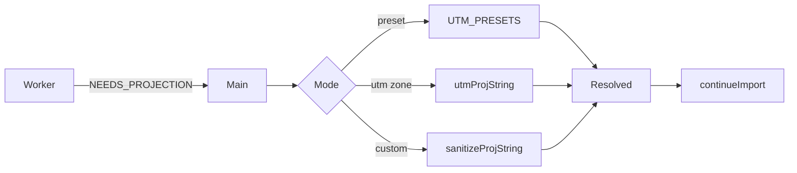

# Coordinate system & projection

Apollo HD maps store geometry in a local UTM frame in metres. Apollo Map Studio displays geometry in WGS84 lng/lat over a MapLibre web-mercator basemap. The bridge is the PROJ.4 string in `Header.projection.proj`. If it's missing, the editor prompts via `ProjPickerDialog`.

## The four spaces

| System                        | Used by                                            | Units     |
| ----------------------------- | -------------------------------------------------- | --------- |
| WGS84 lng/lat                 | MapLibre, `GeoPoint`, `LngLat`, store internals    | degrees   |
| Local UTM (Apollo `PointENU`) | proto `central_curve.points`, all on-disk geometry | metres    |
| Web-Mercator (EPSG:3857)      | MapLibre internal projection                       | metres    |
| MGRS (Military Grid)          | Optional external interchange                      | letters+m |

::: tip Why WGS84 internally
MapLibre renders web-mercator. Storing lng/lat aligns directly with the basemap and skips per-frame projection. UTM↔WGS84 conversion happens once per import and once per export.
:::

## The PROJ.4 string

Apollo's `Header.projection.proj` is a literal PROJ.4 string. Examples:

| Region                | PROJ.4                                                                                                               |
| --------------------- | -------------------------------------------------------------------------------------------------------------------- |
| Sunnyvale, CA         | `+proj=utm +zone=10 +ellps=WGS84 +datum=WGS84 +units=m +no_defs`                                                     |
| Beijing               | `+proj=utm +zone=50 +ellps=WGS84 +datum=WGS84 +units=m +no_defs`                                                     |
| Shanghai              | `+proj=utm +zone=51 +ellps=WGS84 +datum=WGS84 +units=m +no_defs`                                                     |
| Apollo Borregas TMERC | `+proj=tmerc +lat_0={37.413082} +lon_0={-122.013929} +k=1 +x_0=0 +y_0=0 +ellps=WGS84 +datum=WGS84 +units=m +no_defs` |

The brace template is a Borregas/garage-map quirk. `sanitizeProjString` (`projection.ts:10-12`) strips them before handing the string to proj4.

## Projection picker



| Mode          | Function                 | Notes                                                  |
| ------------- | ------------------------ | ------------------------------------------------------ |
| Region preset | `UTM_PRESETS[id]`        | Sunnyvale 10N, Beijing 50N, Shanghai 51N, Shenzhen 50N |
| UTM zone      | `utmProjString(zone, h)` | zone 1–60, hemisphere N or S                           |
| Custom PROJ   | `sanitizeProjString(s)`  | any PROJ.4 with auto-strip of template braces          |

```ts
export function utmProjString(zone: number, hemisphere: 'N' | 'S' = 'N'): string {
  if (zone < 1 || zone > 60) throw new Error(`UTM zone out of range: ${zone}`);
  const south = hemisphere === 'S' ? ' +south' : '';
  return `+proj=utm +zone=${zone}${south} +ellps=WGS84 +datum=WGS84 +units=m +no_defs`;
}
```

## Inferring a UTM zone

```ts
export function utmZoneFromLon(lonDeg: number): number {
  let lon = lonDeg;
  while (lon < -180) lon += 360;
  while (lon > 180) lon -= 360;
  return Math.min(60, Math.max(1, Math.floor((lon + 180) / 6) + 1));
}
```

::: warning You cannot infer the zone from (x, y) alone
UTM is per-zone local; (500 000, 4 500 000) exists in every zone. The zone must come from a region picker, a known longitude, or an external source.
:::

## Steps

### 1. Pick a projection

When import emits `NEEDS_PROJECTION`, the dialog opens. Choose preset / zone / custom and click **Use this projection**.

### 2. Diagnose offsets

| Offset magnitude | Likely cause                 |
| ---------------- | ---------------------------- |
| ~700 km          | Wrong UTM zone               |
| ~50 km           | Wrong hemisphere             |
| ~hundreds of m   | Datum / ellipsoid mismatch   |
| ~few m           | Normal projection truncation |

### 3. Fix

Re-import with a corrected PROJ. The Map metadata panel shows the current PROJ string. If you need a different zone, re-import is the cleanest path; mid-session PROJ swap is on the roadmap.

## Options table

| Item              | Value                        | Notes                               |
| ----------------- | ---------------------------- | ----------------------------------- |
| Internal CRS      | WGS84 lng/lat (degrees)      | `GeoPoint = { x: lng, y: lat, z? }` |
| On-disk CRS       | Apollo PointENU (UTM metres) | per `Header.projection.proj`        |
| Mercator render   | EPSG:3857                    | maplibre internal                   |
| Sanitisation      | strip `{}` template braces   | `sanitizeProjString`                |
| Default preset    | Beijing UTM 50N              | `ProjPickerDialog.tsx:14-19`        |
| Hemispheres       | N / S                        | `utmProjString(zone, hemisphere)`   |
| Default ellipsoid | WGS84                        | most Apollo maps                    |

## Shortcut cheatsheet

| Action             | Key / Where            | Notes                 |
| ------------------ | ---------------------- | --------------------- |
| Switch picker tab  | mouse                  | preset / UTM / custom |
| Confirm PROJ       | `Enter` or button      | submits               |
| Cancel             | `Esc`                  | aborts pipeline       |
| Copy resolved PROJ | select in Resolved box | browser-native        |

## Troubleshooting

| Symptom                            | Cause                                  | Fix                                               |
| ---------------------------------- | -------------------------------------- | ------------------------------------------------- |
| Map appears mid-Pacific            | wrong UTM zone                         | use `utmZoneFromLon` with a known city lon        |
| Re-import gives different PROJ     | header was overwritten between imports | inspect `apolloMapStore.header`                   |
| `proj4 invalid` on `+lat_0={37.4}` | sanitizer regex regression             | confirm `/\{([^}]+)\}/g` in `projection.ts:10-12` |
| QGIS shows offset after export     | `+ellps` or `+datum` lost on writeback | inspect compiled PROJ in exported header          |
| MGRS display request               | not implemented                        | external converter, on the roadmap                |
| proj4 forward/inverse mismatch     | malformed PROJ                         | reproduce in DevTools with literal proj4 call     |

## Geo helpers (`src/lib/geo.ts`)

For local-scale (≤ 100 m) computations the editor avoids the proj4 round-trip and uses haversine + per-latitude meter↔degree factors:

```ts
const EARTH_RADIUS_M = 6_371_008.8; // WGS84 mean radius
haversineMeters(a, b); // great-circle distance
polylineLengthMeters(points); // sum over segments
metersToDegLat(); // 1 m → degrees lat
metersToDegLng(latDeg); // 1 m → degrees lng at lat
```

(`src/lib/geo.ts:1-58`)

This is what powers `LaneEntity.length` derivation and the SignalTemplate sub-2 m geometry generator.

## Source links

- `src/io/proto/projection.ts:1-81`
- `src/components/dialogs/ProjPickerDialog.tsx:1-231`
- `src/store/projDialogStore.ts`
- `src/store/apolloMapStore.ts`
- `src/core/geometry/coords.ts`
- `src/lib/geo.ts:22-58`

## See also

- [Import overview](./import.md)
- [Importing deep dive](./importing.md)
- [Map elements](./map-elements.md)
- [Drawing lanes](./drawing-lanes.md)
