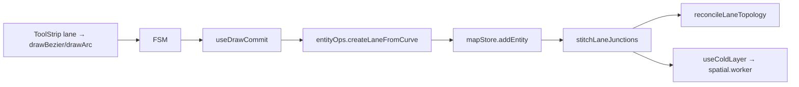
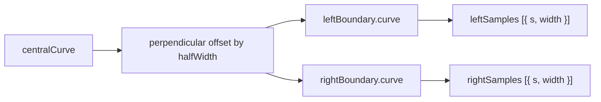

# Drawing lanes

Lanes are the core authoring unit of an Apollo HD Map. This page walks through the full pipeline: pick tool → drop anchors → commit → boundary offset → topology stitch → junction membership.

## Pipeline

`createLaneFromCurve(curve, halfWidth)` produces:

- `centralCurve.segments[].lineSegment.points` — lon/lat WGS84
- `leftBoundary` / `rightBoundary` offset perpendicular by `laneHalfWidth` (default 1.5 m)
- `length` via haversine (`src/lib/geo.ts:35-42`)
- defaults: `type=CITY_DRIVING`, `turn=NO_TURN`, `direction=FORWARD`

## Steps

### 1. Pick lane → tool

ToolStrip's `lane` element exposes `drawBezier` (default) and `drawArc` only (`src/core/elements.ts:50-58`).

### 2. Drop anchors

- **drawBezier:** click anchor, drag to set tangent (handleOut), release; repeat. Double-click to commit. Anchors with no drag (< 1e-6 deg displacement) become corners (`handleIn/Out = null`).
- **drawArc:** click 1 = start, click 2 = arc midpoint, click 3 = end (commits).

### 3. Commit & boundary offset

### 4. Boundary types

The seven `BoundaryLineType` values (`src/types/apollo.ts:74-81`):

| Value           | Visual        | Semantics                           |
| --------------- | ------------- | ----------------------------------- |
| `UNKNOWN`       | grey          | unspecified                         |
| `DOTTED_YELLOW` | yellow dashed | bidirectional, lane change allowed  |
| `DOTTED_WHITE`  | white dashed  | same-direction, lane change allowed |
| `SOLID_YELLOW`  | yellow solid  | centre line, no crossing            |
| `SOLID_WHITE`   | white solid   | no crossing (ramp boundary, etc.)   |
| `DOUBLE_YELLOW` | double yellow | strict no-crossing                  |
| `CURB`          | curb          | physical separation                 |

`LaneBoundary.boundaryType` is an array of `{s, types[]}` entries in ascending `s`. A single boundary can switch from `DOTTED_WHITE` to `SOLID_WHITE` along its length.

### 5. Neighbour twin

Four neighbour lists on `LaneEntity`:

- `leftNeighborForwardIds` — same direction, on the left
- `rightNeighborForwardIds` — same direction, on the right
- `leftNeighborReverseIds` — opposite direction, on the left
- `rightNeighborReverseIds` — opposite direction, on the right

`reconcileLaneTopology` derives these from central-curve heading + geometric adjacency. See [Topology](./topology.md).

### 6. Junction insertion

Lanes whose endpoints fall inside a junction polygon receive `junctionId`. `stitchLaneJunctions` snaps **continuous** end-start pairs to a shared miter point.

::: warning Start-start / End-end exclusion
`isContinuousJunction` rejects start-start (forks) and end-end (merges) pairs (`src/core/geometry/laneJunctions.ts:88-90`). Pulling those boundaries to a shared miter point corrupts the visible split/merge geometry; topology and overlap entities handle them instead.
:::

## Options table

| Option           | Default                  | Notes                                                                           |
| ---------------- | ------------------------ | ------------------------------------------------------------------------------- |
| Tool             | `drawBezier`             | `MAP_ELEMENTS[lane].defaultTool`                                                |
| `laneHalfWidth`  | 1.5 m                    | `settingsStore.laneHalfWidth`                                                   |
| `LaneType`       | `CITY_DRIVING`           | 7 values: NONE / CITY_DRIVING / BIKING / SIDEWALK / PARKING / SHOULDER / SHARED |
| `LaneTurn`       | `NO_TURN`                | NO_TURN / LEFT_TURN / RIGHT_TURN / U_TURN                                       |
| `LaneDirection`  | `FORWARD`                | FORWARD / BACKWARD / BIDIRECTION                                                |
| Boundary default | `SOLID_WHITE`            | per-s entries                                                                   |
| Initial samples  | `[{ s: 0, width: 1.5 }]` | extended via inspector                                                          |

## Shortcut cheatsheet

| Action        | Key / Mouse              | Notes                                |
| ------------- | ------------------------ | ------------------------------------ |
| Pick lane     | ToolStrip lane icon      | activates `MAP_ELEMENTS[lane]`       |
| Bezier / Arc  | `B` / `A`                | tool actions                         |
| Drop anchor   | click                    | `MOUSE_DOWN`                         |
| Drag tangent  | hold + move              | `MOUSE_MOVE [isDraggingHandle]`      |
| Commit        | dbl-click / 3rd click    | `DOUBLE_CLICK` / `[twoPointsLaid]`   |
| Cancel        | `Esc`                    | `CANCEL`                             |
| Select & edit | click lane → drag handle | `selected → editingPoint`            |
| Connect lanes | `C`                      | predecessor/successor stitching mode |

## Troubleshooting

### Boundary looks jagged

Phase E incremental decoration may have skipped a frame. Check `useColdLayer` INCREMENTAL path; refresh once.

### Lane endpoints don't snap at junction

Only continuous (end-start) pairs are stitched. Use `connectLanes` or move endpoints manually.

### Half-width change doesn't propagate

`settingsStore.laneHalfWidth` only affects **future** lanes. Edit existing `leftSamples`/`rightSamples` in the inspector or redraw.

### Neighbor side wrong

`reconcileLaneTopology` uses central-curve heading. If `LaneEntity.direction` is wrong, neighbours classify wrong. Fix `direction` first.

### `lane.length` differs from GIS tools

Editor uses haversine (sphere). Lane-scale error < 0.5 %. External GIS may use ellipsoidal geodesic — expect tens-of-cm divergence.

## Source links

- `src/core/elements.ts:50-58`
- `src/types/apollo.ts:74-164`
- `src/lib/entityOps.ts`
- `src/core/geometry/laneOffset.ts`
- `src/core/geometry/laneJunctions.ts`
- `src/core/elements/derive/`
- `src/lib/geo.ts:22-42`

## See also

- [Drawing tools](./drawing-tools.md)
- [Topology](./topology.md)
- [Topology and junctions](./topology-and-junctions.md)
- [Map elements](./map-elements.md)
- [Editing and snapping](./editing-and-snapping.md)
