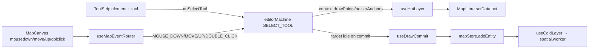
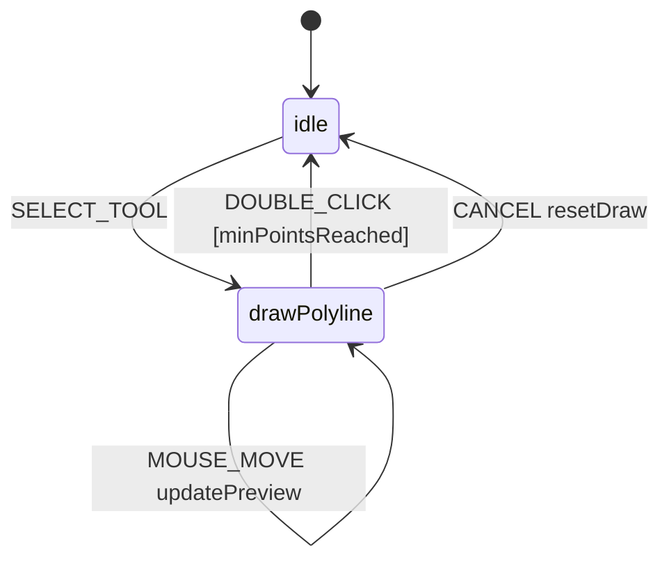
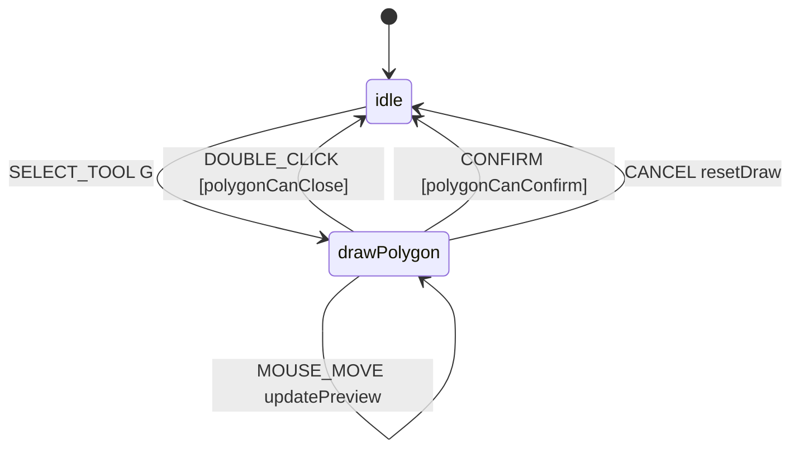

# Drawing tools

The ToolStrip exposes six drawing tools, each backed by an XState `drawXxx` state. `useMapEventRouter` translates maplibre mouse/keyboard events into FSM events; the FSM updates `context.drawPoints` / `context.bezierAnchors`; `useHotLayer` re-renders the preview every frame; on commit, `useDrawCommit` reads the post-snapshot and inserts a new entity into `mapStore`.

## Architecture

## Tool inventory

| Tool            | Key | Commit               | Min points           | Used by elements                                                |
| --------------- | --- | -------------------- | -------------------- | --------------------------------------------------------------- |
| drawPolyline    | `P` | DOUBLE_CLICK         | ≥ 2                  | primitive only                                                  |
| drawCatmullRom  | —   | DOUBLE_CLICK         | ≥ 2                  | primitive only                                                  |
| drawBezier      | `B` | DOUBLE_CLICK         | ≥ 2 anchors          | lane, signal, stopSign, yieldSign, speedBump, barrierGate       |
| drawArc         | `A` | 3rd MOUSE_DOWN       | exactly 3            | lane                                                            |
| drawRotatedRect | `R` | 3rd MOUSE_DOWN       | exactly 3            | parkingSpace, crosswalk, clearArea                              |
| drawPolygon     | `G` | DOUBLE_CLICK / Enter | ≥ 3 non-intersecting | junction, pncJunction, parkingSpace, crosswalk, clearArea, area |

The full enum lives at `editorMachine.ts:10-16`. Action keybindings come from `src/core/actions/registry/definitions.ts:164-221`. Element → tool restrictions come from `src/core/elements.ts:49-158`.

## Steps

### 1. Pick element, then tool

The ToolStrip is two-tier. `ElementBar.onSelect(type)` calls `onSelectTool(def.defaultTool, type)`; the `SELECT_TOOL` event carries `element`, and `resetDraw` writes it to `context.activeElement`. The right-hand tool group filters to `MapElementDef.tools`.

### 2. drawPolyline / drawCatmullRom

`minPointsReached` requires `drawPoints.length >= 2`. `previewPoint` follows the cursor for the live segment. `Esc` cancels.

### 3. drawBezier

Each `MOUSE_DOWN` adds an anchor `{point, handleIn:null, handleOut:null}` **and** sets `isDraggingHandle = true`. Subsequent `MOUSE_MOVE` while dragging mirrors handles around the anchor (`mirrorPoint`). `MOUSE_UP` finalises; if drag distance < 1e-6 deg (~11 cm), handles snap to `null` for a corner. `DOUBLE_CLICK` commits with guard `bezierMinAnchors`.

### 4. drawArc / drawRotatedRect

Three-click commit (`twoPointsLaid` guard).

- **drawArc:** click 1 = start, click 2 = midpoint of arc (not centre), click 3 = end. The compiler fits a circle through three points.
- **drawRotatedRect:** click 1–2 = axis (long edge), click 3 = perpendicular distance to short edge.

### 5. drawPolygon

`polygonNoSelfIntersect` blocks adding a point that would create a self-intersection. `polygonCanClose` requires ≥ 3 points and no self-intersection. Both `DOUBLE_CLICK` and `Enter` commit.

## Options table

| Tool            | Guards / actions                                                                 | Notes                                |
| --------------- | -------------------------------------------------------------------------------- | ------------------------------------ |
| drawPolyline    | `minPointsReached`, `addPoint`, `updatePreview`                                  | DOUBLE_CLICK / CONFIRM commit        |
| drawCatmullRom  | (same)                                                                           | useDrawCommit branches on hint       |
| drawBezier      | `bezierMinAnchors`, `bezierAddAnchor`, `bezierDragHandle`, `bezierConfirmHandle` | corner threshold 1e-6 deg            |
| drawArc         | `twoPointsLaid`                                                                  | exactly 3 points                     |
| drawRotatedRect | `twoPointsLaid`                                                                  | exactly 3 points                     |
| drawPolygon     | `polygonNoSelfIntersect`, `polygonCanClose`, `polygonCanConfirm`                 | self-intersection in `validation.ts` |

## Shortcut cheatsheet

| Action                    | Key / Mouse         | FSM event                       |
| ------------------------- | ------------------- | ------------------------------- |
| Switch to drawBezier      | `B`                 | `SELECT_TOOL drawBezier`        |
| Switch to drawArc         | `A`                 | `SELECT_TOOL drawArc`           |
| Switch to drawRotatedRect | `R`                 | `SELECT_TOOL drawRotatedRect`   |
| Switch to drawPolygon     | `G`                 | `SELECT_TOOL drawPolygon`       |
| Switch to drawPolyline    | `P`                 | `SELECT_TOOL drawPolyline`      |
| Drop point / anchor       | left click          | `MOUSE_DOWN`                    |
| Drag handle (Bezier)      | hold + move         | `MOUSE_MOVE [isDraggingHandle]` |
| Commit polyline / polygon | double-click        | `DOUBLE_CLICK`                  |
| Commit arc / rectangle    | third click         | `MOUSE_DOWN [twoPointsLaid]`    |
| Cancel                    | `Esc`               | `CANCEL`                        |
| Back to Pan               | `H`                 | `defaultMode`                   |
| Toggle grid / snap        | `⌘G` / `toggleSnap` | `uiStore`                       |

::: tip Double-click dedup (`isDuplicateInput`)
MapLibre's `dblclick` is preceded by two synthetic clicks. `useMapEventRouter`'s `isDuplicateInput` swallows the second one (position + time window), so the FSM sees a single `MOUSE_DOWN`. The cautionary comment at `editorMachine.ts:82-87` documents the prior `slice(-1)` regression that this fixes — never add a tail-trim back.
:::

## Troubleshooting

### Polygon won't close

`polygonCanClose` blocks self-intersecting polygons. Inspect the rubber-band; you've drawn an "8" or pulled a vertex through an existing edge.

### Bezier last-anchor missing

Should not happen with the current FSM. If you see it, check whether some upstream code mutates `bezierAnchors` after commit; the FSM relies on input-layer dedup, not tail-trim.

### Arc curves the wrong way

Point 2 is the **midpoint of the arc**, not the centre. To curve the other way, click the midpoint on the opposite side of the chord.

### Rect axis ambiguity

Points 1–2 define the axis. Use a known long edge first.

### Tool change leaks preview

`SELECT_TOOL` triggers `resetDraw`. Stale rubber-band suggests a hot-layer subscription glitch — refresh.

## Source links

- FSM: `src/core/fsm/editorMachine.ts:130-384`
- Event router: `src/hooks/useMapEventRouter.ts` + `src/hooks/mapEventRouter/`
- Action registry: `src/core/actions/registry/definitions.ts:164-221`
- Element/tool matrix: `src/core/elements.ts:49-158`
- Self-intersection: `src/core/geometry/validation.ts`
- ToolStrip UI: `src/components/layout/ToolStrip.tsx:128-219`

## See also

- [Drawing lanes](./drawing-lanes.md)
- [Editing and snapping](./editing-and-snapping.md)
- [Map elements](./map-elements.md)
- [Topology](./topology.md)
