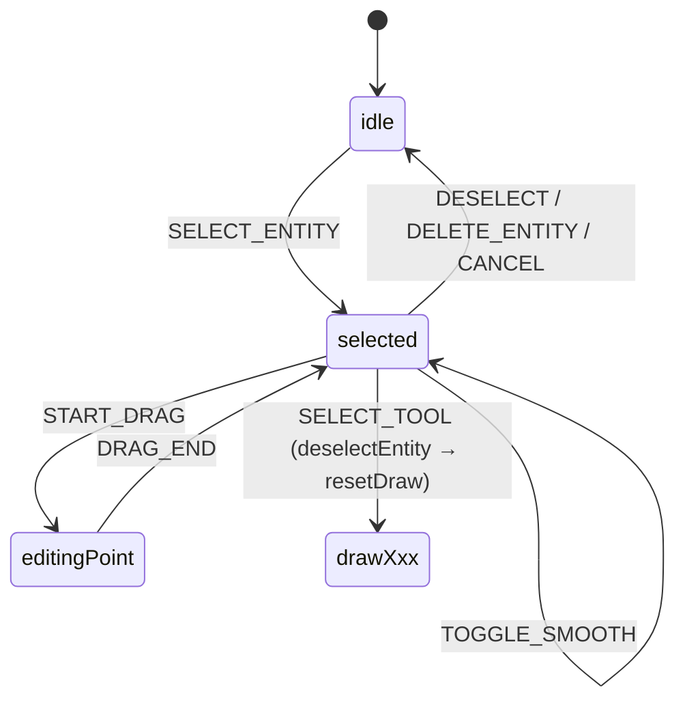
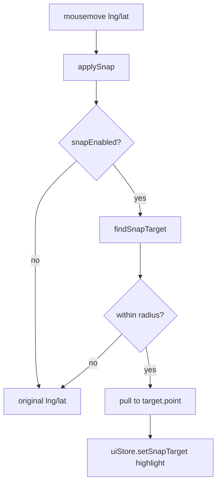
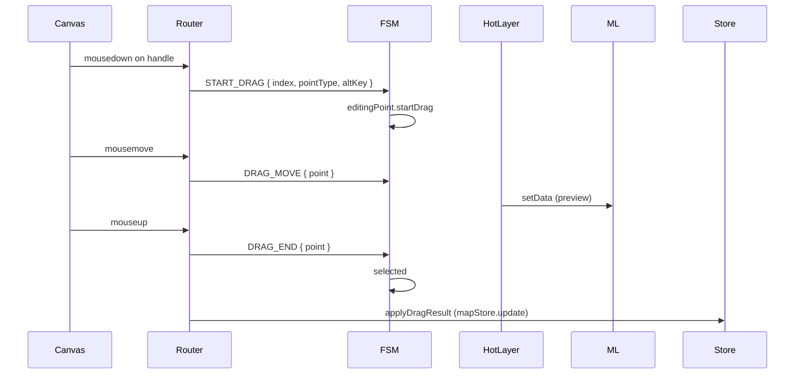

# Editing & snapping

After committing an entity you edit it on the canvas: click to select, drag handles to reshape, drag the body to translate. Snap engages automatically while drawing or dragging.

## FSM

`pointType` covers `vertex`, `bezierIn`, `bezierOut`, `body`, etc. (`src/types/editor.ts`).

## Snap pipeline

`applySnap` (`src/hooks/mapEventRouter/snap.ts:15-39`) only runs when the FSM is in `editingPoint` or any `drawXxx` state. The radius is in pixels (`SNAP_RADIUS_PX`); it's converted to metres at the cursor latitude / current zoom via `pixelsToMeters`.

`SnapTarget` kinds:

| Kind         | Source                           | When                           |
| ------------ | -------------------------------- | ------------------------------ |
| `endpoint`   | lane start/end                   | lane-to-lane stitching         |
| `vertex`     | polygon corner                   | junction / parking / area      |
| `mid`        | edge midpoint                    | long edges                     |
| `centerline` | lane central curve nearest point | drawing along an existing lane |

`excludeId` prevents an entity from snapping to itself during drag.

## Steps

### 1. Select

Click an entity → `SELECT_ENTITY {id}` → `selected`. LayerTree click does the same.

### 2. Drag a handle

### 3. Translate body

`pointType=body` reuses `editingPoint`; the delta applies uniformly to every vertex.

### 4. Toggle corner ↔ smooth (Bezier)

`Alt` + click anchor dispatches `TOGGLE_SMOOTH {index}`. `MapCanvas` flips `handleIn/Out` between `null` and mirrored without leaving `selected` (`editorMachine.ts:304-307`).

## Options table

| Option                  | Default                | Notes                                      |
| ----------------------- | ---------------------- | ------------------------------------------ |
| `snapEnabled`           | `true`                 | `uiStore.snapEnabled`, `toggleSnap` action |
| `SNAP_RADIUS_PX`        | 12 px                  | radius in pixels, converted to metres      |
| Snap scope              | drawing + editingPoint | `isSnapApplicable`                         |
| `gridEnabled`           | `false`                | `uiStore.gridEnabled`, `⌘G`                |
| History limit           | 100                    | `settingsStore.historyLimit`               |
| Bezier corner threshold | < 1e-6 deg             | snaps handle to `null` on tiny drag        |

## Shortcut cheatsheet

| Action                   | Key / Mouse          | Notes                               |
| ------------------------ | -------------------- | ----------------------------------- |
| Select                   | click entity         | `SELECT_ENTITY`                     |
| Deselect                 | click blank / `Esc`  | `DESELECT` / `CANCEL`               |
| Drag handle              | hold + drag          | `editingPoint`                      |
| Translate body           | hold body + drag     | `editingPoint pointType=body`       |
| Corner ↔ smooth (Bezier) | `Alt` + click anchor | `TOGGLE_SMOOTH`                     |
| Delete selection         | `Delete`             | `DELETE_ENTITY`                     |
| Undo / Redo              | `⌘Z` / `⇧⌘Z`         | dispatcher CANCEL → temporal.undo() |
| Toggle snap              | View menu / action   | `uiStore.snapEnabled`               |
| Toggle grid              | `⌘G`                 | `uiStore.gridEnabled`               |

## Troubleshooting

### Snap highlight visible but cursor not pulled

`applySnap` returns the pulled lng/lat. Ensure callers use the return value, not `e.lngLat`.

### Selection vanishes mid-drag

`selected` likely received a stray `CANCEL`. Trace dispatcher events.

### Undo leaves orphan geometry

R1 contract: dispatcher sends `CANCEL` to FSM **before** `temporal.undo()` (`src/hooks/useActionDispatcher.ts:76-82`). Without it, mid-draw `drawPoints` desync from rolled-back `entities`.

### Snap radius wrong

Tune `SNAP_RADIUS_PX` in `src/config/mapConstants.ts`.

### Edit-time self-intersection allowed

By design — `polygonNoSelfIntersect` only blocks during draw; edits may transit illegal states. Commit-time validation is on the roadmap.

## Source links

- FSM: `src/core/fsm/editorMachine.ts:281-326`
- Snap: `src/hooks/mapEventRouter/snap.ts:1-40`
- Snap geometry: `src/core/geometry/snap.ts`
- Drag: `src/hooks/mapEventRouter/selectionDrag.ts`
- Undo R1: `src/hooks/useActionDispatcher.ts:76-82`
- Constants: `src/config/mapConstants.ts`
- StatusBar: `src/components/layout/StatusBar.tsx`

## See also

- [Drawing tools](./drawing-tools.md)
- [Drawing lanes](./drawing-lanes.md)
- [Layer tree](./layer-tree.md)
- [Topology](./topology.md)
