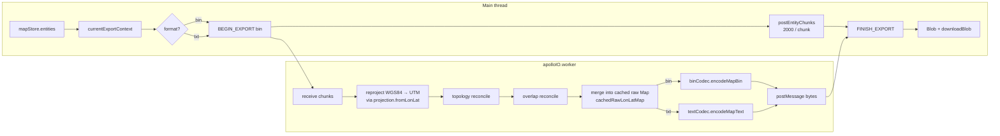
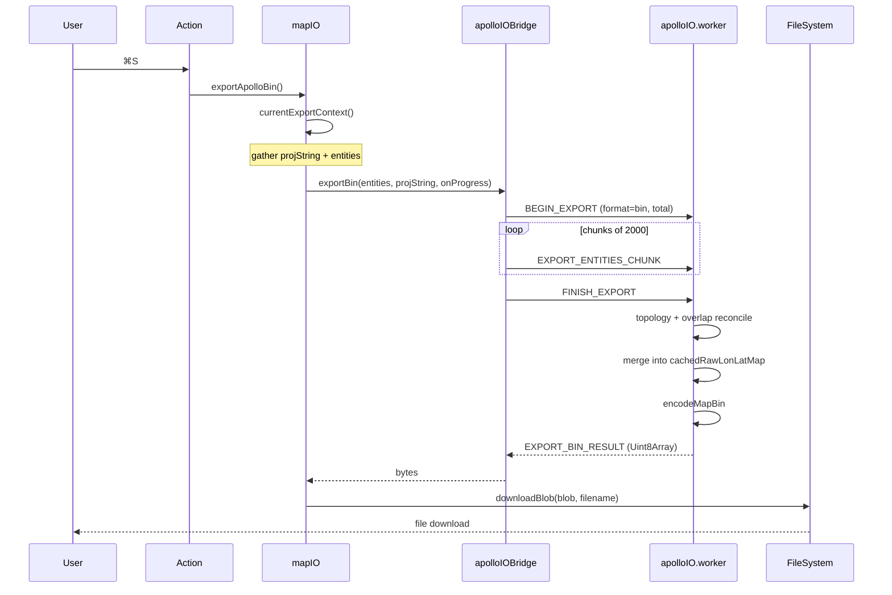

# Exporting (Deep Dive)

> The companion page to [Export](./export.md). Where export.md asks **what**, this page asks **how** — from entity slicing to bytes-on-disk.

::: tip Audience

- You are adding a new element type and want to confirm export serializes it correctly.
- You suspect the produced `base_map.bin` is incompatible with Apollo runtime.
- You are tuning performance, writing benchmarks, or producing regression fixtures.
  :::

## Overview



## Seven pipeline steps

### 1. Main-thread context (`mapIO.ts`)

`exportApolloBin` calls `currentExportContext()`:

```ts
const { info } = useApolloMapStore.getState(); // from Import
const entities = Array.from(useMapStore.getState().entities.values());
```

`info.projString` is the PROJ.4 string; `entities` is a flat `MapEntity[]` (10⁵+ items possible).

Export also depends on `cachedRawLonLatMap` inside `apolloIO.worker.ts`. Import fills that cache with the raw Apollo map converted to lon/lat; export calls `entitiesToApolloMap(cachedRawLonLatMap, processed.entities)` to merge edited entities back into that raw map before reprojection and encoding. Without that cache, the worker throws `"No imported Apollo map is cached in the IO worker."`.

### 2. Worker bridge + chunking (`apolloIOBridge.ts:204-225`)

The main thread sends `BEGIN_EXPORT`, then chunks of `EXPORT_ENTITY_CHUNK_SIZE = 2_000`, with `await yieldToMain()` between chunks so the UI keeps drawing.

```ts
for (let offset = 0; offset < entities.length; offset += 2000) {
  const nextOffset = Math.min(offset + 2000, entities.length);
  this.post({
    type: 'EXPORT_ENTITIES_CHUNK',
    requestId,
    entities: entities.slice(offset, nextOffset),
    offset,
    total: entities.length,
  });
  onProgress?.({ ... });
  await this.yieldToMain();
}
this.post({ type: 'FINISH_EXPORT', requestId });
```

::: tip Why not send everything at once?
`postMessage` uses **structured clone**, and a deep clone of 100k entities pins the main thread for 1–2s. Chunking ensures the long GC isn't a frame-rate killer.
:::

### 3. Reprojection (`apolloIO.worker.ts` + `proto/projection.ts`)

The worker iterates entities and calls `projection.fromLonLat` per ENU point:

```ts
const proj = makeProjection(projString); // proj4 forward/inverse
for (const e of entities) {
  // lane.centralCurve / boundary / polygon / position …
  recurseENU(e, (point) => proj.fromLonLat(point));
}
```

PROJ strings are first run through `sanitizeProjString` to strip Apollo template placeholders like `{37.413082}` (`projection.ts:10-12`).

### 4. Topology reconcile

`apolloIO.worker.ts` reuses `applyImportTopology()`: it puts the `MapEntity[]` into a Map, runs `reconcileLaneTopology(entityMap)`, then proceeds to overlap reconcile. The current export path does not separately invoke the `core/elements/derive` engine; derived values that need to round-trip must already be represented in the entity or in `entitiesToApolloMap()`.

### 5. Overlap reconcile (`core/elements/overlap/reconcile.ts`)

All `OverlapEntity`s go through reconcile:

1. Re-enumerate every (lane, lane) / (lane, junction) / (lane, signal) / … geometric intersection.
2. Recompute `startS` / `endS` / `regionOverlaps` per pair.
3. Skip slots tagged in `_userOverrides` (preserve pinned values).

Details: see Overlap form in [Inspector#overlap-form](./inspector.md#overlap-form-overlap-ts).

### 6. Header retention

::: tip Design goal
**Exported base_map must preserve the imported `Header`** — `projection.proj`, `vendor`, `district`, `date`, `left/right/top/bottom` etc. must not be clobbered, otherwise downstream pipelines treat the map as a brand-new map.
:::

Header retention comes from merging into the imported raw map rather than constructing a fresh map message from `apolloMapStore.header`:

```ts
const merged = entitiesToApolloMap(cachedRawLonLatMap, processed.entities);
```

That preserves `header` and fields not bridged into `MapEntity`. It also means export is not a from-scratch complete `base_map` generator.

### 7. protobuf encoding (`proto/binCodec.ts` / `proto/textCodec.ts`)

Last mile:

| Path   | File                 | Behavior                                                       |
| ------ | -------------------- | -------------------------------------------------------------- |
| `.bin` | `binCodec.ts:17-23`  | `Map.verify(obj)` → `Map.fromObject` → `Map.encode().finish()` |
| `.txt` | `textCodec.ts:13-16` | reverse of `decodeMessage` — hand-rolled textproto encoder     |

`Map.verify` is `protobufjs`'s field validation — catches enum overflow, missing required fields, etc. On failure it throws `"Map.verify failed: …"`, caught at `mapIO.ts:108` and surfaced to the user.

## Output validation

::: tip Automated regression
The repo has Import↔Export round-trip tests (`src/io/__tests__/`). They confirm the in-memory entity is bit-for-bit equivalent to the Apollo proto (modulo auto-derived `length`). CI runs them on every PR.
:::

| Check               | Tool                                                   | Failure mode                                  |
| ------------------- | ------------------------------------------------------ | --------------------------------------------- |
| protobuf types      | `Map.verify`                                           | Throws immediately                            |
| Field ranges        | Lane speedLimit / width etc.                           | Inspector pre-validates; export double-checks |
| Required fields     | `lane.id` / `lane.centralCurve.segments`               | Throws if missing                             |
| Topology closure    | `predecessorIds` references existing                   | Reconcile warns to console, does not block    |
| Overlap consistency | `objects[].objectId` must be present in the main table | Reconcile drops dangling slots                |

To sanity-check externally: `protoc --decode_raw < base_map.bin > tmp.txt` and diff against AMS `.txt` — should match.

## Benchmarks

See `bench/` (gated by `scripts/check-bench-budget.mjs` in CI):

| Map size       | bin export | txt export | Main bottleneck   |
| -------------- | ---------- | ---------- | ----------------- |
| 1 k entities   | < 200 ms   | < 400 ms   | derive            |
| 10 k entities  | ~ 1.5 s    | ~ 3 s      | reproject         |
| 100 k entities | ~ 18 s     | ~ 35 s     | overlap reconcile |

::: warning Big maps
For >50k entities, prefer `.bin`. `.txt` encoding is too slow and the file is huge.
:::

## Persistence

Export does **not write** any `localStorage` keys. `apolloMapStore.{info, header, bounds}` are in-memory state set on the latest Import; they vanish on app exit.

## Detailed steps



## Troubleshooting

| Symptom                                                    | Root cause                                                              | Fix                                                          |
| ---------------------------------------------------------- | ----------------------------------------------------------------------- | ------------------------------------------------------------ |
| `Map.verify failed: lane.0.id is required`                 | Entity id missing (often after a bad `_userOverrides` patch)            | Find the entity in DevTools and re-assign an id              |
| Apollo runtime: "no such file or directory: ./sim_map.bin" | You only exported base_map                                              | Generate `sim_map` offline with Apollo's `sim_map_generator` |
| Output is < 10 KB                                          | No entities committed; likely a failed import                           | Check `mapStore.entities.size > 0`                           |
| Text export shows scientific-notation coordinates          | proto encoder default uses longs; already pinned via `longs:Number`     | `binCodec.ts:8` set; file an issue if it recurs              |
| Overlap count grows after export                           | Reconcile re-enumerated all intersections, including ones missed before | Expected; pin manual values via `_userOverrides`             |
| `No imported Apollo map is cached in the IO worker.`       | Missing import-time raw map cache                                       | Re-import the source base_map, then export                   |

## Source

- `src/io/mapIO.ts:95-141` — main entry
- `src/io/apolloIOBridge.ts:88-225` — bridge + chunking
- `src/io/apolloIO.worker.ts` — worker reconcile + encode
- `src/io/apolloIOProtocol.ts` — main↔worker message protocol
- `src/io/proto/projection.ts:30-45` — `makeProjection`
- `src/io/proto/binCodec.ts:17-23` — `.bin` encode
- `src/io/proto/textCodec.ts:13-16` — `.txt` encode
- `src/core/elements/overlap/reconcile.ts` — overlap reconcile
- `src/io/__tests__/` — round-trip regressions

## Protocol constants

`src/io/apolloIOBridge.ts:13-16`:

| Constant                   | Value                 | Meaning               |
| -------------------------- | --------------------- | --------------------- |
| `FALLBACK_PROJ`            | `UTM_PRESETS.beijing` | Fallback when no PROJ |
| `DEFAULT_TIMEOUT_MS`       | 600_000 (10 min)      | Per-request timeout   |
| `EXPORT_ENTITY_CHUNK_SIZE` | 2_000                 | Entities per chunk    |

## Worker message protocol

`src/io/apolloIOProtocol.ts` defines main↔worker messages:

| Message                                    | Direction     | Purpose                       |
| ------------------------------------------ | ------------- | ----------------------------- |
| `IMPORT_BIN` / `IMPORT_TEXT`               | main → worker | Import entry                  |
| `BEGIN_EXPORT`                             | main → worker | Export starts                 |
| `EXPORT_ENTITIES_CHUNK`                    | main → worker | Streamed chunks               |
| `FINISH_EXPORT`                            | main → worker | Tell worker to encode         |
| `RESOLVE_PROJECTION`                       | main → worker | User picked PROJ in dialog    |
| `CLEAR`                                    | main → worker | Clear worker caches           |
| `PROGRESS`                                 | worker → main | Progress tick                 |
| `NEEDS_PROJECTION`                         | worker → main | File has no header.projection |
| `IMPORT_ENTITIES_CHUNK`                    | worker → main | Streamed return               |
| `IMPORT_RESULT`                            | worker → main | Done                          |
| `EXPORT_BIN_RESULT` / `EXPORT_TEXT_RESULT` | worker → main | Done                          |
| `CLEARED`                                  | worker → main | Ack to CLEAR                  |
| `ERROR`                                    | worker → main | Any failure                   |

## Header retention matrix

| Header field            | Import                                      | Edit                                | Export writes                        |
| ----------------------- | ------------------------------------------- | ----------------------------------- | ------------------------------------ |
| `projection.proj`       | read into `info.projString`; raw map cached | only by changing `info.projString`  | preserved through raw-map merge      |
| `vendor`                | raw map cached                              | editable fields need merge support  | determined by cached raw map / merge |
| `district`              | raw map cached                              | same                                | same                                 |
| `date`                  | raw map cached                              | same                                | same                                 |
| `left/right/top/bottom` | raw map cached                              | not synthesized from a blank header | determined by cached raw map / merge |
| `version`               | raw map cached                              | not editable                        | preserved                            |
| `rev_major/rev_minor`   | raw map cached                              | not editable                        | preserved                            |

## Debug tips

### 1. Inspect worker logs

Chrome DevTools → hamburger → **More tools → Network conditions / Workers** to see `apolloIO.worker.ts` console output.

### 2. Intercept a single message

```js
import { apolloIOBridge } from '@/io/apolloIOBridge';
const originalPost = (apolloIOBridge as any).post;
(apolloIOBridge as any).post = (msg, transfer) => {
  console.log('[bridge]', msg);
  return originalPost.call(apolloIOBridge, msg, transfer);
};
```

### 3. Force reprojection

```js
// devtools console
useApolloMapStore.getState().setError(null);
useApolloMapStore.setState({ info: { ...info, projString: '+proj=utm +zone=51 +datum=WGS84' } });
```

## See also

- [Export](./export.md) — overview
- [Import](./import.md) / [Importing](./importing.md) — inbound side
- [Inspector](./inspector.md) — `_userOverrides` field lock
- [Coordinate System](./coordinate-system.md) — PROJ.4 / UTM
- [Troubleshooting](./troubleshooting.md) — cross-module debugging

## See also

- [Export](./export.md) — overview
- [Import](./import.md) / [Importing](./importing.md) — inbound side
- [Inspector](./inspector.md) — `_userOverrides` field lock
- [Coordinate System](./coordinate-system.md) — PROJ.4 / UTM
- [Troubleshooting](./troubleshooting.md) — cross-module debugging
