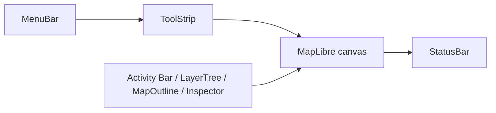
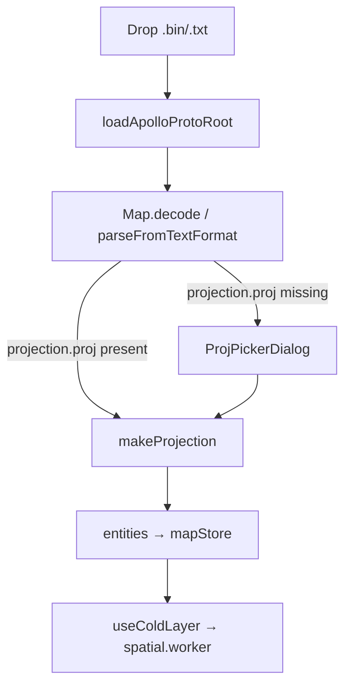

# Getting Started

Apollo Map Studio is a desktop-grade web editor for Apollo HD Maps. It runs in a browser via Vite (`pnpm dev`) and as a native shell via Electron 41 (`pnpm electron:dev`). Under the hood it stitches together MapLibre GL 5 for rendering, XState 5 for the editing FSM, Zustand 5 + zundo 2 for the undoable data store, proj4 2 for projection round-trips, and protobufjs 8 for `.bin` / `.txt` Apollo proto I/O.

## Overview

This page answers four questions:

1. **What can it do?** Edit Apollo entities — lane, junction, PNC junction, parking space, crosswalk, signal, stop sign, yield sign, speed bump, clear area, barrier gate, area — and round-trip them losslessly with `apollo.hdmap.Map` proto.
2. **How do I start it?** `pnpm dev` for the browser, `pnpm electron:dev` for the desktop. See [Installation](./installation.md).
3. **How do I open my first map?** Drag-drop, the `File → Import Apollo Map…` menu, or the command palette (`⌘K`) all reach the same pipeline. See [Import overview](./import.md).
4. **How do I save?** `⌘S` writes binary `.bin`; `⇧⌘S` writes Apollo `TextFormat`.

::: tip Recommended path

1. Read this page → [Installation](./installation.md)
2. Follow [Import overview](./import.md) and load Apollo's Sunnyvale demo
3. Read [Coordinate system](./coordinate-system.md) to understand UTM/WGS84 swaps
4. Continue with [Drawing tools](./drawing-tools.md) and [Drawing lanes](./drawing-lanes.md)
   :::

## Capability snapshot

| Module      | Capability                                                                                            | Key file                                                      |
| ----------- | ----------------------------------------------------------------------------------------------------- | ------------------------------------------------------------- |
| Render      | MapLibre GL 5.x with cold/hot dual layers                                                             | `src/components/map/MapCanvas.tsx`                            |
| FSM         | XState 5: `drawPolyline`, `drawBezier`, `drawArc`, `drawRotatedRect`, `drawPolygon`, `drawCatmullRom` | `src/core/fsm/editorMachine.ts`                               |
| Store       | Zustand + zundo, `partialize: { entities }`                                                           | `src/store/mapStore.ts`                                       |
| Projection  | proj4 with sanitised Apollo `+lat_0={37.4}` braces, UTM 1–60, custom PROJ.4                           | `src/io/proto/projection.ts`                                  |
| Proto codec | protobufjs, `apollo.hdmap.Map`                                                                        | `src/io/proto/loader.ts`                                      |
| ToolStrip   | Action-registry driven, two-tier (element → tool)                                                     | `src/components/layout/ToolStrip.tsx`, `src/core/elements.ts` |
| Layer tree  | react-arborist drag-drop with `canReparent` validation                                                | `src/components/layout/panels/LayerTree.tsx`                  |

## Steps

### 1. Boot the dev server

```bash
pnpm install               # install deps
pnpm dev                   # browser at http://127.0.0.1:5173
pnpm electron:dev          # Electron + Vite HMR
```

The full script catalogue lives at `package.json:9-22` (`build:desktop`, `package:linux`, `package:mac`, `package:win`, `docs:dev`, `bench`, `typecheck`, `lint`, `format`).

### 2. Workspace anatomy



- **MenuBar + ToolStrip** at the top — File / Edit / View / Help, plus the element selector and view-slot toggles.
- **Activity Bar** on the left hosts the LayerTree, MapOutline, Search panel.
- **Inspector** on the right is `react-hook-form` + `zod` schema-driven.
- **StatusBar** at the bottom shows the active tool, cursor lng/lat, zoom, snap state.

### 3. Import a sample map



Three entry points share the pipeline:

1. **Drag-drop** the file onto the canvas;
2. **Menu** `File → Import Apollo Map…` (`ACTION_DEFS.importApollo`, `registry/definitions.ts:23-31`);
3. **Command palette** `⌘K → Import Apollo Map…`.

### 4. Pick element and draw

::: info Two-tier ToolStrip
The ToolStrip is **element-first, tool-second**. The `ElementBar` shows 12 Apollo element icons (`src/core/elements.ts:49-158`); only after you pick an element does the right-hand group reveal the tools allowed for it (`MapElementDef.tools`). Lanes only allow Bezier/Arc; parking spaces only allow Rectangle/Polygon.
:::

| Element      | Default tool    | Allowed tools                |
| ------------ | --------------- | ---------------------------- |
| lane         | drawBezier      | drawBezier, drawArc          |
| junction     | drawPolygon     | drawPolygon                  |
| pncJunction  | drawPolygon     | drawPolygon                  |
| parkingSpace | drawRotatedRect | drawRotatedRect, drawPolygon |
| crosswalk    | drawRotatedRect | drawRotatedRect, drawPolygon |
| signal       | drawBezier      | drawBezier                   |
| stopSign     | drawBezier      | drawBezier                   |
| speedBump    | drawBezier      | drawBezier                   |
| yieldSign    | drawBezier      | drawBezier                   |
| clearArea    | drawRotatedRect | drawRotatedRect, drawPolygon |
| barrierGate  | drawBezier      | drawBezier                   |
| area         | drawPolygon     | drawPolygon                  |

### 5. Edit and undo

- Click an entity → FSM enters `selected`. Drag a vertex/handle → `editingPoint`.
- `⌘Z` / `⇧⌘Z` invoke zundo's `temporal.undo()` / `temporal.redo()`.
- **R1 closure**: the dispatcher sends `CANCEL` to the FSM **before** invoking undo (`src/hooks/useActionDispatcher.ts:76-82`). Without this guard, mid-draw `⌘Z` left `drawPoints` stale while `entities` rolled back.

### 6. Export

- `⌘S` → `exportApolloBin` (binary `.bin`)
- `⇧⌘S` → `exportApolloText` (Apollo TextFormat)
- Both call `entityOps.compileApolloMap` to reassemble `apollo.hdmap.Map` from `mapStore.entities`, then hand off to protobufjs.

## Options table

| Option          | Default | Where              | Notes                                             |
| --------------- | ------- | ------------------ | ------------------------------------------------- |
| Grid            | off     | View / ToolStrip   | `toggleGrid`, `⌘G`                                |
| Snap            | on      | View / ToolStrip   | `toggleSnap`, radius `SNAP_RADIUS_PX`             |
| Default (Pan)   | on      | ToolStrip leftmost | `defaultMode`, `H` — equivalent to ESC + pan-mode |
| Connect Lanes   | off     | ToolStrip          | `connectLanes`, `C`                               |
| History limit   | 100     | Settings           | `settingsStore.historyLimit` → zundo `limit`      |
| Lane half-width | 1.5 m   | Settings           | `settingsStore.laneHalfWidth` → boundary offset   |
| Command palette | `⌘K`    | global             | `commandPalette` — hidden from the palette itself |

## Shortcut cheatsheet

| Action                 | Key               | FSM transition                          |
| ---------------------- | ----------------- | --------------------------------------- |
| Pan                    | drag / `H`        | `idle → idle`                           |
| Rotate / pitch         | right-drag / Ctrl | maplibre native                         |
| Commit polyline / poly | double-click      | `DOUBLE_CLICK` guard `minPointsReached` |
| Commit arc / rect      | third click       | `MOUSE_DOWN` guard `twoPointsLaid`      |
| Cancel draw            | `Esc`             | `* → idle` via `CANCEL`                 |
| Undo / Redo            | `⌘Z` / `⇧⌘Z`      | dispatcher CANCEL → temporal.undo()     |
| Command palette        | `⌘K`              | modal                                   |
| Delete selection       | `Delete`          | `selected → idle` + remove              |
| Toggle grid            | `⌘G`              | `uiStore.gridEnabled`                   |
| Toggle snap            | (no key)          | `uiStore.snapEnabled`                   |

## Troubleshooting

### Q1. Canvas is blank after import

- 90% of the time you didn't actually import anything — try `File → Import Apollo Map…`.
- If imported but still blank, check DevTools for `[ApolloProto] decode failed: …`.
- If cold layer is empty, suspect a `spatial.worker.ts` HMR glitch — refresh once.

### Q2. Projection dialog keeps reappearing

It only opens when `header.projection.proj` is missing (`ProjPickerDialog.tsx:1-231`). After you OK it, the chosen PROJ string is written back to the header. If a re-import still triggers it, the writer dropped the header — see [Importing deep dive](./importing.md#header-retention).

### Q3. `⌘Z` wiped the entire map

zundo's `partialize` only tracks `entities`. The first `⌘Z` after an import undoes the import as a single step. To preserve the snapshot, run any tiny mutation first.

### Q4. Electron complains about `dist-electron/main.cjs`

`pnpm electron:dev` waits on the Vite dev server then runs `pnpm build:electron` (`package.json:16`). If you call `electron .` directly you must first build with `pnpm build:desktop`.

## Source links

- `package.json:9-33` — scripts
- `src/core/elements.ts:49-158` — element/tool matrix
- `src/components/layout/ToolStrip.tsx` — UI shell
- `src/core/actions/registry/definitions.ts` — action catalogue
- `src/core/fsm/editorMachine.ts` — FSM
- `src/components/dialogs/ProjPickerDialog.tsx` — projection picker
- `src/io/proto/loader.ts` — protobufjs loader

## See also

- [Installation](./installation.md)
- [Import overview](./import.md)
- [Coordinate system](./coordinate-system.md)
- [Drawing tools](./drawing-tools.md)
- [Layer tree](./layer-tree.md)
