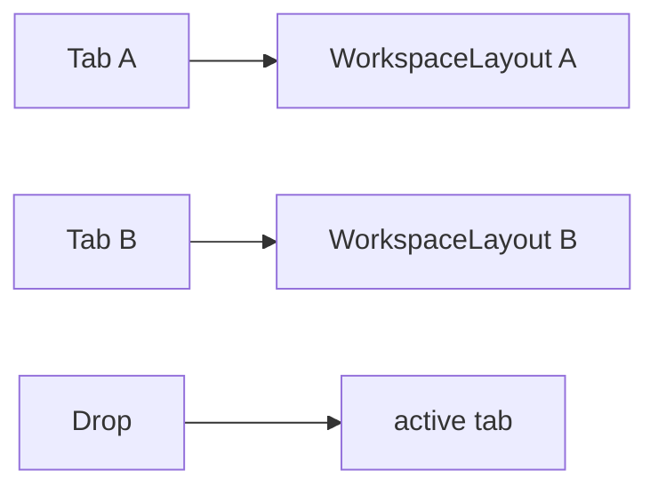
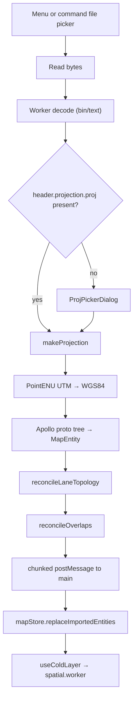

# Import Overview

This page explains **how to get a file into the editor** — the entry points, the UI affordances, the status bar, and the progress popover. The companion page [Importing deep dive](./importing.md) walks through what happens **after** the file is accepted: decoding, projection, entity bridging, topology re-derivation, header retention.

## Pipeline at a glance

The current import path starts in `src/hooks/useActionDispatcher.ts`, calls `pickAndImportApollo()` in `src/io/mapIO.ts`, sends bytes through `src/io/apolloIOBridge.ts`, and finishes in `src/io/apolloIO.worker.ts`. The main thread only chooses the file and applies the result; the worker does protobuf decode, projection (UTM↔WGS84), entity bridging, lane topology re-derivation, and overlap reconciliation.

Supported formats:

- `.bin` — `apollo.hdmap.Map` binary protobuf
- `.txt` — Apollo TextFormat
- `.pb.txt` — TextFormat alias

::: warning Don't import `routing_map.bin` / `sim_map.bin`
Different proto schema; protobufjs will fail or produce garbage.
:::

## Steps

### Entry 1 — Menu

`File → Import Apollo Map…` invokes `ACTION_DEFS.importApollo` (`src/core/actions/registry/definitions.ts:23-31`). It has no keybinding by design (avoiding conflicts with `⌘S`).

### Entry 2 — Command palette

`⌘K`, type "Import". The action declares `inCommandPalette: true`.

### Drag-drop status

Drag-drop import is not wired in the current source. There is no `MapCanvas` HTML5 `drop` handler and no public `mapIO.importFile(file)` API; use the File menu or command palette until that roadmap item lands.

### Entry 4 — Per-tab imports

Today the editor uses a single shared `mapStore`, so imports replace the active document. Multi-document support is on the roadmap.

## Pipeline

Phases below the 1 s threshold are silent; longer phases bubble through `taskProgressStore` (`Decoding protobuf`, `Waiting for projection`, `Projecting coordinates`, `Building editable entities`, `Recomputing topology and overlaps`, `Sending entities`, `Applying result`).

## Options table

| Option                 | Value                                          | Notes                                            |
| ---------------------- | ---------------------------------------------- | ------------------------------------------------ |
| Accepted extensions    | `.bin`, `.txt`, `.pb.txt`                      | enforced by file picker                          |
| Replace semantics      | full replace + history clear                   | `mapStore.replaceImportedEntities()`             |
| Projection fallback    | preset / UTM zone / custom PROJ                | `src/components/dialogs/ProjPickerDialog.tsx`    |
| Progress popover floor | 1000 ms                                        | hides on fast imports                            |
| Chunk size             | ~5000 entities                                 | reduces clone pauses                             |
| Header retention       | `projection.proj` written back                 | see [deep dive](./importing.md#header-retention) |
| Error sink             | `apolloMapStore.lastError` + `[mapIO]` console | StatusBar shows `Import failed: <reason>`        |

## Shortcut cheatsheet

| Action          | Shortcut           | Notes               |
| --------------- | ------------------ | ------------------- |
| Trigger import  | `⌘K → Import`      | command palette     |
| Drag-drop       | not supported yet  | roadmap             |
| Open Outline    | Activity Bar click | sanity-check counts |
| Cancel progress | popover ✕          | aborts the worker   |

## Apollo restoration table

| Apollo type     | Editor entity  | Editable after import                         |
| --------------- | -------------- | --------------------------------------------- |
| `lane`          | `lane`         | full editing + topology/overlap re-derivation |
| `road`          | `road`         | sections + lane drag                          |
| `junction`      | `junction`     | polygon vertices                              |
| `pnc_junction`  | `pncJunction`  | polygon + passageGroups inspector             |
| `parking_space` | `parkingSpace` | `_sourceRect`, heading                        |
| `crosswalk`     | `crosswalk`    | polygon/rect source                           |
| `signal`        | `signal`       | stopLines, type, subsignals, signInfo         |
| `stop_sign`     | `stopSign`     | stopLines, type                               |
| `speed_bump`    | `speedBump`    | position curves                               |
| `yield_sign`    | `yieldSign`    | stopLines                                     |
| `clear_area`    | `clearArea`    | polygon/rect source                           |
| `area`          | `area`         | polygon + type/name                           |
| `barrier_gate`  | `barrierGate`  | polygon + stopLines + type                    |
| `rsu`           | `rsu`          | LayerTree drop in/out junction                |
| `overlap`       | `overlap`      | re-derived deterministically                  |
| `speed_control` | `speedControl` | preserved if present                          |

## Troubleshooting

### `Decoding protobuf` hangs

Wrong proto type. Inspect DevTools for `[apolloIO.worker] decode failed: …`. Ensure the file is the HD-map proto, not routing/sim.

### Projection dialog cancelled

Cancel aborts the pipeline. Re-trigger the import.

### High `Unparented Lanes`

Source map lacks RoadSection / Junction parentage. The Outline panel highlights this in amber (`MapOutline.tsx:135-145`).

### Long pause at `Building editable entities`

Tens of thousands of entities under a slow CPU; consider splitting the source.

### Undo wipes the import

zundo records the import as one step. Make any small edit first.

## Source links

- `src/io/mapIO.ts`
- `src/io/apolloIO.worker.ts`
- `src/io/proto/loader.ts`
- `src/io/proto/projection.ts`
- `src/components/dialogs/ProjPickerDialog.tsx`
- `src/store/taskProgressStore.ts`
- `src/components/layout/panels/MapOutline.tsx`

## See also

- [Importing deep dive](./importing.md)
- [Coordinate system](./coordinate-system.md)
- [Layer tree](./layer-tree.md)
- [Topology](./topology.md)
- [Topology and junctions](./topology-and-junctions.md)
