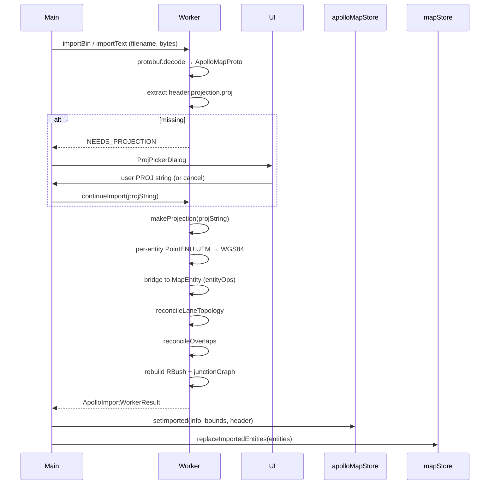

# Importing — Deep Dive

This is the technical companion to [Import overview](./import.md). It explains what happens **after** the user picks a file: decode, projection, bridging, topology re-derivation, header retention.

## Pipeline at a glance



## Source files

| Concern            | File                                                                               |
| ------------------ | ---------------------------------------------------------------------------------- |
| Top-level entry    | `pickAndImportApollo` in `src/io/mapIO.ts:54`                                      |
| File picker        | `pickFile` in `src/io/fileIO.ts:8`                                                 |
| Worker bridge      | `src/io/apolloIOBridge.ts`                                                         |
| Worker pipeline    | `src/io/apolloIO.worker.ts`                                                        |
| Worker protocol    | `src/io/apolloIOProtocol.ts`                                                       |
| Proto runtime      | `src/io/proto/loader.ts`                                                           |
| Projection         | `src/io/proto/projection.ts`                                                       |
| Map metadata store | `src/store/apolloMapStore.ts`                                                      |
| Progress overlay   | `src/components/layout/TaskProgressOverlay.tsx` + `src/store/taskProgressStore.ts` |

## Steps

### 1. File picker

`pickFile()` builds a hidden `<input type="file">`, clicks it, and resolves on `change` or `cancel`. Accepts `.bin`, `.txt`, `.pb.txt`, `application/octet-stream`, `text/plain`.

::: warning macOS focus race
On macOS the window can re-gain focus before `change` fires; the picker uses **only** native `change`/`cancel` events (`fileIO.ts:32-34`).
:::

### 2. Routing by extension

```ts
const isText = /\.(pb\.txt|txt)$/i.test(file.name);
const result = isText ? await importApolloTextFile(file) : await importApolloBinFile(file);
```

A `.bin` mis-named `.txt` is parsed as text and fails loudly — by design.

### 3. Decode

`loadApolloProtoRoot()` (`src/io/proto/loader.ts:26-50`) loads every `.proto` under `src/proto/` via `import.meta.glob('/src/proto/**/*.proto', { query: '?raw', eager: true })`. Imports inside `.proto` files reference root-relative paths (`map_msgs/map_lane.proto`), so `root.resolvePath` is overridden to treat each target as root-relative. The `fetch` callback is intentionally deferred via `Promise.resolve().then(...)` to avoid a `queued`-counter dip that would otherwise race `resolveAll()`.

The top-level message is `apollo.hdmap.Map`. Binary uses `Type.decode(bytes)`; text uses `Type.fromObject(parseTextFormat(text))`.

### 4. Projection resolution

`makeProjection(projString)` in `src/io/proto/projection.ts:30-45`:

1. `sanitizeProjString` strips Apollo's literal `{}` braces around numeric args (`+lat_0={37.413082}` → `+lat_0=37.413082`).
2. Builds two proj4 transformers: source→WGS84 and WGS84→source.
3. Editor stores lon/lat (degrees) internally. Export uses `fromLonLat` to revert to the source CRS (UTM metres).

If `header.projection.proj` is absent, the worker emits `NEEDS_PROJECTION` and the UI opens `ProjPickerDialog` (`src/components/dialogs/ProjPickerDialog.tsx:1-231`):

| Mode          | Input                         | When                             |
| ------------- | ----------------------------- | -------------------------------- |
| Region preset | Sunnyvale / Beijing / SH / SZ | Apollo demo + Chinese fleets     |
| UTM zone      | zone 1–60 + N/S               | Region known, exact PROJ unknown |
| Custom PROJ   | full PROJ.4 string            | Non-UTM, TMERC, custom ellipsoid |

### 5. Bridging

The worker walks the `ApolloMapProto` tree (`crosswalks`, `junctions`, `lanes`, `signals`, `stopSigns`, `yieldSigns`, `overlaps`, `clearAreas`, `speedBumps`, `roads`, `parkingSpaces`, `pncJunctions`, `rsus`, `areas`, `barrierGates`) and projects every `PointENU.x/y` from UTM metres to lon/lat. The resulting `MapEntity` objects mirror the proto union but carry editor-only `_source`, `_sourceRect`, `_userOverrides` fields where applicable (`src/types/apollo.ts:20-31`, `:153-164`).

### 6. Topology + overlap re-derivation

- `reconcileLaneTopology(entities)` derives `predecessorIds`, `successorIds`, `selfReverseLaneIds`, the four `*NeighborForward/Reverse` lists, and `junctionId` from geometry alone. See [Topology](./topology.md).
- `reconcileOverlaps(entities)` walks the spatial index, finds pairwise intersections, and emits `overlap_<sortedParticipantIds>` entities. Existing inspector overrides (`overlap._userOverrides`) are honoured.

### 7. Header retention

`apolloMapStore.setImported(info, bounds, header)` preserves the proto `MapHeader`:

```ts
interface MapHeader {
  version?: string;
  date?: string;
  projection?: MapProjection;
  district?: string;
  generation?: string;
  revMajor?: string;
  revMinor?: string;
  left?: number;
  top?: number;
  right?: number;
  bottom?: number;
  vendor?: string;
}
```

On export:

- `projection.proj` round-trips from the chosen PROJ string.
- `left/top/right/bottom` are recomputed from current entity bounds.
- All other fields pass through unchanged.

## Options table

| Option                 | Default                      | Notes                              |
| ---------------------- | ---------------------------- | ---------------------------------- |
| Accepted extensions    | `.bin`, `.txt`, `.pb.txt`    | `pickFile.accept`                  |
| PROJ sanitisation      | always                       | strips Apollo template braces      |
| Progress popover floor | 1000 ms                      | `taskProgressStore.MIN_VISIBLE_MS` |
| Worker chunk size      | ~5000 entities               | reduces structured-clone pause     |
| Replace semantics      | full replace + history clear | `mapStore.replaceImportedEntities` |
| Header.bounds rewrite  | true                         | recomputed on export               |

## Shortcut cheatsheet

| Action             | Where             | Notes                 |
| ------------------ | ----------------- | --------------------- |
| Trigger import     | `⌘K → Import`     | command palette       |
| Drag-drop          | not supported yet | roadmap               |
| Confirm projection | `Enter`           | "Use this projection" |
| Cancel projection  | `Esc`             | aborts pipeline       |
| Cancel progress    | popover ✕         | `worker.terminate()`  |

## Troubleshooting

| Symptom                             | Likely cause                       | Fix                                        |
| ----------------------------------- | ---------------------------------- | ------------------------------------------ |
| Decode hangs                        | Wrong proto type                   | Verify file is HD-map, not routing/sim     |
| Projection picker stuck             | User cancelled                     | Re-run import                              |
| Map shifted hundreds of metres      | Wrong UTM zone                     | Use `utmZoneFromLon` + a known lon         |
| Re-import asks for projection again | Exporter dropped `projection.proj` | Inspect `apolloMapStore.header` round-trip |
| Lane central curve missing          | Source had empty `repeated points` | proto2 default; fix source                 |
| Second import noticeably slower     | Cold layer thrash                  | Avoid back-to-back replaces                |

## Source links

- `src/io/mapIO.ts:54+`
- `src/io/fileIO.ts:8+`
- `src/io/apolloIOBridge.ts`
- `src/io/apolloIO.worker.ts`
- `src/io/proto/loader.ts:18-50`
- `src/io/proto/projection.ts:1-81`
- `src/components/dialogs/ProjPickerDialog.tsx:1-231`
- `src/store/apolloMapStore.ts`
- `src/store/taskProgressStore.ts`

## See also

- [Import overview](./import.md)
- [Coordinate system](./coordinate-system.md)
- [Topology](./topology.md)
- [Topology and junctions](./topology-and-junctions.md)
