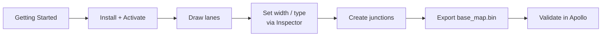

# User Guide

> The guide is written for the **end users** of Apollo Map Studio (AMS): HD-map labelling engineers, self-driving simulation engineers, and road-test fleet operators.
> Unlike [Architecture](/en/architecture/) or [Design](/en/design/), this guide does **not** explain code — it explains **what every button, every shortcut, and every workflow does** on screen.

::: tip Reading order
First-time users: read **Onboarding → Drawing → Inspection → Topology → IO → Settings/Shortcuts → Troubleshooting** in order. Veterans coming from QGIS or Photoshop can skip onboarding and jump straight to [MenuBar & ToolStrip](./menubar-and-toolstrip.md) and [Inspector](./inspector.md).
:::

## Site Map

The table below is organized by user task, not by source directory.

| Section             | Page                                                  | Use it when you need to...                                                            |
| ------------------- | ----------------------------------------------------- | ------------------------------------------------------------------------------------- |
| **Onboarding**      | [Getting Started](./getting-started.md)               | Boot the app, understand the workspace, and complete one import/export loop           |
|                     | [Installation](./installation.md)                     | Prepare Node, pnpm, Vite, Electron, and desktop packaging prerequisites               |
|                     | [License Activation](./license-activation.md)         | Understand offline desktop activation, machine codes, expiry, and read-only mode      |
| **Workspace**       | [MenuBar & ToolStrip](./menubar-and-toolstrip.md)     | Find import, export, drawing, and view-switching entry points                         |
|                     | [Activity Bar & Panels](./activity-bar-and-panels.md) | Use Layer Tree, Search, Inspector, Timeline, and docked side panels                   |
|                     | [Command Palette](./command-palette.md)               | Run actions quickly through `⌘K` / `Ctrl+K` search                                    |
|                     | [Settings](./settings.md)                             | Tune map center, zoom, lane half-width, history depth, and render options             |
| **Drawing**         | [Drawing Tools](./drawing-tools.md)                   | Choose between polyline, Bezier, arc, rectangle, and polygon tools                    |
|                     | [Drawing Lanes](./drawing-lanes.md)                   | Create Lane entities and understand boundaries, half-width, neighbors, and junctions  |
|                     | [Editing & Snapping](./editing-and-snapping.md)       | Move points, snap endpoints, undo/redo edits, and keep topology coherent              |
|                     | [Coordinate System](./coordinate-system.md)           | Work with WGS84, UTM, Apollo ENU, and PROJ.4 settings                                 |
| **Inspection**      | [Inspector](./inspector.md)                           | Edit entity fields, boundary types, speed limits, topology refs, and overlap pins     |
|                     | [Layer Tree](./layer-tree.md)                         | Browse, select, locate, and organize map elements by type                             |
|                     | [Map Elements](./map-elements.md)                     | Learn what Lane, Junction, Signal, Crosswalk, and other entities represent            |
| **Topology**        | [Topology](./topology.md)                             | Understand predecessor, successor, neighbor, and self-reverse derivation              |
|                     | [Topology & Junctions](./topology-and-junctions.md)   | Work with junction polygons, lane endpoints, Junction, and PNC Junction               |
| **IO**              | [Import](./import.md)                                 | Open `.bin`, `.txt`, and `.pb.txt` maps for the first time                            |
|                     | [Importing (deep dive)](./importing.md)               | Diagnose projection prompts, header retention, type restoration, and import failures  |
|                     | [Export](./export.md)                                 | Save base_map output as binary or text and understand filename behavior               |
|                     | [Exporting (deep dive)](./exporting.md)               | Understand topology, overlap, header, and protobuf handling before export             |
| **Keys**            | [Shortcuts](./shortcuts.md)                           | Look up shortcuts, platform mapping, and conflict behavior                            |
|                     | [Keyboard Shortcuts](./keyboard-shortcuts.md)         | Transfer muscle memory from Photoshop, QGIS, VS Code, and similar tools               |
| **Troubleshooting** | [Troubleshooting](./troubleshooting.md)               | Diagnose Worker, projection, undo, license, import/export, and desktop package issues |

## Learning Paths

### Path A — Build a brand-new HD map from scratch (≈ 2 hours)



| Step               | Doc                                                 | ETA    |
| ------------------ | --------------------------------------------------- | ------ |
| 1. Start           | [Getting Started](./getting-started.md)             | 5 min  |
| 2. Activate        | [License Activation](./license-activation.md)       | 5 min  |
| 3. Learn elements  | [Map Elements](./map-elements.md)                   | 15 min |
| 4. Draw            | [Drawing Lanes](./drawing-lanes.md)                 | 30 min |
| 5. Edit properties | [Inspector](./inspector.md)                         | 20 min |
| 6. Topology        | [Topology](./topology.md)                           | 20 min |
| 7. Export          | [Export](./export.md) → [Exporting](./exporting.md) | 15 min |

### Path B — Patch an existing map (≈ 30 minutes)

1. [Import](./import.md) → [Importing](./importing.md) — drag the existing `base_map.bin`.
2. Use [Layer Tree](./layer-tree.md) + [Search Panel](./activity-bar-and-panels.md#search) to locate the entity.
3. Use [Editing & Snapping](./editing-and-snapping.md) to move control points.
4. Use [Inspector](./inspector.md) to fix fields.
5. [Export](./export.md), preserving the original header and forcing overlap recompute.

### Path C — Read-only browsing for QA / road-test verifiers (≈ 10 minutes)

You only need to skim [MenuBar & ToolStrip](./menubar-and-toolstrip.md), [Activity Bar & Panels](./activity-bar-and-panels.md), and [Command Palette](./command-palette.md). Trial mode is sufficient — no activation key required.

## Persistence Map

The table below lists every `localStorage` key written by AMS — handy when migrating machines or when the storage gets corrupted. All keys live under the `apollo-map-studio:` prefix and are written by `src/store/settingsStore.ts` and `WorkspaceLayout/dockviewLayout.ts`.

| Key                                               | Writer                              | Type   | Meaning                        |
| ------------------------------------------------- | ----------------------------------- | ------ | ------------------------------ |
| `apollo-map-studio:historyLimit`                  | `settingsStore.setHistoryLimit`     | number | zundo undo stack depth         |
| `apollo-map-studio:mapCenterLng` / `mapCenterLat` | `settingsStore.setMapCenter`        | number | initial MapLibre center        |
| `apollo-map-studio:mapZoom`                       | `settingsStore.setMapZoom`          | number | initial zoom level             |
| `apollo-map-studio:laneHalfWidth`                 | `settingsStore.setLaneHalfWidth`    | number | default lane half-width (m)    |
| `apollo-map-studio:laneArrowSpacing`              | `settingsStore.setLaneArrowSpacing` | number | arrow symbol spacing (px)      |
| `apollo-map-studio:layout:drawing`                | `WorkspaceLayout/dockviewLayout.ts` | JSON   | drawing-mode dockview snapshot |
| `apollo-map-studio:layout:scene`                  | same                                | JSON   | scene-mode dockview snapshot   |

::: warning Desktop license storage
The desktop (Electron) build also writes `license.json` and `machine.bind` under the OS user-data folder. Activation state is **not** stored in `localStorage`. See [License Activation](./license-activation.md).
:::

## Design Principles

Excerpted from the project [DESIGN.md](https://github.com/apollo-map-studio/apollo-map-studio/blob/main/DESIGN.md). Internalising these four lines up front saves a lot of confusion later:

1. **Parametric-first** — control points, widths, and turn types are the truth; the GeoJSON is a render-side artifact.
2. **Cold/hot split** — committed entities are compiled in a worker; in-flight drag previews bypass React via direct `setData()`.
3. **Single-controller FSM** — every mouse / keyboard event first crosses `editorMachine` and is then dispatched. No event collisions.
4. **Anti-corruption adapter (R2)** — UI never imports `apollo.proto` directly, only `src/lib/entityOps.ts`.

## See also

- [Architecture](/en/architecture/) — five-layer architecture, FSM, worker, state management
- [Design](/en/design/) — visual spec, `ams-*` design tokens, fonts
- [Reference](/en/reference/) — type / function / event protocol API
- [Changelog](https://github.com/apollo-map-studio/apollo-map-studio/blob/main/CHANGELOG.md) — release history

## Using the Guide

These pages are organized around user tasks. If you are new, follow the learning paths above. If you are fixing a specific issue, jump through search or the site map.

| Situation                                   | Recommended page                                                                                 |
| ------------------------------------------- | ------------------------------------------------------------------------------------------------ |
| You are unsure what a button does           | Start with [MenuBar & ToolStrip](./menubar-and-toolstrip.md), then open the panel-specific guide |
| The imported map appears in the wrong place | Read [Coordinate System](./coordinate-system.md) and [Troubleshooting](./troubleshooting.md)     |
| Topology changes are unexpected             | Read [Topology](./topology.md) and [Topology & Junctions](./topology-and-junctions.md)           |
| You are preparing an Apollo handoff         | Start with [Export](./export.md), then continue to [Exporting](./exporting.md)                   |

## Feedback channels

| Type                         | Channel                             |
| ---------------------------- | ----------------------------------- |
| Doc error (content wrong)    | GitHub Issue tagged `docs:bug`      |
| Doc suggestion (new section) | GitHub Discussion                   |
| Code bug                     | GitHub Issue tagged `bug`           |
| Security issue               | DM the maintainer                   |
| Business inquiries           | `regulatory.whitefish.gdns@mask.me` |

## VitePress site layout

```
docs/
├── .vitepress/
│   └── config.ts            ← sidebar / nav / locales config
├── architecture/            ← architecture layer (5 layers / FSM / worker)
├── design/                  ← visual spec
├── guide/                   ← default-locale user guide
├── en/
│   ├── architecture/
│   ├── design/
│   ├── guide/               ← English user guide (this dir)
│   └── reference/
└── reference/               ← default-locale reference
```

`vitepress build` outputs to `docs/.vitepress/dist`; CI deploys to GitHub Pages via `.github/workflows/docs.yml`.

## Doc-side link aliases

VitePress markdown supports:

| Form                  | Resolves to                  |
| --------------------- | ---------------------------- |
| `/architecture/`      | `docs/architecture/index.md` |
| `./inspector.md`      | inspector.md in current dir  |
| `../inspector.md`     | parent dir                   |
| `text -> locale/path` | current-locale only          |

## Contributing Docs

When adding or editing guide pages, write from the reader's task first: describe the scenario, give the workflow, then explain fields and troubleshooting clues. Source references are useful as verification points, but they should not turn the page into a code index.

1. Add or update the sidebar entry in `docs/.vitepress/config.ts`.
2. Preview with `pnpm docs:dev`.
3. Build with `pnpm docs:build`.

## Glossary

| Term            | Meaning                                                  |
| --------------- | -------------------------------------------------------- |
| FSM             | Finite state machine — here specifically `editorMachine` |
| zundo           | Zustand undo middleware                                  |
| Action Registry | Single ActionDef source feeding menu/strip/palette/keys  |
| Cold layer      | GeoJSON layer for committed entities (worker-compiled)   |
| Hot layer       | In-flight drawing geometry (main-thread `setData`)       |
| ENU             | East-North-Up — Apollo's internal 2D frame               |
| WGS84           | Lng/lat (Earth surface)                                  |
| PROJ.4          | Projection string spec                                   |
| Overlap         | Constraint entity binding multiple intersecting entities |

## Quickstart

If you read only one page, do these three steps:

1. `pnpm dev` to launch the app.
2. `File → Import Apollo Map...` and pick a `.bin`.
3. Click a lane → edit speed limit in the Inspector → `⌘S` to export.

Anything bumpy: jump to [Troubleshooting](./troubleshooting.md) section 1.

## Compatibility matrix

| Component           | Minimum version             |
| ------------------- | --------------------------- |
| Chrome              | 130                         |
| Edge                | 130                         |
| Firefox             | 130                         |
| Safari              | 18                          |
| Electron            | 41                          |
| Apollo HD-map proto | 1.x (Apollo 9.0 compatible) |
| Recommended Node    | 22 LTS                      |
| Recommended pnpm    | 9.x                         |

## Naming conventions

- Files: lowercase + dashes — `menubar-and-toolstrip.md`
- Titles: concise, task-oriented English
- Section headings prefer English (search-friendly)
- Table columns prefer English (`Symptom / Cause / Fix`)
