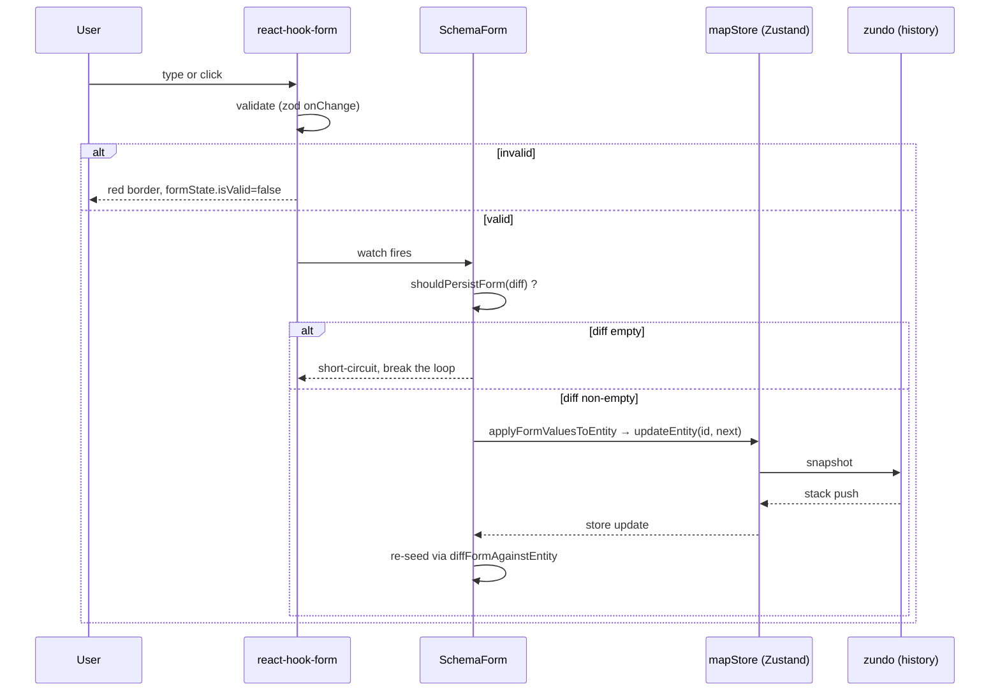

# Inspector Panel

> The Inspector is the **property editor** docked on the right side of the AMS workspace. It is the “last mile” of HD-map labelling — every field that is invisible on the map but critical for simulation (`type`, `turn`, `direction`, `speedLimit`, `boundaryType`, `predecessorIds`, …) is written here.

This page covers the shared Inspector framework for 14 entity types, the `SchemaForm` auto-generation engine, four bespoke forms (Lane / Overlap / PNCJunction / Drawing), the `_userOverrides` lock semantics, and the commit loop into `mapStore`.

## Overview

::: tip TL;DR
**Select an entity → form appears on the right → change a field → applied immediately.**
There is no Save button: the form auto-commits on `change`. `Ctrl+Z` undoes.
:::

| Aspect       | Behavior                                                                                                      |
| ------------ | ------------------------------------------------------------------------------------------------------------- |
| Trigger      | Click an entity on the map or in the Layer Tree                                                               |
| Data flow    | `mapStore.entities` → `formValuesFromEntity` → `react-hook-form` → `applyFormValuesToEntity` → `updateEntity` |
| Validation   | `zod` schema (`@/lib/schemas`) + `mode: 'onChange'`                                                           |
| Undo stack   | Everything goes through `mapStore.entities` which is `zundo.partialize`d, so each commit pushes a snapshot    |
| Field “lock” | Edited fields are pinned in `_userOverrides`; geometry-driven derive rules skip them                          |

## UI Tour

```
┌──────────────────────────────────────────┐
│  Inspector                               │  ← title bar (lazyPanels.tsx:87)
├──────────────────────────────────────────┤
│  Lane              ...AbCd123XyZ         │  ← entityType + short ID
├──────────────────────────────────────────┤
│  ▾ Attributes                            │  ← Section
│    Type            [CITY_DRIVING ▼]      │
│    Turn            [LEFT_TURN ▼]         │
│    Direction       [FORWARD ▼]           │
│    Speed Limit     [16.6   ] m/s         │
│    Speed Limit     [60     ] km/h        │
│    ID              lane_AbCd123XyZ       │  ← read-only Value
│  ▾ Boundaries                            │
│    Left Width      [1.75 ] m             │
│    Right Width     [1.75 ] m             │
│    L Boundary      [SOLID_WHITE ▼]       │
│    R Boundary      [DOTTED_WHITE ▼]      │
│    Length          12.43 m               │  ← read-only
│    L Virtual       No                    │
│    R Virtual       No                    │
│  ▾ Topology                              │
│    Junction        junc_…                │  ← LaneRef, click to jump
│    Predecessors    [lane_…] [lane_…]     │  ← LaneRefList
│    Successors      —                     │
│    L Neighbors fwd —                     │
│    Overlaps        [overlap_…]           │
└──────────────────────────────────────────┘
```

## Mounting

Inspector is rendered by `InspectorPanelContent` in `WorkspaceLayout/lazyPanels.tsx:79-112`:

```ts
const selectedId = useSelector(actorRef, (s) => s.context.selectedEntityId);
const entity = useMapStore((s) => (selectedId ? s.entities.get(selectedId) : undefined));
```

- **No selection**: shows “Select an entity to view properties”.
- **Selected**: routes to `EntityForm` (`InspectorForms.tsx:46-79`) by `entity.entityType`. Routing table:

### Entity → Form routing table

| `entityType`                                                  | Component          | File                              | Family                 |
| ------------------------------------------------------------- | ------------------ | --------------------------------- | ---------------------- |
| `lane`                                                        | `LaneForm`         | `InspectorForms/lane.tsx`         | Schema-driven          |
| `junction`                                                    | `JunctionForm`     | `InspectorForms/junction.tsx`     | Simple                 |
| `parkingSpace`                                                | `ParkingSpaceForm` | `InspectorForms/parkingSpace.tsx` | Simple                 |
| `signal`                                                      | `SignalForm`       | `InspectorForms/signal.tsx`       | Simple                 |
| `stopSign`                                                    | `StopSignForm`     | `InspectorForms/stopSign.tsx`     | Simple                 |
| `road`                                                        | `RoadForm`         | `InspectorForms/road.tsx`         | Simple                 |
| `pncJunction`                                                 | `PNCJunctionForm`  | `InspectorForms/pncJunction.tsx`  | Custom (nested arrays) |
| `overlap`                                                     | `OverlapForm`      | `InspectorForms/overlap.tsx`      | Custom (pin/unpin)     |
| `area` / `barrierGate`                                        | matching `*Form`   | `InspectorForms/<entity>.tsx`     | Simple                 |
| `crosswalk` / `speedBump` / `yieldSign` / `clearArea` / `rsu` | matching `*Form`   | `InspectorForms/readOnly.tsx`     | Read-only              |
| Other (in-flight draw entity)                                 | `DrawingForm`      | `InspectorForms/DrawingForm.tsx`  | Drawing fallback       |

## Schema-driven forms (Lane example)

::: tip Why a schema?
The original code shipped one JSX form per entity type — 14 nearly-identical files. The R5 refactor replaced **all simple-field forms with data definitions**: declare an `EntitySchema`, `SchemaForm.tsx` renders it. Lane is the pilot — see `src/types/inspectorSchema.ts:263`.
:::

### Schema shape

`EntitySchema<TEntity, TFormValues>` has four parts (`inspectorSchema.ts:154-171`):

```ts
interface EntitySchema<TEntity, TFormValues> {
  id: string;
  fields: ReadonlyArray<AnyFieldDef>; // editable
  readonly: ReadonlyArray<ReadOnlyDef>; // read-only
  validation: ZodType<TFormValues>; // zod
  sectionOrder: ReadonlyArray<string>; // section order
}
```

### Lane fields — full table

All fields below come from `LaneInspectorSchema` (`inspectorSchema.ts:263-435`).

| Field                         | Type     | Section    | Range              | Adapter (read / write)                    | Notes                                                |
| ----------------------------- | -------- | ---------- | ------------------ | ----------------------------------------- | ---------------------------------------------------- |
| `type`                        | enum     | Attributes | `LaneType`         | `e.type` ↔ `{ ...e, type: v }`            | Lane class                                           |
| `turn`                        | enum     | Attributes | `LaneTurn`         | same                                      | Turn type                                            |
| `direction`                   | enum     | Attributes | `LaneDirection`    | same                                      | Direction                                            |
| `speedLimit`                  | number   | Attributes | 0..50, step 0.5    | `e.speedLimit ?? 0`                       | m/s                                                  |
| `speedLimitKmh`               | number   | Attributes | 0..180, step 1     | `speedLimit * 3.6` ↔ `km/h / 3.6`         | km/h visual input; stored value remains m/s          |
| `leftWidth`                   | number   | Boundaries | 0.5..10, step 0.1  | `readLeftWidth` / `writeLeftWidth`        | Half-width — write applies uniformly to every sample |
| `rightWidth`                  | number   | Boundaries | 0.5..10, step 0.1  | same family                               |                                                      |
| `leftBoundaryType`            | enum     | Boundaries | `BoundaryLineType` | `e.leftBoundary.boundaryType[0].types[0]` | Write collapses to a single boundaryType segment     |
| `rightBoundaryType`           | enum     | Boundaries | same               | same                                      |                                                      |
| `ID` (RO)                     | readonly | Attributes | —                  | `e.id`                                    | Real ID                                              |
| `Length` (RO)                 | readonly | Boundaries | —                  | `e.length.toFixed(2)` m                   | Auto-derived                                         |
| `L/R Virtual` (RO)            | readonly | Boundaries | —                  | `e.leftBoundary.virtual`                  | Virtual boundary flag                                |
| `Junction` (RO)               | readonly | Topology   | —                  | renders `<LaneRef>`                       | Click to jump                                        |
| `Predecessors` / `Successors` | readonly | Topology   | —                  | renders `<LaneRefList>`                   | Topology pred/succ                                   |
| `L/R Neighbors (fwd/rev)`     | readonly | Topology   | —                  | `LaneRefList`                             | Adjacent lanes                                       |
| `Self-Reverse`                | readonly | Topology   | —                  | `LaneRefList`                             | Self-reverse lanes                                   |
| `Overlaps`                    | readonly | Topology   | —                  | `LaneRefList`                             | Linked overlaps                                      |

### Commit Flow



::: warning Regression-guarded R1 closure
The legacy implementation wrote back into the store **without** a diff guard, producing a `store→reset→watch→updateEntity` death loop that exploded the zundo stack. `shouldPersistForm` (`inspectorSchema.ts:484-493`) is the breaker; any change to `SchemaForm.tsx` must keep `mode: 'onChange'` plus the `shouldPersistForm` call. The regression tests live in `src/components/layout/panels/__tests__/SchemaForm.test.ts` and `src/hooks/__tests__/undoCancel.test.ts`.
:::

### `_userOverrides` field lock

When a user changes a field through Inspector, `applyFormValuesToEntity` (`inspectorSchema.ts:507-540`) writes the field's `overridesPaths` (default: the field name) into `entity._userOverrides`. Subsequent geometry-driven derive (e.g. `core/elements/derive`) **skips** any rule whose `owns` intersects the override set — this is how a manual value survives auto-recomputation.

| Action                                                   | `_userOverrides`                              |
| -------------------------------------------------------- | --------------------------------------------- |
| Edit `leftWidth` 1.75 → 1.95                             | adds `'leftWidth'`                            |
| Drag a control point (auto derive recomputes length)     | unaffected — derive skips                     |
| User “resets” by editing 1.95 back to 1.75 (read-stable) | no change — `prevValue===newValue` so no mark |

## Overlap form (`overlap.tsx`)

`OverlapForm` does **not** use the schema flow because its core fields (`is_merge`, `regionOverlaps`) are **geometry-derived**, not simple fields. It exposes two pin operations:

| Pin                    | Effect                                                | Path                                  |
| ---------------------- | ----------------------------------------------------- | ------------------------------------- |
| Lane × Lane `is_merge` | Freeze the merge semantics of one lane in the overlap | `objects.<i>.laneOverlapInfo.isMerge` |
| Region polygon         | Freeze the region polygons + ID references            | `regionOverlaps`                      |

After pinning, `core/elements/overlap/reconcile.ts` will not recompute these on subsequent geometry changes. Click the “pinned ×” chip to release.

## PNCJunction form (`pncJunction.tsx`)

PNCJunction encodes Apollo planning's **passage groups** — a three-level array tree of `Group → Passage → (Lane / Signal / StopSign / YieldSign)`. `PNCJunctionForm` provides:

- “+ Passage Group” to create a new group (`makeBlankPassage` + `nextSubId`).
- `type` selector (`UNKNOWN_PASSAGE` / `ENTRANCE` / `EXIT`) per Passage.
- `IdMultiSelect` for related-entity references.

::: tip Reference validity
`IdMultiSelect` enumerates valid IDs at runtime via `collectIdsByType(entities, 'lane' | 'signal' | 'stopSign' | 'yieldSign')`. Any ID that does **not** exist in the store cannot be selected, so dangling refs are impossible to introduce here.
:::

## DrawingForm (in-flight fallback)

While drawing, the in-flight entity is not yet committed to `mapStore`. `DrawingForm.tsx` shows a **read-only** summary: control-point count, length, current FSM state.

## Lane reference controls

`<LaneRef id={id} />` and `<LaneRefList ids={ids} />` come from `src/components/layout/panels/LaneRefList.tsx`:

- Render short ID (first 8 / last 6 chars).
- Hover shows the full ID.
- Click triggers `selectEntity(id)` and recenters the viewport.

| Field                         | Control       | Behavior         |
| ----------------------------- | ------------- | ---------------- |
| `junctionId` (string \| null) | `LaneRef`     | Single jump      |
| `predecessorIds` and friends  | `LaneRefList` | Multi-chip jumps |
| `overlapIds`                  | `LaneRefList` | Same             |

## Validation

All validation goes through zod (`@/lib/schemas`). `SchemaForm.tsx:69` selects `mode: 'onChange'`: every keystroke re-validates and updates `formState.isValid`. On failure:

- Input gets a red border (Tailwind `border-rose-500`).
- `shouldPersistForm` may still return true, but `applyFormValuesToEntity` will not be invoked because react-hook-form drops invalid values from the watch payload.

| Field                      | Zod rule                      | Failure message        |
| -------------------------- | ----------------------------- | ---------------------- |
| `speedLimit`               | `z.number().min(0).max(50)`   | "Speed must be 0–50"   |
| `leftWidth` / `rightWidth` | `z.number().min(0.5).max(10)` | "Width must be 0.5–10" |
| `type`                     | `z.enum(LANE_TYPES)`          | "Invalid type"         |

## Persistence

The Inspector itself **does not write `localStorage`**. All edits flow through `mapStore.updateEntity` into the in-memory `Map<id, MapEntity>` managed by zundo; offline persistence is the [Export](./exporting.md) pipeline's job.

## Steps

1. Click an entity on the map or in the Layer Tree. `editorMachine.context.selectedEntityId` updates.
2. The Inspector swaps to the matching form.
3. Edit any field:
   - **Number** — drag the spinner or type.
   - **Enum** — keyboard `↓ ↑` to browse, `Enter` to commit.
4. Leaving the field (`blur`) or the next keystroke fires `watch`.
5. Data syncs to `mapStore` and pushes a zundo snapshot. `Ctrl+Z` rewinds.
6. For PNCJunction / Overlap, use the panel-specific buttons (`+ Passage Group`, `pin`, …).

## Troubleshooting

| Symptom                                              | Likely cause                                        | Fix                                                                                                                        |
| ---------------------------------------------------- | --------------------------------------------------- | -------------------------------------------------------------------------------------------------------------------------- |
| Field reverts after editing                          | Some derive rule overwrote it                       | Inspect `_userOverrides` in devtools; if missing, add `overridesPaths` to the field def in `inspectorSchema.ts`            |
| Red border, no commit                                | zod validation failed                               | Check ranges (speed > 50, width > 10, …)                                                                                   |
| Topology LaneRef shows “unknown id”                  | Referenced entity was deleted or lost on import     | Use [Search Panel](./activity-bar-and-panels.md#search) to find the ID; remove dangling refs per [Topology](./topology.md) |
| “pinned ×” cannot release                            | Corrupted `_userOverrides` array                    | Re-select and click again; if still stuck, restart the session                                                             |
| Form briefly flashes old data after switching entity | Race between `methods.reset` and `watch` on id swap | Already fixed by `useEffect([entity.id])` (`SchemaForm.tsx:76-79`); please file an issue if it recurs                      |

## Source

- `src/components/layout/panels/SchemaForm.tsx:53-136` — generic schema-driven form
- `src/components/layout/panels/InspectorForms.tsx:46-79` — `EntityForm` router
- `src/components/layout/panels/InspectorForms/lane.tsx:32` — Lane (thin wrapper)
- `src/components/layout/panels/InspectorForms/overlap.tsx:65-157` — Overlap pin controls
- `src/components/layout/panels/InspectorForms/pncJunction.tsx:151-262` — passage groups
- `src/components/layout/panels/InspectorForms/<entity>.tsx` — simple hand-written entity forms
- `src/components/layout/panels/InspectorForms/readOnly.tsx` — read-only summary forms
- `src/components/layout/panels/InspectorForms/formSync.ts` — hand-written form sync hook
- `src/types/inspectorSchema.ts:263-435` — `LaneInspectorSchema`
- `src/types/inspectorSchema.ts:444-540` — `formValuesFromEntity` / `diffFormAgainstEntity` / `shouldPersistForm` / `applyFormValuesToEntity`
- `src/lib/schemas.ts` — zod schemas
- `src/components/layout/panels/LaneRefList.tsx` — `LaneRef` / `LaneRefList`

## Section glossary

| Section               | Appears in                  | Meaning                                                   |
| --------------------- | --------------------------- | --------------------------------------------------------- |
| Attributes            | all                         | Scalar fields (type / turn / direction / speedLimit / id) |
| Boundaries            | lane                        | Half-width + boundary type + length                       |
| Topology              | lane                        | Topology refs (pred/succ/neighbors/junction/overlap)      |
| Geometry              | junction / parkingSpace etc | Control points / polygon vertices                         |
| Passage Groups        | pncJunction                 | Nested passage tree                                       |
| Overlap               | overlap                     | Self id + counts                                          |
| Participants          | overlap                     | objects[] listing                                         |
| Lane × Lane Semantics | overlap                     | is_merge toggle                                           |
| Region Overlaps       | overlap                     | Region polygon pin                                        |

## Schema vs Custom

| Form type                             | Fits                | Pros                  | Cons                                     |
| ------------------------------------- | ------------------- | --------------------- | ---------------------------------------- |
| SchemaForm (Lane / others to migrate) | Scalar-heavy        | Data-driven, zero JSX | Hard with nested arrays / custom widgets |
| Custom (Overlap / PNCJunction)        | Non-trivial widgets | Flexible              | Boilerplate-heavy                        |
| Simple (Junction / Signal etc)        | Very few fields     | Quick to author       | Migrate to SchemaForm once it grows      |
| Drawing fallback                      | While drawing       | Display only          | Not writable                             |

## react-hook-form contract

| Setting         | Value                                  | Required?                                 |
| --------------- | -------------------------------------- | ----------------------------------------- |
| `mode`          | `'onChange'`                           | ✅ Mandatory; R1 regression depends on it |
| `defaultValues` | `formValuesFromEntity(schema, entity)` | ✅                                        |
| `resolver`      | `zodResolverZ4(schema.validation)`     | ✅                                        |
| `keepDirty` etc | default                                | Adjustable                                |

## See also

- [Map Elements](./map-elements.md) — semantics of fields per entity type
- [Layer Tree](./layer-tree.md) — selecting from the tree
- [Topology](./topology.md) — meaning of `predecessorIds` / `successorIds`
- [Editing & Snapping](./editing-and-snapping.md) — derive vs override interaction during drag
- [Settings](./settings.md) — `historyLimit` and undo depth
- [Drawing Lanes](./drawing-lanes.md) — where draw-time defaults come from
