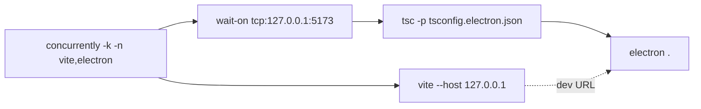

# Installation

This page is the developer-oriented setup guide. End users that only want a binary should jump to [Release downloads](#release-downloads).

## Prerequisites

| Tool    | Minimum   | Why                                                |
| ------- | --------- | -------------------------------------------------- |
| Node.js | >=22.22.1 | required by `package.json` engines                 |
| pnpm    | >=11.5.2  | `packageManager: pnpm@11.5.2`                      |
| Git     | 2.40+     | submodules / hooks                                 |
| Disk    | 4 GB free | `node_modules` ≈ 1.5 GB, Electron payload ≈ 250 MB |
| Wine    | optional  | only when cross-packaging Windows from macOS/Linux |

## Stack pins

| Package          | Range      | Purpose                         |
| ---------------- | ---------- | ------------------------------- |
| typescript       | `^6.0.3`   | strict mode + electron tsconfig |
| vite             | `^8.0.16`  | dev/build/preview               |
| electron         | `^42.3.3`  | desktop shell                   |
| electron-builder | `^26.15.2` | distributables                  |
| maplibre-gl      | `^5.24.0`  | WebGL canvas                    |
| zustand          | `^5.0.14`  | store                           |
| zundo            | `^2.3.0`   | undo middleware                 |
| xstate           | `^5.32.0`  | editing FSM                     |
| protobufjs       | `^8.6.1`   | Apollo proto codec              |
| proj4            | `^2.20.8`  | UTM ↔ WGS84                     |
| dockview-react   | `6.6.1`    | Photoshop-style panels          |
| react-arborist   | `^3.10.1`  | layer tree                      |
| zod              | `^4.4.3`   | inspector schemas               |

## Steps

### 1. Clone and install

```bash
git clone <repo>
cd apollo-map-studio
pnpm install
```

::: warning Apple Silicon
Pulling `electron` from npm may stall behind a corporate proxy or GFW. Use `ELECTRON_MIRROR=https://npmmirror.com/mirrors/electron/`.
:::

### 2. Browser dev server

```bash
pnpm dev
```

Vite serves on `127.0.0.1:5173` (matched by `electron:dev`'s `wait-on`). Hot module replacement comes from `@vitejs/plugin-react`.

### 3. Desktop with HMR

```bash
pnpm electron:dev
```



- Renderer comes from Vite at `5173`;
- Main process is compiled to `dist-electron/main.cjs`;
- `cross-env ELECTRON_RENDERER_URL=http://127.0.0.1:5173` flips the main process from `file://` to dev URL.

### 4. Offline production boot

```bash
pnpm electron:start    # build:desktop && electron .
```

Useful for CI smoke or air-gapped boxes.

### 5. Packaging

```bash
pnpm package           # --dir only — fastest sanity test
pnpm package:linux     # AppImage / deb / rpm
pnpm package:mac       # dmg (x64 + arm64)
pnpm package:win       # nsis exe
```

The `.github/workflows/ci.yml` workflow builds web/docs/hardened Electron assets first, then packages desktop artifacts with `pnpm exec electron-builder ... --publish never`. Local `package:*` scripts run `build:desktop` first.

### 6. Docs site

```bash
pnpm docs:dev          # localhost:5173
pnpm docs:build
pnpm docs:preview
```

Local `docs:dev` defaults to the root base path `/`. For a subpath preview, run `VITEPRESS_BASE=/apollo-map-studio/ pnpm docs:dev`.

VitePress config: `docs/.vitepress/config.ts`.

## Options table

| Script                           | Command                                                                                                         | Use                                       |
| -------------------------------- | --------------------------------------------------------------------------------------------------------------- | ----------------------------------------- |
| `pnpm dev`                       | `vite`                                                                                                          | browser dev                               |
| `pnpm build`                     | `pnpm build:web && pnpm build:docs:desktop`                                                                     | `dist/` + `dist/docs`                     |
| `pnpm build:web`                 | `vite build`                                                                                                    | renderer `dist/`                          |
| `pnpm preview`                   | `vite preview`                                                                                                  | local prod preview                        |
| `pnpm build:electron`            | sync public key + clean + `tsc -p tsconfig.electron.json`                                                       | compile main/preload                      |
| `pnpm build:electron:hardened`   | `build:electron` + harden script                                                                                | seal protected Electron modules           |
| `pnpm verify:electron-hardening` | verifier script                                                                                                 | verify sealed modules / loader / manifest |
| `pnpm build:desktop`             | `build && build:electron:hardened && verify:electron-hardening`                                                 | full hardened rebuild                     |
| `pnpm electron:dev`              | concurrently vite + electron                                                                                    | desktop HMR                               |
| `pnpm electron:start`            | build:desktop + electron .                                                                                      | offline desktop                           |
| `pnpm package`                   | `build:desktop && cross-env NODE_OPTIONS=--no-deprecation electron-builder --dir --publish never`               | smoke pack                                |
| `pnpm package:linux`             | `build:desktop && cross-env NODE_OPTIONS=--no-deprecation electron-builder --linux --x64 --publish never`       | AppImage / deb                            |
| `pnpm package:mac`               | `build:desktop && cross-env NODE_OPTIONS=--no-deprecation electron-builder --mac --x64 --arm64 --publish never` | dmg                                       |
| `pnpm package:win`               | `build:desktop && cross-env NODE_OPTIONS=--no-deprecation electron-builder --win --x64 --publish never`         | nsis exe                                  |
| `pnpm typecheck`                 | renderer + config + Electron tsconfigs                                                                          | triple tsconfig                           |
| `pnpm lint`                      | `eslint . && react-doctor`                                                                                      | flat config + UI structural checks        |
| `pnpm test`                      | `vitest run`                                                                                                    | unit/integration                          |
| `pnpm test:electron`             | `node scripts/run-electron-tests.mjs`                                                                           | Electron main-process tests               |
| `pnpm bench`                     | `vitest bench --run --maxWorkers=1`                                                                             | stable perf budget                        |
| `pnpm bench:fast`                | `vitest bench --run --maxWorkers=100%`                                                                          | quick local perf sampling                 |

## Shortcut cheatsheet

Installation is non-interactive; the only ergonomics worth knowing for first boot:

| Action          | Key                      | Notes                   |
| --------------- | ------------------------ | ----------------------- |
| Command palette | `⌘K`                     | indexes every action    |
| Settings        | `⌘,`                     | `settings` action       |
| DevTools        | `⌘⌥I` / `Ctrl+Shift+I`   | renderer process        |
| Reload renderer | `Ctrl+R` inside DevTools | main process unaffected |

## Troubleshooting

| Symptom                                          | Cause                                    | Fix                                                      |
| ------------------------------------------------ | ---------------------------------------- | -------------------------------------------------------- |
| `pnpm install` hangs on electron                 | network                                  | `ELECTRON_MIRROR` env var                                |
| `electron:dev` says `Failed to load URL`         | `wait-on` 30 s timeout                   | `wait-on -t 120000 tcp:127.0.0.1:5173`                   |
| `electron .` exits `Cannot find module main.cjs` | renderer built, main not                 | `pnpm build:electron` first                              |
| macOS Gatekeeper blocks .app                     | unsigned                                 | allow in `Privacy & Security` or buy Apple Developer ID  |
| `pnpm test` errors on `import.meta.glob`         | vitest too old                           | use a Vitest version compatible with the Vite 8 resolver |
| `:linux deb` build fails on missing `fpm`        | electron-builder needs `fpm` for deb/rpm | `gem install fpm` or restrict to `--linux AppImage`      |

## Release downloads

Tagged commits are handled by `.github/workflows/ci.yml` and publish:

- `Apollo-Map-Studio-<version>-linux.AppImage`
- `Apollo-Map-Studio-<version>.dmg`
- `Apollo-Map-Studio-<version>-Setup.exe`

Code-signing rules live in the workflow file; macOS dmg is currently shipped unsigned (notarisation backlog).

## Source links

- `package.json` — scripts / engines / pnpm `onlyBuiltDependencies`
- `tsconfig.electron.json` — main-process compile target
- `.github/workflows/ci.yml`

## See also

- [Getting Started](./getting-started.md)
- [Settings](./settings.md)
- [License activation](./license-activation.md)
