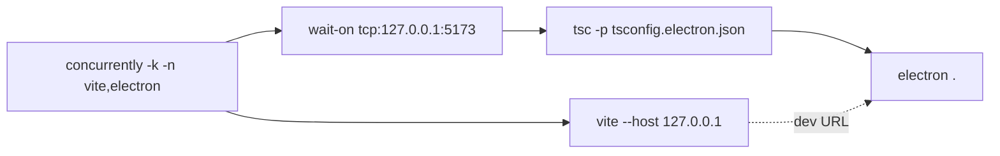

# Installation

This page is the developer-oriented setup guide. End users that only want a binary should jump to [Release downloads](#release-downloads).

## Prerequisites

| Tool    | Minimum   | Why                                                |
| ------- | --------- | -------------------------------------------------- |
| Node.js | 20.x LTS  | Vite 8 + Electron 41 floor                         |
| pnpm    | 9.x       | `package.json` uses `pnpm.onlyBuiltDependencies`   |
| Git     | 2.40+     | submodules / hooks                                 |
| Disk    | 4 GB free | `node_modules` ≈ 1.5 GB, Electron payload ≈ 250 MB |
| Wine    | optional  | only when cross-packaging Windows from macOS/Linux |

## Stack pins

| Package          | Range     | Purpose                         |
| ---------------- | --------- | ------------------------------- |
| typescript       | `^6.0.2`  | strict mode + electron tsconfig |
| vite             | `^8.0.7`  | dev/build/preview               |
| electron         | `^41.5.0` | desktop shell                   |
| electron-builder | `^26.8.1` | distributables                  |
| maplibre-gl      | `^5.22.0` | WebGL canvas                    |
| zustand          | `^5.0.12` | store                           |
| zundo            | `^2.3.0`  | undo middleware                 |
| xstate           | `^5.30.0` | editing FSM                     |
| protobufjs       | `^8.0.3`  | Apollo proto codec              |
| proj4            | `^2.20.8` | UTM ↔ WGS84                     |
| dockview-react   | `^5.2.0`  | Photoshop-style panels          |
| react-arborist   | `^3.4.3`  | layer tree                      |
| zod              | `^4.3.6`  | inspector schemas               |

## Steps

### 1. Clone and install

```bash
git clone <repo>
cd apollo-map-studio
pnpm install
```

::: warning Apple Silicon
Pulling `electron` from npm may stall behind a corporate proxy or GFW. Use `ELECTRON_MIRROR=https://npmmirror.com/mirrors/electron/`.
:::

### 2. Browser dev server

```bash
pnpm dev
```

Vite serves on `127.0.0.1:5173` (matched by `electron:dev`'s `wait-on`). Hot module replacement comes from `@vitejs/plugin-react`.

### 3. Desktop with HMR

```bash
pnpm electron:dev
```



- Renderer comes from Vite at `5173`;
- Main process is compiled to `dist-electron/main.cjs`;
- `cross-env ELECTRON_RENDERER_URL=http://127.0.0.1:5173` flips the main process from `file://` to dev URL.

### 4. Offline production boot

```bash
pnpm electron:start    # build:desktop && electron .
```

Useful for CI smoke or air-gapped boxes.

### 5. Packaging

```bash
pnpm package           # --dir only — fastest sanity test
pnpm package:linux     # AppImage / deb / rpm
pnpm package:mac       # dmg (x64 + arm64)
pnpm package:win       # nsis exe
```

The `desktop.yml` GitHub workflow runs all three on tag push.

### 6. Docs site

```bash
pnpm docs:dev
pnpm docs:build
pnpm docs:preview
```

VitePress config: `docs/.vitepress/config.ts`.

## Options table

| Script                | Command                                                  | Use                  |
| --------------------- | -------------------------------------------------------- | -------------------- |
| `pnpm dev`            | `vite`                                                   | browser dev          |
| `pnpm build`          | `vite build`                                             | static `dist/`       |
| `pnpm preview`        | `vite preview`                                           | local prod preview   |
| `pnpm build:electron` | `tsc -p tsconfig.electron.json`                          | compile main/preload |
| `pnpm build:desktop`  | `pnpm build:web && pnpm build:electron`                  | full rebuild         |
| `pnpm electron:dev`   | concurrently vite + electron                             | desktop HMR          |
| `pnpm electron:start` | build:desktop + electron .                               | offline desktop      |
| `pnpm package`        | `electron-builder --dir --publish never`                 | smoke pack           |
| `pnpm package:linux`  | `electron-builder --linux --x64 --publish never`         | AppImage / deb       |
| `pnpm package:mac`    | `electron-builder --mac --x64 --arm64 --publish never`   | dmg                  |
| `pnpm package:win`    | `electron-builder --win --x64 --publish never`           | nsis exe             |
| `pnpm typecheck`      | `tsc --noEmit && tsc -p tsconfig.electron.json --noEmit` | dual tsconfig        |
| `pnpm lint`           | `eslint .`                                               | flat config          |
| `pnpm test`           | `vitest run`                                             | unit/integration     |
| `pnpm bench`          | `vitest bench --run`                                     | perf budget          |

## Shortcut cheatsheet

Installation is non-interactive; the only ergonomics worth knowing for first boot:

| Action          | Key                      | Notes                   |
| --------------- | ------------------------ | ----------------------- |
| Command palette | `⌘K`                     | indexes every action    |
| Settings        | `⌘,`                     | `settings` action       |
| DevTools        | `⌘⌥I` / `Ctrl+Shift+I`   | renderer process        |
| Reload renderer | `Ctrl+R` inside DevTools | main process unaffected |

## Troubleshooting

| Symptom                                          | Cause                                    | Fix                                                     |
| ------------------------------------------------ | ---------------------------------------- | ------------------------------------------------------- |
| `pnpm install` hangs on electron                 | network                                  | `ELECTRON_MIRROR` env var                               |
| `electron:dev` says `Failed to load URL`         | `wait-on` 30 s timeout                   | `wait-on -t 120000 tcp:127.0.0.1:5173`                  |
| `electron .` exits `Cannot find module main.cjs` | renderer built, main not                 | `pnpm build:electron` first                             |
| macOS Gatekeeper blocks .app                     | unsigned                                 | allow in `Privacy & Security` or buy Apple Developer ID |
| `pnpm test` errors on `import.meta.glob`         | vitest too old                           | upgrade to `^4.1.4` (matches Vite 8 resolver)           |
| `:linux deb` build fails on missing `fpm`        | electron-builder needs `fpm` for deb/rpm | `gem install fpm` or restrict to `--linux AppImage`     |

## Release downloads

Tagged commits trigger `.github/workflows/desktop.yml` and publish:

- `Apollo-Map-Studio-<version>-linux.AppImage`
- `Apollo-Map-Studio-<version>.dmg`
- `Apollo-Map-Studio-<version>-Setup.exe`

Code-signing rules live in the workflow file; macOS dmg is currently shipped unsigned (notarisation backlog).

## Source links

- `package.json:9-33` — scripts
- `package.json:95-100` — pnpm `onlyBuiltDependencies`
- `tsconfig.electron.json` — main-process compile target
- `.github/workflows/ci.yml`
- `.github/workflows/desktop.yml`

## See also

- [Getting Started](./getting-started.md)
- [Settings](./settings.md)
- [License activation](./license-activation.md)
