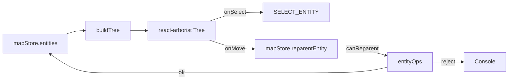

# Layer tree

The Activity Bar's Layer Tree renders every entity in the map as a draggable tree. It's the primary way to navigate large maps, reparent lanes into roads or junctions, and seed empty `road` / `rsu` entities.

## Architecture



`buildTree(entities)` (`treeBuilder.ts:7-126`) flattens `Map<id, MapEntity>` into a tree with three node kinds (`group`, `section`, `entity`).

## Tree shape

```
Roads
├── road_xxx
│   ├── Section sec_1
│   │   ├── lane_aaa
│   │   └── lane_bbb
│   └── Section sec_2
Junctions
├── junction_yyy
│   ├── lane_ccc        (lane.junctionId === junction_yyy)
│   ├── road_zzz        (road.junctionId === junction_yyy)
│   └── rsu_kkk         (rsu.junctionId === junction_yyy)
Lanes (unparented)
PNC Junctions
Parking Spaces
Crosswalks
Signals
Stop Signs
Yield Signs
Speed Bumps
Clear Areas
Barrier Gates
Areas
RSUs (unparented)
Overlaps
```

Group order is fixed by `TOP_LEVEL_ORDER` (`LayerTree/constants.ts`).

## Node kinds

```ts
// LayerTree/types.ts
type TreeNode = {
  id: string;
  name: string;
  kind: 'group' | 'section' | 'entity';
  entityType?: string;
  entityId?: string;
  children?: TreeNode[];
  dropKind: 'none' | 'road' | 'junction' | 'roadSection' | 'unparented';
  parentTarget?: ParentTarget;
};
```

## Steps

### 1. Select / jump

Click any node → `handleSelect` → `onSelect(entityId)` → `SELECT_ENTITY`. The map highlights, Inspector switches forms.

### 2. Reparent via drag

`canReparent(child, target, entities)` (`src/lib/entityOps.ts`) decides validity:

| Child         | Allowed parentTarget                                                                           |
| ------------- | ---------------------------------------------------------------------------------------------- |
| `lane`        | `{ kind: 'roadSection', roadId, sectionId }` / `{ kind: 'junction', id }` / `{ kind: 'none' }` |
| `road`        | `{ kind: 'junction', id }` / `{ kind: 'none' }`                                                |
| `rsu`         | `{ kind: 'junction', id }` / `{ kind: 'none' }`                                                |
| Anything else | Not draggable                                                                                  |

Rejections log `[LayerTree] reparent rejected: <reason>`.

### 3. Seed empty entities

The `+` toolbar creates blank seeds:

```ts
// createRoad (LayerTree.tsx:25-37)
{ id: nextEntityId('road', entities),
  entityType: 'road',
  sections: [{ id: nextSubId(SUB_PREFIX.section, []), laneIds: [] }],
  junctionId: null,
  type: 'CITY_ROAD' }

// createRSU (LayerTree.tsx:39-48)
{ id: nextEntityId('rsu', entities),
  entityType: 'rsu',
  junctionId: null,
  overlapIds: [] }
```

ID uniqueness is enforced by `nextEntityId` / `nextSubId` (`src/lib/idGenerator.ts`).

### 4. Delete / rename

- **Delete**: select node → `Delete` → `DELETE_ENTITY` → `mapStore.removeEntity(id)`.
- **Rename**: not supported. IDs are referenced by other entities (topology, overlap); renaming would corrupt cross-references. Clone-and-delete is the only path.

## Options table

| Field             | Notes                                             |
| ----------------- | ------------------------------------------------- |
| `road.sections[]` | ordered; lane order within a section is `laneIds` |
| `road.junctionId` | LayerTree drag                                    |
| `lane.junctionId` | derived from PIP; not changed by LayerTree drag   |
| `rsu.junctionId`  | LayerTree drag                                    |
| `_userOverrides`  | reconcile-skip paths                              |
| ID generator      | `nextEntityId(type, entities)` collision-free     |

## Shortcut cheatsheet

| Action            | Mouse / Key           | Notes                   |
| ----------------- | --------------------- | ----------------------- |
| Select            | left click            | sync Map + Inspector    |
| Drag reparent     | left-drag onto target | `canReparent` validates |
| Create road       | toolbar `+` Road      | `createRoad`            |
| Create RSU        | toolbar `+` RSU       | `createRSU`             |
| Collapse / expand | triangle on node      | react-arborist          |
| Delete            | select + `Delete`     | `DELETE_ENTITY`         |

## Troubleshooting

### Drag silently fails

`canReparent` rejected. Inspect console for `[LayerTree] reparent rejected: <reason>`. Likely cause: lane endpoints aren't actually inside that junction polygon.

### Overlaps group missing

`Overlaps` only appears when `reconcileOverlaps` produced overlaps.

### Tree not refreshing after edit

`buildTree` is `useMemo`d on `entities`. Ensure mutations go through `mapStore.updateEntity` (immer-backed) rather than direct mutation.

### Lane order within section

Determined by `RoadSection.laneIds`. Intra-section reordering via drag is on the roadmap.

### Lanes follow road into junction?

No. `lane.junctionId` is geometry-derived (PIP), not inherited from `road.junctionId`. To assign lanes, drag endpoints into the polygon.

## Source links

- `src/components/layout/panels/LayerTree.tsx:1-100`
- `src/components/layout/panels/LayerTree/treeBuilder.ts`
- `src/components/layout/panels/LayerTree/Node.tsx`
- `src/components/layout/panels/LayerTree/types.ts`
- `src/components/layout/panels/LayerTree/constants.ts`
- `src/lib/entityOps.ts` (`canReparent`)
- `src/lib/idGenerator.ts`
- `src/components/layout/panels/MapOutline.tsx`

## See also

- [Map elements](./map-elements.md)
- [Topology](./topology.md)
- [Topology and junctions](./topology-and-junctions.md)
- [Drawing lanes](./drawing-lanes.md)
