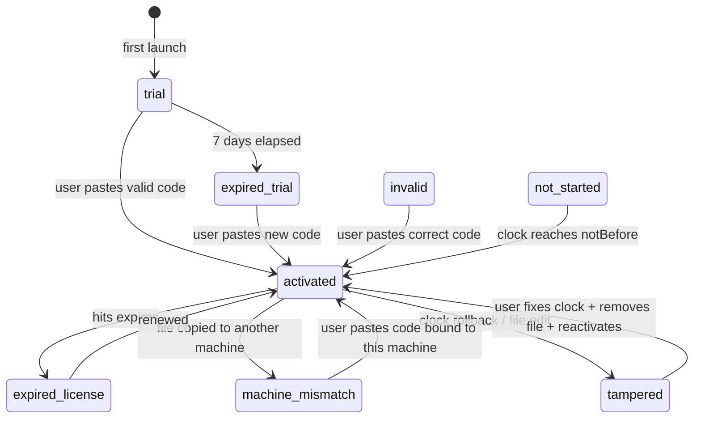
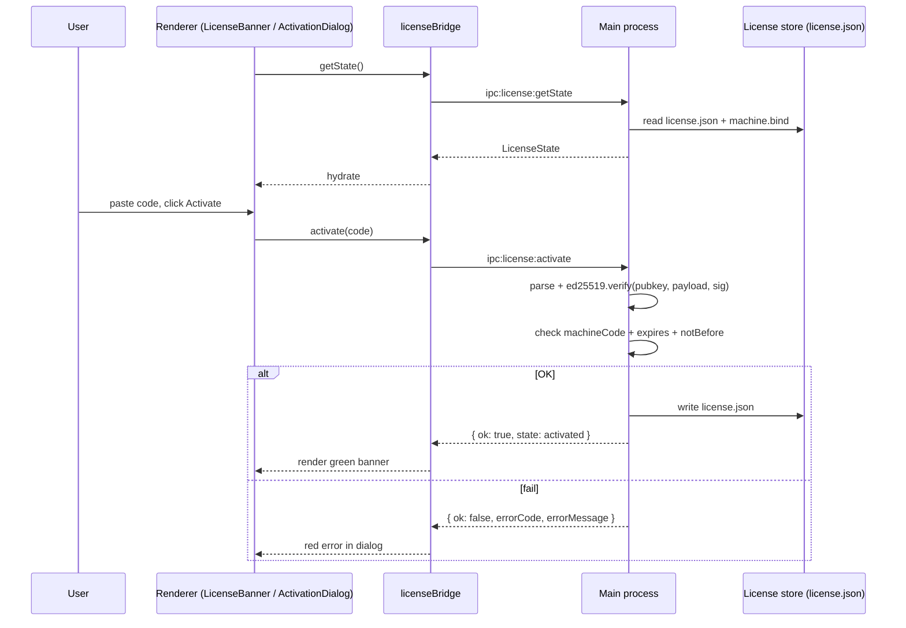

# License Activation

> The AMS desktop build (Electron) ships an **offline activation** mechanism: generate a machine code → mail it to your vendor → receive an activation code bound to that machine → the desktop app verifies it via Ed25519 and persists locally. **No network connection required.**

::: info Desktop only
The browser preview (`pnpm dev`) skips activation entirely — it always reports `trial` with `canEdit=true`. Only production desktop builds enforce activation, so frontend contributors keep working locally. See `src/lib/license-bridge.ts:62-75`.
:::

## Overview

| Aspect         | Behavior                                                                                      |
| -------------- | --------------------------------------------------------------------------------------------- |
| Security model | Ed25519 public-key verification + machine binding + replay detection + system-clock guard     |
| Data path      | Renderer talks to main via `licenseBridge` IPC; main persists `license.json` + `machine.bind` |
| Entry UI       | `LicenseBanner` top bar; click `Activate` / `Manage license` to open `ActivationDialog`       |
| Trial period   | 7 days                                                                                        |
| Status count   | 8 (`LicenseStatus`)                                                                           |
| Online?        | Fully offline                                                                                 |
| Token format   | `APMS1.<base64url(payload)>.<base64url(signature)>`                                           |

## Status machine

`LicenseStatus` has 8 values (`license-bridge.ts:11-19`):

| Status             | Meaning             | `canEdit` | Banner color                     | Trigger                                     |
| ------------------ | ------------------- | --------- | -------------------------------- | ------------------------------------------- |
| `trial`            | In trial            | ✅        | Cyan (only when ≤ 3 days left)   | First launch, no activation present         |
| `activated`        | Licensed            | ✅        | Green (only when ≤ 14 days left) | Verified + within validity                  |
| `expired_trial`    | Trial expired       | ❌        | Amber                            | 7 trial days used up, not activated         |
| `expired_license`  | License expired     | ❌        | Amber                            | Code valid but past `expires`               |
| `tampered`         | Tampering detected  | ❌        | Rose                             | Clock rolled back / `license.json` modified |
| `machine_mismatch` | Wrong machine       | ❌        | Rose                             | License copied from another machine         |
| `invalid`          | Verification failed | ❌        | Rose                             | Format ok but Ed25519 signature wrong       |
| `not_started`      | Not yet active      | ❌        | Grey                             | Code's `notBefore` is in the future         |

### Transitions



## UI Tour

### LicenseBanner (top bar)

Rendered by `src/components/license/LicenseBanner.tsx:106-129`. Visibility rules:

```
┌─────────────────────────────────────────────────────────────┐
│ 🛡 Licensed · 13d remaining            [🔑 Manage license] │   activated (≤14d)
│ ⏱ Trial: 5d remaining                  [🔑 Activate]       │   trial (≤3d)
│ ⚠ License expired — read-only mode...   [🔑 Activate]       │   expired_*
│ ⚠ Tampering detected — read-only mode...[🔑 Activate]       │   tampered
└─────────────────────────────────────────────────────────────┘
```

If trial > 3 days remain, or licensed > 14 days remain → **banner hidden** (no nag).

### ActivationDialog

`src/components/license/ActivationDialog.tsx:103-213`:

```
┌──────────────────────────────────────────────────────────────────┐
│ Apollo Map Studio License        status: trial · 5d trial left   │
├──────────────────────────────────────────────────────────────────┤
│ THIS MACHINE'S CODE                                              │
│  M-AB12-CD34-EF56-GH78-IJ90      [📋 Copy]                       │
│  Send this code to your license vendor. They will reply with     │
│  an activation code that is valid only on this machine.          │
│                                                                  │
│ PASTE ACTIVATION CODE                                            │
│  ┌────────────────────────────────────────────────────────────┐  │
│  │ APMS1.eyJ2IjoxLCJsaWMiOiIuLi4ifQ.…                         │  │
│  │                                                            │  │
│  └────────────────────────────────────────────────────────────┘  │
├──────────────────────────────────────────────────────────────────┤
│                                       [Close]   [Activate]       │
└──────────────────────────────────────────────────────────────────┘
```

## Steps

### First-time activation

1. Launch the desktop app. The cyan banner appears: `Trial: 7d remaining`.
2. Click `Activate` (or open the dialog at any time).
3. Click `Copy` to copy your machine code.
4. Send the code (`M-XXXX-XXXX-...`) to your vendor.
5. Vendor returns an activation token (`APMS1.<...>.<...>`) by email.
6. Paste it into the dialog → click `Activate`.
7. Renderer IPCs the token to the main process, which performs 4 checks:
   - **Format**: must be `APMS1.<base64>.<base64>`
   - **Ed25519 signature**: against the embedded public key
   - **Machine binding**: payload.machineCode === current machine code
   - **Replay**: reject if this license id has been revoked
8. On success, `license.json` is written → `LicenseState.status === 'activated'` → banner turns green.
9. Any failure renders a red error strip with the reason (`errorMessage`).

### Renewal / upgrade

Re-open the dialog while activated; the title shows `status: activated · ...` and a green panel lists current license id / name / expires. Paste a new token to overwrite.

### Deactivation / migration

`licenseBridge.deactivate()` removes `license.json` — next launch falls back to `trial`. **Note: deactivate does not reset trial days remaining** — only the license section is wiped.

## Activation code format

The string format (placeholder in `ActivationDialog.tsx:173`):

```
APMS1.<base64url(JSON payload)>.<base64url(Ed25519 signature)>
```

JSON payload fields:

| Field       | Type      | Meaning                                   |
| ----------- | --------- | ----------------------------------------- |
| `v`         | int       | Schema version (currently 1)              |
| `lic`       | string    | License id (vendor-assigned UUID)         |
| `name`      | string    | Display name (e.g. "Lumina Internal")     |
| `machine`   | string    | Bound machine code                        |
| `issued`    | int (ms)  | Issue time                                |
| `expires`   | int (ms)  | Expiry; `0` = perpetual                   |
| `notBefore` | int (ms)? | Pre-issued, delayed activation (optional) |

Signed with Ed25519, key pair held by the vendor. Renderer only stores the public key constant.

## Activation sequence



## Persistence

| File           | Path (Linux example)                       | Writer                               |
| -------------- | ------------------------------------------ | ------------------------------------ |
| `license.json` | `~/.config/apollo-map-studio/license.json` | main `electron/main/license/storage` |
| `machine.bind` | same directory                             | same                                 |

::: warning Do not edit license files manually
Any manual edit triggers `tampered`. To reset, **delete the files** rather than editing.
:::

## Anti-tamper design

| Mechanism          | Location                              | Notes                                           |
| ------------------ | ------------------------------------- | ----------------------------------------------- |
| Ed25519 signature  | `electron/main/license/verify.ts`     | Any field change breaks the signature           |
| Machine binding    | same + `machine.bind`                 | payload.machine must equal locally-derived hash |
| Replay detection   | `electron/main/license/replay.ts`     | Same license id reused → reject                 |
| System-clock guard | `electron/main/license/clockGuard.ts` | Last-launch timestamp > current → mark tampered |

::: tip Soft failure mode
Even on detected tampering, the app **does not crash** — it sets `canEdit=false` and enters read-only mode. Labellers don't lose data; they can contact the vendor to unlock.
:::

## Troubleshooting

| Symptom                                                  | Cause                                                      | Fix                                                                              |
| -------------------------------------------------------- | ---------------------------------------------------------- | -------------------------------------------------------------------------------- |
| Banner stays `trial` after pasting a code                | You're on `pnpm dev` (fallback state)                      | Use the `pnpm dist` packaged desktop build                                       |
| `invalid_signature`                                      | Pasted with stray whitespace / newlines                    | Re-paste; the dialog auto-strips whitespace via `setCode(...replace(/\s+/g,''))` |
| `machine_mismatch`                                       | License is bound to another machine                        | Ask vendor to issue a new code                                                   |
| `tampered` but I didn't edit anything                    | System clock jumped, or mounted dir mismatch               | Sync NTP; delete `license.json` and reactivate                                   |
| `expired_license`                                        | Past `expires`                                             | Renew with vendor                                                                |
| `Manage license` button missing                          | Currently perpetual (expires=0) with > 14 days "remaining" | By design — banner hides itself                                                  |
| Banner still says activated after I deleted license.json | Renderer cached the old state                              | Restart the app                                                                  |

## Source

- `src/components/license/ActivationDialog.tsx` — UI dialog
- `src/components/license/LicenseBanner.tsx` — top-bar status
- `src/lib/license-bridge.ts` — renderer ↔ main IPC bridge
- `src/store/licenseStore.ts` — Zustand store (mirror of main state)
- `src/hooks/useLicense.ts` — `useLicenseSync` plugged into `WorkspaceLayout`
- `electron/main/license/` — main-process verification + persistence
- `electron/preload.cts` — `contextBridge.exposeInMainWorld('apolloMapStudioLicense', ...)`

## LicenseState glossary

`src/lib/license-bridge.ts:21-32`:

| Field            | Type                                    | Meaning                                                  |
| ---------------- | --------------------------------------- | -------------------------------------------------------- |
| `status`         | `LicenseStatus`                         | One of 8                                                 |
| `canEdit`        | boolean                                 | Write allowed? (gates Inspector / drawing)               |
| `machineCode`    | string                                  | `M-XXXX-XXXX-...`                                        |
| `trialStart`     | int (ms)                                | First launch time                                        |
| `trialEnd`       | int (ms)                                | Trial end time                                           |
| `daysRemaining`  | int \| null                             | Days left; null = perpetual                              |
| `hoursRemaining` | int \| null                             | Hours left (more precise near expiry)                    |
| `license`        | `{ id, name, issued, expires } \| null` | Active license description                               |
| `checkedAt`      | int (ms)                                | Last main-process check time                             |
| `reason`         | string                                  | Human-readable status; consumed by banner + dialog title |

## ActivationResult glossary

`license-bridge.ts:34-46`:

| Field          | Type           | Meaning                                                                                                            |
| -------------- | -------------- | ------------------------------------------------------------------------------------------------------------------ |
| `ok`           | boolean        | Overall success flag                                                                                               |
| `state`        | `LicenseState` | New state after activation                                                                                         |
| `errorCode`    | union          | `'invalid_format' / 'invalid_signature' / 'machine_mismatch' / 'expired' / 'replay' / 'storage_error' / 'unknown'` |
| `errorMessage` | string         | User-facing error shown in the red strip                                                                           |

## Comparison vs similar tools

| Tool          | Model                    | Offline? | Client-side verify? |
| ------------- | ------------------------ | -------- | ------------------- |
| AMS           | Offline + Ed25519        | ✅       | ✅                  |
| JetBrains IDE | Server-issued token      | ❌       | partial             |
| Sublime Text  | Offline license code     | ✅       | RSA                 |
| Adobe CC      | Networked license server | ❌       | —                   |
| 1Password     | Network + biometric      | ❌       | —                   |

AMS chose the offline model because the target deployment (factory-internal HD-map data) **forbids networked activation**.

## Fleet deployment

To deploy on 50 labelling machines:

1. Each machine generates its own machine code (no reuse).
2. The vendor signs 50 distinct tokens with the same key, each bound to one machine code.
3. Distribute through your usual channel (shared drive, IT tool).
4. Each user opens ActivationDialog, pastes their code, activates.

::: tip Automated activation
The main process exposes `apolloMapStudioLicense.activate(code)`. A bootstrap script can read `~/.apollo-map-studio/init-token.txt` and call it automatically. This API is not yet officially backward-compatible; pin the AMS version.
:::

## See also

- [Getting Started](./getting-started.md) — first thing after install
- [Installation](./installation.md) — which builds support activation
- [Troubleshooting](./troubleshooting.md) — general debugging
- [Settings](./settings.md) — local-only settings (unrelated to license)
- [Activity Bar & Panels](./activity-bar-and-panels.md) — where the banner sits
