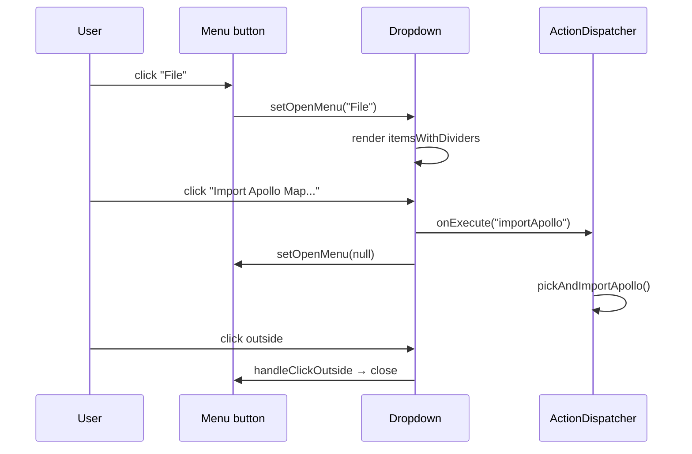

# MenuBar & ToolStrip

> AMS has two horizontal bands at the top: the **MenuBar** (text dropdowns) and the **ToolStrip** (icon buttons). Both are **fully data-driven** — every executable item lives in a single `ActionDef` registry (`src/core/actions/registry/definitions.ts`).

::: tip Why this matters
Every visible "executable operation" (draw, undo, import/export, toggle grid, …) is backed by an `ActionDef`. Master the registry and you simultaneously understand four surfaces: MenuBar, ToolStrip, CommandPalette, and global shortcuts.
:::

## Overview

| Surface       | File                | Height        | Data source                                                                   |
| ------------- | ------------------- | ------------- | ----------------------------------------------------------------------------- |
| MenuBar       | `MenuBar.tsx`       | `h-8` (32 px) | `getMenuActions(menu)`                                                        |
| LicenseBanner | `LicenseBanner.tsx` | 0 / 28 px     | Only visible when trial ≤ 3d / expired / tampered                             |
| ToolStrip     | `ToolStrip.tsx`     | `h-9` (36 px) | `getToolStripSlotActions('view')` + `getToolAction(drawTool)` + element table |
| StatusBar     | `StatusBar.tsx`     | `h-6` (24 px) | `mapStore.entities.size` + `uiStore` + `apolloMapStore.info`                  |

## MenuBar catalog

`MenuBar.tsx:142-176` builds menus through `getMenuNames()`. The table below covers every menu / item in the default registry (`registry/definitions.ts`).

### Menu → item map

| Menu     | Item label               | id                 | Shortcut | menuOrder | Behavior                            |
| -------- | ------------------------ | ------------------ | -------- | --------- | ----------------------------------- |
| **File** | Import Apollo Map...     | `importApollo`     | —        | 1         | `pickAndImportApollo()`             |
|          | Export Apollo Map (.bin) | `exportApolloBin`  | `⌘S`     | 11        | `exportApolloBin()`                 |
|          | Export Apollo Map (.txt) | `exportApolloText` | `⇧⌘S`    | 12        | `exportApolloText()`                |
|          | Settings                 | `settings`         | `⌘,`     | 90        | Open SettingsPanel                  |
| **Edit** | Undo                     | `undo`             | `⌘Z`     | 10        | `temporal.undo()` (with R1 CANCEL)  |
|          | Redo                     | `redo`             | `⇧⌘Z`    | 20        | `temporal.redo()`                   |
|          | Delete Selection         | `delete`           | `⌫`      | 40        | `mapStore.deleteEntity(selectedId)` |
|          | Connect Lanes            | `connectLanes`     | `C`      | 50        | Toggle `connectLanesMode`           |
| **View** | Reset Layout             | `resetLayout`      | —        | 10        | Clear dockview snapshot, recreate   |
|          | Toggle Grid              | `toggleGrid`       | `⌘G`     | 20        | `uiStore.gridEnabled`               |
|          | Toggle Snap              | `toggleSnap`       | —        | 30        | `uiStore.snapEnabled`               |

::: tip Divider rule
`MenuBar.tsx:46-53` auto-buckets by `floor(menuOrder / 10)` and inserts dividers between buckets. So `1` and `11` end up in different buckets — handy for inserting separators without renumbering.
:::

### Menu open/close behavior



## ToolStrip catalog

`ToolStrip.tsx:99-219` is composed of four slots:

```
[Default | Connect] | [11 elements] | [draw tools for current element] | <flex spacer> | [Cmd Palette] | [View slot — Grid/Snap]
```

### Slot 1: Mode switches

| Button           | id             | Shortcut | Meaning                                       |
| ---------------- | -------------- | -------- | --------------------------------------------- |
| ✋ Default (Pan) | `defaultMode`  | `H`      | Exit drawing / selection / edit; back to pan  |
| 🔗 Connect Lanes | `connectLanes` | `C`      | Click two lanes in sequence to wire succ/pred |

### Slot 2: 11 elements

From `MAP_ELEMENTS` (`src/core/elements/elements.ts`):

| Order | Element      | `type`         | Default draw tool |
| ----- | ------------ | -------------- | ----------------- |
| 1     | Lane         | `lane`         | `drawCatmullRom`  |
| 2     | Road         | `road`         | `drawCatmullRom`  |
| 3     | Junction     | `junction`     | `drawPolygon`     |
| 4     | PNCJunction  | `pncJunction`  | `drawPolygon`     |
| 5     | Crosswalk    | `crosswalk`    | `drawRotatedRect` |
| 6     | StopSign     | `stopSign`     | `drawPolyline`    |
| 7     | YieldSign    | `yieldSign`    | `drawPolyline`    |
| 8     | Signal       | `signal`       | `drawRotatedRect` |
| 9     | ParkingSpace | `parkingSpace` | `drawRotatedRect` |
| 10    | SpeedBump    | `speedBump`    | `drawPolyline`    |
| 11    | ClearArea    | `clearArea`    | `drawPolygon`     |

::: warning Element icon coloring
When an element is selected, its icon switches to `el.color` (e.g. lane is cyan `#22d3ee`, crosswalk is yellow). Driven by `style={active ? { color: el.color } : undefined}`.
:::

### Slot 3: Draw tools for the current element

Only visible when `currentElement !== null`. Each element declares `tools: DrawTool[]` and the UI filters via `availableTools`:

| Element                            | Allowed `DrawTool`s (in `el.tools` order)              |
| ---------------------------------- | ------------------------------------------------------ |
| Lane / Road                        | `drawCatmullRom` `drawBezier` `drawArc` `drawPolyline` |
| Crosswalk / Signal / ParkingSpace  | `drawRotatedRect`                                      |
| Junction / PNCJunction / ClearArea | `drawPolygon`                                          |
| StopSign / YieldSign / SpeedBump   | `drawPolyline`                                         |

### Slot 4: Command Palette

`⌘K` / `Ctrl+K` opens the overlay. See [Command Palette](./command-palette.md).

### Slot 5: View slot

`getToolStripSlotActions('view')` lists every ActionDef with `uiSlot: 'view'`:

| Button         | id           | Shortcut | Source                |
| -------------- | ------------ | -------- | --------------------- |
| ▦ Toggle Grid  | `toggleGrid` | `⌘G`     | `uiStore.gridEnabled` |
| 🧲 Toggle Snap | `toggleSnap` | —        | `uiStore.snapEnabled` |

`active` is derived from `getToggleState(action.id)`, centrally read by `useActionDispatcher`.

## ModeToggle: Drawing vs Scene

`MenuBar.tsx:108-140` provides a segmented toggle in the top-right:

| Mode      | Behavior delta                                 |
| --------- | ---------------------------------------------- |
| `drawing` | Default layout; only Map / Sidebar / Inspector |
| `scene`   | Adds a Timeline panel (height 180 px)          |

Stored in `uiStore.appMode`. `WorkspaceLayout` rebuilds the DockviewReact instance via `key={appMode}` (`WorkspaceLayout.tsx:140`); layout snapshot keys also split: `apollo-map-studio:layout:drawing` and `apollo-map-studio:layout:scene`.

## StatusBar

`StatusBar.tsx:33-122` shows six pieces of info:

| Region  | Field             | Source                                                   |
| ------- | ----------------- | -------------------------------------------------------- |
| Left 1  | Mode badge        | `uiStore.appMode`                                        |
| Left 2  | Current FSM state | `editorMachine` `s.value`, mapped via `MODE_LABELS`      |
| Left 3  | Entity count      | `mapStore.entities.size`                                 |
| Left 4  | Apollo info       | `apolloMapStore.info` (filename, lane count, road count) |
| Right 1 | Grid / Snap LEDs  | `uiStore.gridEnabled` / `snapEnabled`                    |
| Right 2 | Cursor lng/lat    | `uiStore.cursorLngLat`                                   |
| Right 3 | Zoom level        | `uiStore.currentZoom`                                    |

::: tip Drawing pulse
While in any `draw*` state the Left 2 dot animates with `bg-ams-accent animate-pulse` so the user can't miss it.
:::

## Adding a new action

Touch **only** `src/core/actions/registry/definitions.ts`:

```ts
{
  id: 'myNewAction',
  label: 'My New Action',
  category: 'edit',                     // affects CommandPalette grouping
  shortcut: '⌥M',                       // displayed to user
  keybinding: { key: 'm', alt: true },  // global key match
  icon: FaWandMagicSparkles,            // react-icons/fa6
  inCommandPalette: true,
  menu: 'Edit',                         // auto-appears in this menu
  menuOrder: 30,
}
```

Then add a case to `useActionDispatcher.ts`:

```ts
case 'myNewAction': {
  doMyThing();
  return;
}
```

Done. MenuBar / CommandPalette / shortcut / ToolStrip all reflect it automatically.

## Steps

1. Click a menu name (File / Edit / View) → dropdown opens.
2. Click an item, or press its shortcut → executes immediately.
3. Click an element icon in ToolStrip → selects the element and switches to its default draw tool.
4. After picking an element, the draw-tool subset appears; click to switch tools.
5. View-slot toggles flip on click; state lives in `uiStore`.
6. ModeToggle clicks switch drawing / scene.

## Troubleshooting

| Symptom                       | Cause                       | Fix                                                                    |
| ----------------------------- | --------------------------- | ---------------------------------------------------------------------- |
| Menu won't open               | A dialog stole focus        | Close the dialog first                                                 |
| Shortcut ignored              | Focus inside input/textarea | Click on the map to defocus; Ctrl+K still works (global=true)          |
| Element icon never highlights | Not selected                | Click the element icon                                                 |
| Connect Lanes hard to find    | At Edit menu bottom         | menuOrder=50 — see table                                               |
| Reset Layout has no effect    | Dockview state corrupted    | See [Activity Bar & Panels](./activity-bar-and-panels.md#reset-layout) |

## Persistence

MenuBar / ToolStrip themselves persist nothing. Toggle states live in `uiStore` (runtime, not `localStorage`). Layout-reset writes/reads two keys — see [Activity Bar & Panels](./activity-bar-and-panels.md).

## Source

- `src/components/layout/MenuBar.tsx:142-176` — menu generation
- `src/components/layout/MenuBar.tsx:108-140` — ModeToggle
- `src/components/layout/ToolStrip.tsx:99-219` — ToolStrip render
- `src/components/layout/StatusBar.tsx:33-122` — StatusBar
- `src/core/actions/registry/definitions.ts` — all ActionDefs
- `src/core/actions/registry/helpers.ts` — `getMenuActions` / `getToolStripSlotActions` / `formatShortcut` / `matchesKeybinding` / `isMacPlatform`
- `src/hooks/useActionDispatcher.ts` — execution + toggle reads
- `src/core/elements/elements.ts` — the 11-element table

## ActionDef field glossary

From `src/core/actions/registry/types.ts`:

| Field              | Type                       | Required    | Meaning                                                                     |
| ------------------ | -------------------------- | ----------- | --------------------------------------------------------------------------- |
| `id`               | `ActionId` (literal union) | ✅          | Unique key, statically checked                                              |
| `label`            | string                     | ✅          | Displayed to user                                                           |
| `category`         | `ActionCategory`           | ✅          | `'file' / 'edit' / 'view' / 'tool' / 'selection'` — drives palette grouping |
| `icon`             | `IconType`                 | Recommended | react-icons/fa6 component                                                   |
| `shortcut`         | string                     | Optional    | Display string (e.g. `'⌘S'`), rendered via `formatShortcut`                 |
| `keybinding`       | `KeyBinding`               | Optional    | Actual match rule                                                           |
| `inCommandPalette` | boolean                    | ✅          | Whether to surface in `⌘K`                                                  |
| `menu`             | string                     | Optional    | Which menu (File / Edit / View / …)                                         |
| `menuOrder`        | number                     | Optional    | Order inside menu; floor/10 inserts dividers                                |
| `isToggle`         | boolean                    | Optional    | Toggle-style action; palette shows ✓                                        |
| `uiSlot`           | `'view'` etc               | Optional    | ToolStrip slot                                                              |
| `uiOrder`          | number                     | Optional    | Order within the slot                                                       |
| `drawTool`         | `DrawTool`                 | Optional    | Tool-class ActionDef only, paired with FSM `SELECT_TOOL`                    |

## Checklist for adding a menu entry

```
□ Add ActionDef in definitions.ts
   □ id (literal)
   □ label / category / icon
   □ menu + menuOrder
   □ shortcut + keybinding (if needed)
   □ inCommandPalette
□ Add a switch case in useActionDispatcher.ts
□ pnpm typecheck (the ActionId union catches typos)
□ pnpm test (registry unit tests validate the table)
□ MenuBar / CommandPalette auto-reflect — no UI changes needed
```

## Known nits

| Item                      | Detail                                                                               |
| ------------------------- | ------------------------------------------------------------------------------------ |
| MenuBar logo              | Cyan gradient square + "Apollo Map Studio" text (hardcoded — no logo swap)           |
| StatusBar coord precision | `toFixed(6)`, about 0.1 m at the equator                                             |
| Dropdown z-index          | 50; same layer as Suspense overlay — mind stacking order                             |
| Localized menu names      | Not supported; `getMenuNames` reads the `menu` field which is currently English-only |

## See also

- [Command Palette](./command-palette.md) — searchable surface for the same registry
- [Shortcuts](./shortcuts.md) — full keyboard reference
- [Activity Bar and Panels](./activity-bar-and-panels.md) — left rail + central dockview
- [Inspector](./inspector.md) — right-side property panel
- [Settings](./settings.md) — `⌘,` opens the settings panel

## Tooltip / title source

Each ToolButton's `title` attribute is computed:

```ts
display ? `${label} (${display})` : label;
```

where `display = formatShortcut(shortcut)`. After ~1 s of hover the browser's native tooltip shows:

```
Draw Polyline (P)
Toggle Grid (⌘G)
```

Using the native `title` attribute (not a React portal tooltip) is intentional: zero dependency, zero render cost, native menu parity. The trade-off is the fixed 1s delay.

## ToolStrip element color map

From `MapElementDef.color` in `src/core/elements/elements.ts`:

| Element      | Hex       | Tailwind equivalent |
| ------------ | --------- | ------------------- |
| Lane         | `#22d3ee` | cyan-400            |
| Road         | `#a855f7` | purple-500          |
| Junction     | `#f59e0b` | amber-500           |
| PNCJunction  | `#fbbf24` | amber-400           |
| Crosswalk    | `#fde047` | yellow-300          |
| Signal       | `#ef4444` | red-500             |
| StopSign     | `#dc2626` | red-600             |
| YieldSign    | `#fb923c` | orange-400          |
| ParkingSpace | `#34d399` | emerald-400         |
| SpeedBump    | `#9ca3af` | gray-400            |
| ClearArea    | `#6b7280` | gray-500            |
