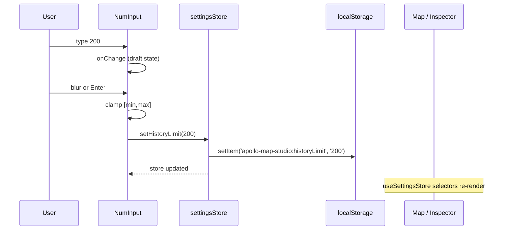

# Settings

> Settings is a **modal dialog** containing every runtime preference (undo depth, initial map viewport, default lane half-width, arrow spacing, layout reset). Every value writes through `settingsStore` to `localStorage` immediately and is restored on next launch.

## Overview

| Aspect                  | Behavior                                              |
| ----------------------- | ----------------------------------------------------- |
| Entry                   | `File → Settings`, ActivityBar gear, `⌘,` / `Ctrl+,`  |
| Component               | `src/components/layout/panels/SettingsPanel.tsx`      |
| Storage                 | `src/store/settingsStore.ts` writes to `localStorage` |
| Modal?                  | Yes; `ESC` or backdrop closes                         |
| Undoable?               | No — does not enter zundo                             |
| Live fields             | History limit, Lane half-width, Arrow spacing         |
| Restart-required fields | Map Viewport (lng/lat/zoom)                           |

## Field catalog

The table below corresponds to `SettingsPanel.tsx:103-235`.

### Undo History

| Field         | Range     | Default | Live?     | localStorage key                 |
| ------------- | --------- | ------- | --------- | -------------------------------- |
| History limit | 10 – 1000 | 100     | ⚠ restart | `apollo-map-studio:historyLimit` |

::: warning Requires restart
`historyLimit` is consumed once when `settingsStore` builds its zundo middleware. Editing it does **not** rebuild the current session's stack; you have to relaunch. Or hit `Reset Layout to Default` (which triggers `window.location.reload()`) for a workaround.
:::

### Map Viewport (restart-applies)

| Field     | Range      | Default                   | localStorage    |
| --------- | ---------- | ------------------------- | --------------- |
| Longitude | -180 – 180 | from `MAP_DEFAULT_CENTER` | `:mapCenterLng` |
| Latitude  | -90 – 90   | same                      | `:mapCenterLat` |
| Zoom      | 1 – 22     | `MAP_DEFAULT_ZOOM`        | `:mapZoom`      |

::: tip Default center
The default center is `MAP_DEFAULT_CENTER` in `src/config/mapConstants.ts` (a coordinate near a Chinese city — see the constant for the exact value).
:::

### Lane (live)

| Field              | Range       | Default                          | Live?                               | localStorage        |
| ------------------ | ----------- | -------------------------------- | ----------------------------------- | ------------------- |
| Default half-width | 0.5 – 10 m  | `DEFAULT_LANE_HALF_WIDTH` (1.75) | ✅ new lanes use the new default    | `:laneHalfWidth`    |
| Arrow spacing      | 40 – 500 px | `LANE_ARROW_SYMBOL_SPACING` (80) | ✅ MapLibre symbol layer re-renders | `:laneArrowSpacing` |

### Layout

| Button                    | Action                                                                  |
| ------------------------- | ----------------------------------------------------------------------- |
| `Reset Layout to Default` | `localStorage.removeItem('ams-layout-v2')` + `window.location.reload()` |

::: warning ams-layout-v2 vs v3
This button only clears the legacy v2 key + does a full reload. Newer keys are `ams-layout-v3-drawing` / `ams-layout-v3-scene`. For a soft reset of the current mode use `View → Reset Layout` — see [Activity Bar & Panels](./activity-bar-and-panels.md#reset-layout).
:::

## NumInput control

`SettingsPanel.tsx:17-54` — the `NumInput` component:

- **Enter** commits.
- **Blur** auto-commits.
- Out-of-range values are clamped to `[min, max]`.
- Non-numeric input resets to the previous value (calls `onReset`).
- `step` defaults to 1; parents override (lane half-width step=0.25, arrow spacing step=10).

## Data flow



## Steps

1. Press `⌘,` / `Ctrl+,` (or `File → Settings`, or the ActivityBar gear).
2. Double-click the number to highlight it.
3. Type a new value.
4. **Enter** or Tab-blur to commit.
5. Close the dialog (`ESC` or ×).
6. Lane / Arrow fields apply immediately. History / Map Viewport need a restart or reload.

## Persistence

| Key                                  | Writer                | Default                 |
| ------------------------------------ | --------------------- | ----------------------- |
| `apollo-map-studio:historyLimit`     | `setHistoryLimit`     | 100                     |
| `apollo-map-studio:mapCenterLng`     | `setMapCenter`        | `MAP_DEFAULT_CENTER[0]` |
| `apollo-map-studio:mapCenterLat`     | `setMapCenter`        | `MAP_DEFAULT_CENTER[1]` |
| `apollo-map-studio:mapZoom`          | `setMapZoom`          | `MAP_DEFAULT_ZOOM`      |
| `apollo-map-studio:laneHalfWidth`    | `setLaneHalfWidth`    | 1.75                    |
| `apollo-map-studio:laneArrowSpacing` | `setLaneArrowSpacing` | 80                      |

::: tip Private mode / SSR
`settingsStore` reads / writes `localStorage` inside try/catch and silently falls back to defaults if storage is unavailable. See `settingsStore.ts:35-46`.
:::

## Range constants

Code: `src/store/settingsStore.ts:20-31`.

| Constant                 | Value |
| ------------------------ | ----- |
| `MIN_HISTORY_LIMIT`      | 10    |
| `MAX_HISTORY_LIMIT`      | 1000  |
| `MIN_MAP_ZOOM`           | 1     |
| `MAX_MAP_ZOOM`           | 22    |
| `MIN_LANE_HALF_WIDTH`    | 0.5   |
| `MAX_LANE_HALF_WIDTH`    | 10    |
| `MIN_LANE_ARROW_SPACING` | 40    |
| `MAX_LANE_ARROW_SPACING` | 500   |

## Troubleshooting

| Symptom                                      | Cause                               | Fix                                                    |
| -------------------------------------------- | ----------------------------------- | ------------------------------------------------------ |
| Changing history limit didn't grow the stack | Restart-required                    | Use `Reset Layout to Default` for a reload, or restart |
| Values get clamped back to bounds            | Input out of range                  | See the constants above                                |
| Typing `abc` reverts to old value            | `NumInput.onReset` triggered        | Expected                                               |
| Reset Layout still leaves dockview wrong     | You triggered the v2 clear + reload | Use `View → Reset Layout` instead                      |
| Settings don't persist in private window     | `localStorage` blocked              | Use a normal window                                    |
| Center change doesn't fly the map            | Initial viewpoint, not an animation | Restart or pan manually                                |

## Source

- `src/components/layout/panels/SettingsPanel.tsx:63-240` — main component
- `src/store/settingsStore.ts:20-148` — store + persistence
- `src/config/mapConstants.ts` — default-value constants
- `src/components/layout/WorkspaceLayout.tsx:54,89-93` — settings open hook
- `src/core/actions/registry/definitions.ts:54-64` — `settings` ActionDef

## Per-field deep dive

### `historyLimit`

zundo undo-stack depth. Every `mapStore.updateEntity` / `addEntity` / `deleteEntity` pushes a frame. Once the stack exceeds the limit, the oldest frame is dropped — `Ctrl+Z` past that point is **unreachable**.

| historyLimit  | Memory (~ thousands of entities) | Use case                           |
| ------------- | -------------------------------- | ---------------------------------- |
| 10            | ~ 1 MB                           | Demo                               |
| 100 (default) | ~ 10 MB                          | Day-to-day                         |
| 500           | ~ 50 MB                          | Long session, no intermediate save |
| 1000          | ~ 100 MB                         | Heavy rework, memory not a concern |

### `mapCenterLng` / `mapCenterLat` / `mapZoom`

Applies on **first launch** or after a hard reload. Once MapLibre is initialised, runtime changes do **not** actively `flyTo`. This is intentional — avoid yanking the user's current viewport.

::: tip Want to fly now?
Temporary trick (DevTools console):

```js
window.__map?.flyTo({ center: [121.5, 31.2], zoom: 16 });
```

(`window.__map` is exposed only in dev builds.)
:::

### `laneHalfWidth`

`MAP_DEFAULT_HALF_WIDTH` is 1.75 m in `mapConstants.ts` (standard lane half-width). When `addEntity` creates a new lane, both `leftSamples` and `rightSamples` are pre-seeded with two samples (s=0 and s=length) using this width. Changing the setting only affects **future** lanes; existing ones don't change.

### `laneArrowSpacing`

MapLibre `symbol` layer `symbol-spacing` in screen pixels. Larger = wider gap between adjacent arrows.

| Value        | Visual                                    |
| ------------ | ----------------------------------------- |
| 40           | Dense arrows, useful in tight-lane scenes |
| 80 (default) | Balanced — readable without dominating    |
| 200          | Sparse, direction-only indicator          |
| 500          | Very sparse: 1–2 arrows per lane segment  |

## Comparison vs other dialogs

| Panel            | Modal? | ESC closes? | Writes localStorage?       | Enters zundo? |
| ---------------- | ------ | ----------- | -------------------------- | ------------- |
| Settings         | ✅     | ✅          | ✅                         | ❌            |
| Inspector        | ❌     | —           | ❌ (indirect via mapStore) | ✅            |
| ProjPickerDialog | ✅     | ✅          | ❌                         | ❌            |
| ActivationDialog | ✅     | ✅          | ❌ (writes desktop file)   | ❌            |

## See also

- [Activity Bar & Panels](./activity-bar-and-panels.md) — Reset Layout: soft vs hard
- [License Activation](./license-activation.md) — independent license persistence (desktop)
- [Shortcuts](./shortcuts.md) — `⌘,` and friends
- [Drawing Lanes](./drawing-lanes.md) — `laneHalfWidth` controls new-lane default
- [Inspector](./inspector.md) — entity-field editing (not part of Settings)

## SettingsState type

`src/store/settingsStore.ts:82-97`:

```ts
export interface SettingsState {
  historyLimit: number;
  mapCenterLng: number;
  mapCenterLat: number;
  mapZoom: number;
  laneHalfWidth: number;
  laneArrowSpacing: number;
}

export interface SettingsActions {
  setHistoryLimit(value: number): void;
  setMapCenter(lng: number, lat: number): void;
  setMapZoom(value: number): void;
  setLaneHalfWidth(value: number): void;
  setLaneArrowSpacing(value: number): void;
}
```

Each setter does three things:

1. **Clamp** to `[MIN_x, MAX_x]`.
2. `set(...)` to update the store.
3. `persist(KEY, v)` write to `localStorage` (wrapped in try/catch).

## Read helpers

For non-hook callers (map init, etc.), settingsStore exposes pure functions:

| Function                 | Source                | Caller                                 |
| ------------------------ | --------------------- | -------------------------------------- |
| `readHistoryLimit()`     | `settingsStore.ts:48` | mapStore zundo init                    |
| `readMapCenter()`        | same                  | MapCanvas initial center               |
| `readMapZoom()`          | same                  | MapCanvas initial zoom                 |
| `readLaneHalfWidth()`    | same                  | useDrawCommit when creating a new lane |
| `readLaneArrowSpacing()` | same                  | maplibre symbol layer registration     |

## Adding a new setting

End-to-end flow:

1. Add a default constant `MY_DEFAULT` in `mapConstants.ts`.
2. Edit `settingsStore.ts`:
   - `MY_LIMIT_KEY = 'apollo-map-studio:myLimit'`
   - `MIN_MY_LIMIT / MAX_MY_LIMIT`
   - `readMyLimit()` helper
   - `SettingsState.myLimit: number`
   - `SettingsActions.setMyLimit(value: number): void`
3. Wire UI in `SettingsPanel.tsx`:
   - `useSettingsStore((s) => s.myLimit)` selector
   - one `<NumInput>` widget
4. Run `pnpm typecheck` & `pnpm test`.

::: tip Test coverage
`src/store/__tests__/settingsStore.test.ts` already covers clamp / persist / read-back. Add an analogous test for the new field to keep regression green.
:::

## Similarity vs other tools

| Tool      | Settings style                        |
| --------- | ------------------------------------- |
| AMS       | Modal, immediate `localStorage` write |
| VS Code   | File `settings.json` + UI             |
| Sublime   | File `.sublime-settings`              |
| Photoshop | Modal + plist/registry                |
| Figma     | Cloud-synced, account-level           |

## Defaults source of truth

| Field            | Default      | Source file                                 |
| ---------------- | ------------ | ------------------------------------------- |
| historyLimit     | 100          | `settingsStore.ts:20`                       |
| mapCenter        | `[lng, lat]` | `mapConstants.ts#MAP_DEFAULT_CENTER`        |
| mapZoom          | 15 (approx)  | `mapConstants.ts#MAP_DEFAULT_ZOOM`          |
| laneHalfWidth    | 1.75         | `mapConstants.ts#DEFAULT_LANE_HALF_WIDTH`   |
| laneArrowSpacing | 80           | `mapConstants.ts#LANE_ARROW_SYMBOL_SPACING` |

::: tip Constants vs SettingsState
At store creation time, SettingsState reads via the `read*()` helpers and **falls back** to the constants above when `localStorage` is empty. So clearing `localStorage` is equivalent to a defaults reset.
:::
