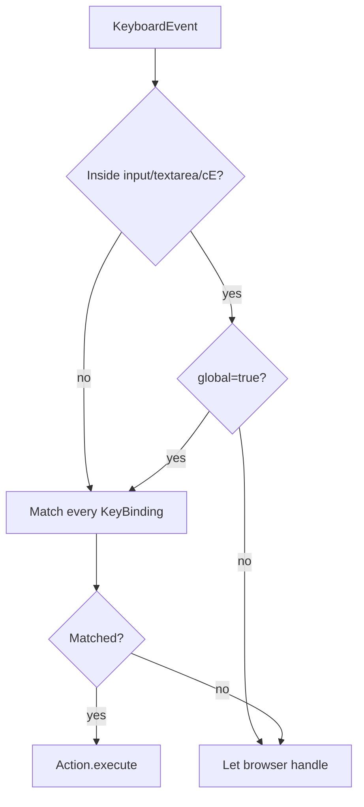

# Shortcuts

> Every AMS shortcut is registered in `src/core/actions/registry/definitions.ts` and dispatched by `useActionDispatcher` via `matchesKeybinding`. **One source of truth feeds menu, palette, ToolStrip, and shortcuts simultaneously.**

::: tip Display vs actual
The `⌘S` you see in menus and the palette is `formatShortcut('⌘S')`'s output — symbols on macOS, `Ctrl+S` on Win/Linux. This page lists both per row, plus the actual `KeyBinding` object that the matcher consumes.
:::

## Full table

### File

| Action                   | macOS | Win/Linux      | KeyBinding                                            | id                 |
| ------------------------ | ----- | -------------- | ----------------------------------------------------- | ------------------ |
| Import Apollo Map        | —     | —              | —                                                     | `importApollo`     |
| Export Apollo Map (.bin) | `⌘S`  | `Ctrl+S`       | `{ key: 's', ctrl: true, global: true }`              | `exportApolloBin`  |
| Export Apollo Map (.txt) | `⇧⌘S` | `Ctrl+Shift+S` | `{ key: 's', ctrl: true, shift: true, global: true }` | `exportApolloText` |
| Settings                 | `⌘,`  | `Ctrl+,`       | `{ key: ',', ctrl: true }`                            | `settings`         |

### Edit

| Action                 | macOS | Win/Linux      | KeyBinding                                            | id             |
| ---------------------- | ----- | -------------- | ----------------------------------------------------- | -------------- |
| Undo                   | `⌘Z`  | `Ctrl+Z`       | `{ key: 'z', ctrl: true, global: true }`              | `undo`         |
| Redo                   | `⇧⌘Z` | `Ctrl+Shift+Z` | `{ key: 'z', ctrl: true, shift: true, global: true }` | `redo`         |
| Delete Selection       | `⌫`   | `Delete`       | `{ key: 'delete' }`                                   | `delete`       |
| Connect Lanes (toggle) | `C`   | `C`            | `{ key: 'c' }`                                        | `connectLanes` |

### View

| Action          | macOS | Win/Linux | KeyBinding                               | id               |
| --------------- | ----- | --------- | ---------------------------------------- | ---------------- |
| Toggle Grid     | `⌘G`  | `Ctrl+G`  | `{ key: 'g', ctrl: true, global: true }` | `toggleGrid`     |
| Toggle Snap     | —     | —         | —                                        | `toggleSnap`     |
| Reset Layout    | —     | —         | —                                        | `resetLayout`    |
| Command Palette | `⌘K`  | `Ctrl+K`  | `{ key: 'k', ctrl: true, global: true }` | `commandPalette` |

### Mode

| Action        | macOS | Win/Linux | KeyBinding     | id            |
| ------------- | ----- | --------- | -------------- | ------------- |
| Default (Pan) | `H`   | `H`       | `{ key: 'h' }` | `defaultMode` |

### Draw tools

| Action          | macOS | Win/Linux | KeyBinding     | id                     |
| --------------- | ----- | --------- | -------------- | ---------------------- |
| Draw Polyline   | `P`   | `P`       | `{ key: 'p' }` | `tool:drawPolyline`    |
| Draw Bezier     | `B`   | `B`       | `{ key: 'b' }` | `tool:drawBezier`      |
| Draw Arc        | `A`   | `A`       | `{ key: 'a' }` | `tool:drawArc`         |
| Draw Rectangle  | `R`   | `R`       | `{ key: 'r' }` | `tool:drawRotatedRect` |
| Draw Polygon    | `G`   | `G`       | `{ key: 'g' }` | `tool:drawPolygon`     |
| Draw CatmullRom | —     | —         | —              | `tool:drawCatmullRom`  |

::: warning `G` collision
Both `Toggle Grid` (`⌘G`) and `Draw Polygon` (`G`) use the letter `G`. The distinguisher is `ctrl: true` — bare `G` switches to polygon, `⌘G` toggles the grid. `matchesKeybinding` strictly compares ctrl/alt/shift/meta.
:::

## Format rule {#format-rule}

`formatShortcut(s)` lives in `src/core/actions/registry/helpers.ts`:

| macOS output | Win/Linux replacement                  |
| ------------ | -------------------------------------- |
| `⌘`          | `Ctrl+`                                |
| `⇧`          | `Shift+`                               |
| `⌥`          | `Alt+`                                 |
| `⌃`          | `Ctrl+` (rarely used; not used in AMS) |

Example: `⇧⌘S` → macOS shows `⇧⌘S`, Win/Linux shows `Ctrl+Shift+S`.

`isMacPlatform()`: `navigator.platform.includes('Mac')`.

## Global vs local

`global: true` on a `KeyBinding` controls whether the shortcut still fires inside an `input` / `textarea` / `contentEditable`.

| Situation             | global=true                         | global=false                |
| --------------------- | ----------------------------------- | --------------------------- |
| Focus inside an input | ✅ fires                            | ❌ browser handles          |
| Outside an input      | ✅ fires                            | ✅ fires                    |
| Typical use           | Undo / Redo / Save / CommandPalette | Single-letter tool switches |

::: tip Why Undo is global
Even with focus on the Inspector's speed-limit input, the user expects `Ctrl+Z` to undo a map edit — not an input edit. So `undo` / `redo` are flagged `global: true` deliberately.
:::

## Match implementation

```ts
function matchesKeybinding(b: KeyBinding, ev: KeyBindingEvent): boolean {
  const wantCtrl = b.ctrl ?? false;
  const wantShift = b.shift ?? false;
  const wantAlt = b.alt ?? false;
  const wantMeta = b.meta ?? false;
  return (
    ev.key.toLowerCase() === b.key.toLowerCase() &&
    ev.ctrl === (wantCtrl || (isMac && b.cmdOrCtrl ? false : wantCtrl)) &&
    ev.shift === wantShift &&
    ev.alt === wantAlt &&
    ev.meta === wantMeta
  );
}
```

Real implementation in `src/core/actions/registry/helpers.ts`. On macOS, `ctrl: true` resolves to `metaKey` (⌘) so `⌘S` (mac) and `Ctrl+S` (Linux) share one definition.

## Precedence



## Steps

1. Just press the keys — no need to click first.
2. Hold modifier(s) + tap the main key.
3. macOS uses `⌘`; Win/Linux uses `Ctrl`.
4. Modifier order doesn't matter when chording.
5. Case-insensitive (`G` / `g` both work).

## Customization

::: warning Not yet runtime-customizable
Shortcuts come from the static `definitions.ts` registry. There is no UI-level remapping yet. To customize:

1. Edit `keybinding` of the relevant ActionDef.
2. Update the `shortcut` field (display only).
3. Restart the dev server / rebuild.

Runtime shortcut remapping is not exposed yet; treat shortcuts as fixed application configuration in the current release.
:::

## Troubleshooting

| Symptom                            | Cause                                         | Fix                                                                         |
| ---------------------------------- | --------------------------------------------- | --------------------------------------------------------------------------- |
| Single-letter shortcut ignored     | Focus is in input/textarea                    | Click on the map; or set `global: true` on the ActionDef                    |
| `⌘S` triggers browser save dialog  | Browser ate the event                         | AMS already calls `event.preventDefault()` in dispatcher; verify on desktop |
| `G` toggles grid AND draws polygon | Wrong modifier — they're separate keybindings | `⌘G` = grid, bare `G` = polygon                                             |
| In Chinese IME `P` does nothing    | IME swallows the event                        | Switch IME to English                                                       |
| `⌘+` zooms the page                | Browser native zoom                           | Disabled in the desktop (Electron) build                                    |

## Source

- `src/core/actions/registry/definitions.ts` — all ActionDefs + keybindings
- `src/core/actions/registry/helpers.ts` — `formatShortcut` / `matchesKeybinding` / `isMacPlatform` / `getKeyBindingActions`
- `src/hooks/useActionDispatcher.ts` — global key listener + dispatch
- `src/components/layout/panels/CommandPalette.tsx:54-66` — palette's own `⌘K`
- `src/components/layout/WorkspaceLayout.tsx:63-77` — backup `⌘K` listener

## Contextual keys

The keys below are **not** in the Action Registry; they are consumed directly by the FSM (`editorMachine`) or the map event router (`useMapEventRouter`):

| Key                        | Context  | Behavior                                                                | Source                    |
| -------------------------- | -------- | ----------------------------------------------------------------------- | ------------------------- |
| `Esc`                      | Any      | Cancel current draw / close modal / exit connect-lanes                  | `editorMachine` `CANCEL`  |
| `Enter`                    | Drawing  | CONFIRM current geometry (equivalent to dblclick)                       | `editorMachine` `CONFIRM` |
| `Space`                    | Drawing  | Insert a subdivision on an existing control point                       | `useMapEventRouter`       |
| Mouse wheel                | Any      | Zoom                                                                    | MapLibre built-in         |
| Middle-click drag          | Any      | Pan                                                                     | MapLibre built-in         |
| `Shift` + drag             | Selected | Proportional scale                                                      | MapLibre handle           |
| `Alt` + drag               | Editing  | Mirror constraint (see [Editing & Snapping](./editing-and-snapping.md)) | `useDragHandle`           |
| Double-click control point | Editing  | Delete the control point                                                | `useDragHandle`           |
| Double-click empty space   | Drawing  | CONFIRM                                                                 | `editorMachine`           |

::: tip Why not in the Action Registry
These don't enter `definitions.ts` because they are 1) context-dependent, 2) tightly coupled to layer mouse events, and 3) not menu/palette-worthy. Registering them would just clutter fuzzy search.
:::

## Debug helpers

Dev builds expose globals on `window`:

| Global                 | Meaning           | Use                                                      |
| ---------------------- | ----------------- | -------------------------------------------------------- |
| `window.__editorActor` | XState actor      | `__editorActor.getSnapshot().value` to inspect FSM state |
| `window.__map`         | MapLibre instance | `__map.flyTo({...})`                                     |
| `window.useMapStore`   | mapStore hook     | `useMapStore.getState().entities.size`                   |

## See also

- [Keyboard Shortcuts](./keyboard-shortcuts.md) — cross-platform mapping alias
- [MenuBar & ToolStrip](./menubar-and-toolstrip.md) — same ActionDef, menu / strip surface
- [Command Palette](./command-palette.md) — `⌘K`
- [Settings](./settings.md) — `⌘,`
- [Editing & Snapping](./editing-and-snapping.md) — mouse + modifier combos
- [Drawing Lanes](./drawing-lanes.md) — Esc / Enter / Space semantics during drawing

## Pre-release shortcut audit

Before each release, verify each row:

| ✓   | Check                                                           |
| --- | --------------------------------------------------------------- |
| ☐   | `⌘K` opens the command palette                                  |
| ☐   | `⌘S` triggers export .bin                                       |
| ☐   | `⇧⌘S` triggers export .txt                                      |
| ☐   | `⌘Z` undoes from both canvas and Inspector inputs               |
| ☐   | `⇧⌘Z` redoes                                                    |
| ☐   | `⌫` deletes the selected entity                                 |
| ☐   | `H` returns to default mode                                     |
| ☐   | `C` toggles connect-lanes                                       |
| ☐   | `P / B / A / R / G` switches draw tools when a lane is selected |
| ☐   | `⌘G` toggles the grid                                           |
| ☐   | `⌘,` opens Settings                                             |
| ☐   | `Esc` cancels drawing; closes dialogs                           |
| ☐   | mac vs Win/Linux symbol display matches                         |

## Platform compatibility

| Browser / desktop | Status                                                                       |
| ----------------- | ---------------------------------------------------------------------------- |
| Chrome 130+       | ✅ Full                                                                      |
| Edge 130+         | ✅ Full                                                                      |
| Firefox 130+      | ⚠ Cmd+S triggers native save dialog unless `preventDefault`; already handled |
| Safari 18+        | ⚠ ⌥ modifier has IME side-effects; prefer English IME                        |
| Electron 41       | ✅ Full and disables browser native zoom by default                          |

## Known conflicts

| Platform      | OS shortcut            | AMS behavior                          |
| ------------- | ---------------------- | ------------------------------------- |
| macOS         | `⌘Q` quits the app     | Not intercepted; quits normally       |
| macOS         | `⌘W` closes window     | Electron close                        |
| Windows       | `Alt+F4` closes window | Same                                  |
| Windows       | `Win+L` lock screen    | OS-level — AMS untouched              |
| All platforms | `Tab`                  | Focus traversal — not an AMS shortcut |

## Design principles

1. **Single letters for tools** — P/B/A/R/G/H/C, Photoshop-style.
2. **Modifier + letter for operations** — ⌘S/⌘Z/⌘G.
3. **Modifiers must be declared explicitly** — strict match avoids accidental fires.
4. **`global` only for cross-context ops** — Undo / Save / Palette.
5. **Shortcuts are the 4-in-1 with menu/strip/palette** — one ActionDef wires all four surfaces.

## Comparison with other surfaces

| Surface                 | Uses ActionDef?                              | Shows shortcut? |
| ----------------------- | -------------------------------------------- | --------------- |
| MenuBar                 | ✅                                           | ✅              |
| ToolStrip View slot     | ✅                                           | ✅ (tooltip)    |
| ToolStrip element icons | ❌ (direct from element table)               | ❌              |
| ToolStrip draw tools    | ✅ (indirect via `getToolAction`)            | ✅              |
| CommandPalette          | ✅                                           | ✅              |
| Inspector               | ❌                                           | ❌              |
| Settings panel          | ❌ (it's an ActionDef, but inner form isn't) | ❌              |

## Shortcut origin

Display vs match are tracked separately:

| Field                                  | Use                                  | Source                       |
| -------------------------------------- | ------------------------------------ | ---------------------------- |
| `shortcut: '⌘S'`                       | Display in menus / palette / tooltip | rendered by `formatShortcut` |
| `keybinding: { key: 's', ctrl: true }` | Actual keydown match                 | `matchesKeybinding`          |

::: warning Keep them in sync
Editing `keybinding` without updating `shortcut` leaves the UI showing the old combo while the new combo silently fires. Treat both fields as one change whenever a shortcut changes.
:::

## Co-located vs non-co-located

| Origin               | Example                                 | Goes through ActionDef?         |
| -------------------- | --------------------------------------- | ------------------------------- |
| Action Registry      | `⌘S` / `⌘Z` etc                         | ✅                              |
| FSM contextual event | `Esc` / `Enter` / `Space` while drawing | ❌ (sent directly to the actor) |
| MapLibre builtin     | Wheel zoom / middle-click pan           | ❌                              |
| dockview builtin     | Double-click panel title                | ❌                              |
| Browser native       | `⌘+/-` zoom                             | Disabled on desktop             |
