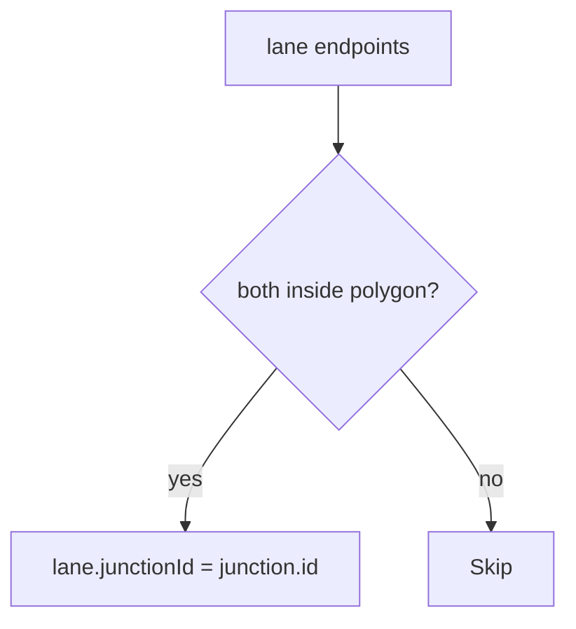
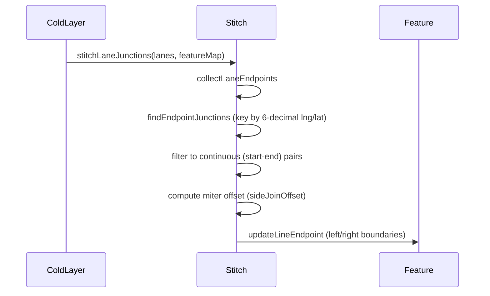
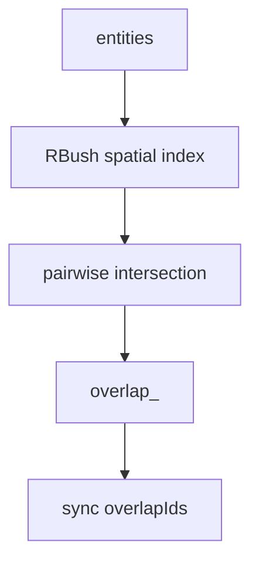

# Topology & junctions

This page covers **junction geometry** (junction, pncJunction, area) and **lane-junction stitching**. The base lane topology fields live in [Topology](./topology.md).

## Two kinds of junction

| Type           | Purpose                                 | Editor entity       |
| -------------- | --------------------------------------- | ------------------- |
| `junction`     | Physical intersection polygon           | `JunctionEntity`    |
| `pnc_junction` | Planning & Control view of the junction | `PNCJunctionEntity` |
| `area`         | Generic region                          | `AreaEntity`        |

## Steps

### 1. Draw a junction polygon

ToolStrip → `junction` → `drawPolygon`. Click for vertices, double-click or `Enter` to close (`polygonCanClose` guard).

```ts
interface JunctionEntity {
  id: string;
  entityType: 'junction';
  polygon: ApolloPolygon;
  type?: 'UNKNOWN' | 'IN_ROAD' | 'CROSS_ROAD' | 'FORK_ROAD' | 'MAIN_SIDE' | 'DEAD_END';
  overlapIds: string[];
}
```

### 2. `lane.junctionId` derivation

Both `central_curve` endpoints are tested PIP against every `junction.polygon`. Both inside ⇒ `lane.junctionId = junction.id`. Half-inside lanes stay unassigned.



### 3. stitchLaneJunctions

`src/core/geometry/laneJunctions.ts` runs during cold-layer rebuild and pulls continuous end-start pairs to a shared miter point.



::: warning Start-start / End-end exclusion
`isContinuousJunction(a, b)` returns `true` only when `a.isStart !== b.isStart`. Start-start forks and end-end merges are excluded — pulling those boundaries to a shared miter point would corrupt the visible split/merge geometry (`laneJunctions.ts:88-90`).
:::

### 4. PNC junction passage groups

```ts
interface PassageGroup {
  id: string;
  passages: Passage[];
}
interface Passage {
  id: string;
  signalIds: string[];
  yieldIds: string[];
  stopSignIds: string[];
  laneIds: string[];
  type: 'UNKNOWN_PASSAGE' | 'ENTRANCE' | 'EXIT';
}
```

PNC junctions are higher-level than `junction`: each `passageGroup` represents a synchronised set of allowed lane sequences. The Inspector exposes add/remove controls for groups and passages (`InspectorForms.tsx`).

### 5. Overlap reconciliation



Derived ID convention: `overlap_<sortedParticipantIds>`. Participants get the overlap ID written into their own `overlapIds`. `_userOverrides` (`overridePaths.ts`) locks specific paths from being clobbered by future reconciles.

## Options table

| Field                          | Type                  | Notes                                                                                                                                                 |
| ------------------------------ | --------------------- | ----------------------------------------------------------------------------------------------------------------------------------------------------- |
| `JunctionType`                 | enum                  | UNKNOWN / IN_ROAD / CROSS_ROAD / FORK_ROAD / MAIN_SIDE / DEAD_END                                                                                     |
| `junction.polygon`             | `ApolloPolygon`       | `points: PointENU[]`                                                                                                                                  |
| `lane.junctionId`              | `string \| null`      | derived via PIP                                                                                                                                       |
| `overlap.objects[].objectType` | union                 | lane / signal / stopSign / crosswalk / junction / yieldSign / clearArea / speedBump / parkingSpace / pncJunction / rsu / area / barrierGate / unknown |
| `overlap.regionOverlaps[]`     | `RegionOverlapInfo[]` | region overlaps (lane↔crosswalk polygons)                                                                                                             |
| `_userOverrides`               | `string[]`            | locked paths (reconcile skips)                                                                                                                        |
| `pncJunction.passageGroups`    | `PassageGroup[]`      | groups of passages by phase                                                                                                                           |

## Shortcut cheatsheet

| Action                | Key / Mouse                        | Notes                  |
| --------------------- | ---------------------------------- | ---------------------- |
| Draw junction         | ToolStrip `junction` + click + dbl | drawPolygon            |
| Draw PNC junction     | ToolStrip `pncJunction`            | drawPolygon            |
| Bind lane to junction | drag endpoint into polygon         | automatic PIP          |
| Add passage           | Inspector edit                     | `pncJunction` selected |
| Move polygon vertex   | select junction → drag             | `editingPoint`         |

## Troubleshooting

### Half-in lane assigned wrongly

Won't happen — derivation requires both endpoints inside.

### Stale `junctionId` after polygon move

Should trigger incremental reconcile; if stale, run a full reconcile.

### Stitch broke a fork

`isContinuousJunction` should filter start-start pairs. Check `laneJunctions.ts:88-90`.

### Overlap ID changes between import/export

ID generation is deterministic given sorted participant IDs. Check participant ID stability.

### `_userOverrides` ignored

Path strings must match exactly (e.g. `"objects.0.laneOverlapInfo.isMerge"`).

## Source links

- `src/core/geometry/laneJunctions.ts`
- `src/core/geometry/laneJunctions/internal.ts`
- `src/core/elements/overlap/`
- `src/core/elements/overlap/overridePaths.ts`
- `src/core/elements/derive/rules/`
- `src/components/layout/panels/InspectorForms.tsx`
- `src/types/apollo.ts:166-194` (junction), `:402-424` (pncJunction), `:347-398` (overlap)

## See also

- [Topology](./topology.md)
- [Drawing lanes](./drawing-lanes.md)
- [Layer tree](./layer-tree.md)
- [Map elements](./map-elements.md)
