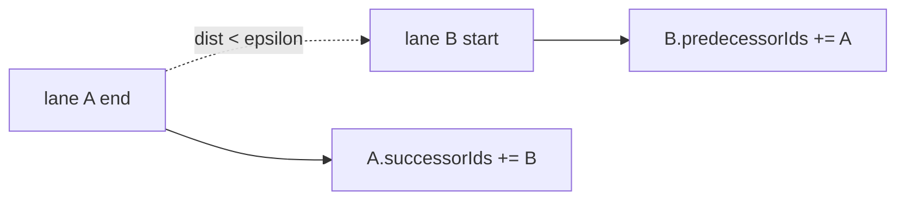

# Topology

Apollo Map Studio derives lane topology fields from geometry rather than relying on hand-filled IDs. `mapStore.addEntity / updateEntity / removeEntity` triggers `reconcileLaneTopologyIncremental` for the affected set; the import/export worker runs the full `reconcileLaneTopology`.

## Fields

From `src/types/apollo.ts:118-164`:

| Field | Geometry rule |
| ------------------------- | -------------------------------------------------------------- | -------- | ----- |
| `predecessorIds` | start point coincides with another lane's end (within epsilon) |
| `successorIds` | end point coincides with another lane's start |
| `selfReverseLaneIds` | central curves overlap, headings opposite |
| `leftNeighborForwardIds` | left side, | Δheading | < 90° |
| `rightNeighborForwardIds` | right side, same direction |
| `leftNeighborReverseIds` | left side, | Δheading | > 90° |
| `rightNeighborReverseIds` | right side, opposite direction |
| `junctionId` | both endpoints inside a junction polygon |

## Derivation rules

### Predecessor / successor

Endpoints within ~1e-6 deg (~11 cm) on the WGS84 sphere are considered coincident. The reconcile pass writes both `A.successorIds += B` and `B.predecessorIds += A`.



### Self-reverse

`selfReverseLaneIds` covers Apollo's "two-lane bidirectional segment" pattern where two lanes share the same geometry but point in opposite directions. The reconcile detects this by sampling central-curve points and verifying near-identical positions plus opposite heading.

### Neighbour classification

For each candidate pair the reconcile compares the lane heading (`atan2` of first→last centreline delta). |Δheading| < 90° ⇒ same direction; > 90° ⇒ reverse. Side (left/right) is the cross product of heading and the centre-to-centre vector at the closest pair of points.

```mermaid
flowchart TD
  L1[lane A heading θa] --> Diff{|θa-θb|}
  Diff -- "< 90°" --> Same[same direction]
  Diff -- "> 90°" --> Rev[reverse]
  Same --> SideS{lane B left/right?}
  Rev --> SideR{lane B left/right?}
  SideS -- left --> LF[leftNeighborForward]
  SideS -- right --> RF[rightNeighborForward]
  SideR -- left --> LR[leftNeighborReverse]
  SideR -- right --> RR[rightNeighborReverse]
```

### Junction membership

Both `central_curve` endpoints are tested with point-in-polygon against every `junction.polygon`. Both-inside ⇒ `junctionId = junction.id`.

## Steps

### Automatic derivation

Just draw, move, or delete; topology updates incrementally.

### Connect Lanes mode

ToolStrip `C` (`connectLanes` action) toggles a "click two lanes to connect" mode for cases where geometry alone doesn't capture intended succession (merge lanes, virtual links).

```mermaid
sequenceDiagram
  User->>Toolbar: press C / click Connect
  Toolbar->>FSM: connectLanes mode on
  User->>Canvas: click lane A
  Canvas->>Router: store first
  User->>Canvas: click lane B
  Canvas->>Router: A.successorIds += B; B.predecessorIds += A
  Router->>Store: mapStore.update
  Store->>Rec: reconcileLaneTopologyIncremental
```

### Inspector references

Select a lane → right-side Inspector lists every `*Ids` array as clickable references (`LaneRefList.tsx`). Click any ID to jump.

## Options table

| Field | Type | Source | Notes |
| ------------------------- | -------------- | ----------------- | --------------------------------------------------------- | -------- | ----- |
| `predecessorIds` | `string[]` | derived + Connect | written bidirectionally |
| `successorIds` | `string[]` | derived + Connect | written bidirectionally |
| `selfReverseLaneIds` | `string[]` | derived | overlap + reverse |
| `leftNeighborForwardIds` | `string[]` | derived | | Δheading | < 90° |
| `rightNeighborForwardIds` | `string[]` | derived | same direction |
| `leftNeighborReverseIds` | `string[]` | derived | | Δheading | > 90° |
| `rightNeighborReverseIds` | `string[]` | derived | opposite direction |
| `junctionId` | `string\|null` | derived | both endpoints inside polygon |
| `overlapIds` | `string[]` | reconcileOverlaps | see [Topology and junctions](./topology-and-junctions.md) |

## Shortcut cheatsheet

| Action              | Key / Mouse             | Notes                 |
| ------------------- | ----------------------- | --------------------- |
| Connect mode toggle | `C`                     | `connectLanes` action |
| Exit Connect        | `C` again / `Esc`       | toggle off            |
| Jump to reference   | click in inspector list | `LaneRefList`         |
| Select lane         | click central curve     | `SELECT_ENTITY`       |

## Troubleshooting

### Aligned endpoints but no successor

Endpoint distance exceeds epsilon. Confirm snap actually pulled the endpoints together.

### Neighbour written on wrong side

`LaneEntity.direction` is wrong; reconcile uses central-curve heading. Fix `direction` first.

### Stale predecessor after delete

`removeEntity` should trigger incremental reconcile. If stale, check the worker incremental path.

### Connect mode shows no preview line

Current implementation writes IDs only; geometry is unchanged. Cold layer renders on next frame.

### dreamview reports orphan lane

Reconcile doesn't manage `road.section.laneIds` — that's the LayerTree's responsibility.

## Source links

- `src/types/apollo.ts:118-164`
- `src/core/elements/derive/`
- `src/io/apolloIO.worker.ts`
- `src/components/layout/panels/LaneRefList.tsx`
- `src/hooks/mapEventRouter/connectMode.ts`

## See also

- [Topology and junctions](./topology-and-junctions.md)
- [Drawing lanes](./drawing-lanes.md)
- [Layer tree](./layer-tree.md)
- [Map elements](./map-elements.md)
