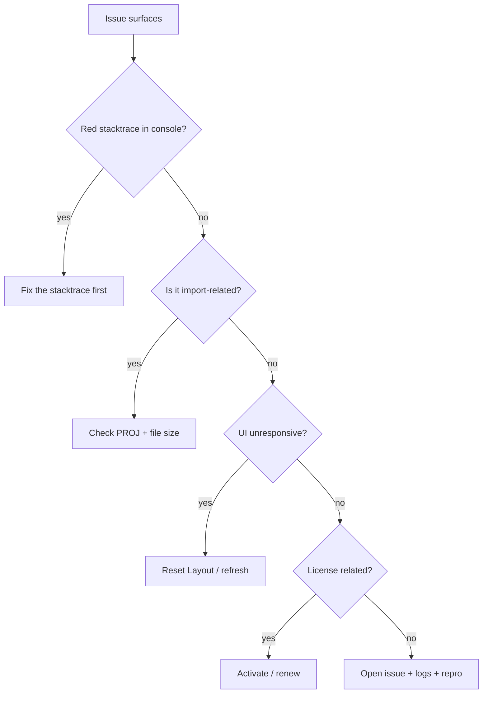

# Troubleshooting

> Issues are organised by **where they first surface** + **actual root cause**. Each entry covers minimal repro, diagnostic checks, immediate mitigation, permanent fix. If your problem isn't here: read the first red stacktrace in DevTools console, then search [GitHub Issues](https://github.com/apollo-map-studio/apollo-map-studio/issues).

::: tip Filing issues
Please include:

1. AMS version (`Help → About` or `package.json#version`)
2. Browser / Electron version
3. Full console stacktrace
4. Reproduction steps
5. base_map file size (a redacted attachment helps if possible)
   :::

## 1. Worker boot failures

### Symptom

White page; console:

```
Failed to construct 'Worker': Module script's response has type 'text/html'
DOMException: Failed to construct 'Worker': Script at … cannot be accessed from origin 'null'
```

### Root cause

Vite dev mode loads workers as ES modules: `new Worker(new URL('...', import.meta.url), { type: 'module' })`. Path resolution requires `import.meta.url`. Opening a static `dist/index.html` directly (`file://`) breaks it.

### Mitigation

- Use `pnpm dev` (always served via localhost:5173).
- For desktop, use the packaged Electron exe — never open dist/index.html directly.

### Permanent fix

Don't bypass the dev server / Electron loader. If you must serve statically, run `pnpm build` and serve via any HTTP server (not `file://`).

## 2. WASM / Proto loader

### Symptom

When `import` or `apolloIO.worker.ts` starts:

```
Error loading map.proto: net::ERR_FAILED
GET .../map_geometry.proto 404
```

### Root cause

`proto/loader.ts` uses `protobufjs/light` to load `.proto` files at runtime. Vite copies them via `?url` or `?raw` imports. If `vite.config.ts#assetsInclude` is broken, .proto files don't ship.

### Mitigation

- Confirm `vite.config.ts#assetsInclude: ['**/*.proto']` is intact.
- Inspect `dist/assets/` for hashed `.proto` files.

### Permanent fix

Restore `assetsInclude` and rebuild.

## 3. Projection mismatch

### Symptom

- After import, the map flies off to Antarctica or the ocean.
- Status bar shows `lane=… road=…` populated but the canvas has no lanes.
- After export, Apollo runtime says "lat/lng out of range".

### Root cause

Apollo's `Header.projection.proj` is a PROJ.4 string. AMS uses `proj4` to inverse-project UTM meters to WGS84 lng/lat. If the file's header is missing, the field was edited, or template placeholders like `{37.413082}` aren't sanitized, you get the wrong projection.

`projection.ts:10-12`'s `sanitizeProjString` already strips braces; if the file has no PROJ at all, AMS falls back to `UTM_PRESETS.beijing` (zone 50N).

### Mitigation

1. Hover over the `apolloInfo.filename` area on the status bar to see the active PROJ.
2. If it's wrong:
   - Re-import → wait for the `ProjPickerDialog` → pick manually.
   - Or use a `UTM_PRESETS` value (sunnyvale / shanghai / shenzhen / beijing).

### Permanent fix

Make sure the upstream base_map's `Header.projection.proj` is set correctly. See [Coordinate System](./coordinate-system.md).

## 4. Undo glitch

### Symptom

After `Ctrl+Z`:

- The lane visually rolls back.
- Inspector shows old fields.
- **Next CONFIRM** during drawing produces a corrupt entity (control points stacked, length=0).

### Root cause (fixed; this entry documents the regression)

Older Undo path didn't send FSM `CANCEL`. `editorMachine.context.drawPoints` retained stale data while `mapStore.entities` rolled back. The next CONFIRM applied stale points to a fresh entity.

Fix in `useActionDispatcher.ts:76-82`:

```ts
case 'undo': {
  actorRef.send({ type: 'CANCEL' });   // R1 closure
  useMapStore.temporal.getState().undo();
  return;
}
```

### Verification

`src/hooks/__tests__/undoCancel.test.ts` must stay green. If it ever flakes, this case was inadvertently rewritten.

## 5. License expired

### Symptom

- Red banner: `License expired — read-only mode`.
- Inspector inputs greyed out.
- Drawing tools click but commit doesn't enter the store.

### Root cause

`license.json.expires < Date.now()`, `canEdit=false`.

### Mitigation

- Renew with the vendor.
- Lifeboat: `File → Export Apollo Map (.bin)` is **still allowed** (export is not gated on license) — save your work first.

### Permanent fix

See [License Activation](./license-activation.md). Paste a new code; banner turns green.

## 6. Dockview corruption

### Symptom

- Only the MenuBar shows; the center is blank.
- Console: `Cannot read properties of null (reading 'addPanel')` or similar.
- Switching Drawing/Scene doesn't help.

### Root cause

`apollo-map-studio:layout:drawing` / `apollo-map-studio:layout:scene` JSON in `localStorage` is corrupt (manual edit, version mismatch).

### Mitigation

`View → Reset Layout`. If even the menu is dead:

```js
localStorage.removeItem('apollo-map-studio:layout:drawing');
localStorage.removeItem('apollo-map-studio:layout:scene');
location.reload();
```

### Permanent fix

Don't hand-edit layout keys. Version upgrades fall back automatically, but extreme jumps may still need a wipe.

## 7. FSM stuck

### Symptom

- Mouse clicks don't drop control points.
- Status bar Left 2 shows `Draw: Polyline` but the dot is not pulsing.
- ESC / H / tool switches don't respond.

### Root cause

`editorMachine` transitioned but React didn't re-render — typically a Suspense fallback caused an event queue desync (rare).

### Mitigation

- Press `H` to fall back to Default Mode (events still fire even without visual feedback).
- If still stuck, refresh the page.

### Diagnose

In DevTools console:

```js
window.__editorActor?.getSnapshot().value;
```

(only dev build exposes `__editorActor`)

## 8. Map disappears

### Symptom

After pan / zoom the canvas turns black.

### Root cause

MapLibre WebGL context lost (GPU driver hiccup / tab in background too long).

### Mitigation

- Scroll once to force invalidation.
- Else `View → Reset Layout` (rebuild DockviewReact → rebuild MapLibre).

### Permanent fix

Update the browser / GPU driver; on Electron, use the latest build.

## 9. Import timeout

### Symptom

Importing a >100 MB file fails after ~10 minutes with `Apollo IO request timed out after 600000ms`.

### Root cause

`apolloIOBridge.ts:14`: `DEFAULT_TIMEOUT_MS = 10 * 60_000`.

### Mitigation

- Bump the timeout: source build edit line 14, or hot-patch the `apolloIOBridge` instance from console (dev only).
- Split the map upstream with `bazel run //modules/map/tools:map_split`.

## 10. Command Palette dead

### Symptom

`⌘K` does nothing.

### Root cause

- A contentEditable / iframe ate the event.
- License `tampered` made `useLicenseSync` throw and broke the dispatcher.

### Mitigation

- Click the map first; press `⌘K` again.
- Look for red stacktrace in console; if any, fix the license issue first.

## 11. Inspector stale

### Symptom

You select lane A on the map, but Inspector still shows lane B.

### Root cause

`mapStore` and `editorMachine.context.selectedEntityId` update asynchronously — race window. Rare; usually self-resolves within 1 second.

### Mitigation

- Click A again.
- Switch to Default Mode and re-select.

## 12. Download silent

### Symptom

Export progress hits 100% but no download starts.

### Root cause

`downloadBlob` uses `<a download>`; site permission denied auto-downloads.

### Mitigation

- Click the "Allow" prompt that the browser shows in the URL bar.
- In Chrome: Settings → Privacy → Site Settings → Automatic Downloads → allow.

## 13. macOS Gatekeeper

### Symptom

After installing dmg, `.app` opens with:

```
"Apollo Map Studio" cannot be opened because the developer cannot be verified.
```

### Root cause

Unsigned / not notarized.

### Mitigation

```
xattr -d com.apple.quarantine /Applications/Apollo\ Map\ Studio.app
```

### Permanent fix

Use an officially signed package — see [Installation](./installation.md).

## 14. Linux AppImage no icon

### Symptom

`./AppImage` launches but no taskbar icon.

### Root cause

KDE/GNOME doesn't always pick up the desktop entry inside an AppImage.

### Mitigation

```bash
sudo apt install libfuse2
chmod +x AMS-x.y.z.AppImage
./AMS-x.y.z.AppImage --appimage-extract-and-run
```

Or install [AppImageLauncher](https://github.com/TheAssassin/AppImageLauncher) for auto-registration.

## Diagnose flow



## Persistence

Keys you may need to nuke when debugging:

| Key                                | Scenario               |
| ---------------------------------- | ---------------------- |
| `apollo-map-studio:layout:drawing` | dockview corruption    |
| `apollo-map-studio:layout:scene`   | same                   |
| `apollo-map-studio:*`              | misconfigured settings |

## Source

- `src/io/apolloIO.worker.ts` — worker exception source
- `src/io/apolloIOBridge.ts:108-122` — worker.onerror
- `src/io/proto/loader.ts` — proto/wasm loader
- `src/io/proto/projection.ts` — PROJ.4 parsing
- `src/hooks/useActionDispatcher.ts:76-82` — Undo R1 closure
- `electron/main/license/` — main-process license
- `src/components/layout/WorkspaceLayout/dockviewLayout.ts` — layout persistence

## See also

- [Importing](./importing.md) — full import pipeline
- [Exporting](./exporting.md) — full export pipeline
- [License Activation](./license-activation.md) — license-specific issues
- [Activity Bar & Panels](./activity-bar-and-panels.md) — Reset Layout
- [Settings](./settings.md) — settings keys
