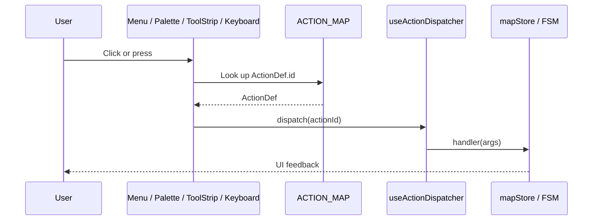

# Adding a New Action

`src/core/actions/registry.ts` is the **single source of truth** for every
user-triggerable command in Apollo Map Studio. The menu bar, command palette,
`ToolStrip`, and keyboard handler all consume `ActionDef` from this registry.
Adding a command means **editing one file**, not pasting JSX into five
components.

::: tip Design principle
Actions are **declarative**. You describe the command — its label, menu, key,
icon — and the registry dispatches it. If you find yourself writing
`if (id === 'foo.bar')` branches inside a component, redesign: split the
branch into a new ActionDef, or push the dispatch logic into the handler.
:::

## Goal

By the end of this recipe you will have a "Duplicate Selection" command that
appears under **Menu Bar → Edit**, is bound to `Ctrl+Shift+D` (`⌘⇧D` on macOS),
and shows up in the command palette.

## Prerequisites

- You have read [Architecture Overview](../architecture/overview) and
  understand the `core/` vs `components/` boundary.
- You can run `pnpm install && pnpm dev` and the editor opens.
- You know the difference between `mapStore` and `uiStore` (see
  [State Management](../architecture/state-management)).

## Action dispatch flow



All four entry points share the same `ACTION_MAP`. Get the ActionDef right and
every surface lights up.

## Step-by-step

### 1. Pick a stable id

IDs are `category.verb`, globally unique. Naming conventions:

| Category    | Use                              | Example             |
| ----------- | -------------------------------- | ------------------- |
| `file`      | Import / export / new / open     | `file.importApollo` |
| `edit`      | Undo / redo / duplicate / delete | `edit.duplicate`    |
| `view`      | Zoom / toggle layers / themes    | `view.toggleGrid`   |
| `tool`      | Enter a draw FSM state           | `tool.drawLane`     |
| `selection` | Selection set operations         | `selection.invert`  |

We are adding `edit.duplicateSelection`.

### 2. Append the ActionDef

```ts
// src/core/actions/registry/definitions.ts
import type { ActionDef } from './types';

export const ACTION_DEFS: ActionDef[] = [
  // ... existing entries
  {
    id: 'edit.duplicateSelection',
    label: 'Duplicate Selection',
    category: 'edit',
    menu: 'Edit',
    menuOrder: 35,
    icon: 'Copy',
    keybinding: { key: 'd', shiftKey: true, ctrlOrMeta: true },
    inCommandPalette: true,
    description: 'Clone the selected entity offset by 1 m',
  },
];
```

::: warning Never rename a published id
IDs are anchors in user config files, URLs, and E2E tests. Renaming breaks
backward compatibility. If you must rename, ship an alias and keep it for at
least two release cycles.
:::

### 3. Wire the handler in the dispatcher

```ts
// src/hooks/useActionDispatcher.ts
import { duplicateEntity } from '@/lib/entityOps';

export function useActionDispatcher() {
  const dispatch = useCallback((id: ActionId) => {
    switch (id) {
      // ...
      case 'edit.duplicateSelection': {
        const selectedId = uiStore.getState().selectedEntityId;
        if (!selectedId) return;
        mapStore.getState().addEntity(duplicateEntity(selectedId));
        return;
      }
    }
  }, []);
  return dispatch;
}
```

::: danger Never call mapStore directly from components
Every store mutation MUST go through the dispatcher. That single chokepoint
is where telemetry, undo grouping, and permission gating will land — keep it
free of bypasses.
:::

### 4. Write a unit test

```ts
// src/core/actions/__tests__/registry.test.ts
import { ACTION_MAP, getMenuActions, getCommandPaletteActions } from '../registry';

it('exposes duplicate action in Edit menu', () => {
  const editMenu = getMenuActions('Edit').map((a) => a.id);
  expect(editMenu).toContain('edit.duplicateSelection');
});

it('lists duplicate in the command palette', () => {
  const palette = getCommandPaletteActions().map((a) => a.id);
  expect(palette).toContain('edit.duplicateSelection');
});

it('parses Ctrl+Shift+D keybinding', () => {
  const def = ACTION_MAP.get('edit.duplicateSelection');
  expect(def?.keybinding).toMatchObject({ key: 'd', shiftKey: true, ctrlOrMeta: true });
});
```

### 5. Cross-platform key check

`ctrlOrMeta` maps to ⌘ on macOS and Ctrl on Linux/Windows automatically.
Do **not** hard-code `metaKey: true` — Linux users with a Super key would
trigger it accidentally and macOS Ctrl users would never hit it. See
[Customizing Shortcuts](./customizing-shortcuts).

### 6. Smoke test in the command palette

1. `pnpm dev`.
2. `Ctrl+K` to open the palette.
3. Type "duplicate" — your command should appear.
4. Select an entity, press `Ctrl+Shift+D`. A new entity must appear in
   `mapStore`.

## Files modified

| File                                          | Change            |
| --------------------------------------------- | ----------------- |
| `src/core/actions/registry/definitions.ts`    | Append ActionDef  |
| `src/hooks/useActionDispatcher.ts`            | New case branch   |
| `src/lib/entityOps.ts`                        | New helper (opt.) |
| `src/core/actions/__tests__/registry.test.ts` | New assertions    |

::: tip Files you should NOT touch

- `MenuBar.tsx` — auto-rendered from `getMenuActions(menu)`.
- `CommandPalette.tsx` — auto-rendered from `getCommandPaletteActions()`.
- `ToolStrip.tsx` — only displays ActionDefs that carry a `drawTool`.

If you find yourself editing those, you bypassed the registry. Stop and go
back to step 2.
:::

## Testing checklist

- [ ] `pnpm typecheck` passes — `ActionId` literal union includes the new id.
- [ ] `pnpm test src/core/actions` passes.
- [ ] Manual: menu item visible, palette finds it, key triggers it.
- [ ] Re-test on macOS using `⌘⇧D`.
- [ ] Close the palette and trigger the shortcut to confirm the dispatcher
      still fires.

## Common pitfalls

### Action does not appear in the menu

Nine times out of ten the `menu` field is mistyped (case-sensitive) or
`menuOrder` collides with an existing entry. Inspect registered menus:

```ts
import { getMenuNames } from '@/core/actions/registry';
console.log(getMenuNames()); // ['File', 'Edit', 'View', ...]
```

### Shortcut never fires

- An input is focused; global shortcuts are suppressed by default. Add
  `allowInInput: true` to the ActionDef if you really want to bypass that.
- Native browser shortcut conflict (`Ctrl+W`, `Ctrl+T`). Pick another combo.
- Mac vs Win key mapping is wrong; verify
  [`matchesKeybinding`](https://github.com/SakuraPuare/apollo-map-studio/blob/main/src/core/actions/registry/helpers.ts).

### Palette does not find the command

`inCommandPalette` defaults to `false`. Set it to `true` explicitly.

### Undo skips the action

Actions are recorded by zundo only if they go through `mapStore` entity
mutations. Direct ref edits or local state mutations are invisible to undo.
See [R1 undo fix](../architecture/state-management#r1-undo-fix).

## Source links

- [`src/core/actions/registry.ts`](https://github.com/SakuraPuare/apollo-map-studio/blob/main/src/core/actions/registry.ts) — entry re-export
- [`src/core/actions/registry/definitions.ts`](https://github.com/SakuraPuare/apollo-map-studio/blob/main/src/core/actions/registry/definitions.ts) — `ACTION_DEFS` array
- [`src/core/actions/registry/types.ts`](https://github.com/SakuraPuare/apollo-map-studio/blob/main/src/core/actions/registry/types.ts) — `ActionDef` interface
- [`src/core/actions/registry/helpers.ts`](https://github.com/SakuraPuare/apollo-map-studio/blob/main/src/core/actions/registry/helpers.ts) — `matchesKeybinding`, platform detection
- [`src/hooks/useActionDispatcher.ts`](https://github.com/SakuraPuare/apollo-map-studio/blob/main/src/hooks/useActionDispatcher.ts) — dispatch implementation
- [`src/components/layout/panels/CommandPalette.tsx`](https://github.com/SakuraPuare/apollo-map-studio/blob/main/src/components/layout/panels/CommandPalette.tsx) — palette UI

## Advanced

### Conditionally enabled actions

```ts
{
  id: 'edit.duplicateSelection',
  // ...
  isEnabled: (ctx) => ctx.selectedEntityId !== null,
}
```

The menu bar and palette grey out — rather than hide — disabled actions, so
users can still discover them.

### Dynamic label

```ts
{
  id: 'edit.undo',
  label: (ctx) => (ctx.lastActionName ? `Undo "${ctx.lastActionName}"` : 'Undo'),
}
```

### Tool actions (tool.\*)

ActionDefs that carry a `drawTool` automatically appear in `ToolStrip`. See
[Adding a Drawing Tool](./adding-a-new-drawing-tool).

::: tip Recommended cadence
One PR per Action. Small, easy to review, easy to revert. Land the
dispatcher branch alongside the ActionDef — never leave a "registered but
not dispatched" intermediate state.
:::
