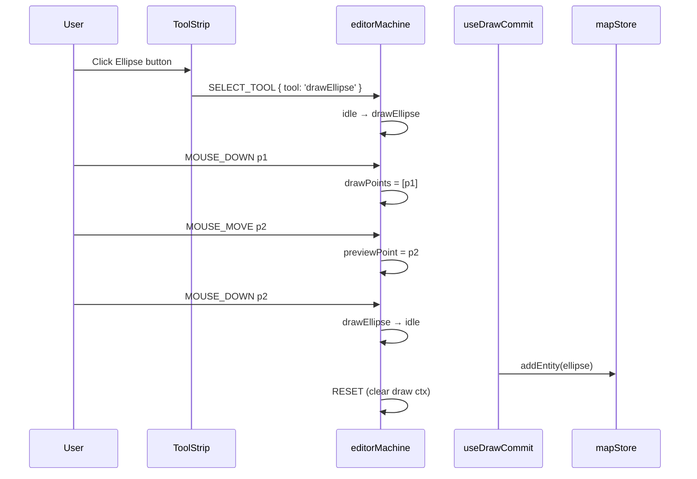

# Adding a New Drawing Tool

A drawing tool = one **draw state** in `editorMachine` + a `ToolStrip` button +
a commit handler. We split "add a tool" into three independent subtasks, each
unit-testable, then chain them.

::: tip Existing draw states
`drawPolyline` / `drawCatmullRom` / `drawBezier` / `drawArc` /
`drawRotatedRect` / `drawPolygon`. New draw tools must follow the same event
contract (`MOUSE_DOWN`, `MOUSE_MOVE`, `DOUBLE_CLICK`, `CONFIRM`, `CANCEL`).
:::

## Goal

Add an **Ellipse** drawing tool:

- First click = ellipse center.
- Drag / move = live preview of semi-axes.
- Second click or double-click = commit.
- ESC = cancel.

## Prerequisites

- You have walked through [Adding a New Action](./adding-a-new-action).
- You know the XState 5 `setup({}).createMachine(...)` style (the file
  carries `@ts-nocheck` for now while XState 5 inference bugs land
  upstream — the syntax itself is still v5).
- You are familiar with how `useDrawCommit` subscribes to FSM transitions.

## End-to-end draw flow



## Step-by-step

### 1. Add the state in `editorMachine.ts`

```ts
// src/core/fsm/editorMachine.ts
export type DrawTool =
  | 'drawPolyline'
  | 'drawCatmullRom'
  | 'drawBezier'
  | 'drawArc'
  | 'drawRotatedRect'
  | 'drawPolygon'
  | 'drawEllipse'; // new

const DRAW_STATES: readonly DrawTool[] = [
  'drawPolyline',
  'drawCatmullRom',
  'drawBezier',
  'drawArc',
  'drawRotatedRect',
  'drawPolygon',
  'drawEllipse',
];

// inside states:
states: {
  // ...
  drawEllipse: {
    on: {
      MOUSE_DOWN: [
        {
          guard: ({ context }) => context.drawPoints.length === 0,
          actions: assign({
            drawPoints: ({ context, event }) => [...context.drawPoints, event.point],
          }),
        },
        {
          // second click: commit
          target: 'idle',
        },
      ],
      MOUSE_MOVE: {
        actions: assign({ previewPoint: ({ event }) => event.point }),
      },
      DOUBLE_CLICK: { target: 'idle' },
      CANCEL: { target: 'idle', actions: 'clearDrawCtx' },
    },
  },
}
```

::: warning State name = tool name
The string `drawEllipse` is both the FSM state value and a member of the
`DrawTool` union. Keep them identical so `ToolStrip` can re-use
`getToolAction(state.value)`.
:::

### 2. Register the Action

```ts
{
  id: 'tool.drawEllipse',
  label: 'Ellipse',
  category: 'tool',
  icon: 'Circle',
  drawTool: 'drawEllipse',
  keybinding: { key: 'e' },
  toolStripSlot: 'shape',
  toolStripOrder: 60,
  inCommandPalette: true,
}
```

ActionDefs that carry `drawTool` are auto-rendered into `ToolStrip`.

### 3. Add a commit branch in `useDrawCommit`

```ts
// src/hooks/useDrawCommit.ts
useEffect(() => {
  const sub = editorActor.subscribe((snapshot, event) => {
    if (event.type !== 'COMPLETE') return;
    const { value, context } = snapshot;
    switch (value) {
      case 'drawEllipse': {
        if (context.drawPoints.length < 1 || !context.previewPoint) return;
        const [center] = context.drawPoints;
        const edge = context.previewPoint;
        const ellipse = createEllipse(center, edge);
        mapStore.getState().addEntity(ellipse);
        editorActor.send({ type: 'RESET' });
        return;
      }
    }
  });
  return () => sub.unsubscribe();
}, []);
```

### 4. Write the geometry factory

```ts
// src/core/elements/ellipse.ts
import { nanoid } from 'nanoid';
import type { EllipseEntity, LngLat } from '@/types/entities';

export function createEllipse(center: LngLat, edge: LngLat): EllipseEntity {
  const a = Math.abs(edge[0] - center[0]);
  const b = Math.abs(edge[1] - center[1]);
  return {
    id: `ellipse_${nanoid(12)}`,
    entityType: 'ellipse',
    center,
    semiMajorAxis: a,
    semiMinorAxis: b,
    rotation: 0,
  };
}
```

::: tip Parametric geometry
Store the minimal parameter set `{ center, a, b, rotation }`; let
`apolloCompile` produce GeoJSON polygons at render time. Rotation, scaling,
and undo never lose precision, and the cold-layer cache stays clean. See
[Adding a Map Element](./adding-a-new-element).
:::

### 5. Integrate with snap / connect

If the ellipse should participate in snap or topology connection, register
its endpoints / center in `src/core/geometry/snap.ts`:

```ts
case 'ellipse':
  return [{ kind: 'centerPoint', position: entity.center, entityId: entity.id }];
```

Otherwise the cursor will not get a snap halo near the ellipse.

### 6. Tests

```ts
// src/core/elements/__tests__/ellipse.test.ts
import { createEllipse } from '../ellipse';

it('builds an ellipse with correct semi-axes', () => {
  const e = createEllipse([0, 0], [3, 2]);
  expect(e.semiMajorAxis).toBe(3);
  expect(e.semiMinorAxis).toBe(2);
});

// src/core/fsm/__tests__/editorMachine.test.ts
it('drawEllipse stays in state until second MOUSE_DOWN', () => {
  const actor = createActor(editorMachine).start();
  actor.send({ type: 'SELECT_TOOL', tool: 'drawEllipse' });
  actor.send({ type: 'MOUSE_DOWN', point: [0, 0] });
  expect(actor.getSnapshot().value).toBe('drawEllipse');
  actor.send({ type: 'MOUSE_DOWN', point: [3, 2] });
  expect(actor.getSnapshot().value).toBe('idle');
});
```

## Files modified

| File                                           | Change                         |
| ---------------------------------------------- | ------------------------------ |
| `src/core/fsm/editorMachine.ts`                | New draw state + `DRAW_STATES` |
| `src/core/actions/registry/definitions.ts`     | New ActionDef                  |
| `src/hooks/useDrawCommit.ts`                   | New commit branch              |
| `src/core/elements/ellipse.ts`                 | New factory                    |
| `src/types/entities.ts`                        | `EllipseEntity` joins union    |
| `src/core/geometry/snap.ts`                    | Snap registration              |
| `src/core/elements/__tests__/ellipse.test.ts`  | New tests                      |
| `src/core/fsm/__tests__/editorMachine.test.ts` | New FSM-path test              |

## Testing checklist

- [ ] FSM path: `idle → drawEllipse → idle` runs cleanly.
- [ ] Double-click commit: failsafe even when only one anchor was placed.
- [ ] ESC cancels: FSM returns to `idle`, drawPoints cleared.
- [ ] Mid-draw undo: start drawing, press Ctrl+Z. FSM must receive
      `CANCEL` BEFORE `temporal.undo()` — otherwise the R1 bug returns.
- [ ] Snap halos appear near ellipse endpoints / center.
- [ ] Cold layer: the entity appears within one frame of commit.
- [ ] Perf: drawing 50 ellipses keeps p99 frame time below 16 ms.

## Common pitfalls

### Double-click commits twice

Both `MOUSE_DOWN` and `DOUBLE_CLICK` fire. Add dedupe in the `MOUSE_DOWN`
guard, or route `DOUBLE_CLICK` through a dedicated transition rather than
stacking. See the
[`clickDedup` regression test](https://github.com/SakuraPuare/apollo-map-studio/blob/main/src/hooks/__tests__/clickDedup.test.ts).

### previewPoint never updates

`MOUSE_MOVE` is not reaching the FSM. Check that `mapEventRouter.ts`
forwards `mousemove` while in this state.

### FSM keeps stale drawPoints after undo

R1 closure: `useActionDispatcher.ts:76-82` MUST send `CANCEL` before
`temporal.undo()`. Skip that and `mapStore` rolls back while the FSM still
references missing context — the next `CONFIRM` crashes. Regression in
[`undoCancel.test.ts`](https://github.com/SakuraPuare/apollo-map-studio/blob/main/src/hooks/__tests__/undoCancel.test.ts).

### ToolStrip button does not appear

`drawTool` field missing or `toolStripSlot` mistyped. Valid slots live on
the `ToolStripSlot` type.

## Source links

- [`src/core/fsm/editorMachine.ts`](https://github.com/SakuraPuare/apollo-map-studio/blob/main/src/core/fsm/editorMachine.ts)
- [`src/hooks/useDrawCommit.ts`](https://github.com/SakuraPuare/apollo-map-studio/blob/main/src/hooks/useDrawCommit.ts)
- [`src/core/elements/`](https://github.com/SakuraPuare/apollo-map-studio/tree/main/src/core/elements)
- [`src/core/geometry/snap.ts`](https://github.com/SakuraPuare/apollo-map-studio/blob/main/src/core/geometry/snap.ts)
- [`src/hooks/__tests__/undoCancel.test.ts`](https://github.com/SakuraPuare/apollo-map-studio/blob/main/src/hooks/__tests__/undoCancel.test.ts)
- [`src/hooks/__tests__/clickDedup.test.ts`](https://github.com/SakuraPuare/apollo-map-studio/blob/main/src/hooks/__tests__/clickDedup.test.ts)

## Advanced

### Apollo element tools

If the tool draws an Apollo element (Lane, Junction) rather than a raw
geometry, inject `activeElement` into the FSM context:

```ts
actor.send({ type: 'SELECT_TOOL', tool: 'drawPolyline', element: 'lane' });
```

`useDrawCommit` switches on `activeElement` to pick the right factory
(`createLane`, `createJunction`, etc.).

### Custom commit guards

Validate before persisting:

```ts
if (polygonSelfIntersects(context.drawPoints)) {
  toastError('Polygon self-intersects, draw cancelled');
  editorActor.send({ type: 'CANCEL' });
  return;
}
```

::: danger Never let invalid geometry into mapStore
mapStore = source of truth. Once invalid geometry lands, every downstream
pipeline (overlap, junction graph, export) is poisoned. All geometric
validation runs **before** commit.
:::
