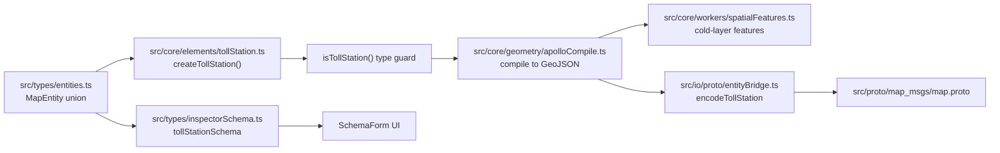

# Adding a New Map Element

A map element is a named Apollo HD Map entity: Lane, Junction, Crosswalk,
Signal, StopSign, SpeedBump, Yield, ClearArea, RSU, ParkingSpace,
BarrierGate, PNCJunction… It is **distinct from** a [drawing
tool](./adding-a-new-drawing-tool): the tool says **how** to draw, the
element says **what** the result is.

::: tip When to add an element
Add an element when you need any of:

- A matching field in the Apollo proto.
- A specific property set in the inspector.
- An independent style on the cold layer.
- A separate message during export.

Otherwise reuse a generic geometry (Polyline / Polygon).
:::

## Goal

Add a **TollStation** element:

- Geometry: a single rectangle polygon + heading.
- Properties: station code, lane count, ETC enabled.
- Inspector: code, lane count, ETC switch.
- Export: lands in the `tollStation` repeated field.

## Prerequisites

- You have read [Anti-corruption Layer](../architecture/anti-corruption)
  and understand why `entityOps` exists.
- You know the cold-layer vs hot-layer distinction.
- The element already exists in `src/proto/*.proto` (or you are willing to
  extend the proto first).

## Element pipeline



## Step-by-step

### 1. Extend the `MapEntity` union

```ts
// src/types/entities.ts
export interface TollStationEntity {
  id: string;
  entityType: 'tollStation';
  polygon: PointENU[]; // 4-point rectangle
  heading: number; // radians
  stationCode: string;
  laneCount: number;
  etcEnabled: boolean;
  overlapIds: string[];
}

export type MapEntity =
  | LaneEntity
  | JunctionEntity
  | CrosswalkEntity
  // ...
  | TollStationEntity; // new
```

::: warning Order matters
TypeScript union member order affects `entityType` autocomplete display.
Append new members rather than inserting in the middle to keep diffs small.
:::

### 2. Type guard

```ts
// src/core/elements/tollStation.ts
import type { MapEntity, TollStationEntity } from '@/types/entities';

export function isTollStation(e: MapEntity): e is TollStationEntity {
  return e.entityType === 'tollStation';
}
```

### 3. Factory + defaults

```ts
import { nanoid } from 'nanoid';

export function createTollStation(rect: LngLat[], heading: number): TollStationEntity {
  if (rect.length !== 4) throw new Error('TollStation requires 4-point rect');
  return {
    id: `toll_${nanoid(12)}`,
    entityType: 'tollStation',
    polygon: rect.map(([x, y]) => ({ x, y })),
    heading,
    stationCode: '',
    laneCount: 1,
    etcEnabled: false,
    overlapIds: [],
  };
}
```

### 4. Wire `entityOps`

```ts
// src/lib/entityOps.ts
import { isTollStation } from '@/core/elements/tollStation';

export function getEntityCenter(e: MapEntity): LngLat {
  if (isTollStation(e)) {
    const cx = e.polygon.reduce((s, p) => s + p.x, 0) / e.polygon.length;
    const cy = e.polygon.reduce((s, p) => s + p.y, 0) / e.polygon.length;
    return [cx, cy];
  }
  // ...
}
```

::: danger Never bypass entityOps
Any UI code that touches Apollo proto fields MUST go through `entityOps`.
Direct imports of `@/core/geometry/apolloCompile` from `components/` or
`hooks/` are protocol leaks — a proto v2 upgrade will break the entire
surface area. Audit:

```bash
git grep "from '@/core/geometry/apolloCompile'" -- 'src/components/**' 'src/hooks/**'
```

A non-empty result is a new leak.
:::

### 5. Cold-layer feature compilation

```ts
// src/core/workers/spatialFeatures.ts
function compileTollStationFeatures(e: TollStationEntity): GeoJSON.Feature[] {
  return [
    {
      type: 'Feature',
      id: e.id,
      properties: { id: e.id, kind: 'tollStation', etc: e.etcEnabled, layer: 'tollStation/fill' },
      geometry: {
        type: 'Polygon',
        coordinates: [[...e.polygon.map((p) => [p.x, p.y]), [e.polygon[0].x, e.polygon[0].y]]],
      },
    },
  ];
}
```

Branch in `compileEntity()`:

```ts
case 'tollStation':
  return compileTollStationFeatures(entity);
```

### 6. Inspector schema

```ts
// src/types/inspectorSchema.ts
export const tollStationSchema: EntitySchema<TollStationEntity, TollStationFormValues> = {
  entityType: 'tollStation',
  label: 'Toll Station',
  validation: tollStationFormSchema, // zod
  fields: [
    {
      kind: 'string',
      name: 'stationCode',
      label: 'Station Code',
      section: 'Basic',
      read: (e) => e.stationCode,
      write: (e, v) => ({ ...e, stationCode: v }),
    },
    {
      kind: 'number',
      name: 'laneCount',
      label: 'Lane Count',
      section: 'Basic',
      min: 1,
      max: 32,
      step: 1,
      read: (e) => e.laneCount,
      write: (e, v) => ({ ...e, laneCount: v }),
    },
    {
      kind: 'boolean',
      name: 'etcEnabled',
      label: 'ETC',
      section: 'Equipment',
      read: (e) => e.etcEnabled,
      write: (e, v) => ({ ...e, etcEnabled: v }),
    },
  ],
};
```

See [Extending the Inspector](./extending-the-inspector).

### 7. Wire export

```ts
// src/io/proto/entityBridge.ts
function encodeTollStation(e: TollStationEntity): proto.TollStation {
  return proto.TollStation.create({
    id: { id: e.id },
    polygon: { points: e.polygon },
    heading: e.heading,
    stationCode: e.stationCode,
    laneCount: e.laneCount,
    etcEnabled: e.etcEnabled,
  });
}

mapMessage.tollStation = entities.filter(isTollStation).map(encodeTollStation);
```

### 8. Wire import

```ts
// src/io/proto/entityBridge.ts
function decodeTollStation(m: proto.TollStation): TollStationEntity {
  return {
    id: m.id?.id ?? `toll_${nanoid(12)}`,
    entityType: 'tollStation',
    polygon: m.polygon?.points ?? [],
    heading: m.heading ?? 0,
    stationCode: m.stationCode ?? '',
    laneCount: m.laneCount ?? 1,
    etcEnabled: m.etcEnabled ?? false,
    overlapIds: [],
  };
}
```

### 9. Tests

```ts
// src/core/elements/__tests__/tollStation.test.ts
it('factory builds rect with heading 0', () => {
  const e = createTollStation(
    [
      [0, 0],
      [1, 0],
      [1, 1],
      [0, 1],
    ],
    0,
  );
  expect(e.polygon).toHaveLength(4);
  expect(isTollStation(e)).toBe(true);
});

// src/io/__tests__/roundTrip.test.ts
it('TollStation survives an import-export round trip', () => {
  const original = createTollStation(
    [
      [0, 0],
      [1, 0],
      [1, 1],
      [0, 1],
    ],
    0,
  );
  const encoded = encodeTollStation(original);
  const decoded = decodeTollStation(encoded);
  expect(decoded.stationCode).toBe(original.stationCode);
  expect(decoded.polygon).toEqual(original.polygon);
});
```

## Files modified

| File                                              | Change             |
| ------------------------------------------------- | ------------------ |
| `src/types/entities.ts`                           | Add union member   |
| `src/core/elements/tollStation.ts`                | Factory + guard    |
| `src/lib/entityOps.ts`                            | Adapter branch     |
| `src/core/workers/spatialFeatures.ts`             | Cold-layer compile |
| `src/types/inspectorSchema.ts`                    | Inspector schema   |
| `src/lib/schemas.ts`                              | Zod form schema    |
| `src/io/proto/entityBridge.ts`                    | Decode             |
| `src/io/proto/entityBridge.ts`                    | Encode             |
| `src/proto/map_msgs/map.proto` (if missing)       | New message        |
| `src/core/elements/__tests__/tollStation.test.ts` | Unit               |
| `src/io/__tests__/roundTrip.test.ts`              | Round-trip         |

## Testing checklist

- [ ] Factory throws on missing args; no half-built entity persists.
- [ ] Type guard returns false for every existing element type.
- [ ] Cold layer renders the toll station fill on the map.
- [ ] Inspector is bidirectional: read → edit → write back, form state
      stays in sync with `mapStore`.
- [ ] Import/export round-trip is exact, including proto2 optional fields.
- [ ] `overlapIds` is auto-maintained against neighboring lanes/junctions.

## Common pitfalls

### Overlap is not updated

`overlapIds` is derived in `overlap.worker.ts`. Do not hand-fill it. If
the worker ignores your new element, branch in
`src/core/workers/overlapBridge.ts`.

### Style is missing

`maplibre` style has no rule for `properties.kind = 'tollStation'`. The
feature compiles but is invisible. Add a layer in
`src/components/map/style.ts`:

```ts
{
  id: 'tollStation/fill',
  type: 'fill',
  source: 'cold',
  filter: ['==', ['get', 'kind'], 'tollStation'],
  paint: { 'fill-color': 'var(--ams-tollstation-fill)' },
}
```

### Inspector edit does not redraw

The read/write adapters are asymmetric. `read(write(e, v))` MUST equal
`v`. Add a unit test asserting that.

### Exported proto fields are zero/empty

proto2 optional fields require explicit set. Check `src/types/apollo.ts`
optionality and use `!== undefined` rather than truthy checks in encode.

## Source links

- [`src/types/entities.ts`](https://github.com/SakuraPuare/apollo-map-studio/blob/main/src/types/entities.ts)
- [`src/core/elements/`](https://github.com/SakuraPuare/apollo-map-studio/tree/main/src/core/elements)
- [`src/lib/entityOps.ts`](https://github.com/SakuraPuare/apollo-map-studio/blob/main/src/lib/entityOps.ts)
- [`src/core/workers/spatialFeatures.ts`](https://github.com/SakuraPuare/apollo-map-studio/blob/main/src/core/workers/spatialFeatures.ts)
- [`src/types/inspectorSchema.ts`](https://github.com/SakuraPuare/apollo-map-studio/blob/main/src/types/inspectorSchema.ts)
- [`src/io/proto/entityBridge.ts`](https://github.com/SakuraPuare/apollo-map-studio/blob/main/src/io/proto/entityBridge.ts)
- [`src/io/proto/entityBridge.ts`](https://github.com/SakuraPuare/apollo-map-studio/blob/main/src/io/proto/entityBridge.ts)
- [`src/proto/map_msgs/map.proto`](https://github.com/SakuraPuare/apollo-map-studio/blob/main/src/proto/map_msgs/map.proto)

## Advanced

### Derived fields

If the element has derivable fields (e.g. lane `length` from
`centralCurve`), put the derivation in `src/core/elements/derive.ts` and
track user overrides via `markUserOverride`:

```ts
import { markUserOverride } from '@/core/elements/derive';

write: (e, v) => markUserOverride({ ...e, laneCount: v }, 'laneCount'),
```

That way import does not silently overwrite a user-edited value with the
proto default.

### Lane topology

If the new element should participate in the topology graph (e.g.
PNCJunction-like), add endpoint contributions in
`src/core/workers/laneJunctionGraph.ts`. Otherwise graph recomputation
ignores it.

::: tip Recommended cadence
Three commits:

1. Types + factory + guard + unit tests.
2. Import/export + round-trip test.
3. Inspector schema + cold-layer style + manual UI test.

Each commit is independently reviewable.
:::
