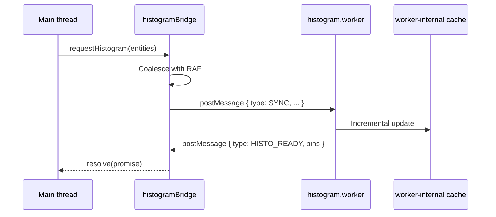

# Adding a Web Worker

Workers move expensive synchronous compute off the main thread: cold-layer
compilation, spatial indexing, geometry clipping, and overlap derivation
all run in workers. This recipe walks through adding a new one: contract,
coalescing, bridge, and tests.

::: tip When to add a worker

- A main-thread task takes > 16 ms (frame drop).
- The work is async-safe and has no DOM / Canvas dependency.
- Inputs and outputs are structured-clone-friendly (no functions, no
  class instances, nothing exotic beyond `SharedArrayBuffer`).

Otherwise (short tasks / chatty small payloads), keep it on main thread —
the postMessage overhead eats the gain.
:::

## Goal

Add a **lane-width histogram worker**: input = all lane entities from
`mapStore`, output = a width-sample histogram per lane (offline stats, no
frame drops).

## Prerequisites

- You have read [Cold Layer Pipeline](../architecture/cold-layer).
- You know the contracts of `spatial.worker.ts` and `overlap.worker.ts`.
- The work really exceeds 16 ms — measure first.

## Worker overview



## Step-by-step

### 1. Define messages in `protocol.ts`

```ts
// src/core/workers/protocol.ts
export type HistogramRequest =
  | { type: 'HISTO_SYNC'; requestId: string; entities: SerializedEntity[] }
  | { type: 'HISTO_QUERY'; requestId: string; binCount: number };

export type HistogramResponse = { type: 'HISTO_READY'; requestId: string; bins: number[] };
```

::: warning Prefix message names
`HISTO_*` avoids collisions with shared names like `SYNC` or `HIT_TEST`.
A single worker file is fine without prefixes; multiple workers sharing a
channel MUST prefix.
:::

### 2. Create the worker file

```ts
// src/core/workers/histogram.worker.ts
/// <reference lib="webworker" />
import type { HistogramRequest, HistogramResponse } from './protocol';

let cache = new Map<string, number[]>();

self.onmessage = (ev: MessageEvent<HistogramRequest>) => {
  const msg = ev.data;
  switch (msg.type) {
    case 'HISTO_SYNC': {
      cache = new Map();
      for (const e of msg.entities) {
        if (e.entityType !== 'lane') continue;
        cache.set(
          e.id,
          e.leftSamples.map((s) => s.width),
        );
      }
      reply({ type: 'HISTO_READY', requestId: msg.requestId, bins: computeBins(8) });
      break;
    }
    case 'HISTO_QUERY':
      reply({ type: 'HISTO_READY', requestId: msg.requestId, bins: computeBins(msg.binCount) });
      break;
  }
};

function computeBins(n: number): number[] {
  return new Array(n).fill(0);
}

function reply(r: HistogramResponse) {
  (self as unknown as Worker).postMessage(r);
}
```

::: danger Never import React or DOM in a worker
A worker has no `window`, `document`, or `React`. Such imports compile
fine but crash at runtime. Put worker-only utilities under
`src/core/workers/utils/` to keep the boundary explicit.
:::

### 3. Main-thread bridge

```ts
// src/core/workers/histogramBridge.ts
import HistogramWorker from './histogram.worker?worker';
import type { HistogramRequest, HistogramResponse } from './protocol';
import { nanoid } from 'nanoid';
import type { MapEntity } from '@/types/entities';

const worker = new HistogramWorker();
const pending = new Map<string, (r: HistogramResponse) => void>();

worker.onmessage = (ev) => {
  const r = ev.data as HistogramResponse;
  pending.get(r.requestId)?.(r);
  pending.delete(r.requestId);
};

let rafToken: number | null = null;
let queuedEntities: MapEntity[] | null = null;

export function requestHistogramSync(entities: MapEntity[]): void {
  queuedEntities = entities;
  if (rafToken !== null) return;
  rafToken = requestAnimationFrame(() => {
    const requestId = nanoid(8);
    worker.postMessage({ type: 'HISTO_SYNC', requestId, entities: queuedEntities! });
    queuedEntities = null;
    rafToken = null;
  });
}

export function queryBins(binCount: number): Promise<number[]> {
  return new Promise((resolve) => {
    const requestId = nanoid(8);
    pending.set(requestId, (r) => {
      if (r.type === 'HISTO_READY') resolve(r.bins);
    });
    worker.postMessage({ type: 'HISTO_QUERY', requestId, binCount });
  });
}
```

::: tip RAF coalescing keeps 60 fps alive
A single zundo undo step can fire 5 store subscriptions. Naive
postMessage-per-call = 5 cross-thread clones. RAF coalescing collapses
that to one per frame. ToolStrip latency drops measurably.
:::

### 4. Vite worker imports

The `?worker` suffix is built into Vite — it bundles the worker into a
separate chunk. No extra config needed. `?worker&inline` inlines (small
files only).

### 5. Main-thread usage

```ts
// src/components/StatsPanel.tsx
import { requestHistogramSync, queryBins } from '@/core/workers/histogramBridge';

useEffect(() => {
  const unsub = mapStore.subscribe((s) => requestHistogramSync([...s.entities.values()]));
  return unsub;
}, []);

const refresh = async () => {
  const bins = await queryBins(16);
  setBins(bins);
};
```

### 6. Tests

Vitest defaults to jsdom; workers are unavailable. Two strategies:

**A. Test the algorithm directly** (recommended): split worker logic into
a pure function `computeBins.ts` and test it; the worker only routes
messages.

```ts
// src/core/workers/__tests__/computeBins.test.ts
import { computeBins } from '../computeBins';
it('produces 8 bins from samples', () => {
  expect(computeBins([1, 2, 3], 8)).toHaveLength(8);
});
```

**B. `vitest --environment node` + `worker_threads`** for end-to-end.
Use sparingly — integration tests are slow.

## Files modified

| File                                             | Change               |
| ------------------------------------------------ | -------------------- |
| `src/core/workers/protocol.ts`                   | New message types    |
| `src/core/workers/histogram.worker.ts`           | Worker               |
| `src/core/workers/histogramBridge.ts`            | RAF-coalesced bridge |
| `src/core/workers/computeBins.ts`                | Pure (testable)      |
| `src/core/workers/__tests__/computeBins.test.ts` | Unit                 |
| `src/components/StatsPanel.tsx`                  | Consumer             |

## Testing checklist

- [ ] Worker chunked separately: after `pnpm build`, `dist/assets/` has a
      `histogram-*.js` chunk.
- [ ] 1k-entity SYNC does not stall the main thread (DevTools Performance
      gap < 4 ms).
- [ ] 100 calls in one frame coalesce into one `postMessage` (count
      `onmessage` invocations).
- [ ] Error messages carry a `requestId`; the pending map can resolve them.
- [ ] On worker crash the bridge does not deadlock — `worker.onerror`
      rejects all pending promises.

## Common pitfalls

### Slow `postMessage` clone

Payload contains `Map`, `Set`, or circular refs — structured clone
degrades or fails. Normalize to plain objects/arrays before sending.
Quick check:

```ts
console.time('clone');
structuredClone(payload);
console.timeEnd('clone');
```

### Forgetting transferables

Big `ArrayBuffer`s should be transferred, not cloned:

```ts
worker.postMessage({ buffer }, [buffer]); // second arg = transfer list
```

A common optimization: serialize GeoJSON to `Uint8Array` via
`TextEncoder`, then transfer.

### Wrong worker import path

Vite needs the `?worker` suffix. A plain import bundles the worker as a
normal module; runtime crashes because `WorkerGlobalScope` is missing.

### Nested RAFs never send

The `rafToken !== null` guard MUST clear inside the RAF callback,
otherwise subsequent calls are silently swallowed. Verify with
`vi.useFakeTimers()` + `vi.advanceTimersToNextFrame()`.

### Worker / main type sharing

Workers compile under TS too, but MUST NOT import `@/components/*`. Keep
workers limited to `@/types/*`, `@/core/workers/*`, `@/core/geometry/*`.
Otherwise tree-shake fails and React lands in the worker chunk.

## Source links

- [`src/core/workers/protocol.ts`](https://github.com/SakuraPuare/apollo-map-studio/blob/main/src/core/workers/protocol.ts)
- [`src/core/workers/spatial.worker.ts`](https://github.com/SakuraPuare/apollo-map-studio/blob/main/src/core/workers/spatial.worker.ts)
- [`src/core/workers/spatialBridge.ts`](https://github.com/SakuraPuare/apollo-map-studio/blob/main/src/core/workers/spatialBridge.ts) — reference RAF-coalesced bridge
- [`src/core/workers/overlap.worker.ts`](https://github.com/SakuraPuare/apollo-map-studio/blob/main/src/core/workers/overlap.worker.ts)

## Advanced

### Incremental protocol

See `spatial.worker.ts` `INCREMENTAL` message: send only `added`,
`removed`, `updated`. The worker maintains a cache instead of recomputing
from scratch each SYNC. P1 dropped postMessage overhead substantially.

### Streaming responses

Workers can chunk results:

```ts
self.postMessage({ type: 'HISTO_CHUNK', offset: 0, total: 1000, items: chunk });
// ...
self.postMessage({ type: 'HISTO_DONE' });
```

Render-while-receiving cuts first-paint latency from 80 ms to 10 ms at 1k
entities.

### SharedWorker / ServiceWorker

Sharing compute across tabs? SharedWorker. But verify MapLibre and
Electron renderer compatibility separately. This project does not use
SharedWorker today.

::: warning Things you should NOT do

- Fetch user files inside a worker (CSP and reliability issues).
- Use `eval()` inside a worker (CSP `script-src` blocks it).
- Keep a long-running `setInterval` in a worker — it survives tab switch
  and drains battery.
  :::
