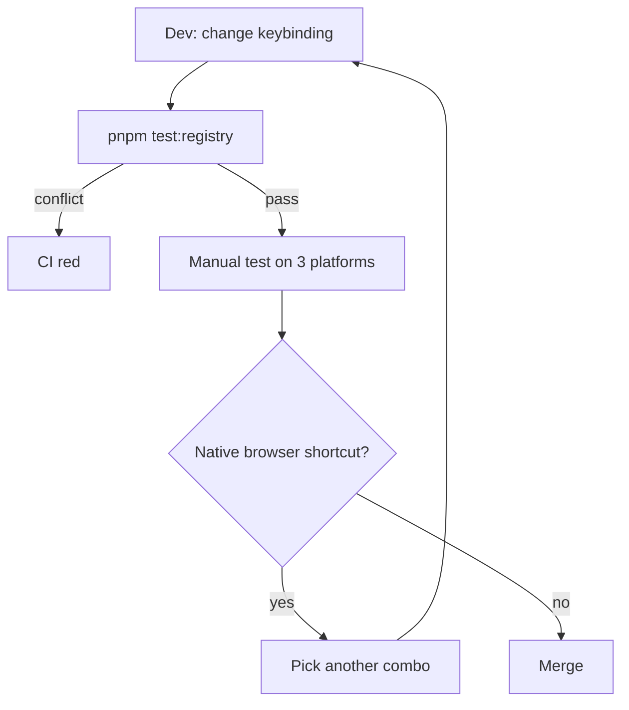

# Customizing Keyboard Shortcuts

A shortcut is just an `ActionDef.keybinding` field. Changing a shortcut
does not touch any keyboard event code — only the registry. This recipe
covers basic keybindings, cross-platform mapping, conflict detection, and
user overrides.

::: tip One thing at a time
If you have not read [Adding a New Action](./adding-a-new-action), start
there to see the ActionDef structure first.
:::

## Goal

- Move "Undo" from `Ctrl+Z` to `Ctrl+Shift+Z` (for demonstration).
- Have it auto-render as `⌘⇧Z` on macOS.
- Detect `Ctrl+S` conflicts with native browser shortcuts.

## KeyBinding shape

```ts
// src/core/actions/registry/types.ts
export interface KeyBinding {
  key: string; // single char or key code (e.g. 'Escape', 'F1')
  ctrlOrMeta?: boolean; // ⌘ on macOS, Ctrl elsewhere
  ctrlKey?: boolean; // force Ctrl (rare)
  metaKey?: boolean; // force Cmd  (rare)
  shiftKey?: boolean;
  altKey?: boolean;
  allowInInput?: boolean; // default false
}
```

::: warning Use `ctrlOrMeta`, not `ctrlKey` / `metaKey`
99% of the time you mean "the primary modifier". `ctrlOrMeta: true` maps
to ⌘ on macOS and Ctrl on Linux/Windows. Hard-coding `ctrlKey` makes
macOS users press Ctrl with no effect.
:::

## Step-by-step

### 1. Edit the ActionDef

```ts
// src/core/actions/registry/definitions.ts
{
  id: 'edit.undo',
  label: 'Undo',
  keybinding: { key: 'z', ctrlOrMeta: true, shiftKey: true },
  // ...
}
```

### 2. Run `pnpm test` for the registry conflict check

```ts
// src/core/actions/__tests__/registry.test.ts
it('keybindings are unique', () => {
  const seen = new Set<string>();
  for (const a of ACTION_DEFS) {
    if (!a.keybinding) continue;
    const key = JSON.stringify(a.keybinding);
    expect(seen.has(key)).toBe(false);
    seen.add(key);
  }
});
```

A failure means a collision — pick another combo.

### 3. Platform-aware display

```ts
import { formatShortcut } from '@/core/actions/registry';

formatShortcut({ key: 'z', ctrlOrMeta: true, shiftKey: true });
// macOS:  '⌘⇧Z'
// Linux:  'Ctrl+Shift+Z'
```

`formatShortcut` uses `isMacPlatform()`. Never hand-build the string.

### 4. Avoid native browser conflicts

Do **not** rebind these — the browser intercepts before React, your
handler never runs.

| Shortcut | Browser behaviour | Replacement     |
| -------- | ----------------- | --------------- |
| `Ctrl+W` | Close tab         | `Ctrl+Shift+W`  |
| `Ctrl+T` | New tab           | `Ctrl+Shift+T`  |
| `Ctrl+N` | New window        | `Alt+N`         |
| `Ctrl+P` | Print             | `Ctrl+Shift+P`  |
| `Ctrl+/` | Some platforms    | `Ctrl+Shift+/`  |
| `F11`    | Fullscreen        | Use a menu item |

::: warning Electron ≠ browser
Under `pnpm electron:dev`, you can override `Ctrl+W` / `Ctrl+T`. But to
keep Web and Electron experiences consistent, still avoid these combos.
:::

### 5. Allow firing inside inputs

Global shortcuts are suppressed when an `<input>`, `<textarea>`, or
`contenteditable` element is focused. For globals like "Save All", set
`allowInInput: true`:

```ts
{
  id: 'file.save',
  keybinding: { key: 's', ctrlOrMeta: true, allowInInput: true },
}
```

::: danger Never enable `allowInInput` for destructive actions
A user pressing `Backspace` in a search field expects to delete a
character, not an entity. Mis-enabling this causes silent data loss.
:::

## Platform mapping cheatsheet

| keybinding                                | macOS | Linux/Win |
| ----------------------------------------- | ----- | --------- |
| `{ key: 'z', ctrlOrMeta: 1 }`             | `⌘Z`  | `Ctrl+Z`  |
| `{ key: 's', ctrlOrMeta: 1 }`             | `⌘S`  | `Ctrl+S`  |
| `{ key: 'F1' }`                           | `F1`  | `F1`      |
| `{ key: 'd', altKey: 1 }`                 | `⌥D`  | `Alt+D`   |
| `{ key: '/', shiftKey: 1, ctrlOrMeta: 1}` | `⌘?`  | `Ctrl+?`  |

## Conflict detection flow



## User overrides (planned)

::: tip Roadmap
User-defined keybindings are not yet supported. The plan: a
`settingsStore.userKeyMap` overrides defaults at lookup time, with
priority `userKeyMap > ActionDef.keybinding`. This doc will be updated
when the feature ships.
:::

## Files modified

| File                                          | Change                         |
| --------------------------------------------- | ------------------------------ |
| `src/core/actions/registry/definitions.ts`    | Update `keybinding` field      |
| `src/core/actions/__tests__/registry.test.ts` | Uniqueness / display assertion |

## Testing checklist

- [ ] `pnpm test src/core/actions` passes.
- [ ] Press the new combo on macOS / Linux / Windows once each.
- [ ] Menu items and tooltips show platform-correct strings (verify
      `formatShortcut` output).
- [ ] When an input is focused the shortcut does NOT fire (unless
      `allowInInput`).
- [ ] Devtools console shows `KeyBinding matched: edit.undo` when the
      `KEY_BINDINGS` log channel is enabled.

## Common pitfalls

### `key` case sensitivity

Web spec `KeyboardEvent.key` returns uppercase when Shift is held
(`'Z'`), lowercase otherwise (`'z'`). **Use lowercase in KeyBinding** —
`matchesKeybinding` does case-insensitive comparison.

### Physical key vs character

A French keyboard's `M` is at QWERTY `;`. To bind a physical position use
`KeyboardEvent.code` (`'KeyM'`) instead of `key`. The project defaults to
`key`; add a `useCode: true` flag to ActionDef if needed (TBI).

### Conflicts with maplibre default gestures

maplibre's `Shift+drag` is rectangular zoom and `Ctrl+drag` is pitch.
Don't reuse those modifiers for click actions.

### F-keys grabbed by the OS

`F11` fullscreen (Win/Linux), `F12` DevTools (Chrome), `F4` Alt+F4 close.
Restrict F-keys to F1 (help) and F2 (rename).

## Source links

- [`src/core/actions/registry/types.ts`](https://github.com/SakuraPuare/apollo-map-studio/blob/main/src/core/actions/registry/types.ts) — `KeyBinding` interface
- [`src/core/actions/registry/helpers.ts`](https://github.com/SakuraPuare/apollo-map-studio/blob/main/src/core/actions/registry/helpers.ts) — `matchesKeybinding`, `formatShortcut`, `isMacPlatform`
- [`src/hooks/useActionDispatcher.ts`](https://github.com/SakuraPuare/apollo-map-studio/blob/main/src/hooks/useActionDispatcher.ts) — action execution + keybinding listener

## Advanced

### Chord sequences

VS Code-style `Ctrl+K Ctrl+S`. Currently **not supported**. To add it,
extend `useActionDispatcher` with a chord buffer and a 300 ms timeout. ESC
MUST cancel the entire chord.

### Gate by FSM state

```ts
{
  id: 'tool.confirmDraw',
  keybinding: { key: 'Enter' },
  enabledStates: ['drawPolyline', 'drawPolygon'],
}
```

`useActionDispatcher` checks the current FSM state value before dispatching.

## User research suggestions

Before a release, print core shortcuts to a cheatsheet image and run a
30-minute test with 5–10 users. Record:

| Item                                       | Target |
| ------------------------------------------ | ------ |
| Users can recall 5 core shortcuts          | ≥ 80%  |
| Conflicts with local editor (VS Code/QGIS) | ≤ 1    |
| Highest-frequency action has a shortcut    | 100%   |

Feed the data into `keybinding` updates. Common findings:

- Delete / duplicate / undo are the most-used trio — they MUST be
  bound.
- Single-letter tool toggles (V / L / P) speed up drawing dramatically.
- View ops (fit-to-content, reset zoom) are easy to forget; surface a
  status-bar hint.

::: tip Three rules for cross-platform sanity
**Always** use `ctrlOrMeta`. **Always** use `formatShortcut` for display.
**Always** run the uniqueness test. Three habits, zero pain.
:::

## Default shortcut reference

| Action             | Key                 |
| ------------------ | ------------------- |
| Command palette    | `Ctrl+K`            |
| Undo / Redo        | `Ctrl+Z` / `Ctrl+Y` |
| Save               | `Ctrl+S`            |
| Select / move tool | `V`                 |
| Polyline draw      | `L`                 |
| Polygon draw       | `P`                 |
| Delete selection   | `Delete`            |
| Cancel current op  | `Escape`            |
| Fit to content     | `Ctrl+0`            |
| Toggle grid        | `Ctrl+'`            |

Full list lives in `src/core/actions/registry/definitions.ts`.
Whenever you change one, walk through this recipe end to end.
