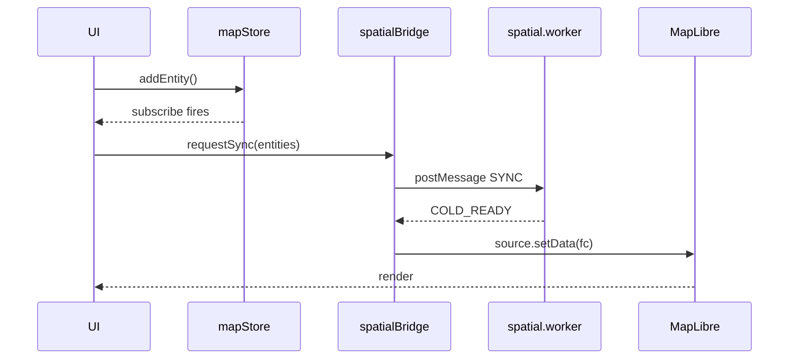

# Debugging the Map Pipeline

The map pipeline is mapStore → entityOps → spatial.worker → maplibre
cold layer → render. A stall anywhere shows up as "entity in data but
not visible", "FPS dive", and similar symptoms. This recipe is a
systematic checklist.

::: tip Debugging pyramid

1. **Look at data** (mapStore) — is the entity even there?
2. **Look at the worker** — did SYNC succeed? Does hit-test fire?
3. **Look at maplibre** — did the source update? Did the feature reach a layer?
4. **Look at the FSM** — is the current state expected?
5. **Look at React** — render counts.

Walk down in order. Don't skip ahead.
:::

## Pipeline at a glance



## 1. Browser DevTools setup

### Source maps

`vite.config.ts` enables dev sourcemaps by default. Verify:

```bash
pnpm dev
# DevTools → Sources should show .ts/.tsx files (not .js)
```

Production builds intentionally **omit** sourcemaps to avoid leaking
source. To debug a production build, temporarily enable:

```ts
// vite.config.ts
build: {
  sourcemap: true;
}
```

### React DevTools

Install the browser extension. Most useful:

- **Components** panel — inspect props and hooks state.
- **Profiler** panel — record an interaction, find re-render hot spots.

::: warning Re-renders aren't always the bottleneck
React reconciles fast — the real cost is maplibre redraw. Confirm the
GPU path with maplibre debug mode first, then look at React.
:::

### MapLibre debug=true

```ts
// src/components/map/MapCanvas.tsx
const map = new maplibregl.Map({
  // ...
  debug: import.meta.env.DEV,
});
```

Toggle at runtime:

```js
window.__map.showTileBoundaries = true;
window.__map.showCollisionBoxes = true;
window.__map.showOverdrawInspector = true;
```

Bright red in `showOverdrawInspector` = repaint hot zone.

## 2. Inspect mapStore

```js
const s = window.__mapStore.getState();
console.log('entity count:', s.entities.size);
console.log(
  'first lane:',
  [...s.entities.values()].find((e) => e.entityType === 'lane'),
);
```

::: tip Store exposed for the console
`src/store/mapStore.ts` attaches to `window.__mapStore` only when
`import.meta.env.DEV`. Production strips it.
:::

### Verify zundo history

```js
const tmp = window.__mapStore.temporal.getState();
console.log('past:', tmp.pastStates.length, 'future:', tmp.futureStates.length);
```

If `pastStates.length` does not grow, your mutation was not recorded —
likely you used `setState` directly instead of `produce`.

## 3. Worker debugging

### Chrome DevTools

DevTools → Sources → Threads lists worker threads. Click in to set
breakpoints and read worker console.

### Cross-thread console

`console.log` inside a worker shows up in the worker's own console group
(top dropdown). If you don't see anything, you're on the main thread
group.

### postMessage monitoring

```js
const original = window.__spatialWorker.postMessage.bind(window.__spatialWorker);
window.__spatialWorker.postMessage = (msg) => {
  console.log('TX', msg.type, msg);
  original(msg);
};
window.__spatialWorker.addEventListener('message', (ev) =>
  console.log('RX', ev.data.type, ev.data),
);
```

::: warning Don't `JSON.stringify` large messages
A 1k-entity SYNC is multiple MB of JSON; DevTools freezes. Just log
`msg.type`.
:::

### Worker not responding

Walk the list:

1. **Worker failed to load?** Network panel → `*.worker.js`.
2. **Worker threw?** `worker.onerror` should log in the bridge.
3. **Message name typo?** Add a `default` warn in the worker switch.
4. **Infinite loop?** Performance recording — worker thread at 100% CPU = loop.

## 4. MapLibre internal state

```js
window.__map.getStyle().sources;
window.__map.getSource('cold').serialize();
window.__map.getStyle().layers.map((l) => l.id);
window.__map.querySourceFeatures('cold', { filter: ['==', 'id', 'lane_xxx'] });
```

### "Feature in source but not rendered"

Almost always a layer filter mismatch. Check `properties.kind` spelling,
layer order (occlusion), `paint.fill-opacity` not 0.

### "Invisible at this zoom"

`minzoom` / `maxzoom` clamp on the layer. `window.__map.getZoom()`
reports current level.

## 5. FSM Inspector

XState 5 ships `@statelyai/inspect`:

```ts
// src/core/fsm/editorMachine.ts
import { createBrowserInspector } from '@statelyai/inspect';
const { inspect } = createBrowserInspector({ autoStart: import.meta.env.DEV });

export const editorActor = createActor(editorMachine, { inspect }).start();
```

Open https://stately.ai/registry/inspect to see live transitions.

### From the console

```js
window.__editorActor.getSnapshot().value;
window.__editorActor.getSnapshot().context;
```

## 6. Log channels

`browser DevTools console / worker protocol logs` defines categorized loggers:

| Channel        | Purpose                    |
| -------------- | -------------------------- |
| `FSM`          | FSM transitions            |
| `WORKER_SYNC`  | spatial worker SYNC timing |
| `KEY_BINDINGS` | Key event matching         |
| `COLD_LAYER`   | cold source setData        |
| `OVERLAP`      | Overlap derivation         |
| `IMPORT`       | Apollo import decode       |
| `EXPORT`       | Apollo export encode       |

Enable:

```js
localStorage.setItem('log:channels', 'FSM,WORKER_SYNC,COLD_LAYER');
location.reload();
```

Or URL: `?log=FSM,WORKER_SYNC`.

::: tip Default off
Production: all off (zero noise). Dev: also all off (zero overhead).
Enable on demand.
:::

## 7. Electron debugging

```bash
pnpm electron:dev
```

Main process: see logs in the terminal.
Renderer: same as web, DevTools `Cmd+Opt+I` (macOS) or `Ctrl+Shift+I`.

Main-process breakpoints:

```bash
electron --inspect=5858 .
# Chrome → chrome://inspect → Configure → add localhost:5858
```

## 8. Performance profiling

### Record a frame

DevTools → Performance → Record for 5 seconds, exercise the slow path.

Watch for:

- **Long tasks on main thread** (red bars) — anything > 16 ms must be fixed.
- **Layout shift / forced reflow** — usually React + maplibre style
  changes in the wrong order.
- **Worker swimlane** at the bottom — SYNC should not block main.

### Vitest bench

To track regression rather than reproduce a hang:

```bash
pnpm bench
node scripts/check-bench-budget.mjs bench-results.json
```

See [Benchmarking](../contributing/benchmarking).

## Files you might touch while debugging

| File                                              | Change                 |
| ------------------------------------------------- | ---------------------- |
| `vite.config.ts`                                  | Temporarily enable map |
| `src/components/map/MapCanvas.tsx`                | `debug: true`          |
| `browser DevTools console / worker protocol logs` | Add a new channel      |

## Symptom cheat-sheet

| Symptom                        | First check                                |
| ------------------------------ | ------------------------------------------ |
| Entity does not appear         | mapStore → cold source feature             |
| Crash after undo               | FSM CANCEL before `temporal.undo()`        |
| Pan stutters                   | maplibre overdraw inspector                |
| Worker silent                  | Network panel + `worker.onerror`           |
| Shortcut does not fire         | log channel `KEY_BINDINGS`                 |
| Exported proto field empty     | proto2 optional explicitly set?            |
| Imported text input blank      | inspector schema read adapter              |
| FPS collapses past 1k entities | RAF coalescing engaged? (worker call rate) |

## Source links

- [`browser DevTools console / worker protocol logs`](browser DevTools console / worker protocol logs)
- [`src/store/mapStore.ts`](https://github.com/SakuraPuare/apollo-map-studio/blob/main/src/store/mapStore.ts) — `__mapStore` global hook
- [`src/components/map/MapCanvas.tsx`](https://github.com/SakuraPuare/apollo-map-studio/blob/main/src/components/map/MapCanvas.tsx)
- [Architecture: Cold Layer Pipeline](../architecture/cold-layer)

::: danger Never leave console.log in production
ESLint enforces `no-console: warn (allow: warn,error)`. If you really
need a production probe, route it through a log channel gated by
`localStorage`.
:::
