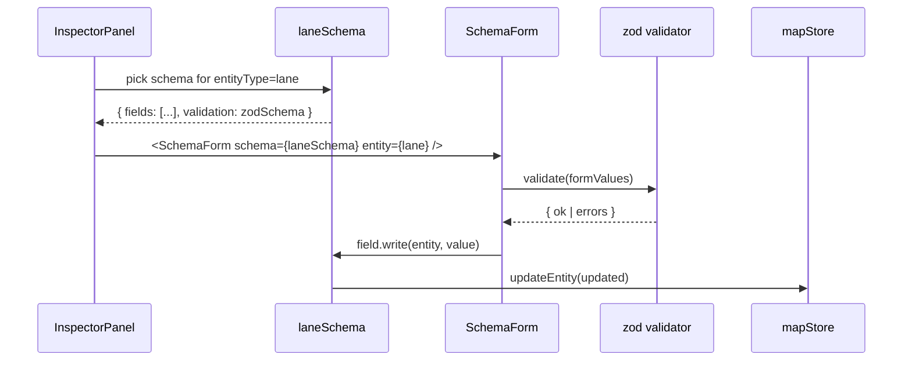

# Extending the Inspector

The inspector is the right-hand property panel. Before the refactor each
entity had its own React form (lane.tsx, junction.tsx, ...). The
schema-driven approach lets a single `SchemaForm` component render any
entity — adding a field touches one place.

::: tip Status
Lane is the schema-driven pilot. Junction / Parking / Signal / StopSign
keep their bespoke forms for now and migrate gradually. New entities
must take the **schema route**, not the bespoke one.
:::

## Goal

Add a "Recommended Follow Distance" field to Lane:

- Renders as a number input.
- Range 0–200, default 30.
- zod validation + onChange gate.
- Writes back to mapStore preserving units.

## Prerequisites

- You have read [Adding a Map Element](./adding-a-new-element).
- You know how zod schemas and react-hook-form work together.
- You are familiar with the read/write adapter pattern in
  `src/types/inspectorSchema.ts`.

## Schema render flow



## Step-by-step

### 1. Extend the zod form schema

```ts
// src/lib/schemas.ts
import { z } from 'zod';

export const laneSchema = z.object({
  // ... existing fields
  recommendedFollowDistance: z.number().min(0).max(200).default(30),
});

export type LaneFormValues = z.infer<typeof laneSchema>;
```

### 2. Extend the entity type

```ts
// src/types/apollo.ts
export interface LaneEntity {
  // ...
  recommendedFollowDistance?: number; // proto2 optional
}
```

### 3. Add a FieldDef

```ts
// src/types/inspectorSchema.ts
import { laneSchema, type LaneFormValues } from '@/lib/schemas';
import type { LaneEntity } from '@/types/apollo';

export const laneInspectorSchema: EntitySchema<LaneEntity, LaneFormValues> = {
  entityType: 'lane',
  label: 'Lane',
  validation: laneSchema,
  fields: [
    // ...
    {
      kind: 'number',
      name: 'recommendedFollowDistance',
      label: 'Recommended Follow Distance (m)',
      section: 'Driving Hints',
      min: 0,
      max: 200,
      step: 1,
      read: (e) => e.recommendedFollowDistance ?? 30,
      write: (e, v) => ({ ...e, recommendedFollowDistance: v }),
      ownsPaths: ['recommendedFollowDistance'],
    },
  ],
};
```

`read` provides a fallback (proto2 optional may be absent), `write` is
immutable.

### 4. Verify SchemaForm section rendering

`src/components/layout/panels/SchemaForm.tsx` groups fields by `section`
automatically. "Driving Hints" is a new section and becomes a new
`<fieldset>`. No component changes needed.

### 5. Validation

```ts
// src/lib/schemas.ts
export const laneSchema = z
  .object({
    recommendedFollowDistance: z.number().min(0).max(200),
    speedLimit: z.number().positive(),
  })
  .refine((v) => v.recommendedFollowDistance < v.speedLimit * 3, {
    message: 'Follow distance is too large for the speed limit',
    path: ['recommendedFollowDistance'],
  });
```

::: warning onChange gate
`SchemaForm` passes the zod schema to
`useForm({ resolver: zodResolver(schema), mode: 'onChange' })`. This is
**deliberate** — it averts the silent-write bug fixed in commit 6a83d9d.
An onSubmit gate would force the user to manually commit, breaking
WYSIWYG. Keep onChange.
:::

### 6. Tests

```ts
// src/types/__tests__/inspectorSchema.test.ts
import { laneInspectorSchema } from '../inspectorSchema';
import { createLane } from '@/core/elements/lane';

it('read returns default 30 when proto field is absent', () => {
  const lane = createLane(/* ... */);
  delete lane.recommendedFollowDistance;
  const field = laneInspectorSchema.fields.find((f) => f.name === 'recommendedFollowDistance')!;
  expect(field.read(lane)).toBe(30);
});

it('write is immutable', () => {
  const lane = createLane(/* ... */);
  const field = laneInspectorSchema.fields.find((f) => f.name === 'recommendedFollowDistance')!;
  const next = field.write(lane, 50);
  expect(next).not.toBe(lane);
  expect(next.recommendedFollowDistance).toBe(50);
});
```

### 7. mapStore round-trip

Manual:

1. Select a lane.
2. Edit "Recommended Follow Distance" to 50.
3. Console: `window.__mapStore.getState().entities.get(<id>).recommendedFollowDistance` is 50.
4. Ctrl+Z restores 30 (or absent).
5. Export → re-import → still 50 (after wiring proto encode/decode).

## Custom FieldKind

Built-ins: `number` / `string` / `boolean` / `select` / `enum` /
`textArea` / `lengthDerived` / `laneRefList`.

Add a kind:

```ts
// 1. Add the type
export interface ColorFieldDef<TEntity, TFormValues, TKey extends keyof TFormValues> {
  kind: 'color';
  name: TKey;
  label: string;
  section: string;
  read: (e: TEntity) => TFormValues[TKey];
  write: (e: TEntity, v: TFormValues[TKey]) => TEntity;
}
export type FieldDef<E, F, K extends keyof F> = /* union */ | ColorFieldDef<E, F, K>;

// 2. Branch in SchemaForm
case 'color':
  return <ColorPicker {...registerProps} />;
```

::: tip One new kind = one PR
Don't smuggle a kind extension into a field-add PR. "Add a kind" is a
framework-level change — separate review, separate tests, separate
changelog entry.
:::

## Files modified

| File                                          | Change              |
| --------------------------------------------- | ------------------- |
| `src/types/apollo.ts`                         | New optional field  |
| `src/lib/schemas.ts`                          | zod schema update   |
| `src/types/inspectorSchema.ts`                | New FieldDef        |
| `src/types/__tests__/inspectorSchema.test.ts` | read/write tests    |
| `src/io/proto/entityBridge.ts`                | proto entity bridge |

## Testing checklist

- [ ] onChange validation paints the field red on `-1`.
- [ ] mapStore writeback type is `number`, not `string`.
- [ ] proto2 optional missing → fallback shown; writeback persists.
- [ ] Ctrl+Z reverts the field.
- [ ] Round-trip: export → clear mapStore → import → value preserved.
- [ ] Switching to another lane and back rebuilds FormState correctly.

## Common pitfalls

### Stale form values after switching entities

`SchemaForm` MUST use `key={entity.id}` to force remount, otherwise
react-hook-form retains old register. Check
`<SchemaForm key={entity.id} />`.

### Writeback infinite loops

`write` returns `{ ...e, x: v }` — must return a **new object** so that
zustand shallow compare detects change. But also `read(write(e, v))`
must equal `v`; otherwise the next render writes back and loops.
Adapters must be idempotent.

### Unit confusion

UI shows km/h, store keeps m/s. `read` divides by 3.6, `write`
multiplies. Always do the conversion in the adapter, never in the
component.

### Bespoke form left behind

Migrating an existing entity? Switch
`InspectorForms.tsx` `case 'lane'` from `<LaneForm />` to
`<SchemaForm schema={laneInspectorSchema} />`. Forgetting this means
your schema is never rendered.

### proto2 optional vs required

A `required` field that's missing makes protobufjs throw.
`recommendedFollowDistance` MUST be `optional` in the proto, otherwise
importing older files breaks.

## Source links

- [`src/types/inspectorSchema.ts`](https://github.com/SakuraPuare/apollo-map-studio/blob/main/src/types/inspectorSchema.ts) — interfaces + lane pilot
- [`src/lib/schemas.ts`](https://github.com/SakuraPuare/apollo-map-studio/blob/main/src/lib/schemas.ts) — zod form schemas
- [`src/components/layout/panels/SchemaForm.tsx`](https://github.com/SakuraPuare/apollo-map-studio/blob/main/src/components/layout/panels/SchemaForm.tsx)
- [`src/components/layout/panels/InspectorForms/lane.tsx`](https://github.com/SakuraPuare/apollo-map-studio/blob/main/src/components/layout/panels/InspectorForms/lane.tsx) — bespoke reference
- [`src/components/layout/panels/InspectorForms/pncJunction.tsx`](https://github.com/SakuraPuare/apollo-map-studio/blob/main/src/components/layout/panels/InspectorForms/pncJunction.tsx)

## Advanced

### Cross-field dependencies

```ts
{
  kind: 'number',
  name: 'speedLimit',
  // ...
  onWriteSideEffect: (entity, value) => ({
    ...entity,
    recommendedFollowDistance: Math.max(value * 0.5, 10),
  }),
}
```

### Conditional visibility

```ts
{
  kind: 'boolean',
  name: 'allowOvertaking',
  visibleWhen: (entity) => entity.type !== 'PARKING',
}
```

### Custom render (escape hatch)

```ts
{
  kind: 'custom',
  render: ({ entity, onChange }) => <MyWidget value={...} onChange={...} />,
}
```

::: warning Custom is an escape hatch
Prefer a built-in kind over `custom`. Custom skips schema validation,
skips telemetry, skips i18n infrastructure. Ask "is this really not a
new kind?" before using.
:::

::: tip One sentence
Every UI operation goes schema → adapter → mapStore. Editing component
refs or local state breaks undo and leaves tests with no anchor.
:::
