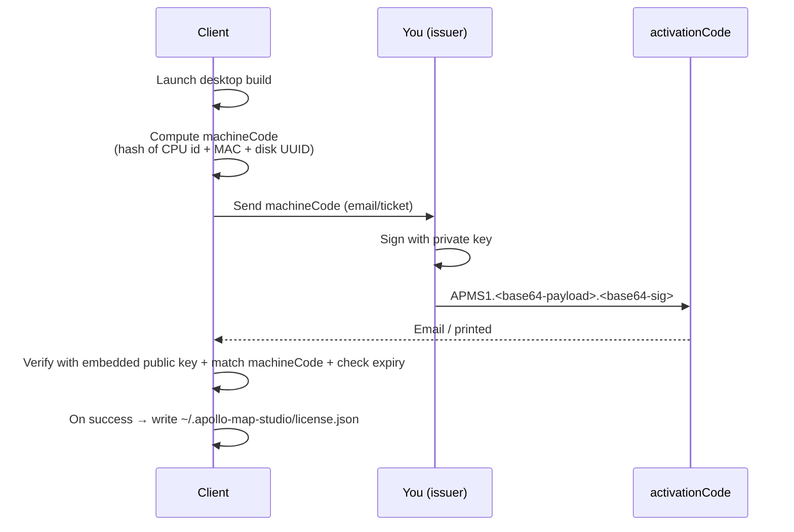

# Issuing License Keys

Apollo Map Studio's desktop build uses Ed25519 offline activation: the
client generates a `machineCode`, you sign an `activationCode` with the
private key, and the client verifies it using the embedded public key.
The whole flow is **offline-capable**, ideal for air-gapped or regulated
environments.

::: danger Private keys are sacred
A leaked private key = anyone can sign codes. Never commit
`tools/license-gen/keys/private.pem` (the keys/ directory is
`.gitignored`). Production private keys live in HSM, 1Password Vault, or
an offline machine.
:::

## Goal

Issue a 365-day desktop activation for "Customer Inc.", bound to
`machineCode = ABCD-EFGH-JKLM-NPQR`.

## Prerequisites

- Key pair already generated (`pnpm --filter license-gen gen-keys`).
- Public key `tools/license-gen/keys/public.pem` is embedded in the
  Electron main process (`electron/license/manager.cts`).
- Private key `tools/license-gen/keys/private.pem` exists only on the
  signing machine.

## Offline activation overview



## Step-by-step

### 1. One-time: generate the key pair

On the dedicated signing machine:

```bash
cd tools/license-gen
pnpm install
node gen-keys.mjs --out keys/
```

Outputs:

```
keys/private.pem   # vendor only
keys/public.pem    # embedded in Electron
```

::: warning Never reuse private keys
One pair per product line / major version. Rotating between v1 and v2
invalidates old codes during upgrades.
:::

### 2. Embed the public key

```ts
// electron/license/manager.cts
import { readFileSync } from 'node:fs';
import path from 'node:path';

const PUBLIC_KEY_PEM = readFileSync(
  path.join(__dirname, '../../tools/license-gen/keys/public.pem'),
  'utf8',
);
```

Electron Builder bundles the key into asar at build time. Verify:

```bash
pnpm package:linux
# Unpack release/linux-unpacked/resources/app.asar; the public key must be inside.
```

### 3. Customer provides their machineCode

On first launch, before activation, the desktop dialog displays:

```
Machine Code: ABCD-EFGH-JKLM-NPQR
```

Ask the customer to copy and send it.

::: tip machineCode is one-way
`machineCode = grouped truncated sha256(cpu-id || mac || disk-uuid)`. It
cannot be reversed — you only see an opaque identifier.
:::

### 4. Issue the activation code

```bash
node tools/license-gen/issue.mjs \
  --machine ABCD-EFGH-JKLM-NPQR \
  --days 365 \
  --name "Customer Inc." \
  --lic LIC-2026-0042
```

Output (truncated):

```
APMS1.eyJsaWMiOiJMSUMtMjAyNi0wMDQyIi...eyJleHAiOjE3...AaBbCc...
```

### 5. Send the code to the customer

Email, ticket, encrypted attachment. The code carries:

- License id (for revocation tracking)
- machineCode (machine binding)
- expiresAt (UTC ISO timestamp)
- features (reserved)
- Signature

::: tip Codes are not secrets
Without the matching machineCode an attacker cannot use the code on a
different machine. So the code itself is not secret, but a leaked
`machineCode + activationCode` pair allows multi-device reuse. Send only
the code via email; let the customer keep their own machineCode.
:::

### 6. Customer activates

Desktop "Activate" dialog → paste activationCode → "Verify". On
success, `~/.apollo-map-studio/license.json` is persisted; next launch
skips the dialog.

### 7. Renew / move machine

The client warns 30 days before expiry. Reissue:

```bash
node tools/license-gen/issue.mjs \
  --machine ABCD-EFGH-JKLM-NPQR \
  --days 365 \
  --name "Customer Inc." \
  --lic LIC-2027-0042
```

Moving machines? Get the new machineCode, issue a new activationCode.

## CLI flags

| Flag         | Purpose                                          |
| ------------ | ------------------------------------------------ |
| `--machine`  | Customer machineCode (required)                  |
| `--days`     | Days valid; mutually exclusive with `--expires`  |
| `--expires`  | Absolute expiry, ISO8601                         |
| `--name`     | Customer name (metadata; not signed)             |
| `--features` | Comma-list, reserved for future feature flags    |
| `--lic`      | license id; default `LIC-YYYY-NNNN`              |
| `--key`      | Private key path; defaults to `keys/private.pem` |
| `--quiet`    | Print only the code, no banner                   |

## Files modified

Issuing does not change code. Common code changes around this flow:

| File                                | When                            |
| ----------------------------------- | ------------------------------- |
| `tools/license-gen/issue.mjs`       | New feature flag or metadata    |
| `tools/license-gen/verify.mjs`      | Sync verification logic         |
| `electron/license/manager.cts`      | Client-side verification policy |
| `electron/license/storage.cts`      | Persistence path / encryption   |
| `tools/license-gen/keys/public.pem` | Major-version key rotation      |

## Testing checklist

- [ ] `node tools/license-gen/verify.mjs --machine X --code Y` passes
      locally.
- [ ] On a clean machine, paste the code; the desktop enters the main UI.
- [ ] Mutate one character of the code or machineCode → verify fails.
- [ ] Set system clock past expiry → desktop returns to activation
      (grace period configurable, default 24h).
- [ ] Same code on a different machine → rejected.

## Common pitfalls

### Verify passes but client reports "expired"

You used `--expires` with a local-time string. Always pass ISO UTC:
`2027-01-01T00:00:00Z`, never local time.

### Private key accidentally committed

Immediately:

```bash
# 1. Rewrite history (replicate across all forks/mirrors)
git filter-repo --path tools/license-gen/keys/private.pem --invert-paths
# 2. Generate a new pair right away
node tools/license-gen/gen-keys.mjs --out keys/
# 3. Ship an emergency build with the new public key
# 4. All old codes invalidated; reissue everyone
```

::: danger This is a P0 incident
Pull people in, rotate immediately, no hesitation.
:::

### Customer's machineCode changes every launch

Likely a VM with non-persistent MAC. Either issue VM customers a
separate SKU keyed by a license seed instead of machineCode, or require
they pin their MAC.

### Activation dialog reappears every launch

`~/.apollo-map-studio/license.json` failed to persist (permissions or
disk full). Check `echo $HOME` + `ls -la ~/.apollo-map-studio/`. On
Windows: `%APPDATA%\apollo-map-studio\`.

### License file copied between machines

If a customer copies `license.json` to a second machine, the local
machineCode mismatch fails verification. Educate users to reactivate on
each new machine and not copy license files.

## Source links

- [`tools/license-gen/issue.mjs`](https://github.com/SakuraPuare/apollo-map-studio/blob/main/tools/license-gen/issue.mjs)
- [`tools/license-gen/verify.mjs`](https://github.com/SakuraPuare/apollo-map-studio/blob/main/tools/license-gen/verify.mjs)
- [`tools/license-gen/gen-keys.mjs`](https://github.com/SakuraPuare/apollo-map-studio/blob/main/tools/license-gen/gen-keys.mjs)
- [`tools/license-gen/README.md`](https://github.com/SakuraPuare/apollo-map-studio/blob/main/tools/license-gen/README.md)
- [`electron/license/manager.cts`](https://github.com/SakuraPuare/apollo-map-studio/blob/main/electron/license/manager.cts)

## Advanced

### Feature flags

```bash
node issue.mjs --machine X --days 365 --features draw,export,pncJunction
```

The desktop client unpacks `features[]` in `electron/license/manager.cts`.
UI gates with `useLicenseFeatures()`:

```ts
const { has } = useLicenseFeatures();
{has('pncJunction') && <DrawPncJunctionButton />}
```

### Revocation list (CRL)

Without leakage, precise revocation is impossible offline. Options:

1. Embed `revoked: ['LIC-2026-0042']` in releases (coarse).
2. Periodic online CRL fetch (breaks offline guarantee).

::: tip Current strategy
This project does not implement a CRL. Short-term signing (1 year) +
emergency public-key rotation handle worst-case events.
:::

### Time-tampering defense

Worried about clients reversing system time to extend expiry? Persist a
"last seen at" timestamp in license.json. If a new launch precedes the
last seen, refuse to start. The project already implements a "monotonic
launch timestamp".

::: warning Not real DRM
Any client-side check can be reverse-engineered. Activation codes serve
**compliance and billing**, not piracy prevention. Pirates were never
your conversion funnel — invest the effort in usability instead.
:::
